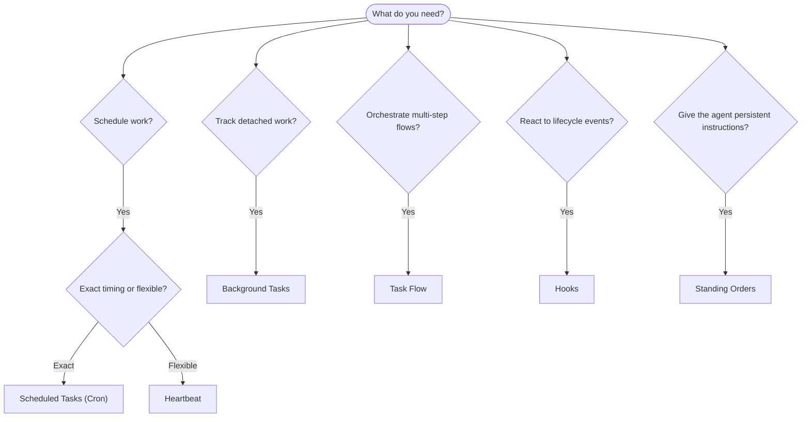

---
read_when:
    - اتخاذ قرار بشأن كيفية أتمتة العمل باستخدام OpenClaw
    - الاختيار بين Heartbeat وCron والخطافات والأوامر الدائمة
    - البحث عن نقطة الدخول المناسبة للأتمتة
summary: 'نظرة عامة على آليات الأتمتة: المهام، Cron، الخطافات، الأوامر الدائمة، وTaskFlow'
title: الأتمتة والمهام
x-i18n:
    generated_at: "2026-04-25T13:40:57Z"
    model: gpt-5.4
    provider: openai
    source_hash: 54524eb5d1fcb2b2e3e51117339be1949d980afaef1f6ae71fcfd764049f3f47
    source_path: automation/index.md
    workflow: 15
---

يشغّل OpenClaw العمل في الخلفية من خلال المهام، والوظائف المجدولة، وخطافات الأحداث، والتعليمات الدائمة. تساعدك هذه الصفحة على اختيار الآلية المناسبة وفهم كيفية تكاملها معًا.

## دليل اتخاذ قرار سريع

| حالة الاستخدام                            | الموصى به             | السبب                                              |
| ----------------------------------------- | --------------------- | -------------------------------------------------- |
| إرسال تقرير يومي في الساعة 9 صباحًا تمامًا | المهام المجدولة (Cron) | توقيت دقيق، وتنفيذ معزول                           |
| ذكّرني بعد 20 دقيقة                       | المهام المجدولة (Cron) | مهمة لمرة واحدة بتوقيت دقيق (`--at`)              |
| تشغيل تحليل عميق أسبوعي                   | المهام المجدولة (Cron) | مهمة مستقلة، ويمكن أن تستخدم نموذجًا مختلفًا      |
| فحص البريد الوارد كل 30 دقيقة             | Heartbeat             | يدمجها مع عمليات فحص أخرى، ومدرك للسياق            |
| مراقبة التقويم للأحداث القادمة            | Heartbeat             | مناسب بطبيعته للمتابعة الدورية                     |
| فحص حالة وكيل فرعي أو تشغيل ACP           | المهام في الخلفية     | يسجّل سجل المهام كل العمل المنفصل                  |
| تدقيق ما الذي تم تشغيله ومتى              | المهام في الخلفية     | `openclaw tasks list` و`openclaw tasks audit`      |
| بحث متعدد الخطوات ثم تلخيص                | TaskFlow              | تنسيق متين مع تتبّع للمراجعات                      |
| تشغيل سكربت عند إعادة تعيين الجلسة        | الخطافات              | مدفوع بالأحداث، ويعمل عند أحداث دورة الحياة        |
| تنفيذ كود عند كل استدعاء أداة             | Plugin hooks          | يمكن للخطافات داخل العملية اعتراض استدعاءات الأدوات |
| التحقق دائمًا من الامتثال قبل الرد         | الأوامر الدائمة       | تُحقن تلقائيًا في كل جلسة                          |

### المهام المجدولة (Cron) مقابل Heartbeat

| البعد           | المهام المجدولة (Cron)              | Heartbeat                               |
| --------------- | ----------------------------------- | --------------------------------------- |
| التوقيت         | دقيق (تعبيرات cron، ولمرة واحدة)    | تقريبي (كل 30 دقيقة افتراضيًا)          |
| سياق الجلسة     | جديد (معزول) أو مشترك               | سياق الجلسة الرئيسية الكامل              |
| سجلات المهام    | يتم إنشاؤها دائمًا                  | لا يتم إنشاؤها أبدًا                     |
| التسليم         | قناة، أو Webhook، أو بصمت           | مضمّن داخل الجلسة الرئيسية               |
| الأنسب لـ       | التقارير، والتذكيرات، والوظائف الخلفية | فحص البريد الوارد، والتقويم، والإشعارات |

استخدم المهام المجدولة (Cron) عندما تحتاج إلى توقيت دقيق أو تنفيذ معزول. استخدم Heartbeat عندما يستفيد العمل من سياق الجلسة الكامل ويكون التوقيت التقريبي كافيًا.

## المفاهيم الأساسية

### المهام المجدولة (cron)

Cron هو المجدول المدمج في Gateway للتوقيت الدقيق. فهو يحتفظ بالوظائف، ويوقظ الوكيل في الوقت المناسب، ويمكنه تسليم المخرجات إلى قناة دردشة أو نقطة نهاية Webhook. يدعم التذكيرات لمرة واحدة، والتعبيرات المتكررة، والمشغلات الواردة عبر Webhook.

راجع [المهام المجدولة](/ar/automation/cron-jobs).

### المهام

يتتبع سجل المهام في الخلفية كل العمل المنفصل: تشغيلات ACP، وإنشاء الوكلاء الفرعيين، وتنفيذات cron المعزولة، وعمليات CLI. المهام هي سجلات وليست مجدولات. استخدم `openclaw tasks list` و`openclaw tasks audit` لفحصها.

راجع [المهام في الخلفية](/ar/automation/tasks).

### TaskFlow

TaskFlow هي طبقة تنسيق التدفقات فوق المهام في الخلفية. وهي تدير تدفقات متعددة الخطوات ومتينة باستخدام أوضاع المزامنة المُدارة والمعكوسة، وتتبع المراجعات، و`openclaw tasks flow list|show|cancel` للفحص.

راجع [TaskFlow](/ar/automation/taskflow).

### الأوامر الدائمة

تمنح الأوامر الدائمة الوكيل صلاحية تشغيل دائمة لبرامج محددة. وهي موجودة في ملفات مساحة العمل (عادة `AGENTS.md`) وتُحقن في كل جلسة. اجمعها مع cron للتنفيذ المعتمد على الوقت.

راجع [الأوامر الدائمة](/ar/automation/standing-orders).

### الخطافات

الخطافات الداخلية هي سكربتات مدفوعة بالأحداث يتم تشغيلها بواسطة أحداث دورة حياة الوكيل
(`\/new`، `\/reset`، `\/stop`)، وCompaction الجلسة، وبدء تشغيل Gateway، وتدفق
الرسائل. يتم اكتشافها تلقائيًا من الأدلة ويمكن إدارتها باستخدام
`openclaw hooks`. ولاعتراض استدعاءات الأدوات داخل العملية، استخدم
[Plugin hooks](/ar/plugins/hooks).

راجع [الخطافات](/ar/automation/hooks).

### Heartbeat

Heartbeat هي دورة دورية للجلسة الرئيسية (كل 30 دقيقة افتراضيًا). فهي تجمع عدة عمليات فحص (البريد الوارد، والتقويم، والإشعارات) في دور وكيل واحد مع سياق الجلسة الكامل. لا تُنشئ دورات Heartbeat سجلات مهام. استخدم `HEARTBEAT.md` لقائمة تحقق صغيرة، أو كتلة `tasks:` عندما تريد عمليات فحص دورية تُشغَّل عند الاستحقاق فقط داخل heartbeat نفسه. تتخطى ملفات heartbeat الفارغة مع `empty-heartbeat-file`؛ ويتخطى وضع المهام عند الاستحقاق فقط مع `no-tasks-due`.

راجع [Heartbeat](/ar/gateway/heartbeat).

## كيف تعمل معًا

- يتولى **Cron** الجداول الزمنية الدقيقة (التقارير اليومية، والمراجعات الأسبوعية) والتذكيرات لمرة واحدة. تنشئ جميع تنفيذات cron سجلات مهام.
- يتولى **Heartbeat** المراقبة الروتينية (البريد الوارد، والتقويم، والإشعارات) في دورة مجمّعة واحدة كل 30 دقيقة.
- تتفاعل **الخطافات** مع أحداث محددة (إعادة تعيين الجلسة، وCompaction، وتدفق الرسائل) عبر سكربتات مخصصة. وتغطي Plugin hooks استدعاءات الأدوات.
- تمنح **الأوامر الدائمة** الوكيل سياقًا دائمًا وحدودًا للصلاحيات.
- ينسّق **TaskFlow** التدفقات متعددة الخطوات فوق المهام الفردية.
- تتعقب **المهام** تلقائيًا كل العمل المنفصل بحيث يمكنك فحصه وتدقيقه.

## ذو صلة

- [المهام المجدولة](/ar/automation/cron-jobs) — جدولة دقيقة وتذكيرات لمرة واحدة
- [المهام في الخلفية](/ar/automation/tasks) — سجل المهام لكل العمل المنفصل
- [TaskFlow](/ar/automation/taskflow) — تنسيق متين لتدفقات متعددة الخطوات
- [الخطافات](/ar/automation/hooks) — سكربتات دورة حياة مدفوعة بالأحداث
- [Plugin hooks](/ar/plugins/hooks) — خطافات داخل العملية للأدوات، والمطالبات، والرسائل، ودورة الحياة
- [الأوامر الدائمة](/ar/automation/standing-orders) — تعليمات وكيل دائمة
- [Heartbeat](/ar/gateway/heartbeat) — دورات دورية للجلسة الرئيسية
- [المرجع الخاص بالإعدادات](/ar/gateway/configuration-reference) — جميع مفاتيح الإعدادات
