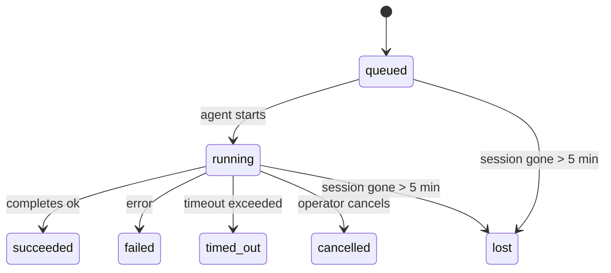

---
read_when:
    - فحص العمل الجاري في الخلفية أو المكتمل مؤخرًا
    - تصحيح أخطاء فشل التسليم لتشغيلات الوكيل المنفصلة
    - فهم كيفية ارتباط التشغيلات في الخلفية بالجلسات وCron وHeartbeat
summary: تتبّع المهام في الخلفية لتشغيلات ACP، والوكلاء الفرعيين، ووظائف Cron المعزولة، وعمليات CLI
title: المهام في الخلفية
x-i18n:
    generated_at: "2026-04-21T07:18:02Z"
    model: gpt-5.4
    provider: openai
    source_hash: ba5511b1c421bdf505fc7d34f09e453ac44e85213fcb0f082078fa957aa91fe7
    source_path: automation/tasks.md
    workflow: 15
---

# المهام في الخلفية

> **هل تبحث عن الجدولة؟** راجع [الأتمتة والمهام](/ar/automation) لاختيار الآلية المناسبة. تغطي هذه الصفحة **تتبّع** العمل في الخلفية، وليس جدولته.

تتتبّع المهام في الخلفية العمل الذي يُشغَّل **خارج جلسة محادثتك الرئيسية**:
تشغيلات ACP، وإنشاءات الوكلاء الفرعيين، وتنفيذات وظائف Cron المعزولة، والعمليات التي يبدأها CLI.

لا تحل المهام محل الجلسات أو وظائف Cron أو Heartbeat — بل هي **سجل النشاط** الذي يسجل ما العمل المنفصل الذي حدث، ومتى حدث، وما إذا كان قد نجح.

<Note>
لا ينشئ كل تشغيل للوكيل مهمة. أدوار Heartbeat والدردشة التفاعلية العادية لا تنشئان ذلك. جميع تنفيذات Cron، وإنشاءات ACP، وإنشاءات الوكلاء الفرعيين، وأوامر وكيل CLI تنشئ مهام.
</Note>

## الملخص السريع

- المهام هي **سجلات** وليست أدوات جدولة — يحدد Cron وHeartbeat _متى_ يُشغَّل العمل، بينما تتتبّع المهام _ما الذي حدث_.
- تُنشئ ACP والوكلاء الفرعيون وجميع وظائف Cron وعمليات CLI مهام. أدوار Heartbeat لا تفعل ذلك.
- تنتقل كل مهمة عبر `queued → running → terminal` (succeeded أو failed أو timed_out أو cancelled أو lost).
- تظل مهام Cron نشطة ما دام وقت تشغيل Cron لا يزال يملك الوظيفة؛ وتظل مهام CLI المعتمدة على الدردشة نشطة فقط ما دام سياق التشغيل المالك لها لا يزال فعالًا.
- الإكمال يعتمد على الدفع: يمكن للعمل المنفصل الإخطار مباشرة أو إيقاظ
  جلسة المُطلِب/Heartbeat عند انتهائه، لذا تكون حلقات استطلاع الحالة
  غالبًا هي النهج غير المناسب.
- تحاول تشغيلات Cron المعزولة وإكمالات الوكلاء الفرعيين، على أساس أفضل جهد، تنظيف علامات تبويب/عمليات المتصفح المتتبعة لجلسة الابن الخاصة بها قبل مسك دفاتر التنظيف النهائية.
- يمنع تسليم Cron المعزول الردود المرحلية القديمة من الأصل بينما لا يزال
  عمل الوكيل الفرعي المتحدر قيد التصريف، ويفضّل المخرجات النهائية للمتحدر
  عندما تصل قبل التسليم.
- تُسلَّم إشعارات الإكمال مباشرة إلى قناة أو تُصفّ في انتظار Heartbeat التالية.
- يعرض `openclaw tasks list` جميع المهام؛ ويُظهر `openclaw tasks audit` المشكلات.
- تُحفَظ السجلات النهائية لمدة 7 أيام، ثم تُزال تلقائيًا.

## البدء السريع

```bash
# اعرض جميع المهام (الأحدث أولًا)
openclaw tasks list

# التصفية حسب وقت التشغيل أو الحالة
openclaw tasks list --runtime acp
openclaw tasks list --status running

# اعرض تفاصيل مهمة محددة (بالمعرّف أو معرّف التشغيل أو مفتاح الجلسة)
openclaw tasks show <lookup>

# ألغِ مهمة قيد التشغيل (يُنهي جلسة الابن)
openclaw tasks cancel <lookup>

# غيّر سياسة الإشعارات لمهمة
openclaw tasks notify <lookup> state_changes

# شغّل تدقيقًا صحيًا
openclaw tasks audit

# اعرض الصيانة أو طبّقها
openclaw tasks maintenance
openclaw tasks maintenance --apply

# افحص حالة TaskFlow
openclaw tasks flow list
openclaw tasks flow show <lookup>
openclaw tasks flow cancel <lookup>
```

## ما الذي ينشئ مهمة

| المصدر                 | نوع وقت التشغيل | متى يُنشأ سجل مهمة                                 | سياسة الإشعار الافتراضية |
| ---------------------- | --------------- | -------------------------------------------------- | ------------------------ |
| تشغيلات ACP في الخلفية | `acp`           | إنشاء جلسة ACP فرعية                               | `done_only`              |
| تنسيق الوكلاء الفرعيين | `subagent`      | إنشاء وكيل فرعي عبر `sessions_spawn`               | `done_only`              |
| وظائف Cron (كل الأنواع) | `cron`         | كل تنفيذ Cron (الجلسة الرئيسية والمعزولة)          | `silent`                 |
| عمليات CLI             | `cli`           | أوامر `openclaw agent` التي تعمل عبر Gateway       | `silent`                 |
| مهام وسائط الوكيل      | `cli`           | تشغيلات `video_generate` المعتمدة على الجلسة       | `silent`                 |

تستخدم مهام Cron الخاصة بالجلسة الرئيسية سياسة الإشعار `silent` افتراضيًا — فهي تنشئ سجلات للتتبع ولكنها لا تولّد إشعارات. وتستخدم مهام Cron المعزولة أيضًا `silent` افتراضيًا لكنها أكثر ظهورًا لأنها تعمل في جلستها الخاصة.

تستخدم تشغيلات `video_generate` المعتمدة على الجلسة أيضًا سياسة الإشعار `silent`. وما تزال تنشئ سجلات مهام، لكن يُعاد الإكمال إلى جلسة الوكيل الأصلية على شكل إيقاظ داخلي حتى يتمكن الوكيل من كتابة رسالة المتابعة وإرفاق الفيديو المكتمل بنفسه. إذا فعّلت `tools.media.asyncCompletion.directSend`، فستحاول إكمالات `music_generate` و`video_generate` غير المتزامنة التسليم المباشر إلى القناة أولًا قبل الرجوع إلى مسار إيقاظ جلسة المُطلِب.

أثناء بقاء مهمة `video_generate` المعتمدة على الجلسة نشطة، تعمل الأداة أيضًا كحاجز وقائي: إذ تُعيد استدعاءات `video_generate` المتكررة في الجلسة نفسها حالة المهمة النشطة بدلًا من بدء توليدٍ ثانٍ متزامن. استخدم `action: "status"` عندما تريد بحثًا صريحًا عن التقدم/الحالة من جهة الوكيل.

**ما الذي لا ينشئ مهام:**

- أدوار Heartbeat — الجلسة الرئيسية؛ راجع [Heartbeat](/ar/gateway/heartbeat)
- أدوار الدردشة التفاعلية العادية
- استجابات `/command` المباشرة

## دورة حياة المهمة



| الحالة      | ما الذي تعنيه                                                             |
| ----------- | ------------------------------------------------------------------------- |
| `queued`    | أُنشئت، وتنتظر بدء الوكيل                                                  |
| `running`   | دور الوكيل قيد التنفيذ الفعلي                                              |
| `succeeded` | اكتملت بنجاح                                                              |
| `failed`    | اكتملت مع حدوث خطأ                                                        |
| `timed_out` | تجاوزت المهلة المهيأة                                                     |
| `cancelled` | أوقفها المشغّل عبر `openclaw tasks cancel`                                |
| `lost`      | فقد وقت التشغيل حالة الدعم الموثوقة بعد فترة سماح مدتها 5 دقائق          |

تحدث الانتقالات تلقائيًا — فعند انتهاء تشغيل الوكيل المرتبط، تتحدث حالة المهمة لتطابقه.

تكون `lost` مدركة لوقت التشغيل:

- مهام ACP: اختفت بيانات تعريف جلسة ACP الفرعية الداعمة.
- مهام الوكيل الفرعي: اختفت الجلسة الفرعية الداعمة من مخزن الوكيل الهدف.
- مهام Cron: لم يعد وقت تشغيل Cron يتتبع الوظيفة على أنها نشطة.
- مهام CLI: تستخدم مهام الجلسة الفرعية المعزولة جلسة الابن؛ بينما تستخدم مهام CLI المعتمدة على الدردشة سياق التشغيل الحي بدلًا من ذلك، لذا فإن صفوف الجلسة العالقة للقناة/المجموعة/الرسائل المباشرة لا تُبقيها نشطة.

## التسليم والإشعارات

عندما تصل مهمة إلى حالة نهائية، يقوم OpenClaw بإخطارك. توجد مساران للتسليم:

**التسليم المباشر** — إذا كانت للمهمة وجهة قناة (أي `requesterOrigin`)، فستُرسل رسالة الإكمال مباشرة إلى تلك القناة (Telegram أو Discord أو Slack، إلخ). وبالنسبة لإكمالات الوكلاء الفرعيين، يحافظ OpenClaw أيضًا على توجيه الخيط/الموضوع المرتبط عند توفره، ويمكنه ملء `to` / الحساب المفقود من المسار المخزن في جلسة المُطلِب (`lastChannel` / `lastTo` / `lastAccountId`) قبل التخلي عن التسليم المباشر.

**التسليم عبر صف الجلسة** — إذا فشل التسليم المباشر أو لم يُضبط أي أصل، فسيُصفَّ التحديث كحدث نظام في جلسة المُطلِب ويظهر عند Heartbeat التالية.

<Tip>
يؤدي اكتمال المهمة إلى تشغيل إيقاظ Heartbeat فوري حتى ترى النتيجة بسرعة — ولا يلزمك انتظار نبضة Heartbeat المجدولة التالية.
</Tip>

هذا يعني أن سير العمل المعتاد قائم على الدفع: ابدأ العمل المنفصل مرة واحدة، ثم دع
وقت التشغيل يوقظك أو يخطرك عند الإكمال. لا تستطلع حالة المهمة إلا عندما
تحتاج إلى تصحيح، أو تدخل، أو تدقيق صريح.

### سياسات الإشعارات

تحكّم في مقدار ما يصلك عن كل مهمة:

| السياسة              | ما الذي يُسلَّم                                                          |
| -------------------- | ------------------------------------------------------------------------ |
| `done_only` (افتراضي) | الحالة النهائية فقط (succeeded أو failed، إلخ) — **هذا هو الافتراضي** |
| `state_changes`      | كل انتقال في الحالة وكل تحديث للتقدم                                    |
| `silent`             | لا شيء على الإطلاق                                                       |

غيّر السياسة أثناء تشغيل المهمة:

```bash
openclaw tasks notify <lookup> state_changes
```

## مرجع CLI

### `tasks list`

```bash
openclaw tasks list [--runtime <acp|subagent|cron|cli>] [--status <status>] [--json]
```

أعمدة المخرجات: معرّف المهمة، النوع، الحالة، التسليم، معرّف التشغيل، جلسة الابن، الملخص.

### `tasks show`

```bash
openclaw tasks show <lookup>
```

تقبل قيمة البحث معرّف مهمة أو معرّف تشغيل أو مفتاح جلسة. وتعرض السجل الكامل بما في ذلك التوقيت، وحالة التسليم، والخطأ، والملخص النهائي.

### `tasks cancel`

```bash
openclaw tasks cancel <lookup>
```

بالنسبة إلى مهام ACP والوكيل الفرعي، يؤدي هذا إلى إنهاء جلسة الابن. أما بالنسبة إلى المهام المتتبعة عبر CLI، فيُسجَّل الإلغاء في سجل المهام (لا يوجد مقبض وقت تشغيل فرعي منفصل). وتنتقل الحالة إلى `cancelled` ويُرسل إشعار بالتسليم عند انطباق ذلك.

### `tasks notify`

```bash
openclaw tasks notify <lookup> <done_only|state_changes|silent>
```

### `tasks audit`

```bash
openclaw tasks audit [--json]
```

يُظهر المشكلات التشغيلية. وتظهر النتائج أيضًا في `openclaw status` عند اكتشاف مشكلات.

| النتيجة                  | الشدة  | المُشغِّل                                              |
| ------------------------ | ------ | ------------------------------------------------------ |
| `stale_queued`           | warn   | بقيت في قائمة الانتظار لأكثر من 10 دقائق               |
| `stale_running`          | error  | بقيت قيد التشغيل لأكثر من 30 دقيقة                     |
| `lost`                   | error  | اختفت ملكية المهمة المدعومة من وقت التشغيل             |
| `delivery_failed`        | warn   | فشل التسليم وسياسة الإشعار ليست `silent`               |
| `missing_cleanup`        | warn   | مهمة نهائية بلا طابع زمني للتنظيف                      |
| `inconsistent_timestamps` | warn  | مخالفة في الخط الزمني (مثلًا انتهت قبل أن تبدأ)       |

### `tasks maintenance`

```bash
openclaw tasks maintenance [--json]
openclaw tasks maintenance --apply [--json]
```

استخدم هذا لمعاينة أو تطبيق المطابقة، ووضع طابع التنظيف، والتقليم
للمهام وحالة Task Flow.

تكون المطابقة مدركة لوقت التشغيل:

- تتحقق مهام ACP/الوكيل الفرعي من جلسة الابن الداعمة لها.
- تتحقق مهام Cron مما إذا كان وقت تشغيل Cron لا يزال يملك الوظيفة.
- تتحقق مهام CLI المعتمدة على الدردشة من سياق التشغيل الحي المالك، لا من صف جلسة الدردشة فقط.

ويكون تنظيف الإكمال أيضًا مدركًا لوقت التشغيل:

- يحاول إكمال الوكيل الفرعي، على أساس أفضل جهد، إغلاق علامات تبويب/عمليات المتصفح المتتبعة لجلسة الابن قبل متابعة تنظيف الإعلان.
- يحاول إكمال Cron المعزول، على أساس أفضل جهد، إغلاق علامات تبويب/عمليات المتصفح المتتبعة لجلسة Cron قبل إنهاء التشغيل بالكامل.
- ينتظر تسليم Cron المعزول اكتمال متابعة الوكيل الفرعي المتحدر عند الحاجة،
  ويمنع نص تأكيد الأصل القديم بدلًا من إعلانه.
- يفضّل تسليم إكمال الوكيل الفرعي أحدث نص مرئي من المساعد؛ وإذا كان فارغًا يعود إلى أحدث نص من tool/toolResult بعد تنقيته، ويمكن لاستخدامات استدعاء الأداة ذات المهلة فقط أن تُختزل إلى ملخص قصير للتقدم الجزئي.
- لا تحجب إخفاقات التنظيف النتيجة الحقيقية للمهمة.

### `tasks flow list|show|cancel`

```bash
openclaw tasks flow list [--status <status>] [--json]
openclaw tasks flow show <lookup> [--json]
openclaw tasks flow cancel <lookup>
```

استخدم هذه الأوامر عندما يكون TaskFlow المنسِّق هو ما يهمك
بدلًا من سجل مهمة فردية في الخلفية.

## لوحة مهام الدردشة (`/tasks`)

استخدم `/tasks` في أي جلسة دردشة لرؤية المهام في الخلفية المرتبطة بتلك الجلسة. تعرض اللوحة
المهام النشطة والمكتملة مؤخرًا مع وقت التشغيل، والحالة، والتوقيت، وتفاصيل التقدم أو الخطأ.

عندما لا تحتوي الجلسة الحالية على مهام مرتبطة مرئية، يعود `/tasks` إلى أعداد المهام المحلية للوكيل
حتى تظل لديك نظرة عامة من دون كشف تفاصيل الجلسات الأخرى.

للاطلاع على سجل المشغّل الكامل، استخدم CLI: `openclaw tasks list`.

## التكامل مع الحالة (ضغط المهام)

يتضمن `openclaw status` ملخصًا سريعًا للمهام:

```
Tasks: 3 queued · 2 running · 1 issues
```

يبلغ الملخص عن:

- **active** — عدد `queued` + `running`
- **failures** — عدد `failed` + `timed_out` + `lost`
- **byRuntime** — توزيع حسب `acp` و`subagent` و`cron` و`cli`

يستخدم كل من `/status` وأداة `session_status` لقطة مهام مدركة للتنظيف: تُفضَّل المهام النشطة،
وتُخفى الصفوف المكتملة القديمة، ولا تظهر الإخفاقات الحديثة إلا عندما لا يتبقى أي عمل نشط.
هذا يُبقي بطاقة الحالة مركزة على ما يهم الآن.

## التخزين والصيانة

### أين تُحفَظ المهام

تُحفَظ سجلات المهام في SQLite في:

```
$OPENCLAW_STATE_DIR/tasks/runs.sqlite
```

يُحمَّل السجل إلى الذاكرة عند بدء Gateway ويزامن عمليات الكتابة إلى SQLite لضمان الاستمرارية عبر إعادة التشغيل.

### الصيانة التلقائية

يعمل منظّف كل **60 ثانية** ويتعامل مع ثلاثة أمور:

1. **المطابقة** — يتحقق مما إذا كانت المهام النشطة لا تزال تملك دعمًا موثوقًا من وقت التشغيل. تستخدم مهام ACP/الوكيل الفرعي حالة جلسة الابن، وتستخدم مهام Cron ملكية الوظيفة النشطة، وتستخدم مهام CLI المعتمدة على الدردشة سياق التشغيل المالك. وإذا اختفت حالة الدعم هذه لأكثر من 5 دقائق، تُعلَّم المهمة على أنها `lost`.
2. **وضع طابع التنظيف** — يضبط طابعًا زمنيًا `cleanupAfter` على المهام النهائية (`endedAt + 7 days`).
3. **التقليم** — يحذف السجلات التي تجاوزت تاريخ `cleanupAfter` الخاص بها.

**الاحتفاظ**: تُحفَظ سجلات المهام النهائية لمدة **7 أيام**، ثم تُزال تلقائيًا. لا حاجة إلى أي إعداد.

## كيف ترتبط المهام بالأنظمة الأخرى

### المهام وTask Flow

تُعد [Task Flow](/ar/automation/taskflow) طبقة تنسيق التدفق فوق المهام في الخلفية. ويمكن لتدفق واحد تنسيق عدة مهام على مدى عمره باستخدام أوضاع المزامنة المُدارة أو المعكوسة. استخدم `openclaw tasks` لفحص سجلات المهام الفردية و`openclaw tasks flow` لفحص التدفق المنسِّق.

راجع [Task Flow](/ar/automation/taskflow) للتفاصيل.

### المهام وCron

يُحفَظ **تعريف** وظيفة Cron في `~/.openclaw/cron/jobs.json`؛ وتُحفَظ حالة تنفيذ وقت التشغيل بجانبه في `~/.openclaw/cron/jobs-state.json`. ينشئ **كل** تنفيذ Cron سجل مهمة — سواء في الجلسة الرئيسية أو بشكل معزول. وتستخدم مهام Cron الخاصة بالجلسة الرئيسية سياسة الإشعار `silent` افتراضيًا حتى تتتبّع بدون توليد إشعارات.

راجع [وظائف Cron](/ar/automation/cron-jobs).

### المهام وHeartbeat

تشغيلات Heartbeat هي أدوار للجلسة الرئيسية — وهي لا تنشئ سجلات مهام. وعند اكتمال مهمة، يمكنها تشغيل إيقاظ Heartbeat حتى ترى النتيجة بسرعة.

راجع [Heartbeat](/ar/gateway/heartbeat).

### المهام والجلسات

قد تشير المهمة إلى `childSessionKey` (حيث يُنفَّذ العمل) و`requesterSessionKey` (من الذي بدأه). الجلسات هي سياق المحادثة؛ أما المهام فهي تتبّع النشاط فوق ذلك.

### المهام وتشغيلات الوكيل

يرتبط `runId` الخاص بالمهمة بتشغيل الوكيل الذي ينفذ العمل. وتحدّث أحداث دورة حياة الوكيل (البدء، والانتهاء، والخطأ) حالة المهمة تلقائيًا — ولا تحتاج إلى إدارة دورة الحياة يدويًا.

## ذو صلة

- [الأتمتة والمهام](/ar/automation) — نظرة سريعة على جميع آليات الأتمتة
- [Task Flow](/ar/automation/taskflow) — تنسيق التدفق فوق المهام
- [المهام المجدولة](/ar/automation/cron-jobs) — جدولة العمل في الخلفية
- [Heartbeat](/ar/gateway/heartbeat) — أدوار دورية للجلسة الرئيسية
- [CLI: Tasks](/cli/index#tasks) — مرجع أوامر CLI
