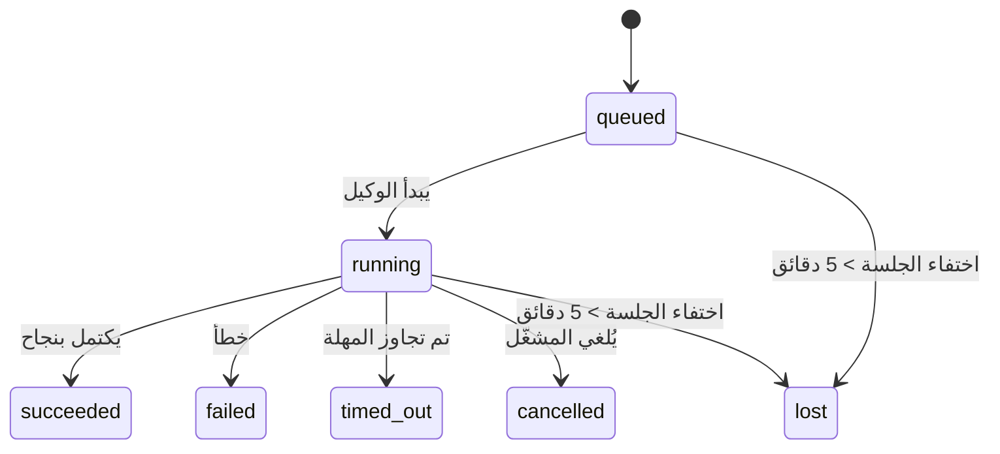

---
read_when:
    - فحص الأعمال الجارية في الخلفية أو المكتملة مؤخرًا
    - تصحيح أخطاء فشل التسليم لعمليات تشغيل الوكيل المنفصلة
    - فهم كيفية ارتباط عمليات التشغيل في الخلفية بالجلسات وCron وHeartbeat
summary: تتبّع المهام في الخلفية لتشغيلات ACP، والوكلاء الفرعيين، ووظائف Cron المعزولة، وعمليات CLI
title: المهام في الخلفية
x-i18n:
    generated_at: "2026-04-23T07:18:31Z"
    model: gpt-5.4
    provider: openai
    source_hash: 5cd0b0db6c20cc677aa5cc50c42e09043d4354e026ca33c020d804761c331413
    source_path: automation/tasks.md
    workflow: 15
---

# المهام في الخلفية

> **هل تبحث عن الجدولة؟** راجع [الأتمتة والمهام](/ar/automation) لاختيار الآلية المناسبة. تغطي هذه الصفحة **تتبّع** العمل في الخلفية، وليس جدولته.

تتتبّع المهام في الخلفية العمل الذي يجري **خارج جلسة المحادثة الرئيسية**:
تشغيلات ACP، وإنشاء الوكلاء الفرعيين، وتنفيذ وظائف Cron المعزولة، والعمليات التي يبدأها CLI.

لا تحل المهام محل الجلسات أو وظائف Cron أو Heartbeat — بل هي **سجل النشاط** الذي يوثّق ما العمل المنفصل الذي حدث، ومتى حدث، وما إذا كان قد نجح.

<Note>
لا ينشئ كل تشغيل للوكيل مهمة. لا تنشئ دورات Heartbeat والمحادثة التفاعلية العادية مهام. أما جميع عمليات تنفيذ Cron، وعمليات إنشاء ACP، وعمليات إنشاء الوكلاء الفرعيين، وأوامر الوكيل عبر CLI فتنشئ مهام.
</Note>

## باختصار

- المهام هي **سجلات** وليست أدوات جدولة — يحدّد Cron وHeartbeat _متى_ يتم تشغيل العمل، بينما تتتبّع المهام _ما الذي حدث_.
- تنشئ ACP، والوكلاء الفرعيون، وجميع وظائف Cron، وعمليات CLI مهام. ولا تنشئ دورات Heartbeat مهام.
- تنتقل كل مهمة عبر `queued → running → terminal` (succeeded أو failed أو timed_out أو cancelled أو lost).
- تظل مهام Cron نشطة ما دام وقت تشغيل Cron لا يزال يملك الوظيفة؛ وتظل مهام CLI المعتمدة على الدردشة نشطة فقط ما دام سياق التشغيل المالك لها لا يزال نشطًا.
- يعتمد الإكمال على الدفع: يمكن للعمل المنفصل الإخطار مباشرة أو إيقاظ
  جلسة/Heartbeat الخاصة بالطالب عند انتهائه، لذا تكون حلقات استطلاع الحالة
  عادةً أسلوبًا غير مناسب.
- تنظّف عمليات Cron المعزولة وعمليات إكمال الوكلاء الفرعيين، بأفضل جهد، علامات تبويب/عمليات المتصفح المتتبَّعة الخاصة بجلساتها الفرعية قبل محاسبة التنظيف النهائية.
- يمنع تسليم Cron المعزول الردود المرحلية القديمة من الأصل أثناء
  استمرار تصريف عمل الوكيل الفرعي المتحدّر، ويفضّل مخرجات المتحدّر النهائية
  عندما تصل قبل التسليم.
- تُسلَّم إشعارات الإكمال مباشرة إلى قناة أو تُدرج في الطابور لنبضة Heartbeat التالية.
- يعرض `openclaw tasks list` جميع المهام؛ ويُظهر `openclaw tasks audit` المشكلات.
- تُحفَظ السجلات النهائية لمدة 7 أيام، ثم تُزال تلقائيًا.

## البدء السريع

```bash
# اعرض جميع المهام (الأحدث أولًا)
openclaw tasks list

# صفِّ حسب وقت التشغيل أو الحالة
openclaw tasks list --runtime acp
openclaw tasks list --status running

# اعرض تفاصيل مهمة محددة (بواسطة المعرّف أو معرّف التشغيل أو مفتاح الجلسة)
openclaw tasks show <lookup>

# ألغِ مهمة قيد التشغيل (ينهي الجلسة الفرعية)
openclaw tasks cancel <lookup>

# غيّر سياسة الإشعارات لمهمة
openclaw tasks notify <lookup> state_changes

# شغّل تدقيقًا للحالة
openclaw tasks audit

# عاين الصيانة أو طبّقها
openclaw tasks maintenance
openclaw tasks maintenance --apply

# افحص حالة TaskFlow
openclaw tasks flow list
openclaw tasks flow show <lookup>
openclaw tasks flow cancel <lookup>
```

## ما الذي ينشئ مهمة

| المصدر                 | نوع وقت التشغيل | متى يُنشأ سجل مهمة                                  | سياسة الإشعارات الافتراضية |
| ---------------------- | --------------- | --------------------------------------------------- | -------------------------- |
| تشغيلات ACP في الخلفية | `acp`           | عند إنشاء جلسة ACP فرعية                            | `done_only`                |
| تنسيق الوكلاء الفرعيين | `subagent`      | عند إنشاء وكيل فرعي عبر `sessions_spawn`            | `done_only`                |
| وظائف Cron (كل الأنواع) | `cron`         | عند كل تنفيذ لـ Cron (في الجلسة الرئيسية والمعزولة) | `silent`                   |
| عمليات CLI             | `cli`           | أوامر `openclaw agent` التي تعمل عبر Gateway        | `silent`                   |
| وظائف وسائط الوكيل     | `cli`           | تشغيلات `video_generate` المعتمدة على الجلسة        | `silent`                   |

تستخدم مهام Cron في الجلسة الرئيسية سياسة الإشعارات `silent` افتراضيًا — فهي تنشئ سجلات للتتبّع لكنها لا تولّد إشعارات. كما تستخدم مهام Cron المعزولة أيضًا `silent` افتراضيًا، لكنها أوضح ظهورًا لأنها تعمل ضمن جلستها الخاصة.

تستخدم تشغيلات `video_generate` المعتمدة على الجلسة أيضًا سياسة الإشعارات `silent`. فهي لا تزال تنشئ سجلات مهام، لكن الإكمال يُعاد إلى جلسة الوكيل الأصلية كتنبيه داخلي لكي يتمكن الوكيل من كتابة رسالة المتابعة وإرفاق الفيديو المكتمل بنفسه. إذا فعّلت `tools.media.asyncCompletion.directSend`، فستحاول عمليات الإكمال غير المتزامنة لـ `music_generate` و`video_generate` أولًا التسليم المباشر إلى القناة قبل الرجوع إلى مسار إيقاظ جلسة الطالب.

وأثناء بقاء مهمة `video_generate` المعتمدة على الجلسة نشطة، تعمل الأداة أيضًا كحاجز وقائي: إذ تعيد استدعاءات `video_generate` المتكررة في الجلسة نفسها حالة المهمة النشطة بدلًا من بدء عملية توليد متزامنة ثانية. استخدم `action: "status"` عندما تريد استعلامًا صريحًا عن التقدّم/الحالة من جهة الوكيل.

**ما الذي لا ينشئ مهام:**

- دورات Heartbeat — الجلسة الرئيسية؛ راجع [Heartbeat](/ar/gateway/heartbeat)
- دورات المحادثة التفاعلية العادية
- استجابات `/command` المباشرة

## دورة حياة المهمة



| الحالة      | معناها                                                                  |
| ----------- | ----------------------------------------------------------------------- |
| `queued`    | أُنشئت وتنتظر بدء الوكيل                                                |
| `running`   | يجري تنفيذ دورة الوكيل حاليًا                                           |
| `succeeded` | اكتملت بنجاح                                                            |
| `failed`    | اكتملت مع خطأ                                                           |
| `timed_out` | تجاوزت المهلة المضبوطة                                                  |
| `cancelled` | أوقفها المشغّل عبر `openclaw tasks cancel`                              |
| `lost`      | فقد وقت التشغيل حالة الدعم الموثوقة بعد فترة سماح مدتها 5 دقائق         |

تحدث الانتقالات تلقائيًا — فعندما ينتهي تشغيل الوكيل المرتبط، تُحدَّث حالة المهمة لتطابق ذلك.

تكون `lost` مدركة لوقت التشغيل:

- مهام ACP: اختفت بيانات جلسة ACP الفرعية الداعمة.
- مهام الوكلاء الفرعيين: اختفت الجلسة الفرعية الداعمة من مخزن الوكيل الهدف.
- مهام Cron: لم يعد وقت تشغيل Cron يتتبّع الوظيفة على أنها نشطة.
- مهام CLI: تستخدم المهام المعزولة المعتمدة على الجلسات الفرعية الجلسة الفرعية؛ أما مهام CLI المعتمدة على الدردشة فتستخدم سياق التشغيل المباشر بدلًا من ذلك، لذا فإن بقاء صفوف جلسات القناة/المجموعة/المباشرة لا يُبقيها نشطة.

## التسليم والإشعارات

عندما تصل المهمة إلى حالة نهائية، يقوم OpenClaw بإشعارك. هناك مساران للتسليم:

**التسليم المباشر** — إذا كان للمهمة هدف قناة (أي `requesterOrigin`)، فستذهب رسالة الإكمال مباشرة إلى تلك القناة (Telegram أو Discord أو Slack وغيرها). وبالنسبة إلى عمليات إكمال الوكيل الفرعي، يحافظ OpenClaw أيضًا على توجيه السلسلة/الموضوع المرتبط عند توفره، ويمكنه ملء قيمة `to` / الحساب الناقصة من المسار المخزَّن لجلسة الطالب (`lastChannel` / `lastTo` / `lastAccountId`) قبل التخلي عن التسليم المباشر.

**التسليم المدرج في طابور الجلسة** — إذا فشل التسليم المباشر أو لم يُضبط أصل، فيُدرج التحديث كحدث نظام في جلسة الطالب ويظهر عند Heartbeat التالية.

<Tip>
يؤدي إكمال المهمة إلى إيقاظ Heartbeat فورًا حتى ترى النتيجة بسرعة — ولا يلزمك انتظار نبضة Heartbeat المجدولة التالية.
</Tip>

وهذا يعني أن سير العمل المعتاد يعتمد على الدفع: ابدأ العمل المنفصل مرة
واحدة، ثم دع وقت التشغيل يوقظك أو يخطرك عند الإكمال. لا تستطلع حالة المهمة
إلا عندما تحتاج إلى تصحيح الأخطاء أو التدخل أو إجراء تدقيق صريح.

### سياسات الإشعارات

تحكّم في مقدار ما يصلك عن كل مهمة:

| السياسة               | ما الذي يُسلَّم                                                            |
| --------------------- | -------------------------------------------------------------------------- |
| `done_only` (افتراضي) | الحالة النهائية فقط (succeeded أو failed أو غير ذلك) — **هذا هو الافتراضي** |
| `state_changes`       | كل انتقال حالة وتحديث تقدّم                                               |
| `silent`              | لا شيء إطلاقًا                                                             |

غيّر السياسة أثناء تشغيل المهمة:

```bash
openclaw tasks notify <lookup> state_changes
```

## مرجع CLI

### `tasks list`

```bash
openclaw tasks list [--runtime <acp|subagent|cron|cli>] [--status <status>] [--json]
```

أعمدة الإخراج: معرّف المهمة، النوع، الحالة، التسليم، معرّف التشغيل، الجلسة الفرعية، الملخّص.

### `tasks show`

```bash
openclaw tasks show <lookup>
```

يقبل رمز البحث معرّف المهمة أو معرّف التشغيل أو مفتاح الجلسة. ويعرض السجل الكامل بما في ذلك التوقيت، وحالة التسليم، والخطأ، والملخّص النهائي.

### `tasks cancel`

```bash
openclaw tasks cancel <lookup>
```

بالنسبة إلى مهام ACP ومهام الوكلاء الفرعيين، يؤدي هذا إلى إنهاء الجلسة الفرعية. أما بالنسبة إلى المهام المتتبَّعة عبر CLI، فيُسجَّل الإلغاء في سجل المهام (ولا يوجد مقبض وقت تشغيل فرعي منفصل). وتنتقل الحالة إلى `cancelled` ويُرسل إشعار بالتسليم عند الاقتضاء.

### `tasks notify`

```bash
openclaw tasks notify <lookup> <done_only|state_changes|silent>
```

### `tasks audit`

```bash
openclaw tasks audit [--json]
```

يُظهر المشكلات التشغيلية. وتظهر النتائج أيضًا في `openclaw status` عند اكتشاف مشكلات.

| النتيجة                  | الخطورة | المُشغِّل                                               |
| ------------------------ | ------- | ------------------------------------------------------- |
| `stale_queued`           | تحذير   | بقيت في قائمة الانتظار لأكثر من 10 دقائق                |
| `stale_running`          | خطأ     | بقيت قيد التشغيل لأكثر من 30 دقيقة                      |
| `lost`                   | خطأ     | اختفت ملكية المهمة المدعومة من وقت التشغيل              |
| `delivery_failed`        | تحذير   | فشل التسليم وكانت سياسة الإشعارات ليست `silent`         |
| `missing_cleanup`        | تحذير   | مهمة نهائية بلا طابع زمني للتنظيف                       |
| `inconsistent_timestamps`| تحذير   | مخالفة في التسلسل الزمني (مثلًا، انتهت قبل أن تبدأ)     |

### `tasks maintenance`

```bash
openclaw tasks maintenance [--json]
openclaw tasks maintenance --apply [--json]
```

استخدم هذا لمعاينة أو تطبيق التسوية، ووضع طابع التنظيف، والتقليم
للمهام وحالة Task Flow.

التسوية مدركة لوقت التشغيل:

- تتحقق مهام ACP/الوكلاء الفرعيين من الجلسة الفرعية الداعمة لها.
- تتحقق مهام Cron مما إذا كان وقت تشغيل Cron لا يزال يملك الوظيفة.
- تتحقق مهام CLI المعتمدة على الدردشة من سياق التشغيل المباشر المالك، لا من صف جلسة الدردشة فقط.

كما أن تنظيف الإكمال مدرك لوقت التشغيل:

- يحاول إكمال الوكيل الفرعي، بأفضل جهد، إغلاق علامات تبويب/عمليات المتصفح المتتبَّعة للجلسة الفرعية قبل متابعة تنظيف الإعلان.
- يحاول إكمال Cron المعزول، بأفضل جهد، إغلاق علامات تبويب/عمليات المتصفح المتتبَّعة لجلسة Cron قبل الإنهاء الكامل للتشغيل.
- ينتظر تسليم Cron المعزول متابعة الوكيل الفرعي المتحدّر عند الحاجة،
  ويمنع نص الإقرار الأصلي القديم بدلًا من إعلانه.
- يفضّل تسليم إكمال الوكيل الفرعي أحدث نص مرئي من المساعد؛ وإذا كان فارغًا يعود إلى أحدث نص معقّم من tool/toolResult، ويمكن لعمليات استدعاء الأدوات التي انتهت بالمهلة فقط أن تختصر إلى ملخّص موجز عن التقدّم الجزئي. تعلن التشغيلات الفاشلة النهائية حالة الفشل من دون إعادة تشغيل نص الرد الملتقَط.
- لا تحجب إخفاقات التنظيف النتيجة الفعلية للمهمة.

### `tasks flow list|show|cancel`

```bash
openclaw tasks flow list [--status <status>] [--json]
openclaw tasks flow show <lookup> [--json]
openclaw tasks flow cancel <lookup>
```

استخدم هذه الأوامر عندما يكون TaskFlow المنسِّق هو ما يهمك
بدلًا من سجل مهمة واحدة في الخلفية.

## لوحة مهام الدردشة (`/tasks`)

استخدم `/tasks` في أي جلسة دردشة لرؤية المهام في الخلفية المرتبطة بتلك الجلسة. تعرض اللوحة
المهام النشطة والمكتملة مؤخرًا مع وقت التشغيل، والحالة، والتوقيت، وتفاصيل التقدّم أو الخطأ.

عندما لا تحتوي الجلسة الحالية على مهام مرتبطة مرئية، يعود `/tasks` إلى أعداد المهام المحلية الخاصة بالوكيل
حتى تظل تحصل على نظرة عامة من دون كشف تفاصيل جلسات أخرى.

للاطلاع على سجل المشغّل الكامل، استخدم CLI: `openclaw tasks list`.

## التكامل مع الحالة (ضغط المهام)

يتضمن `openclaw status` ملخّصًا سريعًا للمهام:

```
Tasks: 3 queued · 2 running · 1 issues
```

يُبلغ الملخّص عن:

- **active** — عدد `queued` + `running`
- **failures** — عدد `failed` + `timed_out` + `lost`
- **byRuntime** — تفصيل حسب `acp` و`subagent` و`cron` و`cli`

يستخدم كلٌّ من `/status` وأداة `session_status` لقطة مهام مدركة للتنظيف: إذ تُفضَّل المهام النشطة،
وتُخفى الصفوف المكتملة القديمة، ولا تظهر الإخفاقات الحديثة إلا عندما لا يبقى أي عمل نشط.
وهذا يُبقي بطاقة الحالة مركّزة على ما يهم الآن.

## التخزين والصيانة

### مكان وجود المهام

تُحفَظ سجلات المهام في SQLite في:

```
$OPENCLAW_STATE_DIR/tasks/runs.sqlite
```

يُحمَّل السجل إلى الذاكرة عند بدء Gateway ويزامن عمليات الكتابة إلى SQLite لضمان الاستمرارية عبر إعادة التشغيل.

### الصيانة التلقائية

يعمل منظِّف كل **60 ثانية** ويتعامل مع ثلاثة أشياء:

1. **التسوية** — يتحقق مما إذا كانت المهام النشطة لا تزال تملك دعمًا موثوقًا من وقت التشغيل. تستخدم مهام ACP/الوكلاء الفرعيين حالة الجلسة الفرعية، وتستخدم مهام Cron ملكية الوظيفة النشطة، وتستخدم مهام CLI المعتمدة على الدردشة سياق التشغيل المالك. وإذا اختفت حالة الدعم تلك لأكثر من 5 دقائق، توضع علامة `lost` على المهمة.
2. **وضع طابع التنظيف** — يضبط طابعًا زمنيًا `cleanupAfter` على المهام النهائية (`endedAt + 7 days`).
3. **التقليم** — يحذف السجلات التي تجاوزت تاريخ `cleanupAfter` الخاص بها.

**الاحتفاظ**: تُحفَظ سجلات المهام النهائية لمدة **7 أيام**، ثم تُزال تلقائيًا. لا حاجة إلى أي إعداد.

## كيف ترتبط المهام بالأنظمة الأخرى

### المهام وTask Flow

تمثّل [Task Flow](/ar/automation/taskflow) طبقة تنسيق التدفق فوق المهام في الخلفية. قد ينسّق تدفق واحد عدة مهام على مدى عمره باستخدام أوضاع مزامنة مُدارة أو معكوسة. استخدم `openclaw tasks` لفحص سجلات المهام الفردية و`openclaw tasks flow` لفحص التدفق المنسِّق.

راجع [Task Flow](/ar/automation/taskflow) للتفاصيل.

### المهام وCron

يوجد **تعريف** وظيفة Cron في `~/.openclaw/cron/jobs.json`؛ وتوجد حالة التنفيذ أثناء التشغيل إلى جواره في `~/.openclaw/cron/jobs-state.json`. ينشئ **كل** تنفيذ لـ Cron سجل مهمة — سواء في الجلسة الرئيسية أو في الجلسة المعزولة. تستخدم مهام Cron في الجلسة الرئيسية سياسة الإشعارات `silent` افتراضيًا، بحيث تتتبّع من دون توليد إشعارات.

راجع [وظائف Cron](/ar/automation/cron-jobs).

### المهام وHeartbeat

تشغيلات Heartbeat هي دورات في الجلسة الرئيسية — وهي لا تنشئ سجلات مهام. وعندما تكتمل مهمة، يمكنها تشغيل إيقاظ Heartbeat حتى ترى النتيجة بسرعة.

راجع [Heartbeat](/ar/gateway/heartbeat).

### المهام والجلسات

قد تشير المهمة إلى `childSessionKey` (حيث يُنفَّذ العمل) و`requesterSessionKey` (من بدأه). تمثل الجلسات سياق المحادثة؛ أما المهام فهي تتبّع النشاط فوق ذلك.

### المهام وتشغيلات الوكيل

يرتبط `runId` الخاص بالمهمة بتشغيل الوكيل الذي ينفّذ العمل. وتقوم أحداث دورة حياة الوكيل (البدء، والانتهاء، والخطأ) بتحديث حالة المهمة تلقائيًا — ولا تحتاج إلى إدارة دورة الحياة يدويًا.

## ذو صلة

- [الأتمتة والمهام](/ar/automation) — نظرة عامة على جميع آليات الأتمتة
- [Task Flow](/ar/automation/taskflow) — تنسيق التدفق فوق المهام
- [المهام المجدولة](/ar/automation/cron-jobs) — جدولة العمل في الخلفية
- [Heartbeat](/ar/gateway/heartbeat) — دورات دورية في الجلسة الرئيسية
- [CLI: المهام](/ar/cli/tasks) — مرجع أوامر CLI
