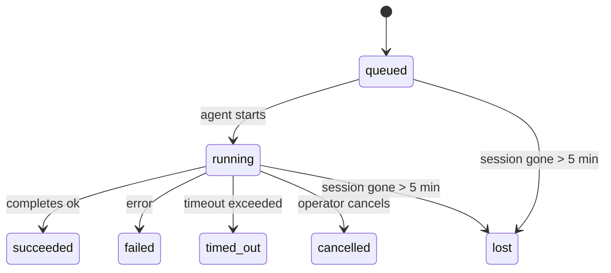

---
read_when:
    - فحص العمل في الخلفية الجاري حاليًا أو المكتمل مؤخرًا
    - تصحيح أخطاء فشل التسليم لتشغيلات الوكيل المنفصلة
    - فهم كيفية ارتباط التشغيلات في الخلفية بالجلسات وCron وHeartbeat
summary: تتبّع المهام في الخلفية لتشغيلات ACP، والوكلاء الفرعيين، ووظائف Cron المعزولة، وعمليات CLI
title: المهام في الخلفية
x-i18n:
    generated_at: "2026-04-21T19:20:42Z"
    model: gpt-5.4
    provider: openai
    source_hash: a4cd666b3eaffde8df0b5e1533eb337e44a0824824af6f8a240f18a89f71b402
    source_path: automation/tasks.md
    workflow: 15
---

# المهام في الخلفية

> **هل تبحث عن الجدولة؟** راجع [الأتمتة والمهام](/ar/automation) لاختيار الآلية المناسبة. تغطي هذه الصفحة **تتبّع** العمل في الخلفية، وليس جدولته.

تتتبّع المهام في الخلفية العمل الذي يُشغَّل **خارج جلسة المحادثة الرئيسية**:
تشغيلات ACP، وتشغيلات الوكلاء الفرعيين، وتنفيذات وظائف Cron المعزولة، والعمليات التي يبدأها CLI.

لا تحل المهام محل الجلسات أو وظائف Cron أو Heartbeat — بل هي **سجل النشاط** الذي يدوّن ما حدث من عمل منفصل، ومتى حدث، وما إذا كان قد نجح.

<Note>
ليس كل تشغيل للوكيل ينشئ مهمة. دورات Heartbeat والدردشة التفاعلية العادية لا تفعل ذلك. جميع تنفيذات Cron، وتشغيلات ACP، وتشغيلات الوكلاء الفرعيين، وأوامر الوكيل عبر CLI تفعل ذلك.
</Note>

## الخلاصة

- المهام هي **سجلات** وليست أدوات جدولة — إذ يحددان Cron وHeartbeat _متى_ يُشغَّل العمل، بينما تتتبّع المهام _ما الذي حدث_.
- تنشئ ACP، والوكلاء الفرعيون، وجميع وظائف Cron، وعمليات CLI مهام. أما دورات Heartbeat فلا تنشئها.
- تنتقل كل مهمة عبر `queued → running → terminal` (succeeded أو failed أو timed_out أو cancelled أو lost).
- تظل مهام Cron نشطة ما دام وقت تشغيل Cron لا يزال يملك الوظيفة؛ وتظل مهام CLI المدعومة بالدردشة نشطة فقط ما دام سياق التشغيل المالك لها لا يزال فعالًا.
- يعتمد الإكمال على الدفع: إذ يمكن للعمل المنفصل الإخطار مباشرة أو إيقاظ
  جلسة الطالب/Heartbeat عند انتهائه، لذا تكون حلقات استطلاع الحالة
  غالبًا الشكل غير المناسب.
- تقوم تشغيلات Cron المعزولة وإكمالات الوكلاء الفرعيين، بأفضل جهد ممكن، بتنظيف علامات تبويب/عمليات المتصفح المتتبَّعة الخاصة بجلساتها الفرعية قبل محاسبة التنظيف النهائية.
- يمنع تسليم Cron المعزول الردود المؤقتة القديمة للأصل أثناء استمرار
  استنزاف عمل الوكلاء الفرعيين التابعين، ويفضّل مخرجات التابع النهائية
  عندما تصل قبل التسليم.
- تُسلَّم إشعارات الإكمال مباشرة إلى قناة أو تُدرج في قائمة انتظار لدورة Heartbeat التالية.
- يعرض `openclaw tasks list` جميع المهام؛ ويُظهر `openclaw tasks audit` المشكلات.
- يُحتفَظ بالسجلات النهائية لمدة 7 أيام، ثم تُحذَف تلقائيًا.

## بدء سريع

```bash
# إدراج جميع المهام (الأحدث أولًا)
openclaw tasks list

# التصفية حسب وقت التشغيل أو الحالة
openclaw tasks list --runtime acp
openclaw tasks list --status running

# عرض تفاصيل مهمة محددة (حسب المعرّف أو معرّف التشغيل أو مفتاح الجلسة)
openclaw tasks show <lookup>

# إلغاء مهمة قيد التشغيل (يُنهي الجلسة الفرعية)
openclaw tasks cancel <lookup>

# تغيير سياسة الإشعارات لمهمة
openclaw tasks notify <lookup> state_changes

# تشغيل تدقيق السلامة
openclaw tasks audit

# معاينة الصيانة أو تطبيقها
openclaw tasks maintenance
openclaw tasks maintenance --apply

# فحص حالة TaskFlow
openclaw tasks flow list
openclaw tasks flow show <lookup>
openclaw tasks flow cancel <lookup>
```

## ما الذي ينشئ مهمة

| المصدر                 | نوع وقت التشغيل | وقت إنشاء سجل المهمة                                | سياسة الإشعارات الافتراضية |
| ---------------------- | --------------- | --------------------------------------------------- | -------------------------- |
| تشغيلات ACP في الخلفية | `acp`           | عند إنشاء جلسة ACP فرعية                            | `done_only`                |
| تنظيم الوكلاء الفرعيين | `subagent`      | عند إنشاء وكيل فرعي عبر `sessions_spawn`            | `done_only`                |
| وظائف Cron (كل الأنواع) | `cron`         | كل تنفيذ لوظيفة Cron (الجلسة الرئيسية والمعزولة)    | `silent`                   |
| عمليات CLI             | `cli`           | أوامر `openclaw agent` التي تعمل عبر Gateway        | `silent`                   |
| وظائف وسائط الوكيل     | `cli`           | تشغيلات `video_generate` المدعومة بالجلسة           | `silent`                   |

تستخدم مهام Cron الخاصة بالجلسة الرئيسية سياسة الإشعارات `silent` افتراضيًا — فهي تنشئ سجلات للتتبّع لكنها لا تولّد إشعارات. كما أن مهام Cron المعزولة تستخدم `silent` افتراضيًا أيضًا، لكنها أوضح ظهورًا لأنها تعمل في جلستها الخاصة.

تستخدم تشغيلات `video_generate` المدعومة بالجلسة أيضًا سياسة الإشعارات `silent`. فهي لا تزال تنشئ سجلات مهام، لكن يُعاد الإكمال إلى جلسة الوكيل الأصلية على شكل إيقاظ داخلي حتى يتمكن الوكيل من كتابة رسالة المتابعة وإرفاق الفيديو المكتمل بنفسه. إذا فعّلت `tools.media.asyncCompletion.directSend`، فستحاول إكمالات `music_generate` و`video_generate` غير المتزامنة التسليم المباشر إلى القناة أولًا قبل الرجوع إلى مسار إيقاظ جلسة الطالب.

أثناء بقاء مهمة `video_generate` المدعومة بالجلسة نشطة، تعمل الأداة أيضًا كوسيلة حماية: إذ تعيد نداءات `video_generate` المتكررة في الجلسة نفسها حالة المهمة النشطة بدلًا من بدء إنشاء ثانٍ متزامن. استخدم `action: "status"` عندما تريد طلبًا صريحًا للتقدّم/الحالة من جهة الوكيل.

**ما الذي لا ينشئ مهام:**

- دورات Heartbeat — الجلسة الرئيسية؛ راجع [Heartbeat](/ar/gateway/heartbeat)
- دورات الدردشة التفاعلية العادية
- استجابات `/command` المباشرة

## دورة حياة المهمة



| الحالة      | معناها                                                                   |
| ----------- | ------------------------------------------------------------------------ |
| `queued`    | أُنشئت، وتنتظر بدء الوكيل                                                 |
| `running`   | يجري تنفيذ دورة الوكيل بشكل نشط                                           |
| `succeeded` | اكتملت بنجاح                                                             |
| `failed`    | اكتملت مع حدوث خطأ                                                        |
| `timed_out` | تجاوزت المهلة الزمنية المُعدّة                                            |
| `cancelled` | أوقفها المشغّل عبر `openclaw tasks cancel`                                |
| `lost`      | فقد وقت التشغيل حالة الدعم المرجعية بعد فترة سماح قدرها 5 دقائق          |

تحدث الانتقالات تلقائيًا — فعندما ينتهي تشغيل الوكيل المرتبط، تتحدّث حالة المهمة لتطابقه.

تكون `lost` مدركة لوقت التشغيل:

- مهام ACP: اختفت بيانات التعريف الداعمة الخاصة بجلسة ACP الفرعية.
- مهام الوكلاء الفرعيين: اختفت الجلسة الفرعية الداعمة من مخزن الوكيل الهدف.
- مهام Cron: لم يعد وقت تشغيل Cron يتتبّع الوظيفة باعتبارها نشطة.
- مهام CLI: تستخدم المهام المعزولة ذات الجلسة الفرعية الجلسةَ الفرعية؛ أما مهام CLI المدعومة بالدردشة فتستخدم سياق التشغيل الحي بدلًا من ذلك، لذا فإن الصفوف العالقة لجلسات القنوات/المجموعات/الرسائل المباشرة لا تُبقيها نشطة.

## التسليم والإشعارات

عندما تصل مهمة إلى حالة نهائية، يقوم OpenClaw بإخطارك. هناك مساران للتسليم:

**التسليم المباشر** — إذا كان للمهمة هدف قناة (أي `requesterOrigin`)، فستصل رسالة الإكمال مباشرة إلى تلك القناة (Telegram أو Discord أو Slack، إلخ). وبالنسبة إلى إكمالات الوكلاء الفرعيين، يحافظ OpenClaw أيضًا على توجيه الخيط/الموضوع المرتبط عند توفره، ويمكنه ملء `to` / الحساب المفقودَين من المسار المخزَّن في جلسة الطالب (`lastChannel` / `lastTo` / `lastAccountId`) قبل التخلي عن التسليم المباشر.

**التسليم عبر قائمة انتظار الجلسة** — إذا فشل التسليم المباشر أو لم يُضبط أصل، فسيُدرج التحديث في قائمة الانتظار كحدث نظام داخل جلسة الطالب ويظهر في دورة Heartbeat التالية.

<Tip>
يؤدي إكمال المهمة إلى إيقاظ Heartbeat فورًا حتى ترى النتيجة بسرعة — ولا يتعين عليك انتظار نبضة Heartbeat المجدولة التالية.
</Tip>

هذا يعني أن سير العمل المعتاد يعتمد على الدفع: ابدأ العمل المنفصل مرة واحدة، ثم
دع وقت التشغيل يوقظك أو يخطرك عند الإكمال. لا تستطلع حالة المهمة إلا عندما
تحتاج إلى التصحيح أو التدخل أو تدقيق صريح.

### سياسات الإشعارات

تحكّم في مقدار ما يصلك عن كل مهمة:

| السياسة               | ما الذي يُسلَّم                                                          |
| --------------------- | ------------------------------------------------------------------------ |
| `done_only` (افتراضي) | الحالة النهائية فقط (مثل succeeded وfailed وما إلى ذلك) — **وهذا هو الافتراضي** |
| `state_changes`       | كل انتقال حالة وتحديث تقدّم                                              |
| `silent`              | لا شيء على الإطلاق                                                        |

غيّر السياسة أثناء تشغيل المهمة:

```bash
openclaw tasks notify <lookup> state_changes
```

## مرجع CLI

### `tasks list`

```bash
openclaw tasks list [--runtime <acp|subagent|cron|cli>] [--status <status>] [--json]
```

أعمدة المخرجات: معرّف المهمة، النوع، الحالة، التسليم، معرّف التشغيل، الجلسة الفرعية، الملخص.

### `tasks show`

```bash
openclaw tasks show <lookup>
```

يقبل رمز البحث معرّف المهمة أو معرّف التشغيل أو مفتاح الجلسة. ويعرض السجل الكامل بما في ذلك التوقيت، وحالة التسليم، والخطأ، والملخص النهائي.

### `tasks cancel`

```bash
openclaw tasks cancel <lookup>
```

بالنسبة إلى مهام ACP ومهام الوكلاء الفرعيين، يؤدي هذا إلى إنهاء الجلسة الفرعية. أما في المهام المتتبَّعة عبر CLI، فيُسجَّل الإلغاء في سجل المهام (ولا يوجد مقبض وقت تشغيل فرعي منفصل). وتنتقل الحالة إلى `cancelled` ويُرسَل إشعار تسليم عند الاقتضاء.

### `tasks notify`

```bash
openclaw tasks notify <lookup> <done_only|state_changes|silent>
```

### `tasks audit`

```bash
openclaw tasks audit [--json]
```

يُظهر المشكلات التشغيلية. كما تظهر النتائج أيضًا في `openclaw status` عند اكتشاف مشكلات.

| النتيجة                  | الشدة | المشغّل                                                  |
| ------------------------ | ----- | -------------------------------------------------------- |
| `stale_queued`           | warn  | بقيت في `queued` لأكثر من 10 دقائق                       |
| `stale_running`          | error | بقيت في `running` لأكثر من 30 دقيقة                      |
| `lost`                   | error | اختفت ملكية المهمة المدعومة من وقت التشغيل               |
| `delivery_failed`        | warn  | فشل التسليم وسياسة الإشعارات ليست `silent`               |
| `missing_cleanup`        | warn  | مهمة نهائية بلا طابع زمني للتنظيف                        |
| `inconsistent_timestamps`| warn  | انتهاك في التسلسل الزمني (مثلًا الانتهاء قبل البدء)      |

### `tasks maintenance`

```bash
openclaw tasks maintenance [--json]
openclaw tasks maintenance --apply [--json]
```

استخدم هذا لمعاينة أو تطبيق التسوية، ووضع طابع التنظيف، وحذف السجلات القديمة
للمهام وحالة Task Flow.

تكون التسوية مدركة لوقت التشغيل:

- تتحقق مهام ACP/الوكلاء الفرعيين من الجلسة الفرعية الداعمة لها.
- تتحقق مهام Cron مما إذا كان وقت تشغيل Cron لا يزال يملك الوظيفة.
- تتحقق مهام CLI المدعومة بالدردشة من سياق التشغيل الحي المالك، لا من صف جلسة الدردشة فقط.

كما أن تنظيف الإكمال مدرك لوقت التشغيل:

- يحاول إكمال الوكيل الفرعي، بأفضل جهد ممكن، إغلاق علامات تبويب/عمليات المتصفح المتتبَّعة للجلسة الفرعية قبل متابعة تنظيف الإعلان.
- يحاول إكمال Cron المعزول، بأفضل جهد ممكن، إغلاق علامات تبويب/عمليات المتصفح المتتبَّعة لجلسة Cron قبل أن يُفكك التشغيل بالكامل.
- ينتظر تسليم Cron المعزول أعمال المتابعة التابعة للوكلاء الفرعيين عند الحاجة،
  ويمنع نص تأكيد الأصل القديم بدلًا من إعلانه.
- يفضّل تسليم إكمال الوكيل الفرعي أحدث نص مرئي للمساعد؛ وإذا كان فارغًا فيرجع إلى أحدث نص tool/toolResult منقّى، ويمكن لتشغيلات نداءات الأدوات التي انتهت بمهلة فقط أن تُختزل إلى ملخص قصير عن التقدّم الجزئي. أما التشغيلات النهائية الفاشلة فتعلن حالة الفشل دون إعادة تشغيل نص الرد الملتقط.
- لا تحجب إخفاقات التنظيف النتيجة الحقيقية للمهمة.

### `tasks flow list|show|cancel`

```bash
openclaw tasks flow list [--status <status>] [--json]
openclaw tasks flow show <lookup> [--json]
openclaw tasks flow cancel <lookup>
```

استخدم هذه الأوامر عندما يكون ما يهمك هو Task Flow المنسِّق
وليس سجل مهمة فردية في الخلفية.

## لوحة مهام الدردشة (`/tasks`)

استخدم `/tasks` في أي جلسة دردشة لرؤية المهام في الخلفية المرتبطة بتلك الجلسة. تعرض اللوحة
المهام النشطة والمكتملة مؤخرًا مع وقت التشغيل، والحالة، والتوقيت، وتفاصيل التقدّم أو الخطأ.

عندما لا تحتوي الجلسة الحالية على مهام مرتبطة مرئية، يعود `/tasks` إلى أعداد المهام المحلية الخاصة بالوكيل
حتى تظل تحصل على نظرة عامة من دون كشف تفاصيل الجلسات الأخرى.

للحصول على سجل المشغّل الكامل، استخدم CLI: `openclaw tasks list`.

## التكامل مع الحالة (ضغط المهام)

يتضمن `openclaw status` ملخصًا سريعًا للمهام:

```
Tasks: 3 queued · 2 running · 1 issues
```

يعرض الملخص ما يلي:

- **active** — عدد `queued` + `running`
- **failures** — عدد `failed` + `timed_out` + `lost`
- **byRuntime** — تفصيل حسب `acp` و`subagent` و`cron` و`cli`

يستخدم كلٌّ من `/status` وأداة `session_status` لقطة مهام مدركة للتنظيف: إذ تُفضَّل المهام النشطة،
وتُخفى الصفوف المكتملة القديمة، ولا تظهر الإخفاقات الحديثة إلا عندما لا يبقى أي عمل نشط.
وهذا يبقي بطاقة الحالة مركزة على ما يهم الآن.

## التخزين والصيانة

### مكان وجود المهام

تُحفَظ سجلات المهام في SQLite في:

```
$OPENCLAW_STATE_DIR/tasks/runs.sqlite
```

يُحمَّل السجل إلى الذاكرة عند بدء Gateway وتُزامَن الكتابات إلى SQLite لضمان الاستمرارية عبر إعادة التشغيل.

### الصيانة التلقائية

يعمل منظِّف كل **60 ثانية** ويتعامل مع ثلاثة أمور:

1. **التسوية** — يتحقق مما إذا كانت المهام النشطة لا تزال تملك دعمًا مرجعيًا من وقت التشغيل. تستخدم مهام ACP/الوكلاء الفرعيين حالة الجلسة الفرعية، وتستخدم مهام Cron ملكية الوظيفة النشطة، وتستخدم مهام CLI المدعومة بالدردشة سياق التشغيل المالك. وإذا اختفت حالة الدعم تلك لأكثر من 5 دقائق، تُعلَّم المهمة على أنها `lost`.
2. **وضع طابع التنظيف** — يضبط طابعًا زمنيًا `cleanupAfter` على المهام النهائية (`endedAt + 7 days`).
3. **الحذف** — يحذف السجلات التي تجاوزت تاريخ `cleanupAfter` الخاص بها.

**الاحتفاظ**: يُحتفَظ بسجلات المهام النهائية لمدة **7 أيام**، ثم تُحذَف تلقائيًا. لا حاجة إلى أي إعداد.

## كيفية ارتباط المهام بالأنظمة الأخرى

### المهام وTask Flow

تمثل [Task Flow](/ar/automation/taskflow) طبقة تنظيم التدفقات فوق المهام في الخلفية. قد ينسّق تدفق واحد عدة مهام خلال عمره باستخدام أوضاع مزامنة مُدارة أو معكوسة. استخدم `openclaw tasks` لفحص سجلات المهام الفردية، و`openclaw tasks flow` لفحص التدفق المنسِّق.

راجع [Task Flow](/ar/automation/taskflow) للتفاصيل.

### المهام وCron

يوجد **تعريف** وظيفة Cron في `~/.openclaw/cron/jobs.json`؛ وتوجد حالة التنفيذ وقت التشغيل بجواره في `~/.openclaw/cron/jobs-state.json`. ينشئ **كل** تنفيذ Cron سجل مهمة — سواء في الجلسة الرئيسية أو بشكل معزول. تستخدم مهام Cron في الجلسة الرئيسية سياسة الإشعارات `silent` افتراضيًا، بحيث تتتبّع من دون توليد إشعارات.

راجع [وظائف Cron](/ar/automation/cron-jobs).

### المهام وHeartbeat

تشغيلات Heartbeat هي دورات للجلسة الرئيسية — وهي لا تنشئ سجلات مهام. وعندما تكتمل مهمة، يمكنها تشغيل إيقاظ Heartbeat حتى ترى النتيجة بسرعة.

راجع [Heartbeat](/ar/gateway/heartbeat).

### المهام والجلسات

قد تشير المهمة إلى `childSessionKey` (حيث يُنفَّذ العمل) و`requesterSessionKey` (من بدأه). تمثل الجلسات سياق المحادثة؛ أما المهام فهي تتبّع النشاط فوق ذلك.

### المهام وتشغيلات الوكيل

يرتبط `runId` الخاص بالمهمة بتشغيل الوكيل الذي ينفّذ العمل. وتحدّث أحداث دورة حياة الوكيل (البدء، والانتهاء، والخطأ) حالة المهمة تلقائيًا — ولا تحتاج إلى إدارة دورة الحياة يدويًا.

## ذو صلة

- [الأتمتة والمهام](/ar/automation) — جميع آليات الأتمتة في لمحة
- [Task Flow](/ar/automation/taskflow) — تنظيم التدفقات فوق المهام
- [المهام المجدولة](/ar/automation/cron-jobs) — جدولة العمل في الخلفية
- [Heartbeat](/ar/gateway/heartbeat) — دورات دورية للجلسة الرئيسية
- [CLI: Tasks](/cli/index#tasks) — مرجع أوامر CLI
