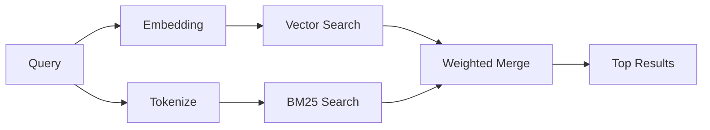

---
read_when:
    - تريد فهم كيفية عمل `memory_search`
    - تريد اختيار مزوّد embedding
    - تريد ضبط جودة البحث
summary: كيف يعثر بحث الذاكرة على الملاحظات ذات الصلة باستخدام embeddings والاسترجاع الهجين
title: بحث الذاكرة
x-i18n:
    generated_at: "2026-04-25T13:45:29Z"
    model: gpt-5.4
    provider: openai
    source_hash: 5cc6bbaf7b0a755bbe44d3b1b06eed7f437ebdc41a81c48cca64bd08bbc546b7
    source_path: concepts/memory-search.md
    workflow: 15
---

يعثر `memory_search` على الملاحظات ذات الصلة من ملفات الذاكرة لديك، حتى عندما
تختلف الصياغة عن النص الأصلي. وهو يعمل عبر فهرسة الذاكرة إلى مقاطع صغيرة
والبحث فيها باستخدام embedding، أو الكلمات المفتاحية، أو كليهما.

## البدء السريع

إذا كانت لديك اشتراك GitHub Copilot، أو مفتاح API لـ OpenAI، أو Gemini، أو Voyage، أو Mistral
مضبوط، فإن بحث الذاكرة يعمل تلقائيًا. ولضبط مزوّد
بشكل صريح:

```json5
{
  agents: {
    defaults: {
      memorySearch: {
        provider: "openai", // or "gemini", "local", "ollama", etc.
      },
    },
  },
}
```

وبالنسبة إلى embedding المحلي من دون مفتاح API، ثبّت حزمة وقت التشغيل الاختيارية `node-llama-cpp`
بجوار OpenClaw واستخدم `provider: "local"`.

## المزوّدون المدعومون

| المزوّد         | المعرّف          | يحتاج إلى مفتاح API | ملاحظات                                             |
| -------------- | ---------------- | ------------------- | --------------------------------------------------- |
| Bedrock        | `bedrock`        | لا                  | يُكتشف تلقائيًا عندما تنجح سلسلة بيانات اعتماد AWS |
| Gemini         | `gemini`         | نعم                 | يدعم فهرسة الصور/الصوت                              |
| GitHub Copilot | `github-copilot` | لا                  | يُكتشف تلقائيًا، ويستخدم اشتراك Copilot            |
| Local          | `local`          | لا                  | نموذج GGUF، تنزيل بحجم ~0.6 GB                     |
| Mistral        | `mistral`        | نعم                 | يُكتشف تلقائيًا                                     |
| Ollama         | `ollama`         | لا                  | محلي، ويجب ضبطه صراحةً                              |
| OpenAI         | `openai`         | نعم                 | يُكتشف تلقائيًا، وسريع                              |
| Voyage         | `voyage`         | نعم                 | يُكتشف تلقائيًا                                     |

## كيف يعمل البحث

يشغّل OpenClaw مساري استرجاع بالتوازي ويدمج النتائج:



- يعثر **البحث المتجهي** على الملاحظات المتشابهة في المعنى ("gateway host" يطابق
  "the machine running OpenClaw").
- يعثر **بحث الكلمات المفتاحية BM25** على المطابقات الدقيقة (المعرّفات، وسلاسل الأخطاء، ومفاتيح
  الإعدادات).

إذا كان مسار واحد فقط متاحًا (لا يوجد embedding أو لا توجد FTS)، فسيعمل المسار الآخر وحده.

عندما لا تكون embedding متاحة، يظل OpenClaw يستخدم الترتيب المعجمي على نتائج FTS بدلًا من الرجوع إلى ترتيب المطابقة الدقيقة الخام فقط. ويعزز هذا الوضع المتدهور المقاطع التي تغطي مصطلحات الاستعلام بشكل أقوى ومسارات الملفات ذات الصلة، مما يبقي الاسترجاع مفيدًا حتى من دون `sqlite-vec` أو مزوّد embedding.

## تحسين جودة البحث

تساعد ميزتان اختياريتان عندما يكون لديك سجل كبير من الملاحظات:

### التلاشي الزمني

تفقد الملاحظات القديمة وزنها الترتيبي تدريجيًا بحيث تظهر المعلومات الحديثة أولًا.
وباستخدام عمر النصف الافتراضي البالغ 30 يومًا، تسجل ملاحظة من الشهر الماضي نسبة 50% من
وزنها الأصلي. أما الملفات الدائمة مثل `MEMORY.md` فلا يطبق عليها التلاشي أبدًا.

<Tip>
فعّل التلاشي الزمني إذا كان لدى وكيلك أشهر من الملاحظات اليومية وكانت
المعلومات القديمة تتفوق باستمرار على السياق الحديث.
</Tip>

### MMR (التنوّع)

يقلل النتائج المتكررة. فإذا كانت خمس ملاحظات تذكر جميعها إعداد router نفسه، فإن MMR
يضمن أن تغطي النتائج العليا موضوعات مختلفة بدلًا من التكرار.

<Tip>
فعّل MMR إذا كان `memory_search` يعيد باستمرار مقاطع شبه مكررة من
ملاحظات يومية مختلفة.
</Tip>

### تفعيل كليهما

```json5
{
  agents: {
    defaults: {
      memorySearch: {
        query: {
          hybrid: {
            mmr: { enabled: true },
            temporalDecay: { enabled: true },
          },
        },
      },
    },
  },
}
```

## الذاكرة متعددة الوسائط

باستخدام Gemini Embedding 2، يمكنك فهرسة الصور وملفات الصوت إلى جانب
Markdown. وتظل استعلامات البحث نصية، لكنها تطابق المحتوى المرئي والصوتي أيضًا. راجع [مرجع إعدادات الذاكرة](/ar/reference/memory-config) لمعرفة
الإعداد.

## بحث ذاكرة الجلسة

يمكنك اختياريًا فهرسة transcripts الجلسات بحيث يتمكن `memory_search` من استدعاء
المحادثات السابقة. وهذا خيار اشتراك صريح عبر
`memorySearch.experimental.sessionMemory`. راجع
[مرجع الإعدادات](/ar/reference/memory-config) للحصول على التفاصيل.

## استكشاف الأخطاء وإصلاحها

**لا توجد نتائج؟** شغّل `openclaw memory status` للتحقق من الفهرس. وإذا كان فارغًا، فشغّل
`openclaw memory index --force`.

**مطابقات كلمات مفتاحية فقط؟** قد لا يكون مزوّد embedding لديك مضبوطًا. تحقّق من
`openclaw memory status --deep`.

**تعذر العثور على نص CJK؟** أعد بناء فهرس FTS باستخدام
`openclaw memory index --force`.

## قراءة إضافية

- [Active Memory](/ar/concepts/active-memory) -- ذاكرة الوكيل الفرعي لجلسات الدردشة التفاعلية
- [الذاكرة](/ar/concepts/memory) -- تخطيط الملفات، والواجهات الخلفية، والأدوات
- [مرجع إعدادات الذاكرة](/ar/reference/memory-config) -- جميع خيارات الإعداد

## ذو صلة

- [نظرة عامة على الذاكرة](/ar/concepts/memory)
- [Active Memory](/ar/concepts/active-memory)
- [محرك الذاكرة المضمّن](/ar/concepts/memory-builtin)
