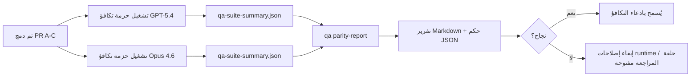

---
read_when:
    - مراجعة سلسلة طلبات السحب الخاصة بتكافؤ GPT-5.4 / Codex
    - صيانة بنية الوكيل ذات العقود الستة وراء برنامج التكافؤ
summary: كيفية مراجعة برنامج تكافؤ GPT-5.4 / Codex بوصفه أربع وحدات دمج
title: ملاحظات صيانة تكافؤ GPT-5.4 / Codex
x-i18n:
    generated_at: "2026-04-25T13:49:32Z"
    model: gpt-5.4
    provider: openai
    source_hash: 162ea68476880d4dbf9b8c3b9397a51a2732c3eb10ac52e421a9c9d90e04eec2
    source_path: help/gpt54-codex-agentic-parity-maintainers.md
    workflow: 15
---

تشرح هذه الملاحظة كيفية مراجعة برنامج تكافؤ GPT-5.4 / Codex بوصفه أربع وحدات دمج من دون فقدان بنية العقود الستة الأصلية.

## وحدات الدمج

### PR A: التنفيذ الوكيلي الصارم

يمتلك:

- `executionContract`
- المتابعة في الدورة نفسها مع نهج GPT-5 أولًا
- `update_plan` بوصفه تتبع تقدم غير نهائي
- حالات الحظر الصريحة بدلًا من التوقفات الصامتة القائمة على الخطة فقط

ولا يمتلك:

- تصنيف فشل auth/runtime
- صدقية الأذونات
- إعادة تصميم replay/continuation
- قياس التكافؤ

### PR B: الصدقية في runtime

يمتلك:

- صحة نطاقات Codex OAuth
- التصنيف المطبّع لفشل الموفّر/runtime
- الصدقية في توفر `/elevated full` وأسباب الحظر

ولا يمتلك:

- تطبيع schema للأدوات
- حالة replay/liveness
- بوابة القياس

### PR C: صحة التنفيذ

يمتلك:

- توافق أدوات OpenAI/Codex المملوكة للموفّر
- التعامل الصارم مع schema الخالية من المعاملات
- إظهار replay-invalid
- إظهار حالات paused وblocked وabandoned للمهام الطويلة

ولا يمتلك:

- continuation المنتخبة ذاتيًا
- سلوك لهجة Codex العامة خارج hooks الخاصة بالموفّر
- بوابة القياس

### PR D: حزام التكافؤ

يمتلك:

- حزمة السيناريوهات الأولى لـ GPT-5.4 مقابل Opus 4.6
- توثيق التكافؤ
- آليات تقرير التكافؤ وبوابة الإصدار

ولا يمتلك:

- تغييرات سلوك runtime خارج QA-lab
- محاكاة auth/proxy/DNS داخل الحزام

## الربط بالعقود الستة الأصلية

| العقد الأصلي                              | وحدة الدمج |
| ----------------------------------------- | ---------- |
| صحة النقل/المصادقة الخاصة بالموفّر        | PR B       |
| توافق عقد الأداة/schema                   | PR C       |
| التنفيذ في الدورة نفسها                   | PR A       |
| صدقية الأذونات                            | PR B       |
| صحة replay/continuation/liveness          | PR C       |
| بوابة القياس/الإصدار                      | PR D       |

## ترتيب المراجعة

1. PR A
2. PR B
3. PR C
4. PR D

تمثل PR D طبقة الإثبات. ويجب ألا تكون هي السبب في تأخير طلبات السحب الخاصة بصحة runtime.

## ما الذي يجب البحث عنه

### PR A

- تشغيلات GPT-5 تتصرف أو تفشل بشكل مغلق بدلًا من التوقف عند التعليق
- لم يعد `update_plan` يبدو كتقدم بحد ذاته
- يظل السلوك GPT-5-first ومحصورًا في embedded-Pi

### PR B

- لم تعد حالات فشل auth/proxy/runtime تنهار إلى معالجة عامة من نوع “فشل النموذج”
- لا يتم وصف `/elevated full` على أنه متاح إلا عندما يكون متاحًا فعلًا
- تكون أسباب الحظر مرئية لكل من النموذج وruntime الموجهة للمستخدم

### PR C

- يتصرف تسجيل أدوات OpenAI/Codex الصارم بصورة قابلة للتنبؤ
- لا تفشل الأدوات الخالية من المعاملات في فحوصات schema الصارمة
- تحافظ نتائج replay وCompaction على حالة liveness صادقة

### PR D

- تكون حزمة السيناريوهات مفهومة وقابلة لإعادة الإنتاج
- تتضمن الحزمة مسار mutating replay-safety، وليس تدفقات للقراءة فقط
- تكون التقارير قابلة للقراءة من قبل البشر والأتمتة
- تكون ادعاءات التكافؤ مدعومة بالأدلة، وليست قصصية

المخرجات المتوقعة من PR D:

- `qa-suite-report.md` / `qa-suite-summary.json` لكل تشغيل نموذج
- `qa-agentic-parity-report.md` مع مقارنة مجمعة وعلى مستوى السيناريو
- `qa-agentic-parity-summary.json` مع حكم قابل للقراءة آليًا

## بوابة الإصدار

لا تدّعِ تكافؤ GPT-5.4 أو تفوقه على Opus 4.6 حتى:

- يتم دمج PR A وPR B وPR C
- تشغّل PR D حزمة التكافؤ الأولى بنجاح
- تبقى مجموعات الانحدار الخاصة بصدق runtime خضراء
- يُظهر تقرير التكافؤ عدم وجود حالات نجاح زائف وعدم وجود انحدار في سلوك التوقف

ليس حزام التكافؤ هو المصدر الوحيد للأدلة. أبقِ هذا الفصل واضحًا في المراجعة:

- تملك PR D المقارنة القائمة على السيناريو بين GPT-5.4 وOpus 4.6
- وما تزال المجموعات الحتمية في PR B تملك أدلة auth/proxy/DNS وصدق الوصول الكامل

## سير عمل دمج سريع للمشرف

استخدم هذا عندما تكون مستعدًا لدمج PR خاصة بالتكافؤ وتريد تسلسلًا منخفض المخاطر وقابلًا للتكرار.

1. تأكد من استيفاء معيار الأدلة قبل الدمج:
   - عرض قابل لإعادة الإنتاج أو اختبار فاشل
   - سبب جذري متحقق منه في الشيفرة المعدلة
   - إصلاح في المسار المتسبب
   - اختبار انحدار أو ملاحظة تحقق يدوي صريحة
2. فرز/وسم قبل الدمج:
   - طبّق أي وسوم `r:*` للإغلاق التلقائي عندما لا ينبغي أن تُدمج PR
   - أبقِ مرشحي الدمج خالين من سلاسل المراجعة المانعة غير المحلولة
3. تحقق محليًا من السطح المعدل:
   - `pnpm check:changed`
   - `pnpm test:changed` عندما تتغير الاختبارات أو تعتمد الثقة في إصلاح الخطأ على تغطية الاختبارات
4. نفّذ الدمج وفق تدفق المشرف القياسي (عملية `/landpr`) ثم تحقق من:
   - سلوك الإغلاق التلقائي للمشكلات المرتبطة
   - حالة CI وما بعد الدمج على `main`
5. بعد الدمج، شغّل بحثًا عن التكرارات لطلبات السحب/المشكلات المفتوحة ذات الصلة وأغلقها فقط مع مرجع أساسي.

إذا كان أي عنصر من عناصر معيار الأدلة مفقودًا، فاطلب تغييرات بدلًا من الدمج.

## خريطة الهدف إلى الدليل

| عنصر بوابة الإكمال                      | المالك الأساسي | مخرج المراجعة                                                       |
| --------------------------------------- | -------------- | ------------------------------------------------------------------- |
| لا حالات تعطل قائمة على الخطة فقط       | PR A           | اختبارات runtime الوكيلية الصارمة و`approval-turn-tool-followthrough` |
| لا تقدم زائف ولا إكمال أداة زائف        | PR A + PR D    | عدد النجاحات الزائفة في التكافؤ بالإضافة إلى تفاصيل التقرير على مستوى السيناريو |
| لا إرشاد خاطئ لـ `/elevated full`       | PR B           | مجموعات الصدقية الحتمية لـ runtime                                   |
| تبقى حالات فشل replay/liveness صريحة    | PR C + PR D    | مجموعات lifecycle/replay بالإضافة إلى `compaction-retry-mutating-tool` |
| GPT-5.4 يطابق أو يتفوق على Opus 4.6     | PR D           | `qa-agentic-parity-report.md` و`qa-agentic-parity-summary.json`     |

## اختصار للمراجعين: قبل مقابل بعد

| المشكلة المرئية للمستخدم قبل ذلك                            | إشارة المراجعة بعد ذلك                                                                   |
| ----------------------------------------------------------- | ---------------------------------------------------------------------------------------- |
| كان GPT-5.4 يتوقف بعد التخطيط                              | تُظهر PR A سلوك تصرف-أو-حظر بدلًا من اكتمال قائم على التعليق فقط                       |
| بدا استخدام الأدوات هشًا مع schema الصارمة لـ OpenAI/Codex | تُبقي PR C تسجيل الأدوات والاستدعاء الخالي من المعاملات قابلين للتنبؤ                   |
| كانت تلميحات `/elevated full` مضللة أحيانًا                | تربط PR B الإرشاد بقدرة runtime الفعلية وأسباب الحظر                                    |
| قد تختفي المهام الطويلة داخل غموض replay/Compaction        | تصدر PR C حالات paused وblocked وabandoned وreplay-invalid بشكل صريح                    |
| كانت ادعاءات التكافؤ قصصية                                 | تنتج PR D تقريرًا مع حكم JSON وبنفس تغطية السيناريوهات على كلا النموذجين               |

## ذو صلة

- [تكافؤ GPT-5.4 / Codex الوكيلي](/ar/help/gpt54-codex-agentic-parity)
