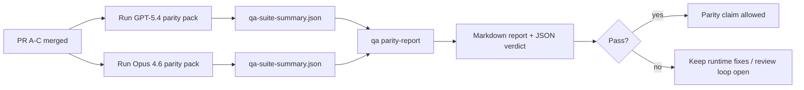

---
read_when:
    - مراجعة سلسلة طلبات السحب الخاصة بتكافؤ GPT-5.4 / Codex
    - صيانة البنية الوكيلة ذات العقود الستة الكامنة وراء برنامج التكافؤ
summary: كيفية مراجعة برنامج التكافؤ بين GPT-5.4 وCodex بوصفه أربع وحدات دمج
title: ملاحظات الصيانة الخاصة بتكافؤ GPT-5.4 / Codex
x-i18n:
    generated_at: "2026-04-22T04:23:33Z"
    model: gpt-5.4
    provider: openai
    source_hash: b872d6a33b269c01b44537bfa8646329063298fdfcd3671a17d0eadbc9da5427
    source_path: help/gpt54-codex-agentic-parity-maintainers.md
    workflow: 15
---

# ملاحظات الصيانة الخاصة بتكافؤ GPT-5.4 / Codex

توضح هذه الملاحظة كيفية مراجعة برنامج التكافؤ بين GPT-5.4 وCodex بوصفه أربع وحدات دمج من دون فقدان بنية العقود الستة الأصلية.

## وحدات الدمج

### PR A: التنفيذ الوكيلي الصارم

يتولى:

- `executionContract`
- المتابعة في الدور نفسه مع إعطاء الأولوية لـ GPT-5
- `update_plan` بوصفه تتبعًا غير نهائي للتقدم
- حالات التعذر الصريحة بدلًا من التوقفات الصامتة المعتمدة على الخطة فقط

لا يتولى:

- تصنيف فشل auth/runtime
- الصدق في الأذونات
- إعادة تصميم replay/continuation
- قياس التكافؤ

### PR B: الصدق في وقت التشغيل

يتولى:

- صحة نطاقات OAuth في Codex
- تصنيف فشل provider/runtime المطبّع
- التوفر الصادق لـ `/elevated full` وأسباب التعذر

لا يتولى:

- تسوية tool schema
- حالة replay/liveness
- قيود القياس

### PR C: صحة التنفيذ

يتولى:

- توافق الأدوات OpenAI/Codex المملوكة لـ provider
- التعامل الصارم مع schema من دون معلمات
- إظهار replay-invalid
- إظهار حالات المهام الطويلة: paused وblocked وabandoned

لا يتولى:

- continuation المنتخبة ذاتيًا
- سلوك لهجة Codex العامة خارج hooks الخاصة بـ provider
- قيود القياس

### PR D: أداة التكافؤ

يتولى:

- الحزمة الأولى من سيناريوهات GPT-5.4 مقابل Opus 4.6
- توثيق التكافؤ
- تقرير التكافؤ وآليات بوابة الإصدار

لا يتولى:

- تغييرات سلوك وقت التشغيل خارج QA-lab
- محاكاة auth/proxy/DNS داخل الأداة

## الربط بالعقود الستة الأصلية

| العقد الأصلي                              | وحدة الدمج |
| ---------------------------------------- | ---------- |
| صحة النقل/المصادقة في provider          | PR B       |
| توافق عقد الأداة/schema                 | PR C       |
| التنفيذ في الدور نفسه                    | PR A       |
| الصدق في الأذونات                        | PR B       |
| صحة replay/continuation/liveness        | PR C       |
| بوابة القياس/الإصدار                     | PR D       |

## ترتيب المراجعة

1. PR A
2. PR B
3. PR C
4. PR D

يمثل PR D طبقة الإثبات. يجب ألا يكون هو سبب تأخير طلبات السحب الخاصة بصحة وقت التشغيل.

## ما الذي يجب البحث عنه

### PR A

- تعمل تشغيلات GPT-5 أو تفشل بشكل مغلق بدلًا من التوقف عند التعليق
- لم يعد `update_plan` يبدو تقدمًا بحد ذاته
- يظل السلوك موجّهًا أولًا إلى GPT-5 ومحصورًا ضمن embedded-Pi

### PR B

- لم تعد حالات فشل auth/proxy/runtime تنهار إلى معالجة عامة من نوع “model failed”
- لا يُوصَف `/elevated full` بأنه متاح إلا عندما يكون متاحًا فعلًا
- تكون أسباب التعذر مرئية لكل من النموذج ووقت التشغيل المواجه للمستخدم

### PR C

- يتصرف تسجيل الأدوات الصارم لـ OpenAI/Codex بشكل يمكن التنبؤ به
- لا تفشل الأدوات من دون معلمات في فحوصات schema الصارمة
- تحافظ نتائج replay وCompaction على حالة liveness صادقة

### PR D

- حزمة السيناريوهات مفهومة وقابلة لإعادة الإنتاج
- تتضمن الحزمة مسار mutating replay-safety، وليس فقط التدفقات للقراءة فقط
- التقارير قابلة للقراءة من قبل البشر والأتمتة
- تكون ادعاءات التكافؤ مدعومة بالأدلة، لا روايات غير موثقة

الآثار المتوقعة من PR D:

- `qa-suite-report.md` / `qa-suite-summary.json` لكل تشغيل نموذج
- `qa-agentic-parity-report.md` مع مقارنة إجمالية وعلى مستوى السيناريو
- `qa-agentic-parity-summary.json` مع حكم قابل للقراءة آليًا

## بوابة الإصدار

لا تدّعِ التكافؤ أو التفوق لـ GPT-5.4 على Opus 4.6 حتى:

- يتم دمج PR A وPR B وPR C
- يشغّل PR D حزمة التكافؤ للموجة الأولى بنجاح
- تظل مجموعات الانحدار الخاصة بالصدق في وقت التشغيل باللون الأخضر
- يُظهر تقرير التكافؤ عدم وجود حالات نجاح زائف وعدم وجود انحدار في سلوك التوقف

ليست أداة التكافؤ المصدر الوحيد للأدلة. أبقِ هذا الفصل صريحًا أثناء المراجعة:

- يتولى PR D المقارنة المعتمدة على السيناريوهات بين GPT-5.4 وOpus 4.6
- وما تزال المجموعات الحتمية في PR B تتولى أدلة auth/proxy/DNS والصدق في full-access

## خريطة الهدف إلى الدليل

| عنصر بوابة الاكتمال                     | المالك الأساسي | أثر المراجعة                                                        |
| -------------------------------------- | -------------- | ------------------------------------------------------------------- |
| لا توقفات تعتمد على الخطة فقط          | PR A           | اختبارات وقت التشغيل الوكيلي الصارم و`approval-turn-tool-followthrough` |
| لا تقدم زائف ولا إكمال أدوات زائف      | PR A + PR D    | عدد النجاحات الزائفة في التكافؤ بالإضافة إلى تفاصيل التقرير على مستوى السيناريو |
| لا إرشادات خاطئة لـ `/elevated full`   | PR B           | مجموعات الصدق الحتمية في وقت التشغيل                                |
| تظل حالات فشل replay/liveness صريحة    | PR C + PR D    | مجموعات lifecycle/replay بالإضافة إلى `compaction-retry-mutating-tool` |
| يطابق GPT-5.4 أو يتفوق على Opus 4.6    | PR D           | `qa-agentic-parity-report.md` و`qa-agentic-parity-summary.json`     |

## اختصار للمراجع: قبل مقابل بعد

| المشكلة المرئية للمستخدم سابقًا                              | إشارة المراجعة لاحقًا                                                                    |
| ----------------------------------------------------------- | ---------------------------------------------------------------------------------------- |
| كان GPT-5.4 يتوقف بعد التخطيط                               | يُظهر PR A سلوك التنفيذ أو التعذر بدلًا من الاكتمال القائم على التعليق فقط               |
| بدا استخدام الأدوات هشًا مع schemas الصارمة في OpenAI/Codex | يجعل PR C تسجيل الأدوات والاستدعاء من دون معلمات قابلين للتنبؤ                           |
| كانت تلميحات `/elevated full` مضللة أحيانًا                 | يربط PR B الإرشاد بقدرة وقت التشغيل الفعلية وأسباب التعذر                               |
| كان يمكن أن تختفي المهام الطويلة ضمن غموض replay/Compaction | يصدر PR C حالات paused وblocked وabandoned وreplay-invalid بشكل صريح                   |
| كانت ادعاءات التكافؤ قصصية وغير موثقة                       | ينتج PR D تقريرًا بالإضافة إلى حكم JSON مع تغطية السيناريوهات نفسها على كلا النموذجين |
