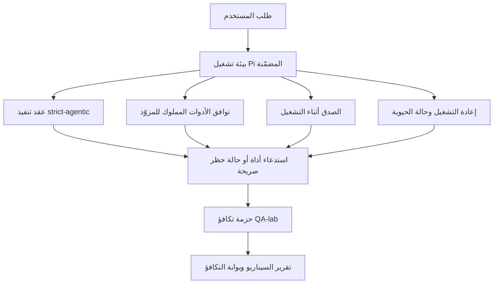

---
read_when:
    - تصحيح سلوك الوكيل في GPT-5.4 أو Codex
    - مقارنة السلوك الوكيلي في OpenClaw عبر النماذج المتقدمة
    - مراجعة إصلاحات strict-agentic ومخطط الأداة والتصعيد وإعادة التشغيل
summary: كيف يسد OpenClaw فجوات التنفيذ الوكيلي في GPT-5.4 والنماذج بأسلوب Codex
title: تكافؤ السلوك الوكيلي لـ GPT-5.4 / Codex
x-i18n:
    generated_at: "2026-04-22T04:23:27Z"
    model: gpt-5.4
    provider: openai
    source_hash: 77bc9b8fab289bd35185fa246113503b3f5c94a22bd44739be07d39ae6779056
    source_path: help/gpt54-codex-agentic-parity.md
    workflow: 15
---

# تكافؤ السلوك الوكيلي لـ GPT-5.4 / Codex في OpenClaw

كان OpenClaw يعمل بالفعل بشكل جيد مع النماذج المتقدمة التي تستخدم الأدوات، لكن GPT-5.4 والنماذج بأسلوب Codex كانت لا تزال أقل أداءً في بعض النواحي العملية:

- قد تتوقف بعد التخطيط بدلًا من تنفيذ العمل
- قد تستخدم مخططات أدوات OpenAI/Codex الصارمة بشكل غير صحيح
- قد تطلب `/elevated full` حتى عندما يكون الوصول الكامل مستحيلًا
- قد تفقد حالة المهام الطويلة أثناء إعادة التشغيل أو Compaction
- كانت ادعاءات التكافؤ مقارنة بـ Claude Opus 4.6 تستند إلى انطباعات متفرقة بدلًا من سيناريوهات قابلة للتكرار

يُصلح برنامج التكافؤ هذا هذه الفجوات عبر أربع دفعات قابلة للمراجعة.

## ما الذي تغيّر

### PR A: تنفيذ strict-agentic

تضيف هذه الدفعة عقد تنفيذ `strict-agentic` اختياريًا لتشغيلات Pi GPT-5 المضمّنة.

عند تفعيله، يتوقف OpenClaw عن قبول الأدوار التي تحتوي على خطة فقط على أنها إنجاز "جيد بما يكفي". وإذا قال النموذج فقط ما ينوي فعله ولم يستخدم الأدوات فعليًا أو يحرز تقدمًا، فسيُعيد OpenClaw المحاولة مع توجيه للتنفيذ الفوري، ثم يفشل بشكل مغلق مع حالة حظر صريحة بدلًا من إنهاء المهمة بصمت.

يحسن هذا تجربة GPT-5.4 أكثر ما يكون في الحالات التالية:

- المتابعات القصيرة من نوع "حسنًا افعل ذلك"
- مهام البرمجة حيث تكون الخطوة الأولى واضحة
- التدفقات التي يجب أن يكون فيها `update_plan` تتبعًا للتقدم بدلًا من نص حشو

### PR B: الصدق أثناء التشغيل

تجعل هذه الدفعة OpenClaw يقول الحقيقة بشأن أمرين:

- سبب فشل استدعاء المزوّد/بيئة التشغيل
- ما إذا كان `/elevated full` متاحًا فعلًا

وهذا يعني أن GPT-5.4 يحصل على إشارات تشغيلية أفضل عند نقص النطاقات، وفشل تحديث المصادقة، وفشل مصادقة HTML 403، ومشكلات الوكيل، وفشل DNS أو المهلات، وأوضاع الوصول الكامل المحظورة. ويصبح احتمال أن يهلوس النموذج بخطوات إصلاح خاطئة أو يستمر في طلب وضع صلاحيات لا تستطيع بيئة التشغيل توفيره أقل.

### PR C: صحة التنفيذ

تحسن هذه الدفعة نوعين من الصحة:

- توافق مخطط الأدوات OpenAI/Codex الذي يملكه المزوّد
- إظهار إعادة التشغيل وحيوية المهام الطويلة

يقلل عمل توافق الأدوات من احتكاك المخطط عند تسجيل أدوات OpenAI/Codex الصارمة، وخصوصًا حول الأدوات التي لا تحتوي على معلمات وتوقعات الجذر الكائني الصارمة. أما عمل إعادة التشغيل/الحيوية فيجعل المهام الطويلة أكثر قابلية للملاحظة، بحيث تصبح الحالات المتوقفة مؤقتًا، والمحظورة، والمتروكة مرئية بدلًا من أن تختفي داخل نص فشل عام.

### PR D: حزمة التكافؤ

تضيف هذه الدفعة أول حزمة تكافؤ من QA-lab حتى يمكن تشغيل GPT-5.4 وOpus 4.6 عبر السيناريوهات نفسها ومقارنتهما باستخدام أدلة مشتركة.

حزمة التكافؤ هي طبقة الإثبات. وهي لا تغيّر سلوك بيئة التشغيل بحد ذاتها.

بعد أن يصبح لديك ملفا `qa-suite-summary.json`، أنشئ مقارنة بوابة الإصدار باستخدام:

```bash
pnpm openclaw qa parity-report \
  --repo-root . \
  --candidate-summary .artifacts/qa-e2e/gpt54/qa-suite-summary.json \
  --baseline-summary .artifacts/qa-e2e/opus46/qa-suite-summary.json \
  --output-dir .artifacts/qa-e2e/parity
```

يكتب هذا الأمر:

- تقرير Markdown مقروءًا للبشر
- نتيجة JSON قابلة للقراءة الآلية
- نتيجة بوابة صريحة `pass` / `fail`

## لماذا يحسن هذا GPT-5.4 عمليًا

قبل هذا العمل، كان GPT-5.4 على OpenClaw قد يبدو أقل وكيلية من Opus في جلسات البرمجة الحقيقية لأن بيئة التشغيل كانت تتسامح مع سلوكيات تضر نماذج GPT-5 بشكل خاص:

- أدوار تعتمد على التعليق فقط
- احتكاك المخطط حول الأدوات
- تغذية راجعة غامضة بشأن الصلاحيات
- أعطال صامتة في إعادة التشغيل أو Compaction

الهدف ليس جعل GPT-5.4 يقلّد Opus. الهدف هو منح GPT-5.4 عقد تشغيل يكافئ التقدم الحقيقي، ويوفر دلالات أنظف للأدوات والصلاحيات، ويحوّل أوضاع الفشل إلى حالات صريحة قابلة للقراءة آليًا وبشريًا.

وهذا يغيّر تجربة المستخدم من:

- "كان لدى النموذج خطة جيدة لكنه توقف"

إلى:

- "إما أن النموذج نفّذ، أو أن OpenClaw أوضح السبب الدقيق لعدم قدرته على ذلك"

## قبل البرنامج وبعده لمستخدمي GPT-5.4

| قبل هذا البرنامج                                                                            | بعد PR A-D                                                                                 |
| -------------------------------------------------------------------------------------------- | ------------------------------------------------------------------------------------------ |
| كان GPT-5.4 قد يتوقف بعد خطة معقولة من دون اتخاذ الخطوة التالية بالأداة                     | يحول PR A "الخطة فقط" إلى "نفّذ الآن أو أظهر حالة حظر"                                    |
| كانت مخططات الأدوات الصارمة قد ترفض الأدوات بدون معلمات أو الأدوات بشكل OpenAI/Codex بطريقة مربكة | يجعل PR C تسجيل الأدوات واستدعاءها المملوكين للمزوّد أكثر قابلية للتنبؤ                   |
| كان توجيه `/elevated full` قد يكون غامضًا أو خاطئًا في بيئات التشغيل المحظورة              | يمنح PR B كلًا من GPT-5.4 والمستخدم تلميحات تشغيلية وتلميحات صلاحيات صادقة                |
| كان فشل إعادة التشغيل أو Compaction قد يبدو وكأن المهمة اختفت بصمت                          | يُظهر PR C حالات التوقف المؤقت والحظر والتخلي وإبطال إعادة التشغيل بشكل صريح               |
| كان الشعور بأن "GPT-5.4 أسوأ من Opus" قائمًا في الغالب على الانطباعات                        | يحول PR D ذلك إلى حزمة السيناريوهات نفسها، والمقاييس نفسها، وبوابة نجاح/فشل صارمة         |

## البنية



## تدفق الإصدار


## حزمة السيناريوهات

تغطي حزمة التكافؤ للموجة الأولى حاليًا خمسة سيناريوهات:

### `approval-turn-tool-followthrough`

يتحقق من أن النموذج لا يتوقف عند "سأفعل ذلك" بعد موافقة قصيرة. بل يجب أن يتخذ أول إجراء ملموس في الدور نفسه.

### `model-switch-tool-continuity`

يتحقق من أن العمل المعتمد على الأدوات يبقى متماسكًا عبر حدود تبديل النموذج/بيئة التشغيل بدلًا من أن يُعاد ضبطه إلى تعليق أو أن يفقد سياق التنفيذ.

### `source-docs-discovery-report`

يتحقق من أن النموذج يمكنه قراءة المصدر والوثائق، وتجميع النتائج، ومتابعة المهمة بشكل وكيلي بدلًا من إنتاج ملخص رقيق ثم التوقف مبكرًا.

### `image-understanding-attachment`

يتحقق من أن المهام المختلطة التي تتضمن مرفقات تبقى قابلة للتنفيذ ولا تنهار إلى سرد غامض.

### `compaction-retry-mutating-tool`

يتحقق من أن المهمة التي تتضمن كتابة تغييرية فعلية تُبقي عدم أمان إعادة التشغيل صريحًا بدلًا من أن تبدو آمنة لإعادة التشغيل بهدوء إذا تعرض التشغيل إلى Compaction أو إعادة محاولة أو فقد حالة الرد تحت الضغط.

## مصفوفة السيناريوهات

| السيناريو                           | ما الذي يختبره                          | السلوك الجيد لـ GPT-5.4                                                         | إشارة الفشل                                                                         |
| ---------------------------------- | --------------------------------------- | -------------------------------------------------------------------------------- | ----------------------------------------------------------------------------------- |
| `approval-turn-tool-followthrough` | أدوار الموافقة القصيرة بعد خطة          | يبدأ أول إجراء أداة ملموس فورًا بدلًا من إعادة صياغة النية                      | متابعة بخطة فقط، أو بلا نشاط أدوات، أو دور محظور من دون مانع حقيقي                 |
| `model-switch-tool-continuity`     | تبديل بيئة التشغيل/النموذج أثناء استخدام الأدوات | يحافظ على سياق المهمة ويواصل التنفيذ بشكل متماسك                                | إعادة ضبط إلى تعليق، أو فقدان سياق الأدوات، أو التوقف بعد التبديل                  |
| `source-docs-discovery-report`     | قراءة المصدر + التجميع + التنفيذ        | يعثر على المصادر، ويستخدم الأدوات، وينتج تقريرًا مفيدًا من دون تعثر             | ملخص رقيق، أو غياب عمل الأدوات، أو توقف في دور غير مكتمل                           |
| `image-understanding-attachment`   | العمل الوكيلي المعتمد على المرفقات      | يفسر المرفق، ويربطه بالأدوات، ويواصل المهمة                                     | سرد غامض، أو تجاهل المرفق، أو غياب إجراء ملموس تالٍ                                 |
| `compaction-retry-mutating-tool`   | العمل التغييري تحت ضغط Compaction       | ينفذ كتابة فعلية ويُبقي عدم أمان إعادة التشغيل صريحًا بعد الأثر الجانبي          | حدوث كتابة تغييرية لكن مع الإيحاء بأن إعادة التشغيل آمنة، أو غياب ذلك، أو تناقضه    |

## بوابة الإصدار

لا يمكن اعتبار GPT-5.4 متكافئًا أو أفضل إلا عندما تجتاز بيئة التشغيل المدمجة حزمة التكافؤ وانحدارات الصدق أثناء التشغيل في الوقت نفسه.

النتائج المطلوبة:

- لا يوجد تعثر عند خطة فقط عندما تكون خطوة الأداة التالية واضحة
- لا يوجد اكتمال زائف من دون تنفيذ حقيقي
- لا يوجد توجيه خاطئ لـ `/elevated full`
- لا يوجد تخلي صامت عن إعادة التشغيل أو Compaction
- مقاييس حزمة التكافؤ تكون على الأقل بالقوة نفسها مقارنة بخط أساس Opus 4.6 المتفق عليه

بالنسبة لحزمة الاختبار الأولى، تقارن البوابة:

- معدل الإكمال
- معدل التوقف غير المقصود
- معدل استدعاء الأدوات الصحيح
- عدد النجاحات الزائفة

تم تقسيم أدلة التكافؤ عمدًا إلى طبقتين:

- يثبت PR D سلوك GPT-5.4 مقابل Opus 4.6 في السيناريوهات نفسها عبر QA-lab
- تثبت مجموعات PR B الحتمية صدق المصادقة والوكيل وDNS و`/elevated full` خارج الحزمة

## مصفوفة الهدف إلى الدليل

| عنصر بوابة الإكمال                                      | PR المالك    | مصدر الدليل                                                      | إشارة النجاح                                                                            |
| ------------------------------------------------------- | ------------ | ---------------------------------------------------------------- | --------------------------------------------------------------------------------------- |
| لم يعد GPT-5.4 يتعثر بعد التخطيط                        | PR A         | `approval-turn-tool-followthrough` بالإضافة إلى مجموعات تشغيل PR A | تؤدي أدوار الموافقة إلى عمل حقيقي أو إلى حالة حظر صريحة                                |
| لم يعد GPT-5.4 يزيف التقدم أو إكمال الأدوات الزائف      | PR A + PR D  | نتائج سيناريو تقرير التكافؤ وعدد النجاحات الزائفة               | لا توجد نتائج نجاح مشبوهة ولا اكتمال قائم على التعليق فقط                              |
| لم يعد GPT-5.4 يقدم توجيه `/elevated full` كاذبًا       | PR B         | مجموعات الصدق الحتمية                                            | تبقى أسباب الحظر وتلميحات الوصول الكامل دقيقة بالنسبة لبيئة التشغيل                    |
| تبقى أعطال إعادة التشغيل/الحيوية صريحة                  | PR C + PR D  | مجموعات دورة الحياة/إعادة التشغيل في PR C بالإضافة إلى `compaction-retry-mutating-tool` | يحتفظ العمل التغييري بعدم أمان إعادة التشغيل بشكل صريح بدلًا من أن يختفي بصمت         |
| يطابق GPT-5.4 أو يتفوق على Opus 4.6 في المقاييس المتفق عليها | PR D         | `qa-agentic-parity-report.md` و`qa-agentic-parity-summary.json`  | التغطية نفسها للسيناريوهات وعدم وجود تراجع في الإكمال أو سلوك التوقف أو الاستخدام الصحيح للأدوات |

## كيفية قراءة نتيجة التكافؤ

استخدم النتيجة في `qa-agentic-parity-summary.json` باعتبارها القرار النهائي القابل للقراءة الآلية لحزمة التكافؤ للموجة الأولى.

- تعني `pass` أن GPT-5.4 غطّى السيناريوهات نفسها التي غطاها Opus 4.6 ولم يتراجع في المقاييس التجميعية المتفق عليها.
- تعني `fail` أن بوابة صارمة واحدة على الأقل قد تعثرت: إكمال أضعف، أو توقفات غير مقصودة أسوأ، أو استخدام صحيح أضعف للأدوات، أو أي حالة نجاح زائف، أو عدم تطابق في تغطية السيناريوهات.
- إن "مشكلة CI مشتركة/أساسية" ليست بحد ذاتها نتيجة تكافؤ. وإذا تسبب ضجيج CI خارج PR D في حظر تشغيل، فيجب أن تنتظر النتيجة تنفيذًا نظيفًا لبيئة التشغيل المدمجة بدلًا من استنتاجها من سجلات تعود إلى مرحلة الفرع.
- تظل دقة المصادقة والوكيل وDNS و`/elevated full` مستندة إلى المجموعات الحتمية في PR B، لذلك يحتاج ادعاء الإصدار النهائي إلى الأمرين معًا: نتيجة تكافؤ ناجحة من PR D وتغطية صدق خضراء من PR B.

## من الذي ينبغي له تفعيل `strict-agentic`

استخدم `strict-agentic` عندما:

- يُتوقع من الوكيل أن ينفّذ فورًا عندما تكون الخطوة التالية واضحة
- تكون GPT-5.4 أو نماذج عائلة Codex هي بيئة التشغيل الأساسية
- تفضّل الحالات المحظورة الصريحة بدلًا من الردود "المفيدة" التي تكتفي بإعادة التلخيص

أبقِ العقد الافتراضي عندما:

- تريد السلوك الحالي الأكثر مرونة
- لا تستخدم نماذج عائلة GPT-5
- تختبر المطالبات بدلًا من فرضية بيئة التشغيل
