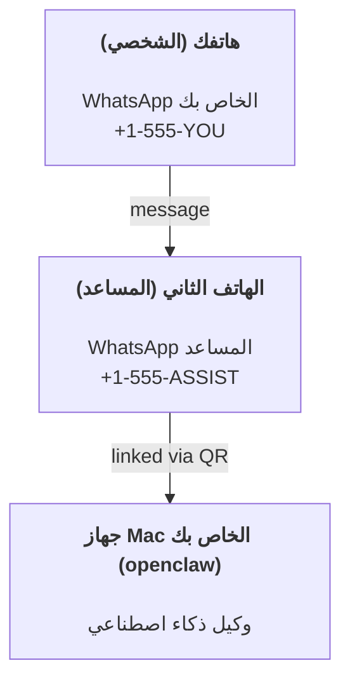

---
read_when:
    - إعداد مثيل مساعد جديد لأول مرة
    - مراجعة تبعات السلامة والأذونات
summary: دليل شامل لتشغيل OpenClaw كمساعد شخصي مع تنبيهات السلامة
title: إعداد المساعد الشخصي
x-i18n:
    generated_at: "2026-04-25T13:58:22Z"
    model: gpt-5.4
    provider: openai
    source_hash: 1647b78e8cf23a3a025969c52fbd8a73aed78df27698abf36bbf62045dc30e3b
    source_path: start/openclaw.md
    workflow: 15
---

# بناء مساعد شخصي باستخدام OpenClaw

OpenClaw هو Gateway مستضاف ذاتيًا يربط Discord وGoogle Chat وiMessage وMatrix وMicrosoft Teams وSignal وSlack وTelegram وWhatsApp وZalo وغيرها بوكلاء الذكاء الاصطناعي. يغطي هذا الدليل إعداد "المساعد الشخصي": رقم WhatsApp مخصص يتصرف كمساعدك الذكي الدائم التشغيل.

## ⚠️ السلامة أولًا

أنت تضع وكيلًا في موضع يسمح له بما يلي:

- تشغيل الأوامر على جهازك (بحسب سياسة الأدوات لديك)
- قراءة الملفات وكتابتها في مساحة العمل الخاصة بك
- إرسال الرسائل مرة أخرى عبر WhatsApp/Telegram/Discord/Mattermost والقنوات المضمّنة الأخرى

ابدأ بشكل محافظ:

- احرص دائمًا على ضبط `channels.whatsapp.allowFrom` (ولا تشغّله أبدًا بشكل مفتوح للعالم على جهاز Mac الشخصي الخاص بك).
- استخدم رقم WhatsApp مخصصًا للمساعد.
- أصبح Heartbeat افتراضيًا كل 30 دقيقة. عطّله إلى أن تثق في الإعداد عبر ضبط `agents.defaults.heartbeat.every: "0m"`.

## المتطلبات المسبقة

- يجب أن يكون OpenClaw مثبتًا وتم إجراء الإعداد الأولي له — راجع [البدء](/ar/start/getting-started) إذا لم تقم بذلك بعد
- رقم هاتف ثانٍ (SIM/eSIM/مسبق الدفع) للمساعد

## إعداد الهاتفين (موصى به)

أنت تريد هذا:



إذا قمت بربط WhatsApp الشخصي الخاص بك بـ OpenClaw، فستصبح كل رسالة تصلك بمثابة "إدخال للوكيل". وهذا نادرًا ما يكون ما تريده.

## بداية سريعة خلال 5 دقائق

1. قم بإقران WhatsApp Web (سيعرض QR؛ امسحه بهاتف المساعد):

```bash
openclaw channels login
```

2. شغّل Gateway (واتركه يعمل):

```bash
openclaw gateway --port 18789
```

3. ضع إعدادًا بسيطًا في `~/.openclaw/openclaw.json`:

```json5
{
  gateway: { mode: "local" },
  channels: { whatsapp: { allowFrom: ["+15555550123"] } },
}
```

الآن أرسل رسالة إلى رقم المساعد من هاتفك المدرج في قائمة السماح.

عند اكتمال الإعداد الأولي، يفتح OpenClaw لوحة التحكم تلقائيًا ويطبع رابطًا نظيفًا (من دون token). إذا طلبت لوحة التحكم المصادقة، فالصق السر المشترك المضبوط في إعدادات Control UI. يستخدم الإعداد الأولي token افتراضيًا (`gateway.auth.token`)، لكن مصادقة كلمة المرور تعمل أيضًا إذا بدّلت `gateway.auth.mode` إلى `password`. لإعادة الفتح لاحقًا: `openclaw dashboard`.

## امنح الوكيل مساحة عمل (AGENTS)

يقرأ OpenClaw تعليمات التشغيل و"الذاكرة" من دليل مساحة العمل الخاص به.

بشكل افتراضي، يستخدم OpenClaw المسار `~/.openclaw/workspace` كمساحة عمل للوكيل، وينشئه تلقائيًا (بالإضافة إلى ملفات البداية `AGENTS.md` و`SOUL.md` و`TOOLS.md` و`IDENTITY.md` و`USER.md` و`HEARTBEAT.md`) عند الإعداد/أول تشغيل للوكيل. لا يتم إنشاء `BOOTSTRAP.md` إلا عندما تكون مساحة العمل جديدة تمامًا (ولا ينبغي أن يعود بعد حذفه). الملف `MEMORY.md` اختياري (لا يتم إنشاؤه تلقائيًا)؛ وعند وجوده، يتم تحميله للجلسات العادية. لا تضخ جلسات الوكيل الفرعي إلا `AGENTS.md` و`TOOLS.md`.

نصيحة: تعامل مع هذا المجلد باعتباره "ذاكرة" OpenClaw واجعله مستودع git (ويُفضّل أن يكون خاصًا) حتى يتم نسخ ملفات `AGENTS.md` + الذاكرة احتياطيًا. إذا كان git مثبتًا، تتم تهيئة مساحات العمل الجديدة تلقائيًا.

```bash
openclaw setup
```

التخطيط الكامل لمساحة العمل + دليل النسخ الاحتياطي: [مساحة عمل الوكيل](/ar/concepts/agent-workspace)  
سير عمل الذاكرة: [الذاكرة](/ar/concepts/memory)

اختياري: اختر مساحة عمل مختلفة باستخدام `agents.defaults.workspace` (يدعم `~`).

```json5
{
  agents: {
    defaults: {
      workspace: "~/.openclaw/workspace",
    },
  },
}
```

إذا كنت توفّر بالفعل ملفات مساحة العمل الخاصة بك من مستودع، فيمكنك تعطيل إنشاء ملفات التهيئة الأولية بالكامل:

```json5
{
  agents: {
    defaults: {
      skipBootstrap: true,
    },
  },
}
```

## الإعداد الذي يحوّله إلى "مساعد"

يفترض OpenClaw افتراضيًا إعدادًا جيدًا للمساعد، لكنك عادةً ستحتاج إلى ضبط ما يلي:

- الشخصية/التعليمات في [`SOUL.md`](/ar/concepts/soul)
- إعدادات التفكير الافتراضية (إذا رغبت)
- Heartbeat (بعد أن تثق به)

مثال:

```json5
{
  logging: { level: "info" },
  agent: {
    model: "anthropic/claude-opus-4-6",
    workspace: "~/.openclaw/workspace",
    thinkingDefault: "high",
    timeoutSeconds: 1800,
    // ابدأ بـ 0؛ وفعّله لاحقًا.
    heartbeat: { every: "0m" },
  },
  channels: {
    whatsapp: {
      allowFrom: ["+15555550123"],
      groups: {
        "*": { requireMention: true },
      },
    },
  },
  routing: {
    groupChat: {
      mentionPatterns: ["@openclaw", "openclaw"],
    },
  },
  session: {
    scope: "per-sender",
    resetTriggers: ["/new", "/reset"],
    reset: {
      mode: "daily",
      atHour: 4,
      idleMinutes: 10080,
    },
  },
}
```

## الجلسات والذاكرة

- ملفات الجلسات: `~/.openclaw/agents/<agentId>/sessions/{{SessionId}}.jsonl`
- بيانات تعريف الجلسات (استخدام الرموز، وآخر مسار، وما إلى ذلك): `~/.openclaw/agents/<agentId>/sessions/sessions.json` (القديم: `~/.openclaw/sessions/sessions.json`)
- يبدأ `/new` أو `/reset` جلسة جديدة لتلك الدردشة (قابل للضبط عبر `resetTriggers`). وإذا أُرسل بمفرده، يرد الوكيل بتحية قصيرة لتأكيد إعادة التعيين.
- يقوم `/compact [instructions]` بضغط سياق الجلسة ويعرض ميزانية السياق المتبقية.

## Heartbeats (الوضع الاستباقي)

بشكل افتراضي، يشغّل OpenClaw Heartbeat كل 30 دقيقة مع الموجّه التالي:
`Read HEARTBEAT.md if it exists (workspace context). Follow it strictly. Do not infer or repeat old tasks from prior chats. If nothing needs attention, reply HEARTBEAT_OK.`
اضبط `agents.defaults.heartbeat.every: "0m"` للتعطيل.

- إذا كان `HEARTBEAT.md` موجودًا لكنه فارغ فعليًا (أسطر فارغة فقط وعناوين markdown مثل `# Heading`)، يتخطى OpenClaw تشغيل Heartbeat لتوفير استدعاءات API.
- إذا كان الملف مفقودًا، يظل Heartbeat يعمل ويقرر النموذج ما يجب فعله.
- إذا رد الوكيل بـ `HEARTBEAT_OK` (اختياريًا مع حشو قصير؛ راجع `agents.defaults.heartbeat.ackMaxChars`)، يمنع OpenClaw الإرسال الصادر لذلك Heartbeat.
- بشكل افتراضي، يُسمح بإرسال Heartbeat إلى الأهداف المباشرة بنمط DM وهي `user:<id>`. اضبط `agents.defaults.heartbeat.directPolicy: "block"` لمنع الإرسال إلى الأهداف المباشرة مع إبقاء تشغيل Heartbeat مفعّلًا.
- تشغّل Heartbeats دورات وكيل كاملة — وكلما قصرت الفواصل الزمنية زاد استهلاك الرموز.

```json5
{
  agent: {
    heartbeat: { every: "30m" },
  },
}
```

## الوسائط الواردة والصادرة

يمكن إظهار المرفقات الواردة (الصور/الصوت/المستندات) إلى أمرك عبر قوالب:

- `{{MediaPath}}` (مسار ملف مؤقت محلي)
- `{{MediaUrl}}` (عنوان URL وهمي)
- `{{Transcript}}` (إذا كان النسخ الصوتي مفعّلًا)

المرفقات الصادرة من الوكيل: ضمّن `MEDIA:<path-or-url>` في سطر مستقل (من دون مسافات). مثال:

```
Here’s the screenshot.
MEDIA:https://example.com/screenshot.png
```

يستخرج OpenClaw هذه ويرسلها كوسائط إلى جانب النص.

يتبع سلوك المسار المحلي نموذج الثقة نفسه لقراءة الملفات الخاص بالوكيل:

- إذا كانت قيمة `tools.fs.workspaceOnly` هي `true`، تبقى المسارات المحلية الصادرة `MEDIA:` محصورة في الجذر المؤقت لـ OpenClaw وذاكرة التخزين المؤقت للوسائط ومسارات مساحة عمل الوكيل والملفات المُنشأة داخل sandbox.
- إذا كانت قيمة `tools.fs.workspaceOnly` هي `false`، يمكن للمسارات المحلية الصادرة `MEDIA:` استخدام الملفات المحلية على المضيف التي يُسمح للوكيل بقراءتها بالفعل.
- لا تزال عمليات الإرسال المحلية على المضيف تسمح فقط بالوسائط وأنواع المستندات الآمنة (الصور والصوت والفيديو وPDF ومستندات Office). لا تُعامل النصوص العادية والملفات الشبيهة بالأسرار كوسائط قابلة للإرسال.

وهذا يعني أن الصور/الملفات المُنشأة خارج مساحة العمل يمكن الآن إرسالها عندما تسمح سياسة fs الحالية لديك بهذه القراءات بالفعل، من دون إعادة فتح باب تسريب المرفقات النصية التعسفي من المضيف.

## قائمة التحقق التشغيلية

```bash
openclaw status          # الحالة المحلية (بيانات الاعتماد، الجلسات، الأحداث المصطفّة)
openclaw status --all    # تشخيص كامل (للقراءة فقط، وقابل للصق)
openclaw status --deep   # يطلب من Gateway فحص سلامة مباشرًا مع فحوصات للقنوات عند الدعم
openclaw health --json   # لقطة سلامة Gateway ‏(WS؛ يمكن للوضع الافتراضي أن يعيد لقطة مخزنة مؤقتًا وحديثة)
```

توجد السجلات ضمن `/tmp/openclaw/` (افتراضيًا: `openclaw-YYYY-MM-DD.log`).

## الخطوات التالية

- WebChat: [WebChat](/ar/web/webchat)
- عمليات Gateway: [دليل تشغيل Gateway](/ar/gateway)
- Cron + التنبيهات: [وظائف Cron](/ar/automation/cron-jobs)
- الرفيق في شريط قوائم macOS: [تطبيق OpenClaw لنظام macOS](/ar/platforms/macos)
- تطبيق العقدة على iOS: [تطبيق iOS](/ar/platforms/ios)
- تطبيق العقدة على Android: [تطبيق Android](/ar/platforms/android)
- حالة Windows: [Windows (WSL2)](/ar/platforms/windows)
- حالة Linux: [تطبيق Linux](/ar/platforms/linux)
- الأمان: [الأمان](/ar/gateway/security)

## ذو صلة

- [البدء](/ar/start/getting-started)
- [الإعداد](/ar/start/setup)
- [نظرة عامة على القنوات](/ar/channels)
