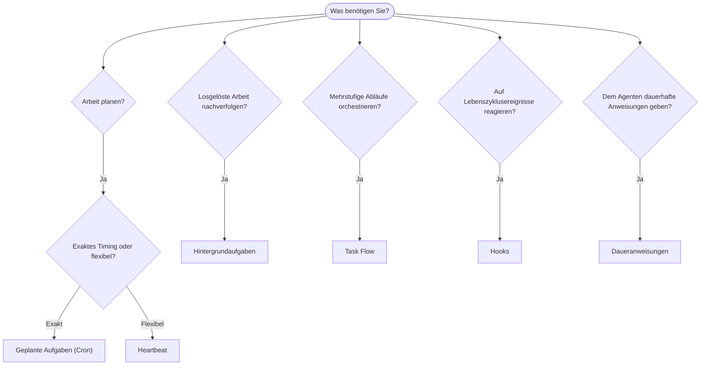

---
read_when:
    - Wenn Sie entscheiden, wie Sie Arbeit mit OpenClaw automatisieren
    - Wenn Sie zwischen Heartbeat, Cron, Hooks und Daueranweisungen wählen
    - Wenn Sie nach dem richtigen Einstiegspunkt für die Automatisierung suchen
summary: 'Überblick über Automatisierungsmechanismen: Aufgaben, Cron, Hooks, Daueranweisungen und Task Flow'
title: Automatisierung und Aufgaben
x-i18n:
    generated_at: "2026-04-05T12:34:28Z"
    model: gpt-5.4
    provider: openai
    source_hash: 13cd05dcd2f38737f7bb19243ad1136978bfd727006fd65226daa3590f823afe
    source_path: automation/index.md
    workflow: 15
---

# Automatisierung und Aufgaben

OpenClaw führt Arbeit im Hintergrund über Aufgaben, geplante Jobs, Ereignis-Hooks und dauerhafte Anweisungen aus. Diese Seite hilft Ihnen, den richtigen Mechanismus auszuwählen und zu verstehen, wie sie zusammenpassen.

## Kurze Entscheidungshilfe

| Anwendungsfall                          | Empfohlen             | Warum                                            |
| --------------------------------------- | --------------------- | ------------------------------------------------ |
| Täglichen Bericht pünktlich um 9 Uhr senden | Geplante Aufgaben (Cron) | Exaktes Timing, isolierte Ausführung             |
| Mich in 20 Minuten erinnern             | Geplante Aufgaben (Cron) | Einmalig mit präzisem Timing (`--at`)            |
| Wöchentliche tiefgehende Analyse ausführen | Geplante Aufgaben (Cron) | Eigenständige Aufgabe, kann ein anderes Modell verwenden |
| Posteingang alle 30 Min. prüfen         | Heartbeat             | Bündelt sich mit anderen Prüfungen, kontextbewusst |
| Kalender auf bevorstehende Ereignisse überwachen | Heartbeat             | Natürliche Wahl für regelmäßige Aufmerksamkeit   |
| Status eines Subagenten- oder ACP-Laufs prüfen | Hintergrundaufgaben   | Das Aufgabenprotokoll verfolgt alle losgelösten Arbeiten |
| Prüfen, was wann gelaufen ist           | Hintergrundaufgaben   | `openclaw tasks list` und `openclaw tasks audit` |
| Mehrstufig recherchieren und dann zusammenfassen | Task Flow             | Dauerhafte Orchestrierung mit Revisionsverfolgung |
| Ein Skript beim Zurücksetzen der Sitzung ausführen | Hooks                 | Ereignisgesteuert, wird bei Lebenszyklusereignissen ausgelöst |
| Bei jedem Tool-Aufruf Code ausführen    | Hooks                 | Hooks können nach Ereignistyp filtern            |
| Vor jeder Antwort immer die Compliance prüfen | Daueranweisungen      | Werden automatisch in jede Sitzung eingefügt     |

### Geplante Aufgaben (Cron) vs. Heartbeat

| Dimension       | Geplante Aufgaben (Cron)           | Heartbeat                            |
| --------------- | ---------------------------------- | ------------------------------------ |
| Timing          | Exakt (Cron-Ausdrücke, einmalig)   | Ungefähr (standardmäßig alle 30 Min.) |
| Sitzungskontext | Frisch (isoliert) oder geteilt     | Vollständiger Hauptsitzungskontext   |
| Aufgabenprotokolle | Immer erstellt                   | Nie erstellt                         |
| Zustellung      | Kanal, Webhook oder still          | Inline in der Hauptsitzung           |
| Am besten geeignet für | Berichte, Erinnerungen, Hintergrundjobs | Posteingangsprüfungen, Kalender, Benachrichtigungen |

Verwenden Sie Geplante Aufgaben (Cron), wenn Sie präzises Timing oder isolierte Ausführung benötigen. Verwenden Sie Heartbeat, wenn die Arbeit vom vollständigen Sitzungskontext profitiert und ungefähres Timing ausreicht.

## Kernkonzepte

### Geplante Aufgaben (Cron)

Cron ist der integrierte Scheduler des Gateway für präzises Timing. Er speichert Jobs, weckt den Agenten zur richtigen Zeit auf und kann Ausgaben an einen Chat-Kanal oder einen Webhook-Endpunkt zustellen. Unterstützt einmalige Erinnerungen, wiederkehrende Ausdrücke und eingehende Webhook-Trigger.

Siehe [Geplante Aufgaben](/automation/cron-jobs).

### Aufgaben

Das Protokoll für Hintergrundaufgaben verfolgt alle losgelösten Arbeiten: ACP-Läufe, Subagent-Starts, isolierte Cron-Ausführungen und CLI-Vorgänge. Aufgaben sind Datensätze, keine Scheduler. Verwenden Sie `openclaw tasks list` und `openclaw tasks audit`, um sie zu untersuchen.

Siehe [Hintergrundaufgaben](/automation/tasks).

### Task Flow

Task Flow ist das Orchestrierungssubstrat für Abläufe oberhalb von Hintergrundaufgaben. Es verwaltet dauerhafte mehrstufige Abläufe mit verwalteten und gespiegelten Synchronisierungsmodi, Revisionsverfolgung und `openclaw tasks flow list|show|cancel` zur Einsicht.

Siehe [Task Flow](/automation/taskflow).

### Daueranweisungen

Daueranweisungen geben dem Agenten dauerhafte Betriebsbefugnisse für definierte Programme. Sie befinden sich in Workspace-Dateien (typischerweise `AGENTS.md`) und werden in jede Sitzung eingefügt. Kombinieren Sie sie mit Cron für zeitbasierte Durchsetzung.

Siehe [Daueranweisungen](/automation/standing-orders).

### Hooks

Hooks sind ereignisgesteuerte Skripte, die durch Lebenszyklusereignisse des Agenten (`/new`, `/reset`, `/stop`), Sitzungskompaktierung, Gateway-Start, Nachrichtenfluss und Tool-Aufrufe ausgelöst werden. Hooks werden automatisch aus Verzeichnissen erkannt und können mit `openclaw hooks` verwaltet werden.

Siehe [Hooks](/automation/hooks).

### Heartbeat

Heartbeat ist ein periodischer Hauptsitzungs-Turn (standardmäßig alle 30 Minuten). Er bündelt mehrere Prüfungen (Posteingang, Kalender, Benachrichtigungen) in einem Agenten-Turn mit vollständigem Sitzungskontext. Heartbeat-Turns erstellen keine Aufgabenprotokolle. Verwenden Sie `HEARTBEAT.md` für eine kleine Checkliste oder einen `tasks:`-Block, wenn Sie nur fällige periodische Prüfungen innerhalb von Heartbeat selbst möchten. Leere Heartbeat-Dateien werden als `empty-heartbeat-file` übersprungen; der Nur-fällige-Aufgaben-Modus wird als `no-tasks-due` übersprungen.

Siehe [Heartbeat](/gateway/heartbeat).

## Wie sie zusammenarbeiten

- **Cron** übernimmt präzise Zeitpläne (tägliche Berichte, wöchentliche Überprüfungen) und einmalige Erinnerungen. Alle Cron-Ausführungen erstellen Aufgabenprotokolle.
- **Heartbeat** übernimmt die routinemäßige Überwachung (Posteingang, Kalender, Benachrichtigungen) in einem gebündelten Turn alle 30 Minuten.
- **Hooks** reagieren mit benutzerdefinierten Skripten auf bestimmte Ereignisse (Tool-Aufrufe, Sitzungszurücksetzungen, Kompaktierung).
- **Daueranweisungen** geben dem Agenten dauerhaften Kontext und Autoritätsgrenzen.
- **Task Flow** koordiniert mehrstufige Abläufe oberhalb einzelner Aufgaben.
- **Aufgaben** verfolgen automatisch alle losgelösten Arbeiten, damit Sie sie untersuchen und prüfen können.

## Verwandt

- [Geplante Aufgaben](/automation/cron-jobs) — präzise Planung und einmalige Erinnerungen
- [Hintergrundaufgaben](/automation/tasks) — Aufgabenprotokoll für alle losgelösten Arbeiten
- [Task Flow](/automation/taskflow) — dauerhafte Orchestrierung mehrstufiger Abläufe
- [Hooks](/automation/hooks) — ereignisgesteuerte Lebenszyklus-Skripte
- [Daueranweisungen](/automation/standing-orders) — dauerhafte Agentenanweisungen
- [Heartbeat](/gateway/heartbeat) — periodische Hauptsitzungs-Turns
- [Konfigurationsreferenz](/gateway/configuration-reference) — alle Konfigurationsschlüssel
