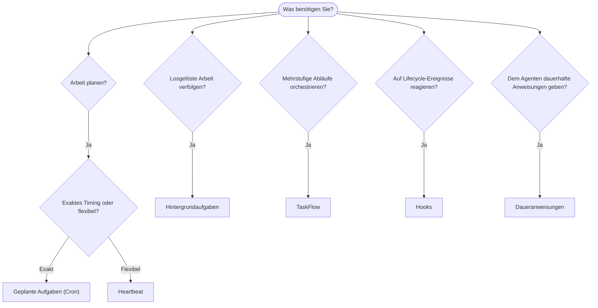

---
read_when:
    - Entscheiden, wie Arbeit mit OpenClaw automatisiert werden kann
    - Zwischen Heartbeat, Cron, Hooks und Daueranweisungen wählen
    - Suche nach dem richtigen Einstiegspunkt für die Automatisierung
summary: 'Überblick über Automatisierungsmechanismen: Aufgaben, Cron, Hooks, Daueranweisungen und TaskFlow'
title: Automatisierung und Aufgaben
x-i18n:
    generated_at: "2026-04-24T06:26:26Z"
    model: gpt-5.4
    provider: openai
    source_hash: 1b4615cc05a6d0ef7c92f44072d11a2541bc5e17b7acb88dc27ddf0c36b2dcab
    source_path: automation/index.md
    workflow: 15
---

OpenClaw führt Arbeit im Hintergrund über Aufgaben, geplante Jobs, Event-Hooks und dauerhafte Anweisungen aus. Diese Seite hilft Ihnen dabei, den richtigen Mechanismus auszuwählen und zu verstehen, wie sie zusammenpassen.

## Kurze Entscheidungshilfe

| Anwendungsfall                          | Empfohlen             | Warum                                            |
| --------------------------------------- | --------------------- | ------------------------------------------------ |
| Täglichen Bericht punktgenau um 9 Uhr senden | Geplante Aufgaben (Cron) | Exaktes Timing, isolierte Ausführung             |
| Mich in 20 Minuten erinnern             | Geplante Aufgaben (Cron) | Einmalig mit präzisem Timing (`--at`)            |
| Wöchentliche Tiefenanalyse ausführen    | Geplante Aufgaben (Cron) | Eigenständige Aufgabe, kann ein anderes Modell verwenden |
| Posteingang alle 30 Minuten prüfen      | Heartbeat             | Wird mit anderen Prüfungen gebündelt, kontextbewusst |
| Kalender auf bevorstehende Ereignisse überwachen | Heartbeat             | Natürliche Eignung für periodische Aufmerksamkeit |
| Status eines Subagenten- oder ACP-Laufs prüfen | Hintergrundaufgaben   | Das Aufgabenprotokoll verfolgt alle losgelösten Arbeiten |
| Prüfen, was wann ausgeführt wurde       | Hintergrundaufgaben   | `openclaw tasks list` und `openclaw tasks audit` |
| Mehrstufig recherchieren und dann zusammenfassen | TaskFlow              | Dauerhafte Orchestrierung mit Revisionsverfolgung |
| Ein Skript bei Sitzungs-Reset ausführen | Hooks                 | Ereignisgesteuert, wird bei Lifecycle-Ereignissen ausgelöst |
| Bei jedem Tool-Aufruf Code ausführen    | Hooks                 | Hooks können nach Ereignistyp filtern            |
| Vor jeder Antwort immer die Compliance prüfen | Daueranweisungen      | Werden automatisch in jede Sitzung eingebunden   |

### Geplante Aufgaben (Cron) vs. Heartbeat

| Dimension       | Geplante Aufgaben (Cron)           | Heartbeat                            |
| --------------- | ---------------------------------- | ------------------------------------ |
| Timing          | Exakt (Cron-Ausdrücke, einmalig)   | Ungefähr (standardmäßig alle 30 Minuten) |
| Sitzungskontext | Frisch (isoliert) oder geteilt     | Vollständiger Hauptsitzungs-Kontext  |
| Aufgabenprotokolle | Werden immer erstellt            | Werden nie erstellt                  |
| Zustellung      | Kanal, Webhook oder still          | Inline in der Hauptsitzung           |
| Am besten für   | Berichte, Erinnerungen, Hintergrundjobs | Posteingangsprüfungen, Kalender, Benachrichtigungen |

Verwenden Sie geplante Aufgaben (Cron), wenn Sie präzises Timing oder isolierte Ausführung benötigen. Verwenden Sie Heartbeat, wenn die Arbeit vom vollständigen Sitzungskontext profitiert und ungefähres Timing ausreicht.

## Grundkonzepte

### Geplante Aufgaben (Cron)

Cron ist der integrierte Scheduler des Gateway für präzises Timing. Er speichert Jobs dauerhaft, weckt den Agenten zum richtigen Zeitpunkt auf und kann Ausgaben an einen Chat-Kanal oder einen Webhook-Endpunkt zustellen. Unterstützt einmalige Erinnerungen, wiederkehrende Ausdrücke und eingehende Webhook-Trigger.

Siehe [Geplante Aufgaben](/de/automation/cron-jobs).

### Aufgaben

Das Protokoll für Hintergrundaufgaben verfolgt alle losgelösten Arbeiten: ACP-Läufe, Subagent-Starts, isolierte Cron-Ausführungen und CLI-Vorgänge. Aufgaben sind Einträge, keine Scheduler. Verwenden Sie `openclaw tasks list` und `openclaw tasks audit`, um sie zu prüfen.

Siehe [Hintergrundaufgaben](/de/automation/tasks).

### TaskFlow

TaskFlow ist das Orchestrierungs-Substrat für Abläufe oberhalb von Hintergrundaufgaben. Es verwaltet dauerhafte mehrstufige Abläufe mit verwalteten und gespiegelten Synchronisierungsmodi, Revisionsverfolgung und `openclaw tasks flow list|show|cancel` zur Prüfung.

Siehe [TaskFlow](/de/automation/taskflow).

### Daueranweisungen

Daueranweisungen geben dem Agenten dauerhafte Handlungsbefugnis für definierte Programme. Sie befinden sich in Workspace-Dateien (typischerweise `AGENTS.md`) und werden in jede Sitzung eingebunden. In Kombination mit Cron eignen sie sich für zeitbasierte Durchsetzung.

Siehe [Daueranweisungen](/de/automation/standing-orders).

### Hooks

Hooks sind ereignisgesteuerte Skripte, die durch Lifecycle-Ereignisse des Agenten (`/new`, `/reset`, `/stop`), Session-Compaction, Gateway-Start, Nachrichtenfluss und Tool-Aufrufe ausgelöst werden. Hooks werden automatisch aus Verzeichnissen erkannt und können mit `openclaw hooks` verwaltet werden.

Siehe [Hooks](/de/automation/hooks).

### Heartbeat

Heartbeat ist ein periodischer Hauptsitzungs-Turnus (standardmäßig alle 30 Minuten). Er bündelt mehrere Prüfungen (Posteingang, Kalender, Benachrichtigungen) in einem Agenten-Turnus mit vollständigem Sitzungskontext. Heartbeat-Turns erstellen keine Aufgabeneinträge. Verwenden Sie `HEARTBEAT.md` für eine kleine Checkliste oder einen `tasks:`-Block, wenn Sie fälligkeitsbasierte periodische Prüfungen innerhalb von Heartbeat selbst möchten. Leere Heartbeat-Dateien werden als `empty-heartbeat-file` übersprungen; der fälligkeitsbasierte Aufgabenmodus wird als `no-tasks-due` übersprungen.

Siehe [Heartbeat](/de/gateway/heartbeat).

## Wie sie zusammenarbeiten

- **Cron** übernimmt präzise Zeitpläne (tägliche Berichte, wöchentliche Reviews) und einmalige Erinnerungen. Alle Cron-Ausführungen erstellen Aufgabeneinträge.
- **Heartbeat** übernimmt routinemäßige Überwachung (Posteingang, Kalender, Benachrichtigungen) in einem gebündelten Turnus alle 30 Minuten.
- **Hooks** reagieren mit benutzerdefinierten Skripten auf bestimmte Ereignisse (Tool-Aufrufe, Sitzungs-Resets, Compaction).
- **Daueranweisungen** geben dem Agenten dauerhaften Kontext und Grenzen seiner Befugnisse.
- **TaskFlow** koordiniert mehrstufige Abläufe oberhalb einzelner Aufgaben.
- **Aufgaben** verfolgen automatisch alle losgelösten Arbeiten, sodass Sie sie prüfen und auditieren können.

## Verwandt

- [Geplante Aufgaben](/de/automation/cron-jobs) — präzise Planung und einmalige Erinnerungen
- [Hintergrundaufgaben](/de/automation/tasks) — Aufgabenprotokoll für alle losgelösten Arbeiten
- [TaskFlow](/de/automation/taskflow) — dauerhafte Orchestrierung mehrstufiger Abläufe
- [Hooks](/de/automation/hooks) — ereignisgesteuerte Lifecycle-Skripte
- [Daueranweisungen](/de/automation/standing-orders) — dauerhafte Anweisungen für Agenten
- [Heartbeat](/de/gateway/heartbeat) — periodische Hauptsitzungs-Turns
- [Konfigurationsreferenz](/de/gateway/configuration-reference) — alle Konfigurationsschlüssel
