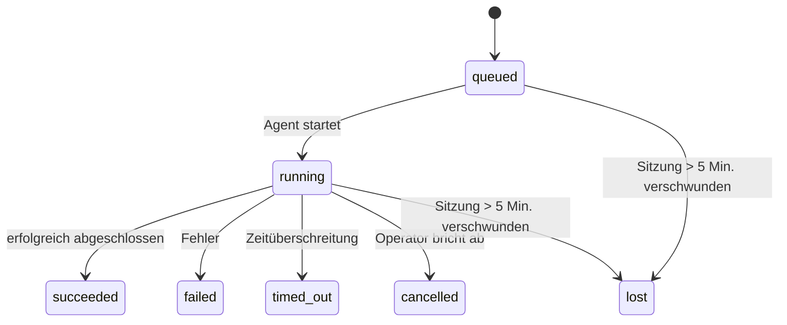

---
read_when:
    - Untersuchen von laufenden oder kürzlich abgeschlossenen Hintergrundarbeiten
    - Debuggen von Zustellungsfehlern bei losgelösten Agent-Ausführungen
    - Verstehen, wie Hintergrundausführungen mit Sitzungen, Cron und Heartbeat zusammenhängen
summary: Hintergrund-Aufgabenverfolgung für ACP-Ausführungen, Subagents, isolierte Cron-Jobs und CLI-Operationen
title: Hintergrundaufgaben
x-i18n:
    generated_at: "2026-04-24T06:26:35Z"
    model: gpt-5.4
    provider: openai
    source_hash: 10f16268ab5cce8c3dfd26c54d8d913c0ac0f9bfb4856ed1bb28b085ddb78528
    source_path: automation/tasks.md
    workflow: 15
---

> **Suchen Sie nach Terminplanung?** Unter [Automation & Tasks](/de/automation) finden Sie Informationen dazu, wie Sie den richtigen Mechanismus auswählen. Diese Seite behandelt das **Nachverfolgen** von Hintergrundarbeit, nicht deren Planung.

Hintergrundaufgaben verfolgen Arbeit, die **außerhalb Ihrer Haupt-Konversationssitzung** ausgeführt wird:
ACP-Ausführungen, Subagent-Starts, isolierte Cron-Job-Ausführungen und über die CLI ausgelöste Operationen.

Aufgaben ersetzen **nicht** Sitzungen, Cron-Jobs oder Heartbeats — sie sind das **Aktivitätsprotokoll**, das festhält, welche losgelöste Arbeit stattgefunden hat, wann sie stattgefunden hat und ob sie erfolgreich war.

<Note>
Nicht jede Agent-Ausführung erzeugt eine Aufgabe. Heartbeat-Durchläufe und normale interaktive Chats tun das nicht. Alle Cron-Ausführungen, ACP-Starts, Subagent-Starts und CLI-Agent-Befehle tun das.
</Note>

## Kurzfassung

- Aufgaben sind **Einträge**, keine Planer — Cron und Heartbeat entscheiden, _wann_ Arbeit ausgeführt wird, Aufgaben verfolgen, _was passiert ist_.
- ACP, Subagents, alle Cron-Jobs und CLI-Operationen erzeugen Aufgaben. Heartbeat-Durchläufe tun das nicht.
- Jede Aufgabe durchläuft `queued → running → terminal` (succeeded, failed, timed_out, cancelled oder lost).
- Cron-Aufgaben bleiben aktiv, solange die Cron-Laufzeitumgebung den Job noch besitzt; chatgestützte CLI-Aufgaben bleiben nur aktiv, solange ihr besitzender Ausführungskontext noch aktiv ist.
- Der Abschluss ist push-gesteuert: Losgelöste Arbeit kann direkt benachrichtigen oder die anfragende Sitzung bzw. den Heartbeat wecken, wenn sie abgeschlossen ist, daher haben Status-Polling-Schleifen meist die falsche Form.
- Isolierte Cron-Ausführungen und Subagent-Abschlüsse bereinigen nach bestem Bemühen verfolgte Browser-Tabs/Prozesse für ihre untergeordnete Sitzung vor der abschließenden Bereinigungsbuchhaltung.
- Die Zustellung isolierter Cron-Ausführungen unterdrückt veraltete vorläufige Antworten der übergeordneten Instanz, während untergeordnete Subagent-Arbeit noch ausläuft, und bevorzugt die endgültige untergeordnete Ausgabe, wenn diese vor der Zustellung eintrifft.
- Abschlussbenachrichtigungen werden direkt an einen Kanal zugestellt oder für den nächsten Heartbeat in die Warteschlange gestellt.
- `openclaw tasks list` zeigt alle Aufgaben; `openclaw tasks audit` macht auf Probleme aufmerksam.
- Terminal-Einträge werden 7 Tage aufbewahrt und dann automatisch entfernt.

## Schnellstart

```bash
# Alle Aufgaben auflisten (neueste zuerst)
openclaw tasks list

# Nach Laufzeitumgebung oder Status filtern
openclaw tasks list --runtime acp
openclaw tasks list --status running

# Details für eine bestimmte Aufgabe anzeigen (nach ID, Ausführungs-ID oder Sitzungsschlüssel)
openclaw tasks show <lookup>

# Eine laufende Aufgabe abbrechen (beendet die untergeordnete Sitzung)
openclaw tasks cancel <lookup>

# Benachrichtigungsrichtlinie für eine Aufgabe ändern
openclaw tasks notify <lookup> state_changes

# Integritätsprüfung ausführen
openclaw tasks audit

# Wartungsvorschau anzeigen oder anwenden
openclaw tasks maintenance
openclaw tasks maintenance --apply

# TaskFlow-Status prüfen
openclaw tasks flow list
openclaw tasks flow show <lookup>
openclaw tasks flow cancel <lookup>
```

## Was eine Aufgabe erzeugt

| Quelle                  | Laufzeittyp | Wann ein Aufgabeneintrag erzeugt wird                 | Standard-Benachrichtigungsrichtlinie |
| ----------------------- | ----------- | ----------------------------------------------------- | ------------------------------------ |
| ACP-Hintergrundläufe    | `acp`       | Beim Starten einer untergeordneten ACP-Sitzung        | `done_only`                          |
| Subagent-Orchestrierung | `subagent`  | Beim Starten eines Subagents über `sessions_spawn`    | `done_only`                          |
| Cron-Jobs (alle Typen)  | `cron`      | Bei jeder Cron-Ausführung (Hauptsitzung und isoliert) | `silent`                             |
| CLI-Operationen         | `cli`       | `openclaw agent`-Befehle, die über das Gateway laufen | `silent`                             |
| Agent-Medienjobs        | `cli`       | Sitzungsgebundene `video_generate`-Ausführungen       | `silent`                             |

Cron-Aufgaben der Hauptsitzung verwenden standardmäßig die Benachrichtigungsrichtlinie `silent` — sie erzeugen Einträge zur Nachverfolgung, generieren aber keine Benachrichtigungen. Isolierte Cron-Aufgaben verwenden ebenfalls standardmäßig `silent`, sind aber sichtbarer, weil sie in ihrer eigenen Sitzung laufen.

Sitzungsgebundene `video_generate`-Ausführungen verwenden ebenfalls die Benachrichtigungsrichtlinie `silent`. Sie erzeugen weiterhin Aufgabeneinträge, aber der Abschluss wird als internes Wecksignal an die ursprüngliche Agent-Sitzung zurückgegeben, damit der Agent die Folgemitteilung schreiben und das fertige Video selbst anhängen kann. Wenn Sie sich für `tools.media.asyncCompletion.directSend` entscheiden, versuchen asynchrone `music_generate`- und `video_generate`-Abschlüsse zuerst die direkte Kanalzustellung, bevor sie auf den Weckpfad der anfragenden Sitzung zurückfallen.

Solange eine sitzungsgebundene `video_generate`-Aufgabe noch aktiv ist, fungiert das Tool außerdem als Schutzmechanismus: Wiederholte `video_generate`-Aufrufe in derselben Sitzung geben den Status der aktiven Aufgabe zurück, anstatt eine zweite gleichzeitige Generierung zu starten. Verwenden Sie `action: "status"`, wenn Sie auf Agent-Seite eine explizite Fortschritts-/Statusabfrage wünschen.

**Was keine Aufgaben erzeugt:**

- Heartbeat-Durchläufe — Hauptsitzung; siehe [Heartbeat](/de/gateway/heartbeat)
- Normale interaktive Chat-Durchläufe
- Direkte `/command`-Antworten

## Aufgabenlebenszyklus



| Status      | Bedeutung                                                                 |
| ----------- | ------------------------------------------------------------------------- |
| `queued`    | Erstellt, wartet darauf, dass der Agent startet                           |
| `running`   | Der Agent-Durchlauf wird aktiv ausgeführt                                 |
| `succeeded` | Erfolgreich abgeschlossen                                                 |
| `failed`    | Mit einem Fehler abgeschlossen                                            |
| `timed_out` | Die konfigurierte Zeitüberschreitung wurde überschritten                  |
| `cancelled` | Vom Operator über `openclaw tasks cancel` gestoppt                        |
| `lost`      | Die Laufzeitumgebung hat nach einer Schonfrist von 5 Minuten den maßgeblichen Trägerstatus verloren |

Übergänge erfolgen automatisch — wenn die zugehörige Agent-Ausführung endet, wird der Aufgabenstatus entsprechend aktualisiert.

`lost` ist laufzeitbewusst:

- ACP-Aufgaben: Metadaten der zugrunde liegenden ACP-Untergeordnetensitzung sind verschwunden.
- Subagent-Aufgaben: Die zugrunde liegende untergeordnete Sitzung ist aus dem Ziel-Agent-Store verschwunden.
- Cron-Aufgaben: Die Cron-Laufzeitumgebung verfolgt den Job nicht mehr als aktiv.
- CLI-Aufgaben: Isolierte untergeordnete Sitzungsaufgaben verwenden die untergeordnete Sitzung; chatgestützte CLI-Aufgaben verwenden stattdessen den aktiven Ausführungskontext, sodass verbleibende Sitzungszeilen für Kanal/Gruppe/Direktnachricht sie nicht aktiv halten.

## Zustellung und Benachrichtigungen

Wenn eine Aufgabe einen Terminal-Status erreicht, benachrichtigt OpenClaw Sie. Es gibt zwei Zustellungspfade:

**Direkte Zustellung** — wenn die Aufgabe ein Kanalziel hat (das `requesterOrigin`), geht die Abschlussnachricht direkt an diesen Kanal (Telegram, Discord, Slack usw.). Bei Subagent-Abschlüssen bewahrt OpenClaw außerdem, wenn verfügbar, die gebundene Thread-/Topic-Weiterleitung und kann ein fehlendes `to` / Konto aus der gespeicherten Route der anfragenden Sitzung (`lastChannel` / `lastTo` / `lastAccountId`) ergänzen, bevor die direkte Zustellung aufgegeben wird.

**Sitzungswarteschlangen-Zustellung** — wenn die direkte Zustellung fehlschlägt oder kein Ursprung gesetzt ist, wird das Update als Systemereignis in die Warteschlange der anfragenden Sitzung gestellt und beim nächsten Heartbeat angezeigt.

<Tip>
Der Aufgabenabschluss löst sofort ein Heartbeat-Wecksignal aus, damit Sie das Ergebnis schnell sehen — Sie müssen nicht bis zum nächsten geplanten Heartbeat-Tick warten.
</Tip>

Das bedeutet, dass der übliche Arbeitsablauf push-basiert ist: Starten Sie losgelöste Arbeit einmal und lassen Sie dann die Laufzeitumgebung Sie bei Abschluss wecken oder benachrichtigen. Fragen Sie den Aufgabenstatus nur dann per Polling ab, wenn Sie Debugging, Eingriffe oder eine explizite Prüfung benötigen.

### Benachrichtigungsrichtlinien

Steuern Sie, wie viel Sie über jede Aufgabe erfahren:

| Richtlinie            | Was zugestellt wird                                                      |
| --------------------- | ------------------------------------------------------------------------ |
| `done_only` (Standard) | Nur der Terminal-Status (succeeded, failed usw.) — **das ist die Standardeinstellung** |
| `state_changes`       | Jeder Statusübergang und jedes Fortschritts-Update                       |
| `silent`              | Gar nichts                                                               |

Ändern Sie die Richtlinie, während eine Aufgabe läuft:

```bash
openclaw tasks notify <lookup> state_changes
```

## CLI-Referenz

### `tasks list`

```bash
openclaw tasks list [--runtime <acp|subagent|cron|cli>] [--status <status>] [--json]
```

Ausgabespalten: Aufgaben-ID, Typ, Status, Zustellung, Ausführungs-ID, untergeordnete Sitzung, Zusammenfassung.

### `tasks show`

```bash
openclaw tasks show <lookup>
```

Das Lookup-Token akzeptiert eine Aufgaben-ID, eine Ausführungs-ID oder einen Sitzungsschlüssel. Zeigt den vollständigen Eintrag einschließlich Zeitangaben, Zustellungsstatus, Fehler und Terminal-Zusammenfassung.

### `tasks cancel`

```bash
openclaw tasks cancel <lookup>
```

Bei ACP- und Subagent-Aufgaben beendet dies die untergeordnete Sitzung. Bei CLI-verfolgten Aufgaben wird die Abbruchaktion im Aufgabenregister vermerkt (es gibt keinen separaten Handle der untergeordneten Laufzeitumgebung). Der Status wechselt zu `cancelled`, und sofern zutreffend wird eine Zustellungsbenachrichtigung gesendet.

### `tasks notify`

```bash
openclaw tasks notify <lookup> <done_only|state_changes|silent>
```

### `tasks audit`

```bash
openclaw tasks audit [--json]
```

Macht auf betriebliche Probleme aufmerksam. Erkenntnisse erscheinen auch in `openclaw status`, wenn Probleme erkannt werden.

| Fund                      | Schweregrad | Auslöser                                              |
| ------------------------- | ----------- | ----------------------------------------------------- |
| `stale_queued`            | warn        | Mehr als 10 Minuten in der Warteschlange              |
| `stale_running`           | error       | Mehr als 30 Minuten laufend                           |
| `lost`                    | error       | Laufzeitgestützte Aufgabenbesitzerschaft verschwunden |
| `delivery_failed`         | warn        | Zustellung fehlgeschlagen und Benachrichtigungsrichtlinie ist nicht `silent` |
| `missing_cleanup`         | warn        | Terminal-Aufgabe ohne Bereinigungszeitstempel         |
| `inconsistent_timestamps` | warn        | Verletzung der Zeitlinie (zum Beispiel Ende vor Start) |

### `tasks maintenance`

```bash
openclaw tasks maintenance [--json]
openclaw tasks maintenance --apply [--json]
```

Verwenden Sie dies, um Abgleich, Bereinigungsmarkierung und Entfernung für Aufgaben und den Task Flow-Status in der Vorschau anzuzeigen oder anzuwenden.

Der Abgleich ist laufzeitbewusst:

- ACP-/Subagent-Aufgaben prüfen ihre zugrunde liegende untergeordnete Sitzung.
- Cron-Aufgaben prüfen, ob die Cron-Laufzeitumgebung den Job noch besitzt.
- Chatgestützte CLI-Aufgaben prüfen den besitzenden aktiven Ausführungskontext, nicht nur die Sitzungseinträge des Chats.

Die Abschlussbereinigung ist ebenfalls laufzeitbewusst:

- Der Abschluss von Subagents schließt nach bestem Bemühen verfolgte Browser-Tabs/Prozesse für die untergeordnete Sitzung, bevor die angekündigte Bereinigung fortgesetzt wird.
- Der Abschluss isolierter Cron-Ausführungen schließt nach bestem Bemühen verfolgte Browser-Tabs/Prozesse für die Cron-Sitzung, bevor der Lauf vollständig beendet wird.
- Die Zustellung isolierter Cron-Ausführungen wartet bei Bedarf das Nacharbeiten untergeordneter Subagents ab und unterdrückt veralteten Bestätigungstext der übergeordneten Instanz, anstatt ihn anzukündigen.
- Die Zustellung bei Subagent-Abschluss bevorzugt den neuesten sichtbaren Assistant-Text; ist dieser leer, wird auf bereinigten neuesten `tool`-/`toolResult`-Text zurückgegriffen, und reine Tool-Aufrufe mit Zeitüberschreitung können auf eine kurze Zusammenfassung des Teilfortschritts reduziert werden. Terminal fehlgeschlagene Ausführungen melden den Fehlerstatus, ohne erfassten Antworttext erneut wiederzugeben.
- Bereinigungsfehler verdecken nicht das tatsächliche Ergebnis der Aufgabe.

### `tasks flow list|show|cancel`

```bash
openclaw tasks flow list [--status <status>] [--json]
openclaw tasks flow show <lookup> [--json]
openclaw tasks flow cancel <lookup>
```

Verwenden Sie diese Befehle, wenn Sie sich für den orchestrierenden Task Flow interessieren und nicht für einen einzelnen Hintergrundaufgabeneintrag.

## Chat-Aufgabenboard (`/tasks`)

Verwenden Sie `/tasks` in einer beliebigen Chat-Sitzung, um mit dieser Sitzung verknüpfte Hintergrundaufgaben zu sehen. Das Board zeigt aktive und kürzlich abgeschlossene Aufgaben mit Laufzeitumgebung, Status, Zeitangaben sowie Fortschritts- oder Fehlerdetails.

Wenn die aktuelle Sitzung keine sichtbar verknüpften Aufgaben hat, greift `/tasks` auf agent-lokale Aufgabenzähler zurück,
sodass Sie weiterhin einen Überblick erhalten, ohne Details anderer Sitzungen offenzulegen.

Für das vollständige Operator-Protokoll verwenden Sie die CLI: `openclaw tasks list`.

## Statusintegration (Aufgabendruck)

`openclaw status` enthält eine Aufgabenübersicht auf einen Blick:

```
Tasks: 3 queued · 2 running · 1 issues
```

Die Übersicht meldet:

- **active** — Anzahl von `queued` + `running`
- **failures** — Anzahl von `failed` + `timed_out` + `lost`
- **byRuntime** — Aufschlüsselung nach `acp`, `subagent`, `cron`, `cli`

Sowohl `/status` als auch das Tool `session_status` verwenden einen bereinigungsbewussten Aufgaben-Snapshot: Aktive Aufgaben werden bevorzugt, veraltete abgeschlossene Zeilen werden ausgeblendet, und aktuelle Fehler werden nur angezeigt, wenn keine aktive Arbeit mehr verbleibt. So bleibt die Statuskarte auf das fokussiert, was jetzt wichtig ist.

## Speicherung und Wartung

### Wo Aufgaben gespeichert werden

Aufgabeneinträge werden in SQLite gespeichert unter:

```
$OPENCLAW_STATE_DIR/tasks/runs.sqlite
```

Das Register wird beim Start des Gateway in den Speicher geladen und synchronisiert Schreibvorgänge mit SQLite, um Dauerhaftigkeit über Neustarts hinweg sicherzustellen.

### Automatische Wartung

Ein Sweeper läuft alle **60 Sekunden** und übernimmt drei Aufgaben:

1. **Abgleich** — prüft, ob aktive Aufgaben noch eine maßgebliche laufzeitgestützte Grundlage haben. ACP-/Subagent-Aufgaben verwenden den Status der untergeordneten Sitzung, Cron-Aufgaben die Besitzerschaft aktiver Jobs und chatgestützte CLI-Aufgaben den besitzenden Ausführungskontext. Wenn dieser zugrunde liegende Status länger als 5 Minuten verschwunden ist, wird die Aufgabe als `lost` markiert.
2. **Bereinigungsmarkierung** — setzt bei Terminal-Aufgaben einen Zeitstempel `cleanupAfter` (endedAt + 7 Tage).
3. **Entfernung** — löscht Einträge nach Ablauf ihres `cleanupAfter`-Datums.

**Aufbewahrung**: Terminal-Aufgabeneinträge werden **7 Tage** lang aufbewahrt und dann automatisch entfernt. Keine Konfiguration erforderlich.

## Wie Aufgaben mit anderen Systemen zusammenhängen

### Aufgaben und Task Flow

[Task Flow](/de/automation/taskflow) ist die Flow-Orchestrierungsebene über Hintergrundaufgaben. Ein einzelner Flow kann über seine Laufzeit mehrere Aufgaben koordinieren, indem er verwaltete oder gespiegelte Synchronisierungsmodi verwendet. Verwenden Sie `openclaw tasks`, um einzelne Aufgabeneinträge zu prüfen, und `openclaw tasks flow`, um den orchestrierenden Flow zu prüfen.

Weitere Informationen finden Sie unter [Task Flow](/de/automation/taskflow).

### Aufgaben und Cron

Eine Cron-Job-**Definition** befindet sich in `~/.openclaw/cron/jobs.json`; der Laufzeit-Ausführungsstatus liegt daneben in `~/.openclaw/cron/jobs-state.json`. **Jede** Cron-Ausführung erzeugt einen Aufgabeneintrag — sowohl in der Hauptsitzung als auch isoliert. Cron-Aufgaben der Hauptsitzung verwenden standardmäßig die Benachrichtigungsrichtlinie `silent`, damit sie verfolgt werden, ohne Benachrichtigungen zu erzeugen.

Siehe [Geplante Aufgaben](/de/automation/cron-jobs).

### Aufgaben und Heartbeat

Heartbeat-Ausführungen sind Durchläufe der Hauptsitzung — sie erzeugen keine Aufgabeneinträge. Wenn eine Aufgabe abgeschlossen wird, kann sie ein Heartbeat-Wecksignal auslösen, damit Sie das Ergebnis zeitnah sehen.

Siehe [Heartbeat](/de/gateway/heartbeat).

### Aufgaben und Sitzungen

Eine Aufgabe kann auf einen `childSessionKey` (wo die Arbeit ausgeführt wird) und einen `requesterSessionKey` (wer sie gestartet hat) verweisen. Sitzungen sind der Konversationskontext; Aufgaben sind die darüberliegende Aktivitätsverfolgung.

### Aufgaben und Agent-Ausführungen

Die `runId` einer Aufgabe verweist auf die Agent-Ausführung, die die Arbeit erledigt. Ereignisse im Lebenszyklus des Agenten (Start, Ende, Fehler) aktualisieren den Aufgabenstatus automatisch — Sie müssen den Lebenszyklus nicht manuell verwalten.

## Verwandt

- [Automation & Tasks](/de/automation) — alle Automatisierungsmechanismen auf einen Blick
- [Task Flow](/de/automation/taskflow) — Flow-Orchestrierung über Aufgaben
- [Geplante Aufgaben](/de/automation/cron-jobs) — Planung von Hintergrundarbeit
- [Heartbeat](/de/gateway/heartbeat) — periodische Durchläufe der Hauptsitzung
- [CLI: Aufgaben](/de/cli/tasks) — CLI-Befehlsreferenz
