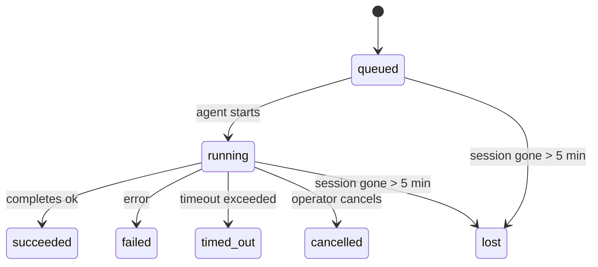

---
read_when:
    - Wenn laufende oder kürzlich abgeschlossene Hintergrundarbeit geprüft wird
    - Beim Debuggen von Zustellungsfehlern für getrennte Agent-Ausführungen
    - Zum Verständnis, wie Hintergrundausführungen mit Sitzungen, Cron und Heartbeat zusammenhängen
summary: Nachverfolgung von Hintergrundaufgaben für ACP-Ausführungen, Subagents, isolierte Cron-Jobs und CLI-Vorgänge
title: Hintergrundaufgaben
x-i18n:
    generated_at: "2026-04-05T12:34:56Z"
    model: gpt-5.4
    provider: openai
    source_hash: 6c95ccf4388d07e60a7bb68746b161793f4bb5ff2ba3d5ce9e51f2225dab2c4d
    source_path: automation/tasks.md
    workflow: 15
---

# Hintergrundaufgaben

> **Auf der Suche nach Planung?** Siehe [Automation & Tasks](/automation), um den richtigen Mechanismus auszuwählen. Diese Seite behandelt die **Nachverfolgung** von Hintergrundarbeit, nicht deren Planung.

Hintergrundaufgaben verfolgen Arbeit, die **außerhalb Ihrer Haupt-Konversationssitzung** ausgeführt wird:
ACP-Ausführungen, Subagent-Starts, Ausführungen isolierter Cron-Jobs und per CLI gestartete Vorgänge.

Aufgaben ersetzen **nicht** Sitzungen, Cron-Jobs oder Heartbeats — sie sind das **Aktivitätsprotokoll**, das aufzeichnet, welche getrennte Arbeit stattgefunden hat, wann sie stattfand und ob sie erfolgreich war.

<Note>
Nicht jede Agent-Ausführung erstellt eine Aufgabe. Heartbeat-Durchläufe und normaler interaktiver Chat tun das nicht. Alle Cron-Ausführungen, ACP-Starts, Subagent-Starts und CLI-Agent-Befehle tun es.
</Note>

## Kurzfassung

- Aufgaben sind **Einträge**, keine Planer — Cron und Heartbeat entscheiden, _wann_ Arbeit ausgeführt wird, Aufgaben erfassen, _was passiert ist_.
- ACP, Subagents, alle Cron-Jobs und CLI-Vorgänge erstellen Aufgaben. Heartbeat-Durchläufe nicht.
- Jede Aufgabe durchläuft `queued → running → terminal` (succeeded, failed, timed_out, cancelled oder lost).
- Cron-Aufgaben bleiben aktiv, solange die Cron-Laufzeit den Job noch besitzt; chatgestützte CLI-Aufgaben bleiben nur aktiv, solange ihr zugehöriger Ausführungskontext noch aktiv ist.
- Der Abschluss ist Push-gesteuert: Getrennte Arbeit kann direkt benachrichtigen oder die anfragende Sitzung bzw. den Heartbeat wecken, wenn sie beendet ist; Status-Polling-Schleifen sind daher meist der falsche Ansatz.
- Isolierte Cron-Ausführungen und Subagent-Abschlüsse bereinigen nach bestem Bemühen verfolgte Browser-Tabs/Prozesse für ihre untergeordnete Sitzung vor der abschließenden Bereinigungsbuchführung.
- Die Zustellung isolierter Cron-Ausführungen unterdrückt veraltete vorläufige Antworten des Elternteils, während untergeordnete Subagent-Arbeit noch ausläuft, und bevorzugt die endgültige Ausgabe des Nachfahren, wenn sie vor der Zustellung eintrifft.
- Abschlussbenachrichtigungen werden direkt an einen Kanal zugestellt oder für den nächsten Heartbeat in die Warteschlange gestellt.
- `openclaw tasks list` zeigt alle Aufgaben; `openclaw tasks audit` meldet Probleme.
- Terminal-Einträge werden 7 Tage lang aufbewahrt und dann automatisch bereinigt.

## Schnellstart

```bash
# Alle Aufgaben auflisten (neueste zuerst)
openclaw tasks list

# Nach Laufzeit oder Status filtern
openclaw tasks list --runtime acp
openclaw tasks list --status running

# Details zu einer bestimmten Aufgabe anzeigen (nach ID, Run-ID oder Sitzungsschlüssel)
openclaw tasks show <lookup>

# Eine laufende Aufgabe abbrechen (beendet die untergeordnete Sitzung)
openclaw tasks cancel <lookup>

# Benachrichtigungsrichtlinie für eine Aufgabe ändern
openclaw tasks notify <lookup> state_changes

# Einen Zustandsaudit ausführen
openclaw tasks audit

# Wartung anzeigen oder anwenden
openclaw tasks maintenance
openclaw tasks maintenance --apply

# TaskFlow-Zustand prüfen
openclaw tasks flow list
openclaw tasks flow show <lookup>
openclaw tasks flow cancel <lookup>
```

## Was eine Aufgabe erstellt

| Quelle                 | Laufzeittyp | Wann ein Aufgabeneintrag erstellt wird                | Standard-Benachrichtigungsrichtlinie |
| ---------------------- | ----------- | ----------------------------------------------------- | ------------------------------------ |
| ACP-Hintergrundläufe   | `acp`       | Starten einer untergeordneten ACP-Sitzung             | `done_only`                          |
| Subagent-Orchestrierung | `subagent`  | Starten eines Subagent über `sessions_spawn`          | `done_only`                          |
| Cron-Jobs (alle Typen) | `cron`      | Jede Cron-Ausführung (Hauptsitzung und isoliert)      | `silent`                             |
| CLI-Vorgänge           | `cli`       | `openclaw agent`-Befehle, die über das Gateway laufen | `silent`                             |

Cron-Aufgaben der Hauptsitzung verwenden standardmäßig die Benachrichtigungsrichtlinie `silent` — sie erstellen Einträge zur Nachverfolgung, erzeugen aber keine Benachrichtigungen. Isolierte Cron-Aufgaben verwenden ebenfalls standardmäßig `silent`, sind aber sichtbarer, weil sie in ihrer eigenen Sitzung laufen.

**Was keine Aufgaben erstellt:**

- Heartbeat-Durchläufe — Hauptsitzung; siehe [Heartbeat](/gateway/heartbeat)
- Normale interaktive Chat-Durchläufe
- Direkte `/command`-Antworten

## Aufgabenlebenszyklus



| Status      | Bedeutung                                                                 |
| ----------- | ------------------------------------------------------------------------- |
| `queued`    | Erstellt, wartet auf den Start des Agent                                  |
| `running`   | Der Agent-Durchlauf wird aktiv ausgeführt                                 |
| `succeeded` | Erfolgreich abgeschlossen                                                 |
| `failed`    | Mit einem Fehler abgeschlossen                                            |
| `timed_out` | Das konfigurierte Zeitlimit wurde überschritten                           |
| `cancelled` | Vom Operator über `openclaw tasks cancel` gestoppt                        |
| `lost`      | Die Laufzeit hat nach einer Schonfrist von 5 Minuten den autoritativen Basiszustand verloren |

Übergänge erfolgen automatisch — wenn die zugehörige Agent-Ausführung endet, wird der Aufgabenstatus entsprechend aktualisiert.

`lost` ist laufzeitbewusst:

- ACP-Aufgaben: Metadaten der zugrunde liegenden ACP-Untergeordnetensitzung sind verschwunden.
- Subagent-Aufgaben: Die zugrunde liegende untergeordnete Sitzung ist aus dem Speicher des Ziel-Agent verschwunden.
- Cron-Aufgaben: Die Cron-Laufzeit verfolgt den Job nicht mehr als aktiv.
- CLI-Aufgaben: Isolierte Aufgaben mit untergeordneter Sitzung verwenden die untergeordnete Sitzung; chatgestützte CLI-Aufgaben verwenden stattdessen den aktiven Ausführungskontext, sodass verbleibende Kanal-/Gruppen-/Direktsitzungszeilen sie nicht aktiv halten.

## Zustellung und Benachrichtigungen

Wenn eine Aufgabe einen Terminal-Zustand erreicht, benachrichtigt OpenClaw Sie. Es gibt zwei Zustellpfade:

**Direkte Zustellung** — wenn die Aufgabe ein Kanalziel hat (den `requesterOrigin`), wird die Abschlussnachricht direkt an diesen Kanal gesendet (Telegram, Discord, Slack usw.). Bei Subagent-Abschlüssen bewahrt OpenClaw außerdem gebundenes Thread-/Topic-Routing, wenn verfügbar, und kann ein fehlendes `to` / Konto aus der gespeicherten Route der anfragenden Sitzung (`lastChannel` / `lastTo` / `lastAccountId`) ergänzen, bevor die direkte Zustellung aufgegeben wird.

**Sitzungswarteschlangen-Zustellung** — wenn die direkte Zustellung fehlschlägt oder kein Ursprung gesetzt ist, wird das Update als Systemereignis in die Warteschlange der anfragenden Sitzung gestellt und beim nächsten Heartbeat angezeigt.

<Tip>
Der Aufgabenabschluss löst ein sofortiges Heartbeat-Wecken aus, damit Sie das Ergebnis schnell sehen — Sie müssen nicht auf den nächsten geplanten Heartbeat-Takt warten.
</Tip>

Das bedeutet, dass der übliche Arbeitsablauf Push-basiert ist: Starten Sie getrennte Arbeit einmal, und lassen Sie dann die Laufzeit Sie beim Abschluss wecken oder benachrichtigen. Fragen Sie den Aufgabenstatus nur ab, wenn Sie Debugging, Eingriffe oder einen ausdrücklichen Audit benötigen.

### Benachrichtigungsrichtlinien

Steuert, wie viel Sie über jede Aufgabe erfahren:

| Richtlinie            | Was zugestellt wird                                                      |
| --------------------- | ------------------------------------------------------------------------ |
| `done_only` (Standard) | Nur der Terminal-Zustand (succeeded, failed usw.) — **dies ist der Standard** |
| `state_changes`       | Jeder Zustandsübergang und jede Fortschrittsaktualisierung               |
| `silent`              | Gar nichts                                                               |

Ändern Sie die Richtlinie, während eine Aufgabe läuft:

```bash
openclaw tasks notify <lookup> state_changes
```

## CLI-Referenz

### `tasks list`

```bash
openclaw tasks list [--runtime <acp|subagent|cron|cli>] [--status <status>] [--json]
```

Ausgabespalten: Aufgaben-ID, Art, Status, Zustellung, Run-ID, untergeordnete Sitzung, Zusammenfassung.

### `tasks show`

```bash
openclaw tasks show <lookup>
```

Das Such-Token akzeptiert eine Aufgaben-ID, Run-ID oder einen Sitzungsschlüssel. Zeigt den vollständigen Eintrag einschließlich Zeitdaten, Zustellstatus, Fehler und Terminal-Zusammenfassung.

### `tasks cancel`

```bash
openclaw tasks cancel <lookup>
```

Bei ACP- und Subagent-Aufgaben beendet dies die untergeordnete Sitzung. Der Status wechselt zu `cancelled` und eine Zustellungsbenachrichtigung wird gesendet.

### `tasks notify`

```bash
openclaw tasks notify <lookup> <done_only|state_changes|silent>
```

### `tasks audit`

```bash
openclaw tasks audit [--json]
```

Meldet betriebliche Probleme. Erkenntnisse erscheinen auch in `openclaw status`, wenn Probleme erkannt werden.

| Erkenntnis               | Schweregrad | Auslöser                                                    |
| ------------------------ | ----------- | ----------------------------------------------------------- |
| `stale_queued`           | warn        | Mehr als 10 Minuten in der Warteschlange                    |
| `stale_running`          | error       | Mehr als 30 Minuten laufend                                 |
| `lost`                   | error       | Laufzeitgestützte Aufgabenbesitzerschaft ist verschwunden   |
| `delivery_failed`        | warn        | Zustellung fehlgeschlagen und Benachrichtigungsrichtlinie ist nicht `silent` |
| `missing_cleanup`        | warn        | Terminal-Aufgabe ohne Bereinigungszeitstempel               |
| `inconsistent_timestamps` | warn       | Verstoß gegen die Zeitachse (zum Beispiel Ende vor Start)   |

### `tasks maintenance`

```bash
openclaw tasks maintenance [--json]
openclaw tasks maintenance --apply [--json]
```

Verwenden Sie dies, um Abgleich, Bereinigungsmarkierung und Bereinigung für Aufgaben und den Task-Flow-Zustand anzuzeigen oder anzuwenden.

Der Abgleich ist laufzeitbewusst:

- ACP-/Subagent-Aufgaben prüfen ihre zugrunde liegende untergeordnete Sitzung.
- Cron-Aufgaben prüfen, ob die Cron-Laufzeit den Job noch besitzt.
- Chatgestützte CLI-Aufgaben prüfen den zugehörigen aktiven Ausführungskontext, nicht nur die Chat-Sitzungszeile.

Die Abschlussbereinigung ist ebenfalls laufzeitbewusst:

- Der Subagent-Abschluss schließt nach bestem Bemühen verfolgte Browser-Tabs/Prozesse für die untergeordnete Sitzung, bevor die Bereinigungsankündigung fortgesetzt wird.
- Der Abschluss eines isolierten Cron-Laufs schließt nach bestem Bemühen verfolgte Browser-Tabs/Prozesse für die Cron-Sitzung, bevor der Lauf vollständig heruntergefahren wird.
- Die Zustellung isolierter Cron-Läufe wartet bei Bedarf auf nachfolgende untergeordnete Subagent-Arbeit und unterdrückt veralteten Bestätigungstext des Elternteils, anstatt ihn anzukündigen.
- Die Zustellung beim Subagent-Abschluss bevorzugt den neuesten sichtbaren Assistant-Text; wenn dieser leer ist, wird auf bereinigten neuesten `tool`-/`toolResult`-Text zurückgegriffen, und reine Tool-Call-Ausführungen mit Timeout können auf eine kurze Zusammenfassung des Teilfortschritts reduziert werden.
- Bereinigungsfehler überdecken nicht das tatsächliche Aufgabenergebnis.

### `tasks flow list|show|cancel`

```bash
openclaw tasks flow list [--status <status>] [--json]
openclaw tasks flow show <lookup> [--json]
openclaw tasks flow cancel <lookup>
```

Verwenden Sie diese Befehle, wenn die orchestrierende Task Flow das ist, was Sie interessiert, und nicht ein einzelner Hintergrundaufgabeneintrag.

## Chat-Aufgabenboard (`/tasks`)

Verwenden Sie `/tasks` in einer beliebigen Chat-Sitzung, um mit dieser Sitzung verknüpfte Hintergrundaufgaben anzuzeigen. Das Board zeigt aktive und kürzlich abgeschlossene Aufgaben mit Laufzeit, Status, Zeitdaten sowie Fortschritts- oder Fehlerdetails.

Wenn die aktuelle Sitzung keine sichtbaren verknüpften Aufgaben hat, greift `/tasks` auf agent-lokale Aufgabenzähler zurück, sodass Sie dennoch einen Überblick erhalten, ohne Details aus anderen Sitzungen preiszugeben.

Für das vollständige Operator-Protokoll verwenden Sie die CLI: `openclaw tasks list`.

## Statusintegration (Aufgabendruck)

`openclaw status` enthält eine Aufgabenübersicht auf einen Blick:

```
Tasks: 3 queued · 2 running · 1 issues
```

Die Zusammenfassung meldet:

- **active** — Anzahl von `queued` + `running`
- **failures** — Anzahl von `failed` + `timed_out` + `lost`
- **byRuntime** — Aufschlüsselung nach `acp`, `subagent`, `cron`, `cli`

Sowohl `/status` als auch das Tool `session_status` verwenden einen bereinigungsbewussten Aufgaben-Schnappschuss: aktive Aufgaben werden bevorzugt, veraltete abgeschlossene Zeilen werden ausgeblendet und aktuelle Fehler werden nur angezeigt, wenn keine aktive Arbeit mehr verbleibt. So bleibt die Statuskarte auf das fokussiert, was jetzt wichtig ist.

## Speicherung und Wartung

### Wo Aufgaben gespeichert werden

Aufgabeneinträge werden in SQLite gespeichert unter:

```
$OPENCLAW_STATE_DIR/tasks/runs.sqlite
```

Die Registry wird beim Start des Gateway in den Speicher geladen und synchronisiert Schreibvorgänge nach SQLite für Beständigkeit über Neustarts hinweg.

### Automatische Wartung

Ein Sweeper läuft alle **60 Sekunden** und erledigt drei Dinge:

1. **Abgleich** — prüft, ob aktive Aufgaben noch eine autoritative Laufzeitbasis haben. ACP-/Subagent-Aufgaben verwenden den Zustand der untergeordneten Sitzung, Cron-Aufgaben die Besitzerschaft des aktiven Jobs und chatgestützte CLI-Aufgaben den zugehörigen Ausführungskontext. Wenn dieser Basiszustand länger als 5 Minuten fehlt, wird die Aufgabe als `lost` markiert.
2. **Bereinigungsmarkierung** — setzt einen `cleanupAfter`-Zeitstempel für Terminal-Aufgaben (`endedAt + 7 days`).
3. **Bereinigung** — löscht Einträge nach ihrem `cleanupAfter`-Datum.

**Aufbewahrung**: Terminal-Aufgabeneinträge werden **7 Tage** lang aufbewahrt und dann automatisch bereinigt. Keine Konfiguration erforderlich.

## Wie Aufgaben mit anderen Systemen zusammenhängen

### Aufgaben und Task Flow

[Task Flow](/automation/taskflow) ist die Flow-Orchestrierungsebene über Hintergrundaufgaben. Ein einzelner Flow kann im Laufe seiner Lebensdauer mehrere Aufgaben koordinieren, indem er verwaltete oder gespiegelte Synchronisationsmodi verwendet. Verwenden Sie `openclaw tasks`, um einzelne Aufgabeneinträge zu prüfen, und `openclaw tasks flow`, um den orchestrierenden Flow zu prüfen.

Siehe [Task Flow](/automation/taskflow) für Details.

### Aufgaben und Cron

Eine Cron-Job-**Definition** befindet sich in `~/.openclaw/cron/jobs.json`. **Jede** Cron-Ausführung erstellt einen Aufgabeneintrag — sowohl in der Hauptsitzung als auch isoliert. Cron-Aufgaben der Hauptsitzung verwenden standardmäßig die Benachrichtigungsrichtlinie `silent`, damit sie verfolgt werden, ohne Benachrichtigungen zu erzeugen.

Siehe [Cron Jobs](/automation/cron-jobs).

### Aufgaben und Heartbeat

Heartbeat-Ausführungen sind Hauptsitzungs-Durchläufe — sie erstellen keine Aufgabeneinträge. Wenn eine Aufgabe abgeschlossen wird, kann sie ein Heartbeat-Wecken auslösen, damit Sie das Ergebnis zeitnah sehen.

Siehe [Heartbeat](/gateway/heartbeat).

### Aufgaben und Sitzungen

Eine Aufgabe kann auf einen `childSessionKey` (wo die Arbeit ausgeführt wird) und einen `requesterSessionKey` (wer sie gestartet hat) verweisen. Sitzungen sind der Konversationskontext; Aufgaben sind die Aktivitätsnachverfolgung darüber.

### Aufgaben und Agent-Ausführungen

Die `runId` einer Aufgabe verknüpft sie mit der Agent-Ausführung, die die Arbeit erledigt. Ereignisse im Agent-Lebenszyklus (Start, Ende, Fehler) aktualisieren den Aufgabenstatus automatisch — Sie müssen den Lebenszyklus nicht manuell verwalten.

## Verwandt

- [Automation & Tasks](/automation) — alle Automatisierungsmechanismen auf einen Blick
- [Task Flow](/automation/taskflow) — Flow-Orchestrierung über Aufgaben
- [Scheduled Tasks](/automation/cron-jobs) — Planung von Hintergrundarbeit
- [Heartbeat](/gateway/heartbeat) — periodische Hauptsitzungs-Durchläufe
- [CLI: Tasks](/cli/index#tasks) — CLI-Befehlsreferenz
