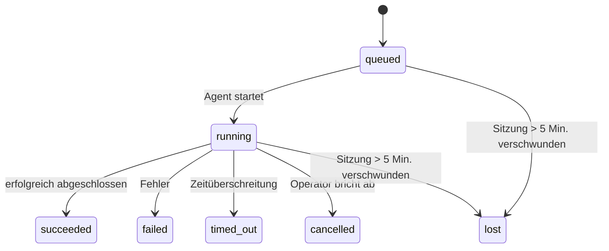

---
read_when:
    - In Bearbeitung befindliche oder kürzlich abgeschlossene Hintergrundaufgaben prüfen
    - Fehler bei der Zustellung für getrennte Agentenläufe beheben
    - Verstehen, wie Hintergrundläufe mit Sitzungen, Cron und Heartbeat zusammenhängen
summary: Hintergrundaufgabenverfolgung für ACP-Läufe, Subagenten, isolierte Cron-Jobs und CLI-Operationen
title: Hintergrundaufgaben
x-i18n:
    generated_at: "2026-04-21T06:22:58Z"
    model: gpt-5.4
    provider: openai
    source_hash: ba5511b1c421bdf505fc7d34f09e453ac44e85213fcb0f082078fa957aa91fe7
    source_path: automation/tasks.md
    workflow: 15
---

# Hintergrundaufgaben

> **Auf der Suche nach Planung?** Siehe [Automatisierung & Aufgaben](/de/automation), um den richtigen Mechanismus auszuwählen. Diese Seite behandelt das **Nachverfolgen** von Hintergrundarbeit, nicht deren Planung.

Hintergrundaufgaben verfolgen Arbeit, die **außerhalb Ihrer Haupt-Konversationssitzung** ausgeführt wird:
ACP-Läufe, Subagent-Starts, isolierte Cron-Job-Ausführungen und per CLI initiierte Operationen.

Aufgaben ersetzen **nicht** Sitzungen, Cron-Jobs oder Heartbeats — sie sind das **Aktivitätsprotokoll**, das aufzeichnet, welche entkoppelte Arbeit stattgefunden hat, wann sie stattgefunden hat und ob sie erfolgreich war.

<Note>
Nicht jeder Agentenlauf erstellt eine Aufgabe. Heartbeat-Durchläufe und normale interaktive Chats tun das nicht. Alle Cron-Ausführungen, ACP-Starts, Subagent-Starts und CLI-Agent-Befehle tun es.
</Note>

## Kurzfassung

- Aufgaben sind **Einträge**, keine Planer — Cron und Heartbeat entscheiden, _wann_ Arbeit ausgeführt wird, Aufgaben verfolgen, _was passiert ist_.
- ACP, Subagenten, alle Cron-Jobs und CLI-Operationen erstellen Aufgaben. Heartbeat-Durchläufe nicht.
- Jede Aufgabe durchläuft `queued → running → terminal` (succeeded, failed, timed_out, cancelled oder lost).
- Cron-Aufgaben bleiben aktiv, solange die Cron-Laufzeit die Aufgabe noch besitzt; chatgestützte CLI-Aufgaben bleiben nur aktiv, solange ihr zugehöriger Ausführungskontext noch aktiv ist.
- Der Abschluss ist push-gesteuert: Entkoppelte Arbeit kann direkt benachrichtigen oder die anfordernde Sitzung bzw. den Heartbeat wecken, wenn sie beendet ist, daher sind Status-Polling-Schleifen meist die falsche Form.
- Isolierte Cron-Läufe und Subagent-Abschlüsse räumen nach bestem Bemühen verfolgte Browser-Tabs/Prozesse für ihre untergeordnete Sitzung vor der abschließenden Cleanup-Buchführung auf.
- Die Zustellung isolierter Cron-Läufe unterdrückt veraltete vorläufige Antworten der übergeordneten Instanz, während nachgeordnete Subagent-Arbeit noch ausläuft, und bevorzugt die endgültige Ausgabe der Nachkommen, wenn diese vor der Zustellung eintrifft.
- Abschlussbenachrichtigungen werden direkt an einen Kanal zugestellt oder für den nächsten Heartbeat in die Warteschlange gestellt.
- `openclaw tasks list` zeigt alle Aufgaben; `openclaw tasks audit` macht Probleme sichtbar.
- Terminal-Einträge werden 7 Tage lang aufbewahrt und dann automatisch entfernt.

## Schnellstart

```bash
# Alle Aufgaben auflisten (neueste zuerst)
openclaw tasks list

# Nach Laufzeit oder Status filtern
openclaw tasks list --runtime acp
openclaw tasks list --status running

# Details für eine bestimmte Aufgabe anzeigen (nach ID, Lauf-ID oder Sitzungsschlüssel)
openclaw tasks show <lookup>

# Eine laufende Aufgabe abbrechen (beendet die untergeordnete Sitzung)
openclaw tasks cancel <lookup>

# Benachrichtigungsrichtlinie für eine Aufgabe ändern
openclaw tasks notify <lookup> state_changes

# Integritätsprüfung ausführen
openclaw tasks audit

# Wartung vorschauen oder anwenden
openclaw tasks maintenance
openclaw tasks maintenance --apply

# TaskFlow-Status prüfen
openclaw tasks flow list
openclaw tasks flow show <lookup>
openclaw tasks flow cancel <lookup>
```

## Was eine Aufgabe erstellt

| Quelle                 | Laufzeittyp | Wann ein Aufgabeneintrag erstellt wird                | Standard-Benachrichtigungsrichtlinie |
| ---------------------- | ----------- | ----------------------------------------------------- | ------------------------------------ |
| ACP-Hintergrundläufe   | `acp`       | Starten einer untergeordneten ACP-Sitzung             | `done_only`                          |
| Subagent-Orchestrierung | `subagent` | Starten eines Subagenten über `sessions_spawn`        | `done_only`                          |
| Cron-Jobs (alle Typen) | `cron`      | Jede Cron-Ausführung (Hauptsitzung und isoliert)      | `silent`                             |
| CLI-Operationen        | `cli`       | `openclaw agent`-Befehle, die über das Gateway laufen | `silent`                             |
| Agenten-Medienjobs     | `cli`       | Sitzungsgebundene `video_generate`-Läufe              | `silent`                             |

Cron-Aufgaben der Hauptsitzung verwenden standardmäßig die Benachrichtigungsrichtlinie `silent` — sie erstellen Einträge zur Nachverfolgung, erzeugen aber keine Benachrichtigungen. Isolierte Cron-Aufgaben verwenden ebenfalls standardmäßig `silent`, sind aber sichtbarer, weil sie in ihrer eigenen Sitzung laufen.

Sitzungsgebundene `video_generate`-Läufe verwenden ebenfalls die Benachrichtigungsrichtlinie `silent`. Sie erstellen weiterhin Aufgabeneinträge, aber der Abschluss wird als internes Wecksignal an die ursprüngliche Agentensitzung zurückgegeben, damit der Agent die Folgemeldung schreiben und das fertige Video selbst anhängen kann. Wenn Sie `tools.media.asyncCompletion.directSend` aktivieren, versuchen asynchrone `music_generate`- und `video_generate`-Abschlüsse zuerst die direkte Kanalzustellung, bevor sie auf den Weckpfad der anfordernden Sitzung zurückfallen.

Solange eine sitzungsgebundene `video_generate`-Aufgabe noch aktiv ist, fungiert das Tool auch als Schutzmechanismus: Wiederholte `video_generate`-Aufrufe in derselben Sitzung geben den Status der aktiven Aufgabe zurück, anstatt eine zweite gleichzeitige Generierung zu starten. Verwenden Sie `action: "status"`, wenn Sie explizit eine Fortschritts-/Statusabfrage von Agentenseite aus möchten.

**Was keine Aufgaben erstellt:**

- Heartbeat-Durchläufe — Hauptsitzung; siehe [Heartbeat](/de/gateway/heartbeat)
- Normale interaktive Chat-Durchläufe
- Direkte `/command`-Antworten

## Aufgabenlebenszyklus



| Status      | Bedeutung                                                                 |
| ----------- | ------------------------------------------------------------------------- |
| `queued`    | Erstellt, wartet auf den Start des Agenten                                |
| `running`   | Der Agent-Durchlauf wird aktiv ausgeführt                                 |
| `succeeded` | Erfolgreich abgeschlossen                                                  |
| `failed`    | Mit einem Fehler abgeschlossen                                            |
| `timed_out` | Die konfigurierte Zeitüberschreitung wurde erreicht                       |
| `cancelled` | Vom Operator über `openclaw tasks cancel` gestoppt                        |
| `lost`      | Die Laufzeit hat nach einer Karenzzeit von 5 Minuten den maßgeblichen Sicherungsstatus verloren |

Übergänge erfolgen automatisch — wenn der zugehörige Agentenlauf endet, wird der Aufgabenstatus entsprechend aktualisiert.

`lost` ist laufzeitbewusst:

- ACP-Aufgaben: Metadaten der zugehörigen ACP-Untergeordnetensitzung sind verschwunden.
- Subagent-Aufgaben: Zugehörige Untergeordnetensitzung ist aus dem Ziel-Agentenspeicher verschwunden.
- Cron-Aufgaben: Die Cron-Laufzeit verfolgt den Job nicht mehr als aktiv.
- CLI-Aufgaben: Isolierte Aufgaben mit Untergeordnetensitzung verwenden die Untergeordnetensitzung; chatgestützte CLI-Aufgaben verwenden stattdessen den aktiven Ausführungskontext, sodass verbleibende Kanal-/Gruppen-/Direktsitzungszeilen sie nicht aktiv halten.

## Zustellung und Benachrichtigungen

Wenn eine Aufgabe einen terminalen Zustand erreicht, benachrichtigt OpenClaw Sie. Es gibt zwei Zustellpfade:

**Direkte Zustellung** — wenn die Aufgabe ein Kanalziel hat (den `requesterOrigin`), geht die Abschlussnachricht direkt an diesen Kanal (Telegram, Discord, Slack usw.). Bei Subagent-Abschlüssen bewahrt OpenClaw außerdem gebundene Thread-/Thema-Weiterleitung, wenn verfügbar, und kann ein fehlendes `to` / Konto aus der gespeicherten Route der anfordernden Sitzung (`lastChannel` / `lastTo` / `lastAccountId`) ergänzen, bevor die direkte Zustellung aufgegeben wird.

**In die Sitzungswarteschlange eingereihte Zustellung** — wenn die direkte Zustellung fehlschlägt oder kein Ursprung gesetzt ist, wird das Update als Systemereignis in die Warteschlange der anfordernden Sitzung gestellt und beim nächsten Heartbeat sichtbar.

<Tip>
Der Abschluss einer Aufgabe löst ein sofortiges Heartbeat-Wecksignal aus, damit Sie das Ergebnis schnell sehen — Sie müssen nicht bis zum nächsten geplanten Heartbeat-Takt warten.
</Tip>

Das bedeutet, dass der übliche Arbeitsablauf push-basiert ist: Starten Sie entkoppelte Arbeit einmal und lassen Sie sich dann von der Laufzeit bei Abschluss wecken oder benachrichtigen. Fragen Sie den Aufgabenstatus nur ab, wenn Sie Debugging, Eingriffe oder eine explizite Prüfung benötigen.

### Benachrichtigungsrichtlinien

Steuern Sie, wie viel Sie über jede Aufgabe erfahren:

| Richtlinie            | Was zugestellt wird                                                      |
| --------------------- | ------------------------------------------------------------------------ |
| `done_only` (Standard) | Nur terminaler Zustand (succeeded, failed usw.) — **dies ist der Standard** |
| `state_changes`       | Jeder Zustandsübergang und jede Fortschrittsaktualisierung               |
| `silent`              | Gar nichts                                                               |

Ändern Sie die Richtlinie, während eine Aufgabe läuft:

```bash
openclaw tasks notify <lookup> state_changes
```

## CLI-Referenz

### `tasks list`

```bash
openclaw tasks list [--runtime <acp|subagent|cron|cli>] [--status <status>] [--json]
```

Ausgabespalten: Aufgaben-ID, Art, Status, Zustellung, Lauf-ID, Untergeordnetensitzung, Zusammenfassung.

### `tasks show`

```bash
openclaw tasks show <lookup>
```

Das Lookup-Token akzeptiert eine Aufgaben-ID, Lauf-ID oder einen Sitzungsschlüssel. Zeigt den vollständigen Eintrag einschließlich Zeitangaben, Zustellstatus, Fehler und terminaler Zusammenfassung.

### `tasks cancel`

```bash
openclaw tasks cancel <lookup>
```

Bei ACP- und Subagent-Aufgaben beendet dies die untergeordnete Sitzung. Bei CLI-verfolgten Aufgaben wird der Abbruch im Aufgabenregister erfasst (es gibt keinen separaten Handle der untergeordneten Laufzeit). Der Status wechselt zu `cancelled`, und falls zutreffend wird eine Zustellbenachrichtigung gesendet.

### `tasks notify`

```bash
openclaw tasks notify <lookup> <done_only|state_changes|silent>
```

### `tasks audit`

```bash
openclaw tasks audit [--json]
```

Macht betriebliche Probleme sichtbar. Erkenntnisse erscheinen auch in `openclaw status`, wenn Probleme erkannt werden.

| Erkenntnis                | Schweregrad | Auslöser                                              |
| ------------------------- | ----------- | ----------------------------------------------------- |
| `stale_queued`            | warn        | Mehr als 10 Minuten in Warteschlange                  |
| `stale_running`           | error       | Mehr als 30 Minuten ausgeführt                        |
| `lost`                    | error       | Laufzeitgestützte Aufgabeninhaberschaft verschwunden  |
| `delivery_failed`         | warn        | Zustellung fehlgeschlagen und Benachrichtigungsrichtlinie ist nicht `silent` |
| `missing_cleanup`         | warn        | Terminale Aufgabe ohne Cleanup-Zeitstempel            |
| `inconsistent_timestamps` | warn        | Verletzung der Zeitachse (zum Beispiel vor Start beendet) |

### `tasks maintenance`

```bash
openclaw tasks maintenance [--json]
openclaw tasks maintenance --apply [--json]
```

Verwenden Sie dies, um Abgleich, Cleanup-Zeitstempelung und Pruning für Aufgaben und den Task Flow-Status in der Vorschau anzuzeigen oder anzuwenden.

Der Abgleich ist laufzeitbewusst:

- ACP-/Subagent-Aufgaben prüfen ihre zugehörige Untergeordnetensitzung.
- Cron-Aufgaben prüfen, ob die Cron-Laufzeit den Job noch besitzt.
- Chatgestützte CLI-Aufgaben prüfen den zugehörigen aktiven Ausführungskontext, nicht nur die Chat-Sitzungszeile.

Das Abschluss-Cleanup ist ebenfalls laufzeitbewusst:

- Beim Subagent-Abschluss werden nach bestem Bemühen verfolgte Browser-Tabs/Prozesse für die untergeordnete Sitzung geschlossen, bevor das Cleanup der Ankündigung fortgesetzt wird.
- Beim Abschluss isolierter Cron-Läufe werden nach bestem Bemühen verfolgte Browser-Tabs/Prozesse für die Cron-Sitzung geschlossen, bevor der Lauf vollständig heruntergefahren wird.
- Die Zustellung isolierter Cron-Läufe wartet bei Bedarf auf nachgeordnetes Subagent-Follow-up und unterdrückt veralteten Bestätigungstext der übergeordneten Instanz, anstatt ihn anzukündigen.
- Die Zustellung beim Subagent-Abschluss bevorzugt den neuesten sichtbaren Assistant-Text; falls dieser leer ist, wird auf bereinigten neuesten `tool`-/`toolResult`-Text zurückgegriffen, und reine Tool-Aufruf-Läufe mit Zeitüberschreitung können zu einer kurzen Zusammenfassung des Teilfortschritts verdichtet werden.
- Cleanup-Fehler verdecken nicht das tatsächliche Aufgabenergebnis.

### `tasks flow list|show|cancel`

```bash
openclaw tasks flow list [--status <status>] [--json]
openclaw tasks flow show <lookup> [--json]
openclaw tasks flow cancel <lookup>
```

Verwenden Sie diese Befehle, wenn der orchestrierende TaskFlow das ist, was Sie interessiert, und nicht ein einzelner Hintergrundaufgabeneintrag.

## Chat-Aufgabenboard (`/tasks`)

Verwenden Sie `/tasks` in jeder Chatsitzung, um mit dieser Sitzung verknüpfte Hintergrundaufgaben anzuzeigen. Das Board zeigt aktive und kürzlich abgeschlossene Aufgaben mit Laufzeit, Status, Zeitangaben sowie Fortschritts- oder Fehlerdetails.

Wenn die aktuelle Sitzung keine sichtbaren verknüpften Aufgaben hat, greift `/tasks` auf agentlokale Aufgabenzählungen zurück, sodass Sie weiterhin einen Überblick erhalten, ohne Details anderer Sitzungen offenzulegen.

Für das vollständige Operator-Protokoll verwenden Sie die CLI: `openclaw tasks list`.

## Statusintegration (Aufgabenlast)

`openclaw status` enthält eine Aufgabenübersicht auf einen Blick:

```
Tasks: 3 queued · 2 running · 1 issues
```

Die Zusammenfassung meldet:

- **active** — Anzahl von `queued` + `running`
- **failures** — Anzahl von `failed` + `timed_out` + `lost`
- **byRuntime** — Aufschlüsselung nach `acp`, `subagent`, `cron`, `cli`

Sowohl `/status` als auch das Tool `session_status` verwenden eine Cleanup-bewusste Aufgabenmomentaufnahme: Aktive Aufgaben werden bevorzugt, veraltete abgeschlossene Einträge werden ausgeblendet, und aktuelle Fehler werden nur angezeigt, wenn keine aktive Arbeit mehr verbleibt. So bleibt die Statuskarte auf das fokussiert, was gerade wichtig ist.

## Speicherung und Wartung

### Wo Aufgaben gespeichert werden

Aufgabeneinträge werden in SQLite gespeichert unter:

```
$OPENCLAW_STATE_DIR/tasks/runs.sqlite
```

Das Register wird beim Gateway-Start in den Speicher geladen und synchronisiert Schreibvorgänge nach SQLite, damit die Daten Neustarts überdauern.

### Automatische Wartung

Ein Sweeper läuft alle **60 Sekunden** und übernimmt drei Dinge:

1. **Abgleich** — prüft, ob aktive Aufgaben noch einen maßgeblichen Laufzeit-Backing-Status haben. ACP-/Subagent-Aufgaben verwenden den Status der Untergeordnetensitzung, Cron-Aufgaben die Eigentümerschaft aktiver Jobs, und chatgestützte CLI-Aufgaben den zugehörigen Ausführungskontext. Wenn dieser Backing-Status länger als 5 Minuten fehlt, wird die Aufgabe als `lost` markiert.
2. **Cleanup-Zeitstempelung** — setzt für terminale Aufgaben einen Zeitstempel `cleanupAfter` (endedAt + 7 Tage).
3. **Pruning** — löscht Einträge nach Erreichen ihres `cleanupAfter`-Datums.

**Aufbewahrung**: Terminale Aufgabeneinträge werden **7 Tage** lang aufbewahrt und dann automatisch entfernt. Keine Konfiguration erforderlich.

## Wie Aufgaben mit anderen Systemen zusammenhängen

### Aufgaben und Task Flow

[Task Flow](/de/automation/taskflow) ist die Flow-Orchestrierungsebene oberhalb von Hintergrundaufgaben. Ein einzelner Flow kann über seine Lebensdauer hinweg mehrere Aufgaben koordinieren, indem er verwaltete oder gespiegelte Synchronisationsmodi verwendet. Verwenden Sie `openclaw tasks`, um einzelne Aufgabeneinträge zu prüfen, und `openclaw tasks flow`, um den orchestrierenden Flow zu prüfen.

Siehe [Task Flow](/de/automation/taskflow) für Details.

### Aufgaben und Cron

Eine Cron-Job-**Definition** liegt in `~/.openclaw/cron/jobs.json`; der Laufzeit-Ausführungsstatus liegt daneben in `~/.openclaw/cron/jobs-state.json`. **Jede** Cron-Ausführung erstellt einen Aufgabeneintrag — sowohl in der Hauptsitzung als auch isoliert. Cron-Aufgaben der Hauptsitzung verwenden standardmäßig die Benachrichtigungsrichtlinie `silent`, sodass sie nachverfolgt werden, ohne Benachrichtigungen zu erzeugen.

Siehe [Cron Jobs](/de/automation/cron-jobs).

### Aufgaben und Heartbeat

Heartbeat-Läufe sind Durchläufe der Hauptsitzung — sie erstellen keine Aufgabeneinträge. Wenn eine Aufgabe abgeschlossen wird, kann sie ein Heartbeat-Wecksignal auslösen, damit Sie das Ergebnis umgehend sehen.

Siehe [Heartbeat](/de/gateway/heartbeat).

### Aufgaben und Sitzungen

Eine Aufgabe kann auf einen `childSessionKey` verweisen (wo die Arbeit läuft) und auf einen `requesterSessionKey` (wer sie gestartet hat). Sitzungen sind der Gesprächskontext; Aufgaben sind die darüberliegende Aktivitätsverfolgung.

### Aufgaben und Agentenläufe

Die `runId` einer Aufgabe verknüpft sie mit dem Agentenlauf, der die Arbeit ausführt. Ereignisse im Agentenlebenszyklus (Start, Ende, Fehler) aktualisieren den Aufgabenstatus automatisch — Sie müssen den Lebenszyklus nicht manuell verwalten.

## Verwandt

- [Automatisierung & Aufgaben](/de/automation) — alle Automatisierungsmechanismen auf einen Blick
- [Task Flow](/de/automation/taskflow) — Flow-Orchestrierung oberhalb von Aufgaben
- [Geplante Aufgaben](/de/automation/cron-jobs) — Planung von Hintergrundarbeit
- [Heartbeat](/de/gateway/heartbeat) — periodische Durchläufe der Hauptsitzung
- [CLI: Tasks](/cli/index#tasks) — CLI-Befehlsreferenz
