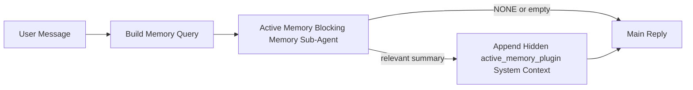

---
read_when:
    - Sie möchten verstehen, wofür Active Memory gedacht ist
    - Sie möchten Active Memory für einen konversationellen Agenten aktivieren
    - Sie möchten das Verhalten von Active Memory abstimmen, ohne es überall zu aktivieren
summary: Ein Plugin-eigener blockierender Memory-Sub-Agent, der relevante Memory in interaktive Chat-Sitzungen einspeist
title: Active Memory
x-i18n:
    generated_at: "2026-04-12T23:27:58Z"
    model: gpt-5.4
    provider: openai
    source_hash: 11665dbc888b6d4dc667a47624cc1f2e4cc71e1d58e1f7d9b5fe4057ec4da108
    source_path: concepts/active-memory.md
    workflow: 15
---

# Active Memory

Active Memory ist ein optionaler, Plugin-eigener blockierender Memory-Sub-Agent, der
vor der Hauptantwort für geeignete konversationelle Sitzungen ausgeführt wird.

Er existiert, weil die meisten Memory-Systeme leistungsfähig, aber reaktiv sind. Sie verlassen sich darauf,
dass der Haupt-Agent entscheidet, wann Memory durchsucht werden soll, oder darauf, dass der Nutzer Dinge sagt
wie „merke dir das“ oder „durchsuche Memory“. Zu diesem Zeitpunkt ist der Moment, in dem Memory die Antwort
natürlich hätte wirken lassen, bereits vorbei.

Active Memory gibt dem System eine begrenzte Möglichkeit, relevante Memory
vor der Generierung der Hauptantwort sichtbar zu machen.

## Fügen Sie dies in Ihren Agenten ein

Fügen Sie dies in Ihren Agenten ein, wenn Sie Active Memory mit einer
eigenständigen, standardmäßig sicheren Konfiguration aktivieren möchten:

```json5
{
  plugins: {
    entries: {
      "active-memory": {
        enabled: true,
        config: {
          enabled: true,
          agents: ["main"],
          allowedChatTypes: ["direct"],
          modelFallback: "google/gemini-3-flash",
          queryMode: "recent",
          promptStyle: "balanced",
          timeoutMs: 15000,
          maxSummaryChars: 220,
          persistTranscripts: false,
          logging: true,
        },
      },
    },
  },
}
```

Dadurch wird das Plugin für den `main`-Agenten aktiviert, standardmäßig auf
Sitzungen im Direktnachrichtenstil beschränkt, es kann zunächst das aktuelle Sitzungsmodell erben und
verwendet das konfigurierte Fallback-Modell nur dann, wenn kein explizites oder geerbtes Modell verfügbar ist.

Starten Sie danach das Gateway neu:

```bash
openclaw gateway
```

Um es live in einer Unterhaltung zu prüfen:

```text
/verbose on
/trace on
```

## Active Memory aktivieren

Die sicherste Konfiguration ist:

1. das Plugin aktivieren
2. einen konversationellen Agenten als Ziel festlegen
3. Logging nur während der Abstimmung aktiviert lassen

Beginnen Sie mit Folgendem in `openclaw.json`:

```json5
{
  plugins: {
    entries: {
      "active-memory": {
        enabled: true,
        config: {
          agents: ["main"],
          allowedChatTypes: ["direct"],
          modelFallback: "google/gemini-3-flash",
          queryMode: "recent",
          promptStyle: "balanced",
          timeoutMs: 15000,
          maxSummaryChars: 220,
          persistTranscripts: false,
          logging: true,
        },
      },
    },
  },
}
```

Starten Sie dann das Gateway neu:

```bash
openclaw gateway
```

Das bedeutet:

- `plugins.entries.active-memory.enabled: true` aktiviert das Plugin
- `config.agents: ["main"]` meldet nur den `main`-Agenten für Active Memory an
- `config.allowedChatTypes: ["direct"]` beschränkt Active Memory standardmäßig auf Sitzungen im Direktnachrichtenstil
- wenn `config.model` nicht gesetzt ist, erbt Active Memory zuerst das aktuelle Sitzungsmodell
- `config.modelFallback` stellt optional Ihr eigenes Fallback-Provider-/Modell für Recall bereit
- `config.promptStyle: "balanced"` verwendet den standardmäßigen Allzweck-Prompt-Stil für den `recent`-Modus
- Active Memory wird weiterhin nur in geeigneten interaktiven persistenten Chat-Sitzungen ausgeführt

## So sehen Sie es

Active Memory fügt verborgenen Systemkontext für das Modell ein. Es zeigt
keine rohen `<active_memory_plugin>...</active_memory_plugin>`-Tags an den Client weiter.

## Sitzungsumschaltung

Verwenden Sie den Plugin-Befehl, wenn Sie Active Memory für die
aktuelle Chat-Sitzung pausieren oder fortsetzen möchten, ohne die Konfiguration zu bearbeiten:

```text
/active-memory status
/active-memory off
/active-memory on
```

Dies ist sitzungsbezogen. Es ändert weder
`plugins.entries.active-memory.enabled`, die Agentenzuordnung noch andere globale
Konfigurationen.

Wenn der Befehl Konfiguration schreiben und Active Memory für
alle Sitzungen pausieren oder fortsetzen soll, verwenden Sie die explizite globale Form:

```text
/active-memory status --global
/active-memory off --global
/active-memory on --global
```

Die globale Form schreibt `plugins.entries.active-memory.config.enabled`. Sie lässt
`plugins.entries.active-memory.enabled` aktiviert, damit der Befehl später weiter verfügbar bleibt,
um Active Memory wieder einzuschalten.

Wenn Sie sehen möchten, was Active Memory in einer Live-Sitzung tut, aktivieren Sie die
Sitzungsumschalter, die zu der gewünschten Ausgabe passen:

```text
/verbose on
/trace on
```

Wenn diese aktiviert sind, kann OpenClaw Folgendes anzeigen:

- eine Active-Memory-Statuszeile wie `Active Memory: ok 842ms recent 34 chars` bei `/verbose on`
- eine lesbare Debug-Zusammenfassung wie `Active Memory Debug: Lemon pepper wings with blue cheese.` bei `/trace on`

Diese Zeilen stammen aus demselben Active-Memory-Durchlauf, der den verborgenen
Systemkontext speist, sind jedoch für Menschen formatiert, statt rohes Prompt-Markup offenzulegen.
Sie werden nach der normalen Assistentenantwort als diagnostische Folgemeldung gesendet, sodass
Channel-Clients wie Telegram keine separate Diagnoseblase vor der Antwort anzeigen.

Standardmäßig ist das Transcript des blockierenden Memory-Sub-Agenten temporär und wird
nach Abschluss des Durchlaufs gelöscht.

Beispielablauf:

```text
/verbose on
/trace on
what wings should i order?
```

Erwartete sichtbare Antwortform:

```text
...normal assistant reply...

🧩 Active Memory: ok 842ms recent 34 chars
🔎 Active Memory Debug: Lemon pepper wings with blue cheese.
```

## Wann es ausgeführt wird

Active Memory verwendet zwei Schranken:

1. **Config-Opt-in**
   Das Plugin muss aktiviert sein, und die aktuelle Agenten-ID muss in
   `plugins.entries.active-memory.config.agents` enthalten sein.
2. **Strenge Laufzeit-Eignung**
   Selbst wenn es aktiviert ist und als Ziel festgelegt wurde, wird Active Memory nur für geeignete
   interaktive persistente Chat-Sitzungen ausgeführt.

Die tatsächliche Regel lautet:

```text
plugin enabled
+
agent id targeted
+
allowed chat type
+
eligible interactive persistent chat session
=
active memory runs
```

Wenn eine dieser Bedingungen fehlschlägt, wird Active Memory nicht ausgeführt.

## Sitzungstypen

`config.allowedChatTypes` steuert, in welchen Arten von Unterhaltungen Active
Memory überhaupt ausgeführt werden darf.

Der Standardwert ist:

```json5
allowedChatTypes: ["direct"]
```

Das bedeutet, dass Active Memory standardmäßig in Sitzungen im Direktnachrichtenstil ausgeführt wird,
jedoch nicht in Gruppen- oder Channel-Sitzungen, sofern Sie diese nicht ausdrücklich aktivieren.

Beispiele:

```json5
allowedChatTypes: ["direct"]
```

```json5
allowedChatTypes: ["direct", "group"]
```

```json5
allowedChatTypes: ["direct", "group", "channel"]
```

## Wo es ausgeführt wird

Active Memory ist eine Funktion zur Anreicherung konversationeller Sitzungen, keine plattformweite
Inference-Funktion.

| Oberfläche                                                         | Wird Active Memory ausgeführt?                           |
| ------------------------------------------------------------------ | -------------------------------------------------------- |
| Control UI / Webchat mit persistenten Sitzungen                    | Ja, wenn das Plugin aktiviert ist und der Agent als Ziel festgelegt ist |
| Andere interaktive Channel-Sitzungen auf demselben persistenten Chat-Pfad | Ja, wenn das Plugin aktiviert ist und der Agent als Ziel festgelegt ist |
| Headless-Einmaldurchläufe                                          | Nein                                                     |
| Heartbeat-/Hintergrunddurchläufe                                   | Nein                                                     |
| Generische interne `agent-command`-Pfade                           | Nein                                                     |
| Sub-Agent-/interne Hilfsausführung                                 | Nein                                                     |

## Warum es verwenden

Verwenden Sie Active Memory, wenn:

- die Sitzung persistent und nutzerorientiert ist
- der Agent über sinnvolle Langzeit-Memory verfügt, die durchsucht werden kann
- Kontinuität und Personalisierung wichtiger sind als reine Prompt-Deterministik

Es funktioniert besonders gut für:

- stabile Präferenzen
- wiederkehrende Gewohnheiten
- langfristigen Nutzerkontext, der natürlich sichtbar werden sollte

Es passt schlecht zu:

- Automatisierung
- internen Workern
- einmaligen API-Aufgaben
- Stellen, an denen verborgene Personalisierung überraschend wäre

## So funktioniert es

Die Laufzeitform ist:



Der blockierende Memory-Sub-Agent kann nur Folgendes verwenden:

- `memory_search`
- `memory_get`

Wenn die Verbindung schwach ist, sollte er `NONE` zurückgeben.

## Abfragemodi

`config.queryMode` steuert, wie viel von der Unterhaltung der blockierende Memory-Sub-Agent sieht.

## Prompt-Stile

`config.promptStyle` steuert, wie bereitwillig oder streng der blockierende Memory-Sub-Agent ist,
wenn er entscheidet, ob Memory zurückgegeben werden soll.

Verfügbare Stile:

- `balanced`: allgemeiner Standard für den `recent`-Modus
- `strict`: am wenigsten bereitwillig; am besten, wenn Sie sehr wenig Übertragung aus nahem Kontext möchten
- `contextual`: am freundlichsten für Kontinuität; am besten, wenn der Unterhaltungsverlauf stärker zählen soll
- `recall-heavy`: eher bereit, Memory auch bei schwächeren, aber noch plausiblen Treffern sichtbar zu machen
- `precision-heavy`: bevorzugt aggressiv `NONE`, außer wenn der Treffer eindeutig ist
- `preference-only`: optimiert für Favoriten, Gewohnheiten, Routinen, Geschmack und wiederkehrende persönliche Fakten

Standardzuordnung, wenn `config.promptStyle` nicht gesetzt ist:

```text
message -> strict
recent -> balanced
full -> contextual
```

Wenn Sie `config.promptStyle` explizit festlegen, hat diese Überschreibung Vorrang.

Beispiel:

```json5
promptStyle: "preference-only"
```

## Modell-Fallback-Richtlinie

Wenn `config.model` nicht gesetzt ist, versucht Active Memory ein Modell in dieser Reihenfolge aufzulösen:

```text
explicit plugin model
-> current session model
-> agent primary model
-> optional configured fallback model
```

`config.modelFallback` steuert den konfigurierten Fallback-Schritt.

Optionales benutzerdefiniertes Fallback:

```json5
modelFallback: "google/gemini-3-flash"
```

Wenn kein explizites, geerbtes oder konfiguriertes Fallback-Modell aufgelöst werden kann, überspringt Active Memory
den Recall für diesen Durchlauf.

`config.modelFallbackPolicy` wird nur noch als veraltetes Kompatibilitätsfeld
für ältere Konfigurationen beibehalten. Es ändert das Laufzeitverhalten nicht mehr.

## Erweiterte Escape Hatches

Diese Optionen sind absichtlich nicht Teil der empfohlenen Konfiguration.

`config.thinking` kann die Thinking-Stufe des blockierenden Memory-Sub-Agenten überschreiben:

```json5
thinking: "medium"
```

Standard:

```json5
thinking: "off"
```

Aktivieren Sie dies nicht standardmäßig. Active Memory läuft im Antwortpfad, daher erhöht zusätzliche
Thinking-Zeit direkt die für Nutzer sichtbare Latenz.

`config.promptAppend` fügt nach dem standardmäßigen Active-Memory-
Prompt und vor dem Unterhaltungskontext zusätzliche Operator-Anweisungen hinzu:

```json5
promptAppend: "Prefer stable long-term preferences over one-off events."
```

`config.promptOverride` ersetzt den standardmäßigen Active-Memory-Prompt. OpenClaw
hängt den Unterhaltungskontext danach weiterhin an:

```json5
promptOverride: "You are a memory search agent. Return NONE or one compact user fact."
```

Prompt-Anpassungen werden nicht empfohlen, es sei denn, Sie testen absichtlich einen
anderen Recall-Vertrag. Der Standard-Prompt ist darauf abgestimmt, entweder `NONE`
oder kompakten Nutzerfakt-Kontext für das Hauptmodell zurückzugeben.

### `message`

Nur die neueste Nutzernachricht wird gesendet.

```text
Latest user message only
```

Verwenden Sie dies, wenn:

- Sie das schnellste Verhalten möchten
- Sie die stärkste Ausrichtung auf den Recall stabiler Präferenzen möchten
- Folgezüge keinen Unterhaltungskontext benötigen

Empfohlener Timeout:

- beginnen Sie bei etwa `3000` bis `5000` ms

### `recent`

Die neueste Nutzernachricht plus ein kleiner aktueller Unterhaltungsausschnitt werden gesendet.

```text
Recent conversation tail:
user: ...
assistant: ...
user: ...

Latest user message:
...
```

Verwenden Sie dies, wenn:

- Sie eine bessere Balance aus Geschwindigkeit und konversationeller Einbettung möchten
- Rückfragen oft von den letzten paar Zügen abhängen

Empfohlener Timeout:

- beginnen Sie bei etwa `15000` ms

### `full`

Die vollständige Unterhaltung wird an den blockierenden Memory-Sub-Agenten gesendet.

```text
Full conversation context:
user: ...
assistant: ...
user: ...
...
```

Verwenden Sie dies, wenn:

- die bestmögliche Recall-Qualität wichtiger ist als Latenz
- die Unterhaltung wichtige Vorbereitung weit hinten im Thread enthält

Empfohlener Timeout:

- erhöhen Sie ihn im Vergleich zu `message` oder `recent` deutlich
- beginnen Sie bei etwa `15000` ms oder höher, abhängig von der Thread-Größe

Im Allgemeinen sollte der Timeout mit der Kontextgröße steigen:

```text
message < recent < full
```

## Persistenz von Transcripts

Durchläufe des blockierenden Active-Memory-Memory-Sub-Agenten erzeugen während des Aufrufs des blockierenden Memory-Sub-Agenten ein echtes `session.jsonl`-
Transcript.

Standardmäßig ist dieses Transcript temporär:

- es wird in ein temporäres Verzeichnis geschrieben
- es wird nur für den Durchlauf des blockierenden Memory-Sub-Agenten verwendet
- es wird unmittelbar nach Abschluss des Durchlaufs gelöscht

Wenn Sie diese Transcripts des blockierenden Memory-Sub-Agenten zur Fehleranalyse oder
Prüfung auf der Festplatte behalten möchten, aktivieren Sie Persistenz ausdrücklich:

```json5
{
  plugins: {
    entries: {
      "active-memory": {
        enabled: true,
        config: {
          agents: ["main"],
          persistTranscripts: true,
          transcriptDir: "active-memory",
        },
      },
    },
  },
}
```

Wenn aktiviert, speichert Active Memory Transcripts in einem separaten Verzeichnis unter dem
Sitzungsordner des Ziel-Agenten, nicht im Transcript-Pfad der Haupt-Nutzerunterhaltung.

Das Standardlayout sieht konzeptionell so aus:

```text
agents/<agent>/sessions/active-memory/<blocking-memory-sub-agent-session-id>.jsonl
```

Sie können das relative Unterverzeichnis mit `config.transcriptDir` ändern.

Verwenden Sie dies mit Vorsicht:

- Transcripts des blockierenden Memory-Sub-Agenten können sich in stark genutzten Sitzungen schnell ansammeln
- der Abfragemodus `full` kann viel Unterhaltungskontext duplizieren
- diese Transcripts enthalten verborgenen Prompt-Kontext und abgerufene Memories

## Konfiguration

Die gesamte Active-Memory-Konfiguration befindet sich unter:

```text
plugins.entries.active-memory
```

Die wichtigsten Felder sind:

| Schlüssel                    | Typ                                                                                                  | Bedeutung                                                                                              |
| --------------------------- | ---------------------------------------------------------------------------------------------------- | ------------------------------------------------------------------------------------------------------ |
| `enabled`                   | `boolean`                                                                                            | Aktiviert das Plugin selbst                                                                            |
| `config.agents`             | `string[]`                                                                                           | Agenten-IDs, die Active Memory verwenden dürfen                                                        |
| `config.model`              | `string`                                                                                             | Optionale Modell-Referenz für den blockierenden Memory-Sub-Agenten; wenn nicht gesetzt, verwendet Active Memory das aktuelle Sitzungsmodell |
| `config.queryMode`          | `"message" \| "recent" \| "full"`                                                                    | Steuert, wie viel Unterhaltung der blockierende Memory-Sub-Agent sieht                                 |
| `config.promptStyle`        | `"balanced" \| "strict" \| "contextual" \| "recall-heavy" \| "precision-heavy" \| "preference-only"` | Steuert, wie bereitwillig oder streng der blockierende Memory-Sub-Agent ist, wenn er entscheidet, ob Memory zurückgegeben wird |
| `config.thinking`           | `"off" \| "minimal" \| "low" \| "medium" \| "high" \| "xhigh" \| "adaptive"`                         | Erweiterte Thinking-Überschreibung für den blockierenden Memory-Sub-Agenten; Standard ist `off` für Geschwindigkeit |
| `config.promptOverride`     | `string`                                                                                             | Erweiterter vollständiger Prompt-Ersatz; für normale Nutzung nicht empfohlen                           |
| `config.promptAppend`       | `string`                                                                                             | Erweiterte zusätzliche Anweisungen, die an den Standard- oder überschriebenen Prompt angehängt werden |
| `config.timeoutMs`          | `number`                                                                                             | Harte Zeitüberschreitung für den blockierenden Memory-Sub-Agenten                                      |
| `config.maxSummaryChars`    | `number`                                                                                             | Maximal zulässige Gesamtzeichenanzahl in der Active-Memory-Zusammenfassung                             |
| `config.logging`            | `boolean`                                                                                            | Gibt Active-Memory-Logs während der Abstimmung aus                                                     |
| `config.persistTranscripts` | `boolean`                                                                                            | Behält Transcripts des blockierenden Memory-Sub-Agenten auf der Festplatte, statt temporäre Dateien zu löschen |
| `config.transcriptDir`      | `string`                                                                                             | Relatives Transcript-Verzeichnis für den blockierenden Memory-Sub-Agenten unter dem Sitzungsordner des Agenten |

Nützliche Abstimmungsfelder:

| Schlüssel                     | Typ      | Bedeutung                                                    |
| ---------------------------- | -------- | ------------------------------------------------------------ |
| `config.maxSummaryChars`      | `number` | Maximal zulässige Gesamtzeichenanzahl in der Active-Memory-Zusammenfassung |
| `config.recentUserTurns`      | `number` | Frühere Nutzerzüge, die eingeschlossen werden, wenn `queryMode` auf `recent` gesetzt ist |
| `config.recentAssistantTurns` | `number` | Frühere Assistentenzüge, die eingeschlossen werden, wenn `queryMode` auf `recent` gesetzt ist |
| `config.recentUserChars`      | `number` | Maximale Zeichenanzahl pro aktuellem Nutzerzug               |
| `config.recentAssistantChars` | `number` | Maximale Zeichenanzahl pro aktuellem Assistentenzug          |
| `config.cacheTtlMs`           | `number` | Cache-Wiederverwendung für wiederholte identische Abfragen   |

## Empfohlene Konfiguration

Beginnen Sie mit `recent`.

```json5
{
  plugins: {
    entries: {
      "active-memory": {
        enabled: true,
        config: {
          agents: ["main"],
          queryMode: "recent",
          promptStyle: "balanced",
          timeoutMs: 15000,
          maxSummaryChars: 220,
          logging: true,
        },
      },
    },
  },
}
```

Wenn Sie das Live-Verhalten während der Abstimmung prüfen möchten, verwenden Sie `/verbose on` für die
normale Statuszeile und `/trace on` für die Active-Memory-Debug-Zusammenfassung,
anstatt nach einem separaten Active-Memory-Debug-Befehl zu suchen. In Chat-Channels werden diese
Diagnosezeilen nach der Hauptantwort des Assistenten statt davor gesendet.

Wechseln Sie dann zu:

- `message`, wenn Sie geringere Latenz möchten
- `full`, wenn Sie entscheiden, dass zusätzlicher Kontext den langsameren blockierenden Memory-Sub-Agenten wert ist

## Fehlerbehebung

Wenn Active Memory nicht dort angezeigt wird, wo Sie es erwarten:

1. Bestätigen Sie, dass das Plugin unter `plugins.entries.active-memory.enabled` aktiviert ist.
2. Bestätigen Sie, dass die aktuelle Agenten-ID in `config.agents` aufgeführt ist.
3. Bestätigen Sie, dass Sie über eine interaktive persistente Chat-Sitzung testen.
4. Aktivieren Sie `config.logging: true` und beobachten Sie die Gateway-Logs.
5. Verifizieren Sie mit `openclaw memory status --deep`, dass die Memory-Suche selbst funktioniert.

Wenn Memory-Treffer verrauscht sind, verringern Sie:

- `maxSummaryChars`

Wenn Active Memory zu langsam ist:

- `queryMode` verringern
- `timeoutMs` verringern
- die Anzahl aktueller Züge reduzieren
- die Zeichenobergrenzen pro Zug reduzieren

## Häufige Probleme

### Embedding-Provider hat sich unerwartet geändert

Active Memory verwendet die normale `memory_search`-Pipeline unter
`agents.defaults.memorySearch`. Das bedeutet, dass eine Embedding-Provider-Konfiguration nur dann eine
Anforderung ist, wenn Ihre `memorySearch`-Konfiguration Embeddings für das gewünschte Verhalten erfordert.

In der Praxis gilt:

- eine explizite Provider-Konfiguration ist **erforderlich**, wenn Sie einen Provider möchten, der nicht
  automatisch erkannt wird, etwa `ollama`
- eine explizite Provider-Konfiguration ist **erforderlich**, wenn die automatische Erkennung
  keinen nutzbaren Embedding-Provider für Ihre Umgebung auflöst
- eine explizite Provider-Konfiguration ist **dringend empfohlen**, wenn Sie eine deterministische
  Providerauswahl statt „first available wins“ möchten
- eine explizite Provider-Konfiguration ist normalerweise **nicht erforderlich**, wenn die automatische Erkennung bereits
  den gewünschten Provider auflöst und dieser Provider in Ihrer Bereitstellung stabil ist

Wenn `memorySearch.provider` nicht gesetzt ist, erkennt OpenClaw automatisch den ersten verfügbaren
Embedding-Provider.

Das kann in realen Bereitstellungen verwirrend sein:

- ein neu verfügbarer API-Schlüssel kann ändern, welchen Provider die Memory-Suche verwendet
- ein Befehl oder eine Diagnoseoberfläche kann den ausgewählten Provider anders erscheinen lassen
  als den Pfad, den Sie bei Live-Memory-Sync oder beim Bootstrap der Suche tatsächlich verwenden
- gehostete Provider können mit Quoten- oder Rate-Limit-Fehlern scheitern, die erst sichtbar werden,
  sobald Active Memory vor jeder Antwort Recall-Suchen ausführt

Active Memory kann auch ohne Embeddings ausgeführt werden, wenn `memory_search` im
degradierten rein lexikalischen Modus arbeiten kann, was typischerweise geschieht, wenn kein Embedding-
Provider aufgelöst werden kann.

Gehen Sie nicht davon aus, dass derselbe Fallback bei Laufzeitfehlern des Providers wie
Quotenausschöpfung, Rate Limits, Netzwerk-/Providerfehlern oder fehlenden lokalen/entfernten
Modellen greift, nachdem bereits ein Provider ausgewählt wurde.

In der Praxis gilt:

- wenn kein Embedding-Provider aufgelöst werden kann, kann `memory_search` auf
  rein lexikalisches Retrieval degradiert werden
- wenn ein Embedding-Provider aufgelöst wird und dann zur Laufzeit ausfällt, garantiert OpenClaw
  derzeit keinen lexikalischen Fallback für diese Anfrage
- wenn Sie eine deterministische Providerauswahl benötigen, fixieren Sie
  `agents.defaults.memorySearch.provider`
- wenn Sie ein Provider-Failover bei Laufzeitfehlern benötigen, konfigurieren Sie
  `agents.defaults.memorySearch.fallback` ausdrücklich

Wenn Sie auf embeddinggestützten Recall, multimodale Indizierung oder einen bestimmten
lokalen/entfernten Provider angewiesen sind, fixieren Sie den Provider ausdrücklich, statt sich auf
automatische Erkennung zu verlassen.

Häufige Beispiele zum Fixieren:

OpenAI:

```json5
{
  agents: {
    defaults: {
      memorySearch: {
        provider: "openai",
        model: "text-embedding-3-small",
      },
    },
  },
}
```

Gemini:

```json5
{
  agents: {
    defaults: {
      memorySearch: {
        provider: "gemini",
        model: "gemini-embedding-001",
      },
    },
  },
}
```

Ollama:

```json5
{
  agents: {
    defaults: {
      memorySearch: {
        provider: "ollama",
        model: "nomic-embed-text",
      },
    },
  },
}
```

Wenn Sie Provider-Failover bei Laufzeitfehlern wie Quotenausschöpfung erwarten,
reicht das Fixieren eines Providers allein nicht aus. Konfigurieren Sie zusätzlich einen expliziten Fallback:

```json5
{
  agents: {
    defaults: {
      memorySearch: {
        provider: "openai",
        fallback: "gemini",
      },
    },
  },
}
```

### Fehlerbehebung bei Provider-Problemen

Wenn Active Memory langsam oder leer ist oder Provider unerwartet zu wechseln scheint:

- beobachten Sie die Gateway-Logs, während Sie das Problem reproduzieren; achten Sie auf Zeilen wie
  `active-memory: ... start|done`, `memory sync failed (search-bootstrap)` oder
  provider-spezifische Embedding-Fehler
- aktivieren Sie `/trace on`, um die Plugin-eigene Active-Memory-Debug-Zusammenfassung in
  der Sitzung sichtbar zu machen
- aktivieren Sie `/verbose on`, wenn Sie zusätzlich die normale Statuszeile
  `🧩 Active Memory: ...` nach jeder Antwort sehen möchten
- führen Sie `openclaw memory status --deep` aus, um das aktuelle Memory-Search-
  Backend und den Zustand des Index zu prüfen
- prüfen Sie `agents.defaults.memorySearch.provider` und zugehörige Auth-/Konfigurationswerte, um
  sicherzustellen, dass der erwartete Provider tatsächlich derjenige ist, der zur Laufzeit aufgelöst werden kann
- wenn Sie `ollama` verwenden, verifizieren Sie, dass das konfigurierte Embedding-Modell installiert ist, zum
  Beispiel mit `ollama list`

Beispiel für eine Debugging-Schleife:

```text
1. Start the gateway and watch its logs
2. In the chat session, run /trace on
3. Send one message that should trigger Active Memory
4. Compare the chat-visible debug line with the gateway log lines
5. If provider choice is ambiguous, pin agents.defaults.memorySearch.provider explicitly
```

Beispiel:

```json5
{
  agents: {
    defaults: {
      memorySearch: {
        provider: "ollama",
        model: "nomic-embed-text",
      },
    },
  },
}
```

Oder, wenn Sie Gemini-Embeddings möchten:

```json5
{
  agents: {
    defaults: {
      memorySearch: {
        provider: "gemini",
      },
    },
  },
}
```

Nachdem Sie den Provider geändert haben, starten Sie das Gateway neu und führen Sie mit
`/trace on` einen frischen Test aus, damit die Active-Memory-Debug-Zeile den neuen Embedding-Pfad widerspiegelt.

## Verwandte Seiten

- [Memory Search](/de/concepts/memory-search)
- [Referenz zur Memory-Konfiguration](/de/reference/memory-config)
- [Plugin SDK-Einrichtung](/de/plugins/sdk-setup)
