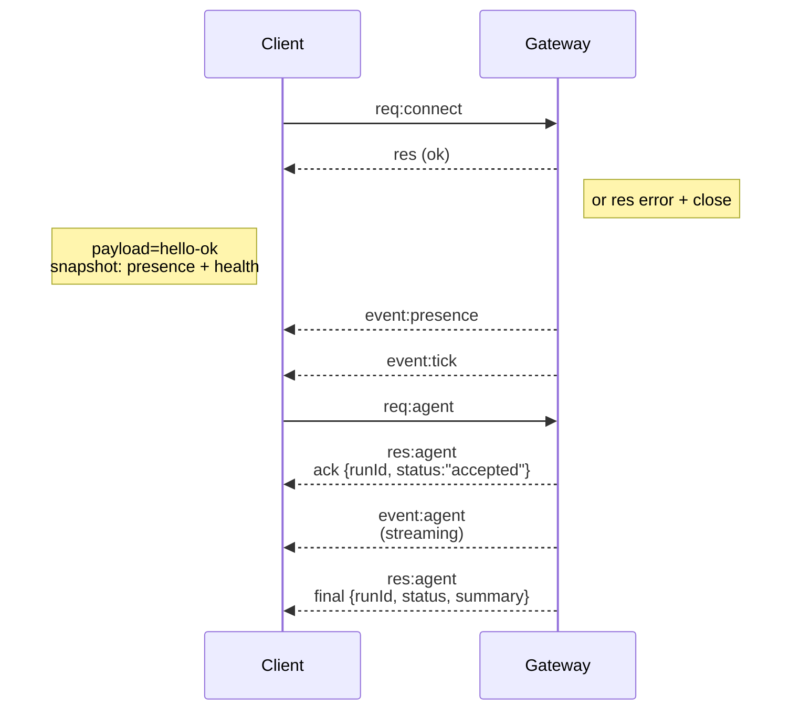

---
read_when:
    - Arbeiten an Gateway-Protokoll, Clients oder Transporten
summary: WebSocket-Gateway-Architektur, Komponenten und Client-Flows
title: Gateway-Architektur
x-i18n:
    generated_at: "2026-04-24T06:33:16Z"
    model: gpt-5.4
    provider: openai
    source_hash: 91c553489da18b6ad83fc860014f5bfb758334e9789cb7893d4d00f81c650f02
    source_path: concepts/architecture.md
    workflow: 15
---

## Überblick

- Ein einzelnes langlebiges **Gateway** besitzt alle Messaging-Oberflächen (WhatsApp über
  Baileys, Telegram über grammY, Slack, Discord, Signal, iMessage, WebChat).
- Clients der Control Plane (macOS-App, CLI, Web-UI, Automatisierungen) verbinden sich über
  **WebSocket** mit dem Gateway auf dem konfigurierten Bind-Host (Standard
  `127.0.0.1:18789`).
- **Nodes** (macOS/iOS/Android/headless) verbinden sich ebenfalls über **WebSocket**, deklarieren
  aber `role: node` mit expliziten Caps/Befehlen.
- Ein Gateway pro Host; es ist der einzige Ort, der eine WhatsApp-Sitzung öffnet.
- Der **Canvas-Host** wird vom Gateway-HTTP-Server unter folgenden Pfaden bereitgestellt:
  - `/__openclaw__/canvas/` (vom Agenten bearbeitbares HTML/CSS/JS)
  - `/__openclaw__/a2ui/` (A2UI-Host)
    Er verwendet denselben Port wie das Gateway (Standard `18789`).

## Komponenten und Flows

### Gateway (Daemon)

- Hält Provider-Verbindungen aufrecht.
- Stellt eine typisierte WS-API bereit (Anfragen, Antworten, vom Server gepushte Ereignisse).
- Validiert eingehende Frames gegen JSON Schema.
- Sendet Ereignisse wie `agent`, `chat`, `presence`, `health`, `heartbeat`, `cron`.

### Clients (mac-App / CLI / Web-Admin)

- Eine WS-Verbindung pro Client.
- Senden Anfragen (`health`, `status`, `send`, `agent`, `system-presence`).
- Abonnieren Ereignisse (`tick`, `agent`, `presence`, `shutdown`).

### Nodes (macOS / iOS / Android / headless)

- Verbinden sich mit **demselben WS-Server** mit `role: node`.
- Stellen in `connect` eine Geräteidentität bereit; Pairing ist **gerätebasiert** (Rolle `node`) und
  die Genehmigung liegt im Device-Pairing-Store.
- Stellen Befehle wie `canvas.*`, `camera.*`, `screen.record`, `location.get` bereit.

Protokolldetails:

- [Gateway-Protokoll](/de/gateway/protocol)

### WebChat

- Statische UI, die die Gateway-WS-API für Chatverlauf und Sendevorgänge verwendet.
- In Remote-Setups verbindet sie sich über denselben SSH-/Tailscale-Tunnel wie andere
  Clients.

## Verbindungslebenszyklus (einzelner Client)



## Wire-Protokoll (Zusammenfassung)

- Transport: WebSocket, Text-Frames mit JSON-Payloads.
- Der erste Frame **muss** `connect` sein.
- Nach dem Handshake:
  - Anfragen: `{type:"req", id, method, params}` → `{type:"res", id, ok, payload|error}`
  - Ereignisse: `{type:"event", event, payload, seq?, stateVersion?}`
- `hello-ok.features.methods` / `events` sind Discovery-Metadaten, kein
  generierter Dump jeder aufrufbaren Helper-Route.
- Shared-Secret-Authentifizierung verwendet `connect.params.auth.token` oder
  `connect.params.auth.password`, abhängig vom konfigurierten Gateway-Auth-Modus.
- Identitätstragende Modi wie Tailscale Serve
  (`gateway.auth.allowTailscale: true`) oder nicht-loopback
  `gateway.auth.mode: "trusted-proxy"` erfüllen die Authentifizierung über Request-Header
  statt über `connect.params.auth.*`.
- Privater Ingress mit `gateway.auth.mode: "none"` deaktiviert Shared-Secret-Authentifizierung
  vollständig; halten Sie diesen Modus von öffentlichem/nicht vertrauenswürdigem Ingress fern.
- Idempotenz-Schlüssel sind für Methoden mit Seiteneffekten (`send`, `agent`) erforderlich, um
  sicher erneut zu versuchen; der Server hält einen kurzlebigen Dedupe-Cache vor.
- Nodes müssen in `connect` `role: "node"` plus Caps/Befehle/Berechtigungen angeben.

## Pairing + lokales Vertrauen

- Alle WS-Clients (Operatoren + Nodes) enthalten bei `connect` eine **Geräteidentität**.
- Neue Geräte-IDs erfordern Pairing-Genehmigung; das Gateway stellt für nachfolgende Verbindungen ein **Gerätetoken**
  aus.
- Direkte lokale Loopback-Verbindungen können automatisch genehmigt werden, um die UX auf demselben Host
  reibungslos zu halten.
- OpenClaw hat außerdem einen engen backend-/containerlokalen Self-Connect-Pfad für
  vertrauenswürdige Shared-Secret-Helper-Flows.
- Tailnet- und LAN-Verbindungen, einschließlich Tailnet-Bindings auf demselben Host, erfordern weiterhin
  explizite Pairing-Genehmigung.
- Alle Verbindungen müssen die Nonce `connect.challenge` signieren.
- Die Signatur-Payload `v3` bindet außerdem `platform` + `deviceFamily`; das Gateway
  pinnt gepaarte Metadaten bei erneuter Verbindung fest und verlangt ein Reparatur-Pairing bei
  Metadatenänderungen.
- **Nicht-lokale** Verbindungen erfordern weiterhin explizite Genehmigung.
- Gateway-Authentifizierung (`gateway.auth.*`) gilt weiterhin für **alle** Verbindungen, lokal oder
  remote.

Details: [Gateway-Protokoll](/de/gateway/protocol), [Pairing](/de/channels/pairing),
[Sicherheit](/de/gateway/security).

## Protokoll-Typisierung und Codegen

- TypeBox-Schemas definieren das Protokoll.
- JSON Schema wird aus diesen Schemas generiert.
- Swift-Modelle werden aus dem JSON Schema generiert.

## Remote-Zugriff

- Bevorzugt: Tailscale oder VPN.
- Alternative: SSH-Tunnel

  ```bash
  ssh -N -L 18789:127.0.0.1:18789 user@host
  ```

- Dasselbe Handshake + Auth-Token gilt über den Tunnel.
- TLS + optionales Pinning können für WS in Remote-Setups aktiviert werden.

## Betriebsübersicht

- Start: `openclaw gateway` (im Vordergrund, Logs auf stdout).
- Health: `health` über WS (ist auch in `hello-ok` enthalten).
- Überwachung: launchd/systemd für automatischen Neustart.

## Invarianten

- Genau ein Gateway steuert pro Host genau eine einzelne Baileys-Sitzung.
- Das Handshake ist obligatorisch; jeder nicht-JSON- oder nicht-`connect`-erste Frame führt zu einer harten Schließung.
- Ereignisse werden nicht erneut abgespielt; Clients müssen bei Lücken aktualisieren.

## Verwandt

- [Agent Loop](/de/concepts/agent-loop) — detaillierter Agent-Ausführungszyklus
- [Gateway-Protokoll](/de/gateway/protocol) — WebSocket-Protokollvertrag
- [Queue](/de/concepts/queue) — Befehlswarteschlange und Nebenläufigkeit
- [Sicherheit](/de/gateway/security) — Vertrauensmodell und Härtung
