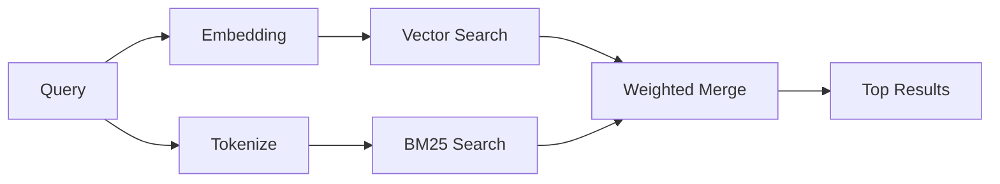

---
read_when:
    - Sie möchten verstehen, wie `memory_search` funktioniert.
    - Sie möchten einen Embedding-Provider auswählen.
    - Sie möchten die Suchqualität abstimmen.
summary: Wie die Memory-Suche mithilfe von Embeddings und hybrider Retrieval relevante Notizen findet
title: Memory-Suche
x-i18n:
    generated_at: "2026-04-24T06:34:25Z"
    model: gpt-5.4
    provider: openai
    source_hash: 04db62e519a691316ce40825c082918094bcaa9c36042cc8101c6504453d238e
    source_path: concepts/memory-search.md
    workflow: 15
---

`memory_search` findet relevante Notizen aus Ihren Memory-Dateien, selbst wenn die
Formulierung vom ursprünglichen Text abweicht. Es funktioniert, indem Memory in kleine
Chunks indexiert und diese mit Embeddings, Keywords oder beidem durchsucht werden.

## Schnellstart

Wenn Sie ein GitHub Copilot-Abonnement oder einen konfigurierten API-Schlüssel für OpenAI, Gemini, Voyage oder Mistral haben,
funktioniert die Memory-Suche automatisch. Um einen Provider
explizit festzulegen:

```json5
{
  agents: {
    defaults: {
      memorySearch: {
        provider: "openai", // oder "gemini", "local", "ollama" usw.
      },
    },
  },
}
```

Für lokale Embeddings ohne API-Schlüssel verwenden Sie `provider: "local"` (erfordert
node-llama-cpp).

## Unterstützte Provider

| Provider       | ID               | Benötigt API-Schlüssel | Hinweise                                             |
| -------------- | ---------------- | ---------------------- | ---------------------------------------------------- |
| Bedrock        | `bedrock`        | Nein                   | Automatisch erkannt, wenn die AWS-Credential-Chain aufgelöst wird |
| Gemini         | `gemini`         | Ja                     | Unterstützt Bild-/Audio-Indexierung                  |
| GitHub Copilot | `github-copilot` | Nein                   | Automatisch erkannt, verwendet das Copilot-Abonnement |
| Local          | `local`          | Nein                   | GGUF-Modell, Download von ca. 0,6 GB                 |
| Mistral        | `mistral`        | Ja                     | Automatisch erkannt                                  |
| Ollama         | `ollama`         | Nein                   | Lokal, muss explizit gesetzt werden                  |
| OpenAI         | `openai`         | Ja                     | Automatisch erkannt, schnell                         |
| Voyage         | `voyage`         | Ja                     | Automatisch erkannt                                  |

## So funktioniert die Suche

OpenClaw führt zwei Retrieval-Pfade parallel aus und führt die Ergebnisse zusammen:



- **Vektorsuche** findet Notizen mit ähnlicher Bedeutung („Gateway-Host“ passt zu
  „die Maschine, auf der OpenClaw läuft“).
- **BM25-Keyword-Suche** findet exakte Treffer (IDs, Fehlerstrings, Config-
  Schlüssel).

Wenn nur ein Pfad verfügbar ist (keine Embeddings oder kein FTS), läuft der andere allein.

Wenn Embeddings nicht verfügbar sind, verwendet OpenClaw weiterhin lexikalisches Ranking über FTS-Ergebnisse, statt nur auf rohe Exakt-Treffer-Reihenfolge zurückzufallen. Dieser degradierte Modus verstärkt Chunks mit stärkerer Abdeckung der Query-Begriffe und relevanten Dateipfaden, wodurch der Recall auch ohne `sqlite-vec` oder einen Embedding-Provider nützlich bleibt.

## Verbesserung der Suchqualität

Zwei optionale Funktionen helfen, wenn Sie einen großen Notizverlauf haben:

### Zeitlicher Verfall

Alte Notizen verlieren schrittweise an Ranking-Gewicht, sodass neuere Informationen zuerst erscheinen.
Mit der Standard-Halbwertszeit von 30 Tagen erhält eine Notiz vom letzten Monat 50 % ihres
ursprünglichen Gewichts. Evergreen-Dateien wie `MEMORY.md` unterliegen nie einem Verfall.

<Tip>
Aktivieren Sie zeitlichen Verfall, wenn Ihr Agent monatelange tägliche Notizen hat und veraltete
Informationen wiederholt höher gerankt werden als aktueller Kontext.
</Tip>

### MMR (Diversität)

Reduziert redundante Ergebnisse. Wenn fünf Notizen alle dieselbe Router-Konfiguration erwähnen, sorgt MMR
dafür, dass die Top-Ergebnisse verschiedene Themen abdecken, statt sich zu wiederholen.

<Tip>
Aktivieren Sie MMR, wenn `memory_search` immer wieder nahezu doppelte Snippets aus
verschiedenen täglichen Notizen zurückgibt.
</Tip>

### Beides aktivieren

```json5
{
  agents: {
    defaults: {
      memorySearch: {
        query: {
          hybrid: {
            mmr: { enabled: true },
            temporalDecay: { enabled: true },
          },
        },
      },
    },
  },
}
```

## Multimodale Memory

Mit Gemini Embedding 2 können Sie Bilder und Audiodateien zusammen mit
Markdown indexieren. Suchanfragen bleiben Text, werden aber mit visuellen und Audioinhalten abgeglichen. Siehe die [Memory-Konfigurationsreferenz](/de/reference/memory-config) für
die Einrichtung.

## Suche in Session-Memory

Sie können optional Sitzungs-Transkripte indexieren, sodass `memory_search`
frühere Konversationen abrufen kann. Das ist über
`memorySearch.experimental.sessionMemory` opt-in. Siehe die
[Konfigurationsreferenz](/de/reference/memory-config) für Details.

## Fehlerbehebung

**Keine Ergebnisse?** Führen Sie `openclaw memory status` aus, um den Index zu prüfen. Wenn er leer ist, führen Sie
`openclaw memory index --force` aus.

**Nur Keyword-Treffer?** Ihr Embedding-Provider ist möglicherweise nicht konfiguriert. Prüfen Sie
`openclaw memory status --deep`.

**CJK-Text wird nicht gefunden?** Erstellen Sie den FTS-Index neu mit
`openclaw memory index --force`.

## Weiterführende Informationen

- [Active Memory](/de/concepts/active-memory) -- Subagent-Memory für interaktive Chat-Sitzungen
- [Memory](/de/concepts/memory) -- Dateilayout, Backends, Tools
- [Memory-Konfigurationsreferenz](/de/reference/memory-config) -- alle Konfigurationsoptionen

## Verwandt

- [Memory overview](/de/concepts/memory)
- [Active memory](/de/concepts/active-memory)
- [Builtin memory engine](/de/concepts/memory-builtin)
