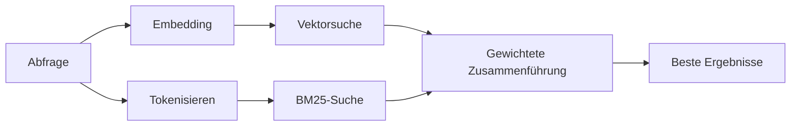

---
read_when:
    - Sie möchten verstehen, wie `memory_search` funktioniert
    - Sie möchten einen Embedding-Provider auswählen
    - Sie möchten die Suchqualität optimieren
summary: Wie die Memory-Suche mit Embeddings und Hybrid-Retrieval relevante Notizen findet
title: Memory-Suche
x-i18n:
    generated_at: "2026-04-05T12:40:14Z"
    model: gpt-5.4
    provider: openai
    source_hash: 87b1cb3469c7805f95bca5e77a02919d1e06d626ad3633bbc5465f6ab9db12a2
    source_path: concepts/memory-search.md
    workflow: 15
---

# Memory-Suche

`memory_search` findet relevante Notizen aus Ihren Memory-Dateien, auch wenn die
Formulierung vom Originaltext abweicht. Dazu wird der Memory-Inhalt in kleine
Chunks indiziert und mit Embeddings, Keywords oder beidem durchsucht.

## Schnelleinstieg

Wenn Sie einen API-Schlüssel für OpenAI, Gemini, Voyage oder Mistral konfiguriert haben, funktioniert die Memory-Suche automatisch. So legen Sie einen Provider explizit fest:

```json5
{
  agents: {
    defaults: {
      memorySearch: {
        provider: "openai", // or "gemini", "local", "ollama", etc.
      },
    },
  },
}
```

Für lokale Embeddings ohne API-Schlüssel verwenden Sie `provider: "local"` (erfordert
`node-llama-cpp`).

## Unterstützte Provider

| Provider | ID        | Benötigt API-Schlüssel | Hinweise                       |
| -------- | --------- | ---------------------- | ------------------------------ |
| OpenAI   | `openai`  | Ja                     | Automatisch erkannt, schnell   |
| Gemini   | `gemini`  | Ja                     | Unterstützt Bild-/Audio-Indizierung |
| Voyage   | `voyage`  | Ja                     | Automatisch erkannt            |
| Mistral  | `mistral` | Ja                     | Automatisch erkannt            |
| Ollama   | `ollama`  | Nein                   | Lokal, muss explizit gesetzt werden |
| Local    | `local`   | Nein                   | GGUF-Modell, Download ca. 0,6 GB |

## So funktioniert die Suche

OpenClaw führt zwei Retrieval-Pfade parallel aus und führt die Ergebnisse zusammen:



- **Vektorsuche** findet Notizen mit ähnlicher Bedeutung („gateway host“ passt zu
  „dem Rechner, auf dem OpenClaw läuft“).
- **BM25-Keyword-Suche** findet exakte Treffer (IDs, Fehlerstrings, Konfigurationsschlüssel).

Wenn nur ein Pfad verfügbar ist (keine Embeddings oder kein FTS), läuft der andere allein.

## Verbesserung der Suchqualität

Zwei optionale Funktionen helfen, wenn Sie einen großen Notizverlauf haben:

### Zeitlicher Abfall

Alte Notizen verlieren nach und nach an Ranking-Gewicht, damit aktuelle Informationen zuerst erscheinen.
Mit der Standard-Halbwertszeit von 30 Tagen erzielt eine Notiz vom letzten Monat 50 % ihres
ursprünglichen Gewichts. Dauerhafte Dateien wie `MEMORY.md` werden nie abgeschwächt.

<Tip>
Aktivieren Sie den zeitlichen Abfall, wenn Ihr Agent monatelange tägliche Notizen hat und veraltete
Informationen immer wieder höher eingestuft werden als aktueller Kontext.
</Tip>

### MMR (Diversität)

Reduziert redundante Ergebnisse. Wenn fünf Notizen alle dieselbe Router-Konfiguration erwähnen, sorgt MMR
dafür, dass die besten Ergebnisse verschiedene Themen abdecken, statt sich zu wiederholen.

<Tip>
Aktivieren Sie MMR, wenn `memory_search` immer wieder nahezu identische Ausschnitte aus
verschiedenen täglichen Notizen zurückgibt.
</Tip>

### Beides aktivieren

```json5
{
  agents: {
    defaults: {
      memorySearch: {
        query: {
          hybrid: {
            mmr: { enabled: true },
            temporalDecay: { enabled: true },
          },
        },
      },
    },
  },
}
```

## Multimodaler Memory

Mit Gemini Embedding 2 können Sie Bilder und Audiodateien zusammen mit
Markdown indizieren. Suchabfragen bleiben textbasiert, werden aber mit visuellen und Audio-Inhalten abgeglichen. Siehe die [Konfigurationsreferenz für Memory](/reference/memory-config) für die
Einrichtung.

## Sitzungsspeicher-Suche

Optional können Sie Sitzungsprotokolle indizieren, damit `memory_search`
frühere Unterhaltungen abrufen kann. Dies ist ein Opt-in über
`memorySearch.experimental.sessionMemory`. Siehe die
[Konfigurationsreferenz](/reference/memory-config) für Details.

## Fehlerbehebung

**Keine Ergebnisse?** Führen Sie `openclaw memory status` aus, um den Index zu prüfen. Wenn er leer ist, führen Sie
`openclaw memory index --force` aus.

**Nur Keyword-Treffer?** Ihr Embedding-Provider ist möglicherweise nicht konfiguriert. Prüfen Sie
`openclaw memory status --deep`.

**CJK-Text wird nicht gefunden?** Erstellen Sie den FTS-Index mit
`openclaw memory index --force` neu.

## Weiterführende Informationen

- [Memory](/concepts/memory) -- Dateilayout, Backends, Tools
- [Konfigurationsreferenz für Memory](/reference/memory-config) -- alle Konfigurationsoptionen
