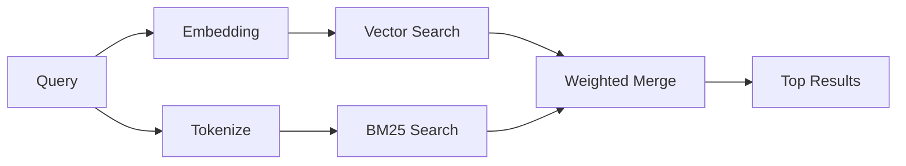

---
read_when:
    - Sie möchten verstehen, wie `memory_search` funktioniert
    - Sie möchten einen Embedding-Anbieter auswählen
    - Sie möchten die Suchqualität optimieren
summary: Wie die Speichersuche mit Embeddings und hybrider Retrieval relevante Notizen findet
title: Speichersuche
x-i18n:
    generated_at: "2026-04-12T23:28:14Z"
    model: gpt-5.4
    provider: openai
    source_hash: 71fde251b7d2dc455574aa458e7e09136f30613609ad8dafeafd53b2729a0310
    source_path: concepts/memory-search.md
    workflow: 15
---

# Speichersuche

`memory_search` findet relevante Notizen aus Ihren Speicherdateien, auch wenn
die Formulierung vom ursprünglichen Text abweicht. Dazu wird der Speicher in
kleine Abschnitte indexiert und diese mithilfe von Embeddings, Schlüsselwörtern oder
beidem durchsucht.

## Schnellstart

Wenn Sie einen OpenAI-, Gemini-, Voyage- oder Mistral-API-Schlüssel konfiguriert haben, funktioniert die
Speichersuche automatisch. Um einen Anbieter explizit festzulegen:

```json5
{
  agents: {
    defaults: {
      memorySearch: {
        provider: "openai", // or "gemini", "local", "ollama", etc.
      },
    },
  },
}
```

Für lokale Embeddings ohne API-Schlüssel verwenden Sie `provider: "local"` (erfordert
node-llama-cpp).

## Unterstützte Anbieter

| Anbieter | ID        | API-Schlüssel erforderlich | Hinweise                                             |
| -------- | --------- | ------------------------- | ---------------------------------------------------- |
| OpenAI   | `openai`  | Ja                        | Automatisch erkannt, schnell                         |
| Gemini   | `gemini`  | Ja                        | Unterstützt Bild-/Audio-Indexierung                  |
| Voyage   | `voyage`  | Ja                        | Automatisch erkannt                                  |
| Mistral  | `mistral` | Ja                        | Automatisch erkannt                                  |
| Bedrock  | `bedrock` | Nein                      | Automatisch erkannt, wenn die AWS-Anmeldeinformationskette aufgelöst wird |
| Ollama   | `ollama`  | Nein                      | Lokal, muss explizit festgelegt werden               |
| Local    | `local`   | Nein                      | GGUF-Modell, Download von ca. 0,6 GB                 |

## So funktioniert die Suche

OpenClaw führt zwei Retrieval-Pfade parallel aus und führt die Ergebnisse zusammen:



- **Vektorsuche** findet Notizen mit ähnlicher Bedeutung („gateway host“ passt zu
  „the machine running OpenClaw“).
- **BM25-Schlüsselwortsuche** findet exakte Übereinstimmungen (IDs, Fehlerzeichenfolgen, Konfigurations-
  schlüssel).

Wenn nur ein Pfad verfügbar ist (keine Embeddings oder kein FTS), wird der andere allein ausgeführt.

Wenn Embeddings nicht verfügbar sind, verwendet OpenClaw weiterhin lexikalisches Ranking über FTS-Ergebnisse, statt nur auf eine rohe Reihenfolge nach exakter Übereinstimmung zurückzufallen. Dieser degradierte Modus hebt Abschnitte mit stärkerer Abdeckung der Suchbegriffe und relevanten Dateipfaden hervor, wodurch der Recall auch ohne `sqlite-vec` oder einen Embedding-Anbieter nützlich bleibt.

## Suchqualität verbessern

Zwei optionale Funktionen helfen, wenn Sie einen großen Notizverlauf haben:

### Zeitlicher Zerfall

Alte Notizen verlieren schrittweise an Ranking-Gewicht, sodass aktuelle Informationen zuerst angezeigt werden.
Mit der Standard-Halbwertszeit von 30 Tagen erreicht eine Notiz vom letzten Monat 50 %
ihres ursprünglichen Gewichts. Dauerhaft relevante Dateien wie `MEMORY.md` unterliegen nie einem Zerfall.

<Tip>
Aktivieren Sie den zeitlichen Zerfall, wenn Ihr Agent tägliche Notizen über mehrere Monate hat und veraltete
Informationen wiederholt aktuellerem Kontext vorgezogen werden.
</Tip>

### MMR (Diversität)

Verringert redundante Ergebnisse. Wenn fünf Notizen alle dieselbe Router-Konfiguration erwähnen, sorgt MMR
dafür, dass die obersten Ergebnisse unterschiedliche Themen abdecken, statt sich zu wiederholen.

<Tip>
Aktivieren Sie MMR, wenn `memory_search` immer wieder nahezu doppelte Ausschnitte aus
verschiedenen täglichen Notizen zurückgibt.
</Tip>

### Beides aktivieren

```json5
{
  agents: {
    defaults: {
      memorySearch: {
        query: {
          hybrid: {
            mmr: { enabled: true },
            temporalDecay: { enabled: true },
          },
        },
      },
    },
  },
}
```

## Multimodaler Speicher

Mit Gemini Embedding 2 können Sie Bilder und Audiodateien zusammen mit
Markdown indexieren. Suchanfragen bleiben Text, aber sie werden mit visuellen und Audio-Inhalten abgeglichen. Siehe die [Referenz zur Speicherkonfiguration](/de/reference/memory-config) für
die Einrichtung.

## Sitzungsspeichersuche

Sie können optional Sitzungsprotokolle indexieren, damit `memory_search`
frühere Gespräche abrufen kann. Dies ist ein Opt-in über
`memorySearch.experimental.sessionMemory`. Weitere Details finden Sie in der
[Konfigurationsreferenz](/de/reference/memory-config).

## Fehlerbehebung

**Keine Ergebnisse?** Führen Sie `openclaw memory status` aus, um den Index zu prüfen. Wenn er leer ist, führen Sie
`openclaw memory index --force` aus.

**Nur Schlüsselworttreffer?** Ihr Embedding-Anbieter ist möglicherweise nicht konfiguriert. Prüfen Sie
`openclaw memory status --deep`.

**CJK-Text wird nicht gefunden?** Erstellen Sie den FTS-Index mit
`openclaw memory index --force` neu.

## Weiterführende Informationen

- [Active Memory](/de/concepts/active-memory) -- Sub-Agent-Speicher für interaktive Chat-Sitzungen
- [Speicher](/de/concepts/memory) -- Dateilayout, Backends, Tools
- [Referenz zur Speicherkonfiguration](/de/reference/memory-config) -- alle Konfigurationsoptionen
