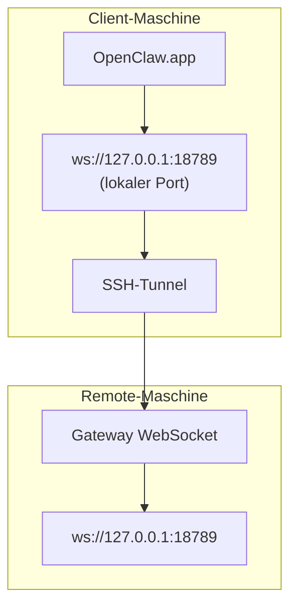

> Dieser Inhalt wurde in [Remote Access](/gateway/remote#macos-persistent-ssh-tunnel-via-launchagent) zusammengeführt. Auf dieser Seite finden Sie den aktuellen Leitfaden.

# OpenClaw.app mit einem Remote-Gateway ausführen

OpenClaw.app verwendet SSH-Tunneling, um sich mit einem Remote-Gateway zu verbinden. Dieser Leitfaden zeigt, wie Sie das einrichten.

## Überblick



## Schnelleinrichtung

### Schritt 1: SSH-Konfiguration hinzufügen

Bearbeiten Sie `~/.ssh/config` und fügen Sie Folgendes hinzu:

```ssh
Host remote-gateway
    HostName <REMOTE_IP>          # z. B. 172.27.187.184
    User <REMOTE_USER>            # z. B. jefferson
    LocalForward 18789 127.0.0.1:18789
    IdentityFile ~/.ssh/id_rsa
```

Ersetzen Sie `<REMOTE_IP>` und `<REMOTE_USER>` durch Ihre Werte.

### Schritt 2: SSH-Schlüssel kopieren

Kopieren Sie Ihren öffentlichen Schlüssel auf die Remote-Maschine (Passwort einmal eingeben):

```bash
ssh-copy-id -i ~/.ssh/id_rsa <REMOTE_USER>@<REMOTE_IP>
```

### Schritt 3: Remote-Gateway-Auth konfigurieren

```bash
openclaw config set gateway.remote.token "<your-token>"
```

Verwenden Sie stattdessen `gateway.remote.password`, wenn Ihr Remote-Gateway Passwort-Auth verwendet.
`OPENCLAW_GATEWAY_TOKEN` ist weiterhin als Überschreibung auf Shell-Ebene gültig, aber das dauerhafte
Remote-Client-Setup ist `gateway.remote.token` / `gateway.remote.password`.

### Schritt 4: SSH-Tunnel starten

```bash
ssh -N remote-gateway &
```

### Schritt 5: OpenClaw.app neu starten

```bash
# OpenClaw.app beenden (⌘Q), dann erneut öffnen:
open /path/to/OpenClaw.app
```

Die App verbindet sich nun über den SSH-Tunnel mit dem Remote-Gateway.

---

## Tunnel beim Login automatisch starten

Um den SSH-Tunnel beim Einloggen automatisch zu starten, erstellen Sie einen Launch Agent.

### Die PLIST-Datei erstellen

Speichern Sie dies als `~/Library/LaunchAgents/ai.openclaw.ssh-tunnel.plist`:

```xml
<?xml version="1.0" encoding="UTF-8"?>
<!DOCTYPE plist PUBLIC "-//Apple//DTD PLIST 1.0//EN" "http://www.apple.com/DTDs/PropertyList-1.0.dtd">
<plist version="1.0">
<dict>
    <key>Label</key>
    <string>ai.openclaw.ssh-tunnel</string>
    <key>ProgramArguments</key>
    <array>
        <string>/usr/bin/ssh</string>
        <string>-N</string>
        <string>remote-gateway</string>
    </array>
    <key>KeepAlive</key>
    <true/>
    <key>RunAtLoad</key>
    <true/>
</dict>
</plist>
```

### Den Launch Agent laden

```bash
launchctl bootstrap gui/$UID ~/Library/LaunchAgents/ai.openclaw.ssh-tunnel.plist
```

Der Tunnel wird nun:

- automatisch gestartet, wenn Sie sich anmelden
- neu gestartet, wenn er abstürzt
- im Hintergrund weiter ausgeführt

Legacy-Hinweis: Entfernen Sie einen eventuell vorhandenen verbleibenden `com.openclaw.ssh-tunnel`-LaunchAgent.

---

## Fehlerbehebung

**Prüfen, ob der Tunnel läuft:**

```bash
ps aux | grep "ssh -N remote-gateway" | grep -v grep
lsof -i :18789
```

**Den Tunnel neu starten:**

```bash
launchctl kickstart -k gui/$UID/ai.openclaw.ssh-tunnel
```

**Den Tunnel stoppen:**

```bash
launchctl bootout gui/$UID/ai.openclaw.ssh-tunnel
```

---

## So funktioniert es

| Komponente                           | Was sie tut                                                  |
| ------------------------------------ | ------------------------------------------------------------ |
| `LocalForward 18789 127.0.0.1:18789` | Leitet lokalen Port 18789 an den Remote-Port 18789 weiter    |
| `ssh -N`                             | SSH ohne Ausführen von Remote-Befehlen (nur Port-Weiterleitung) |
| `KeepAlive`                          | Startet den Tunnel automatisch neu, wenn er abstürzt         |
| `RunAtLoad`                          | Startet den Tunnel, wenn der Agent geladen wird              |

OpenClaw.app verbindet sich mit `ws://127.0.0.1:18789` auf Ihrer Client-Maschine. Der SSH-Tunnel leitet diese Verbindung an Port 18789 auf der Remote-Maschine weiter, auf der das Gateway läuft.
