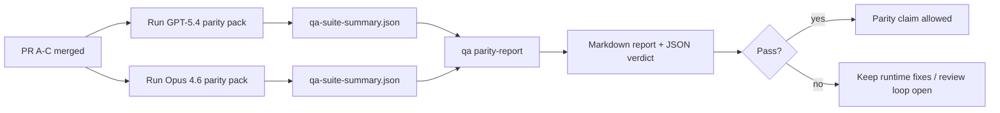

---
read_when:
    - Die PR-Serie zur GPT-5.4-/Codex-Parität prüfen
    - Die agentische Sechs-Vertrags-Architektur hinter dem Paritätsprogramm pflegen
summary: Wie das GPT-5.4-/Codex-Paritätsprogramm als vier Merge-Einheiten überprüft wird
title: Hinweise für Maintainer zur GPT-5.4-/Codex-Parität
x-i18n:
    generated_at: "2026-04-24T06:41:26Z"
    model: gpt-5.4
    provider: openai
    source_hash: 803b62bf5bb6b00125f424fa733e743ecdec7f8410dec0782096f9d1ddbed6c0
    source_path: help/gpt54-codex-agentic-parity-maintainers.md
    workflow: 15
---

Diese Notiz erklärt, wie das GPT-5.4-/Codex-Paritätsprogramm als vier Merge-Einheiten geprüft werden kann, ohne die ursprüngliche agentische Sechs-Vertrags-Architektur aus dem Blick zu verlieren.

## Merge-Einheiten

### PR A: strikt-agentische Ausführung

Verantwortet:

- `executionContract`
- GPT-5-first-Follow-through im selben Turn
- `update_plan` als nicht-terminales Fortschrittstracking
- explizite Blocked-Zustände statt stiller Stopps nur mit Plan

Verantwortet nicht:

- Klassifizierung von Auth-/Laufzeitfehlern
- Wahrhaftigkeit bei Berechtigungen
- Neugestaltung von Replay/Fortsetzung
- Paritäts-Benchmarking

### PR B: Wahrhaftigkeit der Laufzeit

Verantwortet:

- Korrektheit des OAuth-Scopes von Codex
- typisierte Klassifizierung von Provider-/Laufzeitfehlern
- wahrheitsgemäße Verfügbarkeit von `/elevated full` und Blockierungsgründen

Verantwortet nicht:

- Normalisierung von Tool-Schemas
- Replay-/Liveness-Status
- Benchmark-Gating

### PR C: Korrektheit der Ausführung

Verantwortet:

- provider-eigene Kompatibilität von OpenAI-/Codex-Tools
- parameterfreie strikte Schema-Behandlung
- Sichtbarmachung von `replay-invalid`
- Sichtbarkeit von Zuständen bei pausierten, blockierten und aufgegebenen Langläufen

Verantwortet nicht:

- selbstgewählte Fortsetzung
- generisches Codex-Dialektverhalten außerhalb von Provider-Hooks
- Benchmark-Gating

### PR D: Paritäts-Harness

Verantwortet:

- erstes Szenariopaket für GPT-5.4 vs. Opus 4.6
- Paritätsdokumentation
- Paritätsbericht und Release-Gate-Mechanik

Verantwortet nicht:

- Änderungen am Laufzeitverhalten außerhalb von QA Lab
- Auth-/Proxy-/DNS-Simulation innerhalb des Harness

## Zuordnung zurück zu den ursprünglichen sechs Verträgen

| Ursprünglicher Vertrag                   | Merge-Einheit |
| ---------------------------------------- | ------------- |
| Korrektheit von Provider-Transport/Auth  | PR B          |
| Tool-Vertrag/Schemakompatibilität        | PR C          |
| Ausführung im selben Turn                | PR A          |
| Wahrhaftigkeit bei Berechtigungen        | PR B          |
| Korrektheit von Replay/Fortsetzung/Liveness | PR C       |
| Benchmark-/Release-Gate                  | PR D          |

## Reihenfolge der Prüfung

1. PR A
2. PR B
3. PR C
4. PR D

PR D ist die Nachweisschicht. Es sollte nicht der Grund sein, warum PRs zur Laufzeitkorrektheit verzögert werden.

## Worauf zu achten ist

### PR A

- GPT-5-Läufe handeln oder schlagen geschlossen fehl, statt bei Kommentaren stehenzubleiben
- `update_plan` wirkt nicht mehr für sich allein wie Fortschritt
- das Verhalten bleibt GPT-5-first und auf eingebettete Pi beschränkt

### PR B

- Auth-/Proxy-/Laufzeitfehler fallen nicht mehr in generische Behandlung vom Typ „model failed“ zusammen
- `/elevated full` wird nur dann als verfügbar beschrieben, wenn es tatsächlich verfügbar ist
- Blockierungsgründe sind sowohl für das Modell als auch für die benutzerseitige Laufzeit sichtbar

### PR C

- strikte OpenAI-/Codex-Toolregistrierung verhält sich vorhersehbar
- parameterfreie Tools scheitern nicht an strikten Schema-Prüfungen
- Ergebnisse von Replay und Compaction bewahren einen wahrheitsgemäßen Liveness-Status

### PR D

- das Szenariopaket ist verständlich und reproduzierbar
- das Paket enthält eine mutierende Replay-Safety-Lane, nicht nur schreibgeschützte Abläufe
- Berichte sind für Menschen und Automatisierung lesbar
- Paritätsbehauptungen sind durch Nachweise gestützt, nicht anekdotisch

Erwartete Artefakte aus PR D:

- `qa-suite-report.md` / `qa-suite-summary.json` für jeden Modelllauf
- `qa-agentic-parity-report.md` mit aggregiertem und szenariobezogenem Vergleich
- `qa-agentic-parity-summary.json` mit maschinenlesbarem Urteil

## Release-Gate

Behaupten Sie keine Parität oder Überlegenheit von GPT-5.4 gegenüber Opus 4.6, bevor nicht:

- PR A, PR B und PR C gemergt sind
- PR D das erste Paritätspaket sauber durchläuft
- Regression-Suites zur Wahrhaftigkeit der Laufzeit grün bleiben
- der Paritätsbericht keine Fälle von Scheinerfolg und keine Regression beim Stoppverhalten zeigt

Das Paritäts-Harness ist nicht die einzige Nachweisquelle. Halten Sie diese Trennung in der Prüfung explizit:

- PR D verantwortet den szenariobasierten Vergleich GPT-5.4 vs. Opus 4.6
- deterministische Suites aus PR B verantworten weiterhin Nachweise zu Auth/Proxy/DNS und Wahrhaftigkeit beim Vollzugriff

## Zuordnung von Ziel zu Nachweis

| Element des Completion-Gates             | Primärer Owner | Prüfartefakt                                                         |
| ---------------------------------------- | -------------- | -------------------------------------------------------------------- |
| Keine Stopps nur mit Plan                | PR A           | strikt-agentische Laufzeittests und `approval-turn-tool-followthrough` |
| Kein Scheinerfolg und keine falsche Tool-Completion | PR A + PR D | Anzahl von Scheinerfolgen in der Parität plus szenariobezogene Berichtsdetails |
| Keine falschen Hinweise zu `/elevated full` | PR B        | deterministische Suites zur Wahrhaftigkeit der Laufzeit             |
| Replay-/Liveness-Fehler bleiben explizit | PR C + PR D   | Lifecycle-/Replay-Suites plus `compaction-retry-mutating-tool`       |
| GPT-5.4 entspricht Opus 4.6 oder übertrifft es | PR D     | `qa-agentic-parity-report.md` und `qa-agentic-parity-summary.json`  |

## Kurzform für Reviewer: vorher vs. nachher

| Benutzerseitiges Problem vorher                              | Prüfsignal nachher                                                                        |
| ------------------------------------------------------------ | ----------------------------------------------------------------------------------------- |
| GPT-5.4 stoppte nach dem Planen                              | PR A zeigt Verhalten nach dem Muster handeln-oder-blockieren statt Abschluss nur mit Kommentar |
| Tool-Nutzung wirkte mit strikten OpenAI-/Codex-Schemas fragil | PR C hält Tool-Registrierung und parameterfreien Aufruf vorhersehbar                     |
| Hinweise zu `/elevated full` waren manchmal irreführend      | PR B bindet Hinweise an tatsächliche Laufzeitfähigkeit und Blockierungsgründe             |
| Lange Aufgaben konnten in Replay-/Compaction-Mehrdeutigkeit verschwinden | PR C gibt explizite Zustände für pausiert, blockiert, aufgegeben und replay-invalid aus |
| Paritätsbehauptungen waren anekdotisch                       | PR D erzeugt einen Bericht plus JSON-Urteil mit derselben Szenarioabdeckung für beide Modelle |

## Verwandt

- [GPT-5.4 / Codex agentic parity](/de/help/gpt54-codex-agentic-parity)
