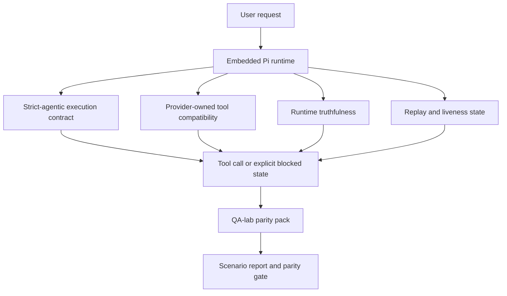
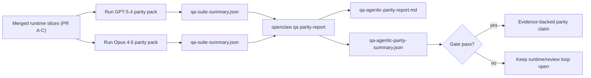

---
read_when:
    - Verhalten von GPT-5.4 oder Codex-Agenten debuggen.
    - Vergleich des agentischen Verhaltens von OpenClaw über Frontier-Modelle hinweg.
    - Prüfung der Korrekturen für `strict-agentic`, Tool-Schema, erhöhte Rechte und Replay.
summary: Wie OpenClaw agentische Ausführungslücken für GPT-5.4- und Codex-ähnliche Modelle schließt
title: GPT-5.4-/Codex-Agentic-Parität
x-i18n:
    generated_at: "2026-04-24T06:41:46Z"
    model: gpt-5.4
    provider: openai
    source_hash: 9f8c7dcf21583e6dbac80da9ddd75f2dc9af9b80801072ade8fa14b04258d4dc
    source_path: help/gpt54-codex-agentic-parity.md
    workflow: 15
---

# GPT-5.4 / Codex Agentic Parity in OpenClaw

OpenClaw funktionierte bereits gut mit Tool-verwendenden Frontier-Modellen, aber GPT-5.4 und Codex-ähnliche Modelle schnitten in einigen praktischen Punkten noch schlechter ab:

- sie konnten nach der Planung aufhören, statt die Arbeit zu erledigen
- sie konnten strikte OpenAI-/Codex-Tool-Schemas falsch verwenden
- sie konnten nach `/elevated full` fragen, selbst wenn voller Zugriff unmöglich war
- sie konnten den Zustand langlaufender Aufgaben während Replay oder Compaction verlieren
- Paritätsbehauptungen gegenüber Claude Opus 4.6 stützten sich auf Anekdoten statt auf wiederholbare Szenarien

Dieses Paritätsprogramm schließt diese Lücken in vier überprüfbaren Teilabschnitten.

## Was sich geändert hat

### PR A: `strict-agentic`-Ausführung

Dieser Abschnitt fügt einen opt-in-Ausführungsvertrag `strict-agentic` für eingebettete Pi-GPT-5-Läufe hinzu.

Wenn er aktiviert ist, akzeptiert OpenClaw keine rein planerischen Turns mehr als „gut genug“ abgeschlossen. Wenn das Modell nur sagt, was es tun möchte, aber tatsächlich keine Tools verwendet oder Fortschritt macht, versucht OpenClaw es mit einem lenkenden „jetzt handeln“-Impuls erneut und schlägt dann fail-closed mit einem expliziten blockierten Zustand fehl, statt die Aufgabe stillschweigend zu beenden.

Das verbessert die Erfahrung mit GPT-5.4 besonders bei:

- kurzen „ok mach es“-Folgeturns
- Code-Aufgaben, bei denen der erste Schritt offensichtlich ist
- Abläufen, bei denen `update_plan` Fortschrittsverfolgung statt Fülltext sein sollte

### PR B: Wahrhaftigkeit der Runtime

Dieser Abschnitt sorgt dafür, dass OpenClaw bei zwei Dingen die Wahrheit sagt:

- warum der Provider-/Runtime-Aufruf fehlgeschlagen ist
- ob `/elevated full` tatsächlich verfügbar ist

Das bedeutet, dass GPT-5.4 bessere Runtime-Signale für fehlende Scopes, Fehler bei Auth-Refresh, HTML-403-Auth-Fehler, Proxy-Probleme, DNS- oder Timeout-Fehler sowie blockierte Vollzugriffsmodi erhält. Das Modell halluziniert dadurch seltener die falsche Abhilfe oder fragt weiter nach einem Berechtigungsmodus, den die Runtime gar nicht bereitstellen kann.

### PR C: Korrektheit der Ausführung

Dieser Abschnitt verbessert zwei Arten von Korrektheit:

- providerverwaltete Kompatibilität von OpenAI-/Codex-Tool-Schemas
- Sichtbarkeit von Replay und Lebenszeichen langlaufender Aufgaben

Die Arbeiten zur Tool-Kompatibilität reduzieren Schema-Reibung bei strikter OpenAI-/Codex-Tool-Registrierung, insbesondere bei parameterlosen Tools und strikten Erwartungen an die Objektwurzel. Die Arbeiten zu Replay/Liveness machen langlaufende Aufgaben besser beobachtbar, sodass pausierte, blockierte und aufgegebene Zustände sichtbar werden, statt in generischem Fehlertext zu verschwinden.

### PR D: Parity-Harness

Dieser Abschnitt fügt das erste QA-lab-Parity-Pack hinzu, sodass GPT-5.4 und Opus 4.6 durch dieselben Szenarien ausgeführt und anhand gemeinsamer Evidenz verglichen werden können.

Das Parity-Pack ist die Beweisschicht. Es verändert das Runtime-Verhalten selbst nicht.

Sobald Sie zwei Artefakte `qa-suite-summary.json` haben, generieren Sie den Release-Gate-Vergleich mit:

```bash
pnpm openclaw qa parity-report \
  --repo-root . \
  --candidate-summary .artifacts/qa-e2e/gpt54/qa-suite-summary.json \
  --baseline-summary .artifacts/qa-e2e/opus46/qa-suite-summary.json \
  --output-dir .artifacts/qa-e2e/parity
```

Dieser Befehl schreibt:

- einen menschenlesbaren Markdown-Bericht
- ein maschinenlesbares JSON-Urteil
- ein explizites Gate-Ergebnis `pass` / `fail`

## Warum das GPT-5.4 in der Praxis verbessert

Vor dieser Arbeit konnte sich GPT-5.4 auf OpenClaw in echten Coding-Sitzungen weniger agentisch anfühlen als Opus, weil die Runtime Verhaltensweisen tolerierte, die für Modelle im Stil von GPT-5 besonders schädlich sind:

- Turns nur mit Kommentaren
- Schema-Reibung bei Tools
- vages Feedback zu Berechtigungen
- stille Brüche bei Replay oder Compaction

Das Ziel ist nicht, GPT-5.4 dazu zu bringen, Opus zu imitieren. Das Ziel ist, GPT-5.4 einen Runtime-Vertrag zu geben, der echten Fortschritt belohnt, sauberere Tool- und Berechtigungssemantik liefert und Fehlermodi in explizite maschinen- und menschenlesbare Zustände verwandelt.

Das verändert die Benutzererfahrung von:

- „das Modell hatte einen guten Plan, hat aber aufgehört“

zu:

- „das Modell hat entweder gehandelt, oder OpenClaw hat den genauen Grund angezeigt, warum es nicht konnte“

## Vorher vs. nachher für GPT-5.4-Benutzer

| Vor diesem Programm                                                                        | Nach PR A-D                                                                              |
| ------------------------------------------------------------------------------------------ | ---------------------------------------------------------------------------------------- |
| GPT-5.4 konnte nach einem vernünftigen Plan aufhören, ohne den nächsten Tool-Schritt zu nehmen | PR A verwandelt „nur Plan“ in „jetzt handeln oder einen blockierten Zustand anzeigen“ |
| Strikte Tool-Schemas konnten parameterlose oder OpenAI-/Codex-geformte Tools auf verwirrende Weise ablehnen | PR C macht providerverwaltete Tool-Registrierung und -Aufrufe vorhersehbarer |
| Hinweise zu `/elevated full` konnten in blockierten Runtimes vage oder falsch sein        | PR B gibt GPT-5.4 und dem Benutzer wahrheitsgemäße Runtime- und Berechtigungshinweise |
| Replay- oder Compaction-Fehler konnten sich so anfühlen, als verschwände die Aufgabe stillschweigend | PR C macht pausierte, blockierte, aufgegebene und replay-ungültige Ergebnisse explizit sichtbar |
| „GPT-5.4 fühlt sich schlechter an als Opus“ war größtenteils anekdotisch                  | PR D verwandelt das in dasselbe Szenario-Pack, dieselben Metriken und ein hartes Pass/Fail-Gate |

## Architektur



## Release-Ablauf



## Szenario-Pack

Das Parity-Pack der ersten Welle deckt derzeit fünf Szenarien ab:

### `approval-turn-tool-followthrough`

Prüft, dass das Modell nach einer kurzen Freigabe nicht bei „Ich mache das“ stehenbleibt. Es sollte im selben Turn die erste konkrete Aktion ausführen.

### `model-switch-tool-continuity`

Prüft, dass Tool-verwendende Arbeit über Grenzen von Modell-/Runtime-Wechseln hinweg kohärent bleibt, statt in Kommentare zurückzufallen oder den Ausführungskontext zu verlieren.

### `source-docs-discovery-report`

Prüft, dass das Modell Source und Dokumentation lesen, Findings synthetisieren und die Aufgabe agentisch fortsetzen kann, statt eine dünne Zusammenfassung zu erzeugen und früh aufzuhören.

### `image-understanding-attachment`

Prüft, dass Mixed-Mode-Aufgaben mit Anhängen handlungsfähig bleiben und nicht in vage Erzählung zusammenbrechen.

### `compaction-retry-mutating-tool`

Prüft, dass eine Aufgabe mit einer echten mutierenden Schreiboperation Replay-Unsicherheit explizit hält, statt stillschweigend replay-sicher zu wirken, wenn der Lauf kompakt wird, neu versucht wird oder unter Druck Antwortzustand verliert.

## Szenario-Matrix

| Szenario                           | Was es testet                            | Gutes Verhalten von GPT-5.4                                                   | Fehlersignal                                                                    |
| ---------------------------------- | ---------------------------------------- | ----------------------------------------------------------------------------- | ------------------------------------------------------------------------------- |
| `approval-turn-tool-followthrough` | Kurze Freigabe-Turns nach einem Plan     | Startet sofort die erste konkrete Tool-Aktion, statt die Absicht zu wiederholen | Plan-only-Folgeturn, keine Tool-Aktivität oder blockierter Turn ohne echten Blocker |
| `model-switch-tool-continuity`     | Runtime-/Modellwechsel unter Tool-Nutzung | Behält Aufgabenkontext bei und handelt kohärent weiter                        | fällt in Kommentare zurück, verliert Tool-Kontext oder stoppt nach dem Wechsel |
| `source-docs-discovery-report`     | Source lesen + synthetisieren + handeln  | Findet Sources, verwendet Tools und erstellt einen nützlichen Bericht, ohne zu stocken | dünne Zusammenfassung, fehlende Tool-Arbeit oder Stop bei unvollständigem Turn |
| `image-understanding-attachment`   | agentische Arbeit, getrieben durch Anhänge | Interpretiert den Anhang, verbindet ihn mit Tools und setzt die Aufgabe fort | vage Erzählung, Anhang ignoriert oder keine konkrete nächste Aktion |
| `compaction-retry-mutating-tool`   | mutierende Arbeit unter Compaction-Druck | Führt einen echten Schreibvorgang aus und hält Replay-Unsicherheit nach dem Seiteneffekt explizit | mutierender Schreibvorgang passiert, aber Replay-Sicherheit wird impliziert, fehlt oder ist widersprüchlich |

## Release-Gate

GPT-5.4 kann nur dann als auf Parität oder besser angesehen werden, wenn die gemergte Runtime gleichzeitig das Parity-Pack und die Regressionen zur Wahrhaftigkeit der Runtime besteht.

Erforderliche Ergebnisse:

- kein Plan-only-Stall, wenn die nächste Tool-Aktion klar ist
- kein Fake-Abschluss ohne echte Ausführung
- keine falschen Hinweise zu `/elevated full`
- keine stille Aufgabe bei Replay- oder Compaction-Abbruch
- Metriken des Parity-Packs, die mindestens so stark sind wie die vereinbarte Opus-4.6-Baseline

Für die Harness der ersten Welle vergleicht das Gate:

- Completion-Rate
- Rate unbeabsichtigter Stopps
- Rate gültiger Tool-Aufrufe
- Anzahl von Fake-Success

Paritätsevidenz wird absichtlich auf zwei Ebenen aufgeteilt:

- PR D beweist mit QA-lab dasselbe Szenarioverhalten von GPT-5.4 vs. Opus 4.6
- die deterministischen Suiten aus PR B beweisen Wahrhaftigkeit bei Auth, Proxy, DNS und `/elevated full` außerhalb der Harness

## Ziel-zu-Evidenz-Matrix

| Element des Completion-Gates                               | Verantwortliche PR | Evidenzquelle                                                     | Pass-Signal                                                                              |
| ---------------------------------------------------------- | ------------------ | ----------------------------------------------------------------- | ---------------------------------------------------------------------------------------- |
| GPT-5.4 stockt nach der Planung nicht mehr                 | PR A               | `approval-turn-tool-followthrough` plus Runtime-Suiten aus PR A   | Freigabe-Turns lösen echte Arbeit oder einen expliziten blockierten Zustand aus         |
| GPT-5.4 täuscht keinen Fortschritt oder Tool-Abschluss mehr vor | PR A + PR D     | Ergebnisse aus Parity-Berichtsszenarien und Anzahl Fake-Success   | keine verdächtigen Pass-Ergebnisse und kein Abschluss nur durch Kommentare               |
| GPT-5.4 gibt keine falschen Hinweise zu `/elevated full` mehr | PR B            | deterministische Suiten zur Wahrhaftigkeit                        | Blockgründe und Hinweise auf Vollzugriff bleiben runtime-genau                           |
| Replay-/Liveness-Fehler bleiben explizit                   | PR C + PR D        | Lifecycle-/Replay-Suiten aus PR C plus `compaction-retry-mutating-tool` | mutierende Arbeit hält Replay-Unsicherheit explizit, statt stillschweigend zu verschwinden |
| GPT-5.4 entspricht oder übertrifft Opus 4.6 bei den vereinbarten Metriken | PR D | `qa-agentic-parity-report.md` und `qa-agentic-parity-summary.json` | dieselbe Szenarioabdeckung und keine Regression bei Completion, Stoppverhalten oder gültiger Tool-Nutzung |

## So lesen Sie das Paritätsurteil

Verwenden Sie das Urteil in `qa-agentic-parity-summary.json` als finale maschinenlesbare Entscheidung für das Parity-Pack der ersten Welle.

- `pass` bedeutet, dass GPT-5.4 dieselben Szenarien wie Opus 4.6 abgedeckt hat und bei den vereinbarten aggregierten Metriken nicht regressiert ist.
- `fail` bedeutet, dass mindestens ein hartes Gate ausgelöst wurde: schwächere Completion, schlechtere unbeabsichtigte Stopps, schwächere gültige Tool-Nutzung, irgendein Fake-Success-Fall oder nicht übereinstimmende Szenarioabdeckung.
- „shared/base CI issue“ ist für sich genommen kein Paritätsergebnis. Wenn CI-Rauschen außerhalb von PR D einen Lauf blockiert, sollte das Urteil auf eine saubere Ausführung der gemergten Runtime warten, statt aus Logs aus Branch-Zeiten abgeleitet zu werden.
- Wahrhaftigkeit bei Auth, Proxy, DNS und `/elevated full` kommt weiterhin aus den deterministischen Suiten von PR B, daher benötigt die finale Release-Behauptung beides: ein bestehendes Paritätsurteil aus PR D und grüne Abdeckung der Wahrhaftigkeit aus PR B.

## Wer `strict-agentic` aktivieren sollte

Verwenden Sie `strict-agentic`, wenn:

- vom Agent erwartet wird, sofort zu handeln, wenn ein nächster Schritt offensichtlich ist
- Modelle der GPT-5.4- oder Codex-Familie die primäre Runtime sind
- Sie explizite blockierte Zustände gegenüber „hilfreichen“ Antworten bevorzugen, die nur den bisherigen Stand zusammenfassen

Behalten Sie den Standardvertrag bei, wenn:

- Sie das bisherige lockerere Verhalten möchten
- Sie keine Modelle der GPT-5-Familie verwenden
- Sie Prompts statt Runtime-Enforcement testen

## Verwandt

- [GPT-5.4 / Codex parity maintainer notes](/de/help/gpt54-codex-agentic-parity-maintainers)
