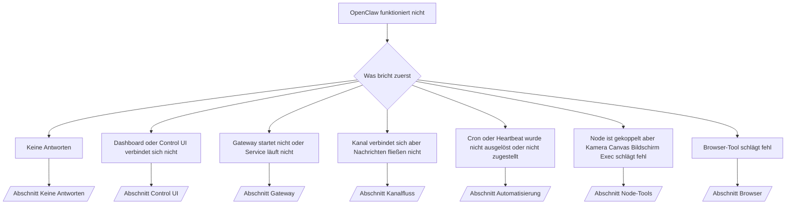

---
read_when:
    - OpenClaw funktioniert nicht und Sie brauchen den schnellsten Weg zur Lösung
    - Sie möchten einen Triage-Ablauf, bevor Sie in tiefe Runbooks einsteigen
summary: Symptomorientierter Fehlerbehebungs-Hub für OpenClaw
title: Allgemeine Fehlerbehebung
x-i18n:
    generated_at: "2026-04-05T12:45:31Z"
    model: gpt-5.4
    provider: openai
    source_hash: 23ae9638af5edf5a5e0584ccb15ba404223ac3b16c2d62eb93b2c9dac171c252
    source_path: help/troubleshooting.md
    workflow: 15
---

# Fehlerbehebung

Wenn Sie nur 2 Minuten haben, verwenden Sie diese Seite als Triage-Einstiegspunkt.

## Die ersten 60 Sekunden

Führen Sie genau diese Abfolge in dieser Reihenfolge aus:

```bash
openclaw status
openclaw status --all
openclaw gateway probe
openclaw gateway status
openclaw doctor
openclaw channels status --probe
openclaw logs --follow
```

Gute Ausgabe in einer Zeile:

- `openclaw status` → zeigt konfigurierte Kanäle und keine offensichtlichen Auth-Fehler.
- `openclaw status --all` → vollständiger Bericht ist vorhanden und teilbar.
- `openclaw gateway probe` → erwartetes Gateway-Ziel ist erreichbar (`Reachable: yes`). `RPC: limited - missing scope: operator.read` bedeutet eingeschränkte Diagnose, nicht einen Verbindungsfehler.
- `openclaw gateway status` → `Runtime: running` und `RPC probe: ok`.
- `openclaw doctor` → keine blockierenden Konfigurations-/Service-Fehler.
- `openclaw channels status --probe` → bei erreichbarem Gateway gibt der Befehl Live-Transportstatus pro Account sowie Probe-/Audit-Ergebnisse wie `works` oder `audit ok` zurück; wenn das Gateway nicht erreichbar ist, fällt der Befehl auf reine Konfigurationszusammenfassungen zurück.
- `openclaw logs --follow` → stetige Aktivität, keine sich wiederholenden fatalen Fehler.

## Anthropic Long-Context-429

Wenn Sie Folgendes sehen:
`HTTP 429: rate_limit_error: Extra usage is required for long context requests`,
gehen Sie zu [/gateway/troubleshooting#anthropic-429-extra-usage-required-for-long-context](/gateway/troubleshooting#anthropic-429-extra-usage-required-for-long-context).

## Plugin-Installation schlägt fehl mit fehlenden openclaw-Erweiterungen

Wenn die Installation mit `package.json missing openclaw.extensions` fehlschlägt, verwendet das Plugin-Paket
eine alte Form, die OpenClaw nicht mehr akzeptiert.

Korrektur im Plugin-Paket:

1. Fügen Sie `openclaw.extensions` zu `package.json` hinzu.
2. Lassen Sie die Einträge auf gebaute Laufzeitdateien zeigen (normalerweise `./dist/index.js`).
3. Veröffentlichen Sie das Plugin erneut und führen Sie `openclaw plugins install <package>` noch einmal aus.

Beispiel:

```json
{
  "name": "@openclaw/my-plugin",
  "version": "1.2.3",
  "openclaw": {
    "extensions": ["./dist/index.js"]
  }
}
```

Referenz: [Plugin-Architektur](/plugins/architecture)

## Entscheidungsbaum



<AccordionGroup>
  <Accordion title="Keine Antworten">
    ```bash
    openclaw status
    openclaw gateway status
    openclaw channels status --probe
    openclaw pairing list --channel <channel> [--account <id>]
    openclaw logs --follow
    ```

    Gute Ausgabe sieht so aus:

    - `Runtime: running`
    - `RPC probe: ok`
    - Ihr Kanal zeigt verbundenen Transport und, wo unterstützt, `works` oder `audit ok` in `channels status --probe`
    - Absender erscheint als genehmigt (oder DM-Richtlinie ist open/allowlist)

    Häufige Log-Signaturen:

    - `drop guild message (mention required` → Mention-Gating hat die Nachricht in Discord blockiert.
    - `pairing request` → Absender ist nicht genehmigt und wartet auf DM-Pairing-Genehmigung.
    - `blocked` / `allowlist` in Kanal-Logs → Absender, Raum oder Gruppe wird gefiltert.

    Tiefere Seiten:

    - [/gateway/troubleshooting#no-replies](/gateway/troubleshooting#no-replies)
    - [/channels/troubleshooting](/channels/troubleshooting)
    - [/channels/pairing](/channels/pairing)

  </Accordion>

  <Accordion title="Dashboard oder Control UI verbindet sich nicht">
    ```bash
    openclaw status
    openclaw gateway status
    openclaw logs --follow
    openclaw doctor
    openclaw channels status --probe
    ```

    Gute Ausgabe sieht so aus:

    - `Dashboard: http://...` wird in `openclaw gateway status` angezeigt
    - `RPC probe: ok`
    - Keine Auth-Schleife in den Logs

    Häufige Log-Signaturen:

    - `device identity required` → HTTP-/unsicherer Kontext kann Device-Auth nicht abschließen.
    - `origin not allowed` → Browser-`Origin` ist für das Control-UI-
      Gateway-Ziel nicht erlaubt.
    - `AUTH_TOKEN_MISMATCH` mit Retry-Hinweisen (`canRetryWithDeviceToken=true`) → ein vertrauenswürdiger Retry mit Device-Token kann automatisch erfolgen.
    - Dieser Retry mit gecachtem Token verwendet den gecachten Scope-Satz erneut, der mit dem gepaarten
      Device-Token gespeichert ist. Aufrufer mit explizitem `deviceToken` / expliziten `scopes` behalten stattdessen
      ihren angeforderten Scope-Satz.
    - Auf dem asynchronen Tailscale-Serve-Control-UI-Pfad werden fehlgeschlagene Versuche für dasselbe
      `{scope, ip}` serialisiert, bevor der Limiter den Fehler aufzeichnet, sodass ein zweiter gleichzeitiger fehlerhafter Retry bereits `retry later` anzeigen kann.
    - `too many failed authentication attempts (retry later)` von einem localhost-
      Browser-Origin → wiederholte Fehler von derselben `Origin` werden vorübergehend
      ausgesperrt; ein anderer localhost-Origin verwendet einen separaten Bucket.
    - wiederholtes `unauthorized` nach diesem Retry → falsches Token/Passwort, nicht passender Auth-Modus oder veraltetes gepaartes Device-Token.
    - `gateway connect failed:` → UI zielt auf die falsche URL/den falschen Port oder das Gateway ist nicht erreichbar.

    Tiefere Seiten:

    - [/gateway/troubleshooting#dashboard-control-ui-connectivity](/gateway/troubleshooting#dashboard-control-ui-connectivity)
    - [/web/control-ui](/web/control-ui)
    - [/gateway/authentication](/gateway/authentication)

  </Accordion>

  <Accordion title="Gateway startet nicht oder Service ist installiert, läuft aber nicht">
    ```bash
    openclaw status
    openclaw gateway status
    openclaw logs --follow
    openclaw doctor
    openclaw channels status --probe
    ```

    Gute Ausgabe sieht so aus:

    - `Service: ... (loaded)`
    - `Runtime: running`
    - `RPC probe: ok`

    Häufige Log-Signaturen:

    - `Gateway start blocked: set gateway.mode=local` oder `existing config is missing gateway.mode` → Gateway-Modus ist remote, oder der Konfigurationsdatei fehlt die lokale Modus-Markierung und sie sollte repariert werden.
    - `refusing to bind gateway ... without auth` → Nicht-Loopback-Bind ohne gültigen Gateway-Auth-Pfad (Token/Passwort oder trusted-proxy, wo konfiguriert).
    - `another gateway instance is already listening` oder `EADDRINUSE` → Port bereits belegt.

    Tiefere Seiten:

    - [/gateway/troubleshooting#gateway-service-not-running](/gateway/troubleshooting#gateway-service-not-running)
    - [/gateway/background-process](/gateway/background-process)
    - [/gateway/configuration](/gateway/configuration)

  </Accordion>

  <Accordion title="Kanal verbindet sich aber Nachrichten fließen nicht">
    ```bash
    openclaw status
    openclaw gateway status
    openclaw logs --follow
    openclaw doctor
    openclaw channels status --probe
    ```

    Gute Ausgabe sieht so aus:

    - Kanaltransport ist verbunden.
    - Pairing-/Allowlist-Prüfungen bestehen.
    - Erwähnungen werden erkannt, wo sie erforderlich sind.

    Häufige Log-Signaturen:

    - `mention required` → Mention-Gating hat die Verarbeitung in der Gruppe blockiert.
    - `pairing` / `pending` → DM-Absender ist noch nicht genehmigt.
    - `not_in_channel`, `missing_scope`, `Forbidden`, `401/403` → Problem mit Kanalberechtigungen oder Token.

    Tiefere Seiten:

    - [/gateway/troubleshooting#channel-connected-messages-not-flowing](/gateway/troubleshooting#channel-connected-messages-not-flowing)
    - [/channels/troubleshooting](/channels/troubleshooting)

  </Accordion>

  <Accordion title="Cron oder Heartbeat wurde nicht ausgelöst oder nicht zugestellt">
    ```bash
    openclaw status
    openclaw gateway status
    openclaw cron status
    openclaw cron list
    openclaw cron runs --id <jobId> --limit 20
    openclaw logs --follow
    ```

    Gute Ausgabe sieht so aus:

    - `cron.status` zeigt aktiviert mit nächstem Wake.
    - `cron runs` zeigt aktuelle `ok`-Einträge.
    - Heartbeat ist aktiviert und nicht außerhalb der aktiven Stunden.

    Häufige Log-Signaturen:

- `cron: scheduler disabled; jobs will not run automatically` → Cron ist deaktiviert.
- `heartbeat skipped` mit `reason=quiet-hours` → außerhalb der konfigurierten aktiven Stunden.
- `heartbeat skipped` mit `reason=empty-heartbeat-file` → `HEARTBEAT.md` existiert, enthält aber nur leere/Header-only-Vorlage.
- `heartbeat skipped` mit `reason=no-tasks-due` → Heartbeat-Task-Modus ist aktiv, aber keines der Aufgabenintervalle ist bereits fällig.
- `heartbeat skipped` mit `reason=alerts-disabled` → gesamte Heartbeat-Sichtbarkeit ist deaktiviert (`showOk`, `showAlerts` und `useIndicator` sind alle aus).
- `requests-in-flight` → Hauptspur ist beschäftigt; Heartbeat-Wake wurde verschoben.
- `unknown accountId` → Account für das Heartbeat-Zustellziel existiert nicht.

      Tiefere Seiten:

      - [/gateway/troubleshooting#cron-and-heartbeat-delivery](/gateway/troubleshooting#cron-and-heartbeat-delivery)
      - [/automation/cron-jobs#troubleshooting](/automation/cron-jobs#troubleshooting)
      - [/gateway/heartbeat](/gateway/heartbeat)

    </Accordion>

    <Accordion title="Node ist gekoppelt aber Tool schlägt fehl bei Kamera Canvas Bildschirm Exec">
      ```bash
      openclaw status
      openclaw gateway status
      openclaw nodes status
      openclaw nodes describe --node <idOrNameOrIp>
      openclaw logs --follow
      ```

      Gute Ausgabe sieht so aus:

      - Node ist als verbunden und gepaart für Rolle `node` gelistet.
      - Capability existiert für den Befehl, den Sie aufrufen.
      - Berechtigungsstatus ist für das Tool gewährt.

      Häufige Log-Signaturen:

      - `NODE_BACKGROUND_UNAVAILABLE` → Node-App in den Vordergrund bringen.
      - `*_PERMISSION_REQUIRED` → OS-Berechtigung wurde verweigert/fehlt.
      - `SYSTEM_RUN_DENIED: approval required` → Exec-Genehmigung steht aus.
      - `SYSTEM_RUN_DENIED: allowlist miss` → Befehl steht nicht auf der Exec-Allowlist.

      Tiefere Seiten:

      - [/gateway/troubleshooting#node-paired-tool-fails](/gateway/troubleshooting#node-paired-tool-fails)
      - [/nodes/troubleshooting](/nodes/troubleshooting)
      - [/tools/exec-approvals](/tools/exec-approvals)

    </Accordion>

    <Accordion title="Exec fragt plötzlich nach Genehmigung">
      ```bash
      openclaw config get tools.exec.host
      openclaw config get tools.exec.security
      openclaw config get tools.exec.ask
      openclaw gateway restart
      ```

      Was sich geändert hat:

      - Wenn `tools.exec.host` nicht gesetzt ist, ist der Standard `auto`.
      - `host=auto` wird zu `sandbox`, wenn eine Sandbox-Laufzeit aktiv ist, andernfalls zu `gateway`.
      - `host=auto` betrifft nur das Routing; das verhaltensmäßige „YOLO“ ohne Rückfrage kommt von `security=full` plus `ask=off` auf Gateway/Node.
      - Auf `gateway` und `node` ist der Standard für nicht gesetztes `tools.exec.security` `full`.
      - Nicht gesetztes `tools.exec.ask` ist standardmäßig `off`.
      - Ergebnis: Wenn Sie Genehmigungen sehen, hat irgendeine hostlokale oder sitzungsbezogene Richtlinie Exec gegenüber den aktuellen Standards verschärft.

      Aktuelles Standardverhalten ohne Genehmigung wiederherstellen:

      ```bash
      openclaw config set tools.exec.host gateway
      openclaw config set tools.exec.security full
      openclaw config set tools.exec.ask off
      openclaw gateway restart
      ```

      Sicherere Alternativen:

      - Setzen Sie nur `tools.exec.host=gateway`, wenn Sie nur stabiles Host-Routing möchten.
      - Verwenden Sie `security=allowlist` mit `ask=on-miss`, wenn Sie Host-Exec möchten, aber bei Allowlist-Fehlschlägen dennoch eine Prüfung wollen.
      - Aktivieren Sie den Sandbox-Modus, wenn `host=auto` wieder zu `sandbox` aufgelöst werden soll.

      Häufige Log-Signaturen:

      - `Approval required.` → Befehl wartet auf `/approve ...`.
      - `SYSTEM_RUN_DENIED: approval required` → Genehmigung für Node-Host-Exec steht aus.
      - `exec host=sandbox requires a sandbox runtime for this session` → implizite/explizite Sandbox-Auswahl, aber Sandbox-Modus ist aus.

      Tiefere Seiten:

      - [/tools/exec](/tools/exec)
      - [/tools/exec-approvals](/tools/exec-approvals)
      - [/gateway/security#runtime-expectation-drift](/gateway/security#runtime-expectation-drift)

    </Accordion>

    <Accordion title="Browser-Tool schlägt fehl">
      ```bash
      openclaw status
      openclaw gateway status
      openclaw browser status
      openclaw logs --follow
      openclaw doctor
      ```

      Gute Ausgabe sieht so aus:

      - Browser-Status zeigt `running: true` und einen ausgewählten Browser/ein Profil.
      - `openclaw` startet, oder `user` kann lokale Chrome-Tabs sehen.

      Häufige Log-Signaturen:

      - `unknown command "browser"` oder `unknown command 'browser'` → `plugins.allow` ist gesetzt und enthält `browser` nicht.
      - `Failed to start Chrome CDP on port` → Start des lokalen Browsers fehlgeschlagen.
      - `browser.executablePath not found` → konfigurierter Binärpfad ist falsch.
      - `browser.cdpUrl must be http(s) or ws(s)` → die konfigurierte CDP-URL verwendet ein nicht unterstütztes Schema.
      - `browser.cdpUrl has invalid port` → die konfigurierte CDP-URL hat einen schlechten oder ungültigen Port.
      - `No Chrome tabs found for profile="user"` → das Chrome-MCP-Attach-Profil hat keine offenen lokalen Chrome-Tabs.
      - `Remote CDP for profile "<name>" is not reachable` → der konfigurierte entfernte CDP-Endpunkt ist von diesem Host aus nicht erreichbar.
      - `Browser attachOnly is enabled ... not reachable` oder `Browser attachOnly is enabled and CDP websocket ... is not reachable` → Attach-only-Profil hat kein aktives CDP-Ziel.
      - veraltete Überschreibungen für Viewport / Dark-Mode / Locale / Offline auf Attach-only- oder Remote-CDP-Profilen → führen Sie `openclaw browser stop --browser-profile <name>` aus, um die aktive Control-Sitzung zu schließen und den Emulationsstatus freizugeben, ohne das Gateway neu zu starten.

      Tiefere Seiten:

      - [/gateway/troubleshooting#browser-tool-fails](/gateway/troubleshooting#browser-tool-fails)
      - [/tools/browser#missing-browser-command-or-tool](/tools/browser#missing-browser-command-or-tool)
      - [/tools/browser-linux-troubleshooting](/tools/browser-linux-troubleshooting)
      - [/tools/browser-wsl2-windows-remote-cdp-troubleshooting](/tools/browser-wsl2-windows-remote-cdp-troubleshooting)

    </Accordion>
  </AccordionGroup>

## Verwandt

- [FAQ](/help/faq) — häufig gestellte Fragen
- [Gateway-Fehlerbehebung](/gateway/troubleshooting) — gatewayspezifische Probleme
- [Doctor](/gateway/doctor) — automatisierte Health-Checks und Reparaturen
- [Kanal-Fehlerbehebung](/channels/troubleshooting) — Probleme mit der Kanalverbindung
- [Fehlerbehebung bei der Automatisierung](/automation/cron-jobs#troubleshooting) — Probleme mit Cron und Heartbeat
