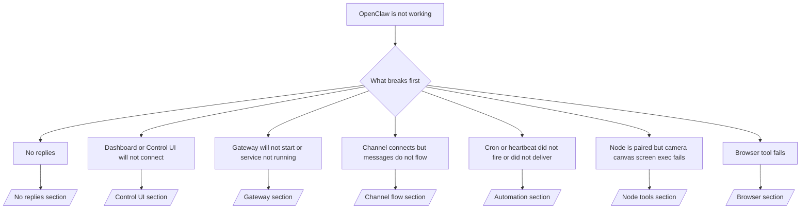

---
read_when:
    - OpenClaw funktioniert nicht und Sie brauchen den schnellsten Weg zur Lösung
    - Sie möchten einen Triage-Ablauf, bevor Sie in tiefgehende Runbooks einsteigen
summary: Symptomorientierter Hub zur Fehlerbehebung für OpenClaw
title: Allgemeine Fehlerbehebung
x-i18n:
    generated_at: "2026-04-24T06:42:19Z"
    model: gpt-5.4
    provider: openai
    source_hash: ce06ddce9de9e5824b4c5e8c182df07b29ce3ff113eb8e29c62aef9a4682e8e9
    source_path: help/troubleshooting.md
    workflow: 15
---

# Fehlerbehebung

Wenn Sie nur 2 Minuten haben, verwenden Sie diese Seite als Triage-Einstieg.

## Die ersten 60 Sekunden

Führen Sie genau diese Befehlsleiter in dieser Reihenfolge aus:

```bash
openclaw status
openclaw status --all
openclaw gateway probe
openclaw gateway status
openclaw doctor
openclaw channels status --probe
openclaw logs --follow
```

Gute Ausgabe in einer Zeile:

- `openclaw status` → zeigt konfigurierte Kanäle und keine offensichtlichen Auth-Fehler.
- `openclaw status --all` → vollständiger Bericht ist vorhanden und teilbar.
- `openclaw gateway probe` → erwartetes Gateway-Ziel ist erreichbar (`Reachable: yes`). `Capability: ...` zeigt, welche Auth-Stufe der Probe nachweisen konnte, und `Read probe: limited - missing scope: operator.read` bedeutet eingeschränkte Diagnose, nicht einen Verbindungsfehler.
- `openclaw gateway status` → `Runtime: running`, `Connectivity probe: ok` und eine plausible Zeile `Capability: ...`. Verwenden Sie `--require-rpc`, wenn Sie zusätzlich einen RPC-Nachweis mit Leseberechtigung brauchen.
- `openclaw doctor` → keine blockierenden Konfigurations-/Dienstfehler.
- `openclaw channels status --probe` → ein erreichbares Gateway liefert Live-Transportstatus pro Account plus Probe-/Audit-Ergebnisse wie `works` oder `audit ok`; wenn das Gateway nicht erreichbar ist, fällt der Befehl auf rein konfigurationsbasierte Zusammenfassungen zurück.
- `openclaw logs --follow` → stetige Aktivität, keine sich wiederholenden fatalen Fehler.

## Anthropic Long-Context 429

Wenn Sie Folgendes sehen:
`HTTP 429: rate_limit_error: Extra usage is required for long context requests`,
gehen Sie zu [/gateway/troubleshooting#anthropic-429-extra-usage-required-for-long-context](/de/gateway/troubleshooting#anthropic-429-extra-usage-required-for-long-context).

## Lokales OpenAI-kompatibles Backend funktioniert direkt, aber nicht in OpenClaw

Wenn Ihr lokales oder selbst gehostetes `/v1`-Backend kleine direkte
`/v1/chat/completions`-Probes beantwortet, aber bei `openclaw infer model run` oder normalen
Agenten-Turns fehlschlägt:

1. Wenn der Fehler erwähnt, dass `messages[].content` einen String erwartet, setzen Sie
   `models.providers.<provider>.models[].compat.requiresStringContent: true`.
2. Wenn das Backend weiterhin nur bei OpenClaw-Agenten-Turns fehlschlägt, setzen Sie
   `models.providers.<provider>.models[].compat.supportsTools: false` und versuchen Sie es erneut.
3. Wenn winzige direkte Aufrufe weiterhin funktionieren, aber größere OpenClaw-Prompts das
   Backend zum Absturz bringen, behandeln Sie das verbleibende Problem als Einschränkung des Upstream-Modells/Servers und
   fahren Sie im tiefgehenden Runbook fort:
   [/gateway/troubleshooting#local-openai-compatible-backend-passes-direct-probes-but-agent-runs-fail](/de/gateway/troubleshooting#local-openai-compatible-backend-passes-direct-probes-but-agent-runs-fail)

## Plugin-Installation schlägt fehl wegen fehlender openclaw extensions

Wenn die Installation mit `package.json missing openclaw.extensions` fehlschlägt, verwendet das Plugin-Paket
eine alte Form, die OpenClaw nicht mehr akzeptiert.

Korrektur im Plugin-Paket:

1. Fügen Sie `openclaw.extensions` zu `package.json` hinzu.
2. Verweisen Sie Einträge auf gebaute Laufzeitdateien (normalerweise `./dist/index.js`).
3. Veröffentlichen Sie das Plugin erneut und führen Sie `openclaw plugins install <package>` erneut aus.

Beispiel:

```json
{
  "name": "@openclaw/my-plugin",
  "version": "1.2.3",
  "openclaw": {
    "extensions": ["./dist/index.js"]
  }
}
```

Referenz: [Plugin architecture](/de/plugins/architecture)

## Entscheidungsbaum



<AccordionGroup>
  <Accordion title="Keine Antworten">
    ```bash
    openclaw status
    openclaw gateway status
    openclaw channels status --probe
    openclaw pairing list --channel <channel> [--account <id>]
    openclaw logs --follow
    ```

    Gute Ausgabe sieht so aus:

    - `Runtime: running`
    - `Connectivity probe: ok`
    - `Capability: read-only`, `write-capable` oder `admin-capable`
    - Ihr Kanal zeigt verbundenen Transport und, wo unterstützt, `works` oder `audit ok` in `channels status --probe`
    - Absender erscheint als genehmigt (oder die DM-Richtlinie ist open/allowlist)

    Häufige Log-Signaturen:

    - `drop guild message (mention required` → Erwähnungs-Gating hat die Nachricht in Discord blockiert.
    - `pairing request` → Absender ist nicht genehmigt und wartet auf Genehmigung für DM-Pairing.
    - `blocked` / `allowlist` in Kanal-Logs → Absender, Raum oder Gruppe wird gefiltert.

    Tiefgehende Seiten:

    - [/gateway/troubleshooting#no-replies](/de/gateway/troubleshooting#no-replies)
    - [/channels/troubleshooting](/de/channels/troubleshooting)
    - [/channels/pairing](/de/channels/pairing)

  </Accordion>

  <Accordion title="Dashboard oder Control UI kann keine Verbindung herstellen">
    ```bash
    openclaw status
    openclaw gateway status
    openclaw logs --follow
    openclaw doctor
    openclaw channels status --probe
    ```

    Gute Ausgabe sieht so aus:

    - `Dashboard: http://...` wird in `openclaw gateway status` angezeigt
    - `Connectivity probe: ok`
    - `Capability: read-only`, `write-capable` oder `admin-capable`
    - Keine Auth-Schleife in den Logs

    Häufige Log-Signaturen:

    - `device identity required` → HTTP-/unsicherer Kontext kann Geräte-Auth nicht abschließen.
    - `origin not allowed` → Browser-`Origin` ist für das Gateway-Ziel der Control UI nicht erlaubt.
    - `AUTH_TOKEN_MISMATCH` mit Retry-Hinweisen (`canRetryWithDeviceToken=true`) → ein vertrauenswürdiger Retry mit Geräte-Token kann automatisch erfolgen.
    - Dieser Retry mit gecachtem Token verwendet erneut die gecachte Scope-Menge, die mit dem gepairten Geräte-Token gespeichert wurde. Aufrufer mit explizitem `deviceToken` / expliziten `scopes` behalten stattdessen ihre angeforderte Scope-Menge.
    - Auf dem asynchronen Tailscale-Serve-Pfad der Control UI werden fehlgeschlagene Versuche für dasselbe `{scope, ip}` serialisiert, bevor der Limiter den Fehlschlag protokolliert, sodass ein zweiter gleichzeitiger fehlerhafter Retry bereits `retry later` anzeigen kann.
    - `too many failed authentication attempts (retry later)` von einer localhost-Browser-Origin → wiederholte Fehler von derselben `Origin` werden vorübergehend gesperrt; eine andere localhost-Origin verwendet einen separaten Bucket.
    - wiederholtes `unauthorized` nach diesem Retry → falsches Token/Passwort, Auth-Modus-Mismatch oder veraltetes gepairtes Geräte-Token.
    - `gateway connect failed:` → UI zielt auf falsche URL/falschen Port oder auf ein nicht erreichbares Gateway.

    Tiefgehende Seiten:

    - [/gateway/troubleshooting#dashboard-control-ui-connectivity](/de/gateway/troubleshooting#dashboard-control-ui-connectivity)
    - [/web/control-ui](/de/web/control-ui)
    - [/gateway/authentication](/de/gateway/authentication)

  </Accordion>

  <Accordion title="Gateway startet nicht oder Dienst ist installiert, aber läuft nicht">
    ```bash
    openclaw status
    openclaw gateway status
    openclaw logs --follow
    openclaw doctor
    openclaw channels status --probe
    ```

    Gute Ausgabe sieht so aus:

    - `Service: ... (loaded)`
    - `Runtime: running`
    - `Connectivity probe: ok`
    - `Capability: read-only`, `write-capable` oder `admin-capable`

    Häufige Log-Signaturen:

    - `Gateway start blocked: set gateway.mode=local` oder `existing config is missing gateway.mode` → Gateway-Modus ist auf remote gesetzt, oder in der Konfigurationsdatei fehlt die Markierung für den lokalen Modus und sie sollte repariert werden.
    - `refusing to bind gateway ... without auth` → Bind ohne Loopback ohne gültigen Gateway-Auth-Pfad (Token/Passwort oder, falls konfiguriert, trusted-proxy).
    - `another gateway instance is already listening` oder `EADDRINUSE` → Port ist bereits belegt.

    Tiefgehende Seiten:

    - [/gateway/troubleshooting#gateway-service-not-running](/de/gateway/troubleshooting#gateway-service-not-running)
    - [/gateway/background-process](/de/gateway/background-process)
    - [/gateway/configuration](/de/gateway/configuration)

  </Accordion>

  <Accordion title="Kanal verbindet sich, aber Nachrichten fließen nicht">
    ```bash
    openclaw status
    openclaw gateway status
    openclaw logs --follow
    openclaw doctor
    openclaw channels status --probe
    ```

    Gute Ausgabe sieht so aus:

    - Kanal-Transport ist verbunden.
    - Pairing-/Allowlist-Prüfungen bestehen.
    - Erwähnungen werden erkannt, wo erforderlich.

    Häufige Log-Signaturen:

    - `mention required` → Erwähnungs-Gating hat die Verarbeitung in einer Gruppe blockiert.
    - `pairing` / `pending` → DM-Absender ist noch nicht genehmigt.
    - `not_in_channel`, `missing_scope`, `Forbidden`, `401/403` → Problem mit Kanalberechtigungen/Token.

    Tiefgehende Seiten:

    - [/gateway/troubleshooting#channel-connected-messages-not-flowing](/de/gateway/troubleshooting#channel-connected-messages-not-flowing)
    - [/channels/troubleshooting](/de/channels/troubleshooting)

  </Accordion>

  <Accordion title="Cron oder Heartbeat wurde nicht ausgelöst oder nicht zugestellt">
    ```bash
    openclaw status
    openclaw gateway status
    openclaw cron status
    openclaw cron list
    openclaw cron runs --id <jobId> --limit 20
    openclaw logs --follow
    ```

    Gute Ausgabe sieht so aus:

    - `cron.status` zeigt aktiviert mit dem nächsten Wake.
    - `cron runs` zeigt aktuelle `ok`-Einträge.
    - Heartbeat ist aktiviert und nicht außerhalb der aktiven Stunden.

    Häufige Log-Signaturen:

    - `cron: scheduler disabled; jobs will not run automatically` → Cron ist deaktiviert.
    - `heartbeat skipped` mit `reason=quiet-hours` → außerhalb der konfigurierten aktiven Stunden.
    - `heartbeat skipped` mit `reason=empty-heartbeat-file` → `HEARTBEAT.md` existiert, enthält aber nur leere/header-only Grundstruktur.
    - `heartbeat skipped` mit `reason=no-tasks-due` → Task-Modus von `HEARTBEAT.md` ist aktiv, aber keines der Task-Intervalle ist bislang fällig.
    - `heartbeat skipped` mit `reason=alerts-disabled` → sämtliche Heartbeat-Sichtbarkeit ist deaktiviert (`showOk`, `showAlerts` und `useIndicator` sind alle aus).
    - `requests-in-flight` → Haupt-Lane beschäftigt; Heartbeat-Wake wurde verschoben.
    - `unknown accountId` → Ziel-Account für Heartbeat-Zustellung existiert nicht.

    Tiefgehende Seiten:

    - [/gateway/troubleshooting#cron-and-heartbeat-delivery](/de/gateway/troubleshooting#cron-and-heartbeat-delivery)
    - [/automation/cron-jobs#troubleshooting](/de/automation/cron-jobs#troubleshooting)
    - [/gateway/heartbeat](/de/gateway/heartbeat)

  </Accordion>

  <Accordion title="Node ist gepairt, aber Tool für Kamera/Canvas/Bildschirm/Exec schlägt fehl">
    ```bash
    openclaw status
    openclaw gateway status
    openclaw nodes status
    openclaw nodes describe --node <idOrNameOrIp>
    openclaw logs --follow
    ```

    Gute Ausgabe sieht so aus:

    - Node ist als verbunden und gepairt für die Rolle `node` aufgeführt.
    - Fähigkeit existiert für den Befehl, den Sie aufrufen.
    - Berechtigungsstatus ist für das Tool erteilt.

    Häufige Log-Signaturen:

    - `NODE_BACKGROUND_UNAVAILABLE` → Node-App in den Vordergrund bringen.
    - `*_PERMISSION_REQUIRED` → OS-Berechtigung wurde verweigert/fehlt.
    - `SYSTEM_RUN_DENIED: approval required` → Exec-Genehmigung ist ausstehend.
    - `SYSTEM_RUN_DENIED: allowlist miss` → Befehl steht nicht auf der Exec-Allowlist.

    Tiefgehende Seiten:

    - [/gateway/troubleshooting#node-paired-tool-fails](/de/gateway/troubleshooting#node-paired-tool-fails)
    - [/nodes/troubleshooting](/de/nodes/troubleshooting)
    - [/tools/exec-approvals](/de/tools/exec-approvals)

  </Accordion>

  <Accordion title="Exec fragt plötzlich nach Genehmigung">
    ```bash
    openclaw config get tools.exec.host
    openclaw config get tools.exec.security
    openclaw config get tools.exec.ask
    openclaw gateway restart
    ```

    Was hat sich geändert:

    - Wenn `tools.exec.host` nicht gesetzt ist, lautet der Standard `auto`.
    - `host=auto` wird zu `sandbox` aufgelöst, wenn eine Sandbox-Laufzeit aktiv ist, andernfalls zu `gateway`.
    - `host=auto` betrifft nur das Routing; das Verhalten „YOLO“ ohne Rückfrage kommt von `security=full` plus `ask=off` auf Gateway/Node.
    - Auf `gateway` und `node` lautet der Standard für nicht gesetztes `tools.exec.security` `full`.
    - Nicht gesetztes `tools.exec.ask` hat standardmäßig den Wert `off`.
    - Ergebnis: Wenn Sie Genehmigungen sehen, hat irgendeine hostlokale oder sitzungsbezogene Richtlinie Exec gegenüber den aktuellen Standards verschärft.

    Aktuelles Standardverhalten ohne Genehmigungen wiederherstellen:

    ```bash
    openclaw config set tools.exec.host gateway
    openclaw config set tools.exec.security full
    openclaw config set tools.exec.ask off
    openclaw gateway restart
    ```

    Sicherere Alternativen:

    - Setzen Sie nur `tools.exec.host=gateway`, wenn Sie lediglich stabiles Host-Routing möchten.
    - Verwenden Sie `security=allowlist` mit `ask=on-miss`, wenn Sie Host-Exec möchten, aber bei Allowlist-Fehlschlägen trotzdem prüfen wollen.
    - Aktivieren Sie den Sandbox-Modus, wenn `host=auto` wieder zu `sandbox` aufgelöst werden soll.

    Häufige Log-Signaturen:

    - `Approval required.` → Befehl wartet auf `/approve ...`.
    - `SYSTEM_RUN_DENIED: approval required` → Exec-Genehmigung auf dem Node-Host ist ausstehend.
    - `exec host=sandbox requires a sandbox runtime for this session` → implizite/explizite Sandbox-Auswahl, aber Sandbox-Modus ist deaktiviert.

    Tiefgehende Seiten:

    - [/tools/exec](/de/tools/exec)
    - [/tools/exec-approvals](/de/tools/exec-approvals)
    - [/gateway/security#what-the-audit-checks-high-level](/de/gateway/security#what-the-audit-checks-high-level)

  </Accordion>

  <Accordion title="Browser-Tool schlägt fehl">
    ```bash
    openclaw status
    openclaw gateway status
    openclaw browser status
    openclaw logs --follow
    openclaw doctor
    ```

    Gute Ausgabe sieht so aus:

    - Browser-Status zeigt `running: true` und einen ausgewählten Browser/ein ausgewähltes Profil.
    - `openclaw` startet, oder `user` kann lokale Chrome-Tabs sehen.

    Häufige Log-Signaturen:

    - `unknown command "browser"` oder `unknown command 'browser'` → `plugins.allow` ist gesetzt und enthält `browser` nicht.
    - `Failed to start Chrome CDP on port` → Start des lokalen Browsers ist fehlgeschlagen.
    - `browser.executablePath not found` → konfigurierter Binärpfad ist falsch.
    - `browser.cdpUrl must be http(s) or ws(s)` → die konfigurierte CDP-URL verwendet ein nicht unterstütztes Schema.
    - `browser.cdpUrl has invalid port` → die konfigurierte CDP-URL hat einen ungültigen oder außerhalb des zulässigen Bereichs liegenden Port.
    - `No Chrome tabs found for profile="user"` → das Chrome-MCP-Attach-Profil hat keine offenen lokalen Chrome-Tabs.
    - `Remote CDP for profile "<name>" is not reachable` → der konfigurierte Remote-CDP-Endpunkt ist von diesem Host nicht erreichbar.
    - `Browser attachOnly is enabled ... not reachable` oder `Browser attachOnly is enabled and CDP websocket ... is not reachable` → Attach-only-Profil hat kein aktives CDP-Ziel.
    - veraltete Überschreibungen für Viewport / Dark Mode / Locale / Offline bei Attach-only- oder Remote-CDP-Profilen → führen Sie `openclaw browser stop --browser-profile <name>` aus, um die aktive Steuerungssitzung zu schließen und den Emulationsstatus freizugeben, ohne das Gateway neu zu starten.

    Tiefgehende Seiten:

    - [/gateway/troubleshooting#browser-tool-fails](/de/gateway/troubleshooting#browser-tool-fails)
    - [/tools/browser#missing-browser-command-or-tool](/de/tools/browser#missing-browser-command-or-tool)
    - [/tools/browser-linux-troubleshooting](/de/tools/browser-linux-troubleshooting)
    - [/tools/browser-wsl2-windows-remote-cdp-troubleshooting](/de/tools/browser-wsl2-windows-remote-cdp-troubleshooting)

  </Accordion>

</AccordionGroup>

## Verwandt

- [FAQ](/de/help/faq) — häufig gestellte Fragen
- [Gateway Troubleshooting](/de/gateway/troubleshooting) — gatewayspezifische Probleme
- [Doctor](/de/gateway/doctor) — automatisierte Gesundheitsprüfungen und Reparaturen
- [Channel Troubleshooting](/de/channels/troubleshooting) — Probleme mit der Kanalverbindung
- [Automation Troubleshooting](/de/automation/cron-jobs#troubleshooting) — Probleme mit Cron und Heartbeat
