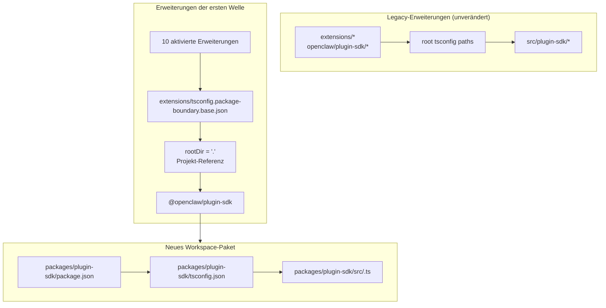

# Refactor: plugin-sdk schrittweise zu einem echten Workspace-Paket machen

## Überblick

Dieser Plan führt unter
`packages/plugin-sdk` ein echtes Workspace-Paket für das plugin-sdk ein und verwendet es, um für eine kleine erste Welle von Erweiterungen paketgrenzen mit Compiler-Durchsetzung zu aktivieren. Das Ziel ist, dass unzulässige relative
Importe unter normalem `tsc` für eine ausgewählte Gruppe gebündelter Provider-
Erweiterungen fehlschlagen, ohne eine repo-weite Migration oder eine riesige Merge-Konflikt-
Oberfläche zu erzwingen.

Der zentrale inkrementelle Schritt besteht darin, zwei Modi eine Zeit lang parallel auszuführen:

| Modus       | Importform               | Wer es verwendet                     | Durchsetzung                                 |
| ----------- | ------------------------ | ------------------------------------ | -------------------------------------------- |
| Legacy-Modus | `openclaw/plugin-sdk/*`  | alle bestehenden nicht aktivierten Erweiterungen | aktuelles permissives Verhalten bleibt bestehen |
| Opt-in-Modus | `@openclaw/plugin-sdk/*` | nur Erweiterungen der ersten Welle   | paketlokales `rootDir` + Projekt-Referenzen |

## Problemrahmen

Das aktuelle Repo exportiert eine große öffentliche plugin-sdk-Oberfläche, ist aber kein echtes
Workspace-Paket. Stattdessen gilt:

- `tsconfig.json` im Root mappt `openclaw/plugin-sdk/*` direkt auf
  `src/plugin-sdk/*.ts`
- Erweiterungen, die nicht für das vorherige Experiment aktiviert wurden, teilen weiterhin dieses
  globale Source-Alias-Verhalten
- Das Hinzufügen von `rootDir` funktioniert nur dann, wenn erlaubte SDK-Importe nicht mehr in rohe
  Repo-Quellen aufgelöst werden

Das bedeutet, dass das Repo die gewünschte Grenzrichtlinie beschreiben kann, TypeScript
sie aber für die meisten Erweiterungen nicht sauber durchsetzt.

Gewünscht ist ein inkrementeller Pfad, der:

- `plugin-sdk` real macht
- das SDK in Richtung eines Workspace-Pakets namens `@openclaw/plugin-sdk` bewegt
- im ersten PR nur etwa 10 Erweiterungen ändert
- den Rest des Erweiterungsbaums bis zur späteren Bereinigung im alten Schema belässt
- den Workflow mit `tsconfig.plugin-sdk.dts.json` + durch postinstall generierten Deklarationen als primären Mechanismus für den Rollout der ersten Welle vermeidet

## Anforderungszuordnung

- R1. Unter `packages/` ein echtes Workspace-Paket für das Plugin SDK erstellen.
- R2. Das neue Paket `@openclaw/plugin-sdk` nennen.
- R3. Dem neuen SDK-Paket ein eigenes `package.json` und `tsconfig.json` geben.
- R4. Während des Migrationsfensters Legacy-Importe `openclaw/plugin-sdk/*` für nicht aktivierte
  Erweiterungen funktionsfähig halten.
- R5. Im ersten PR nur eine kleine erste Welle von Erweiterungen aktivieren.
- R6. Die Erweiterungen der ersten Welle müssen für relative Importe, die ihren
  Paket-Root verlassen, fail-closed sein.
- R7. Die Erweiterungen der ersten Welle müssen das SDK über eine Paket-
  Abhängigkeit und eine TS-Projekt-Referenz konsumieren, nicht über `paths`-Aliasse im Root.
- R8. Der Plan muss einen repo-weiten verpflichtenden postinstall-Generierungsschritt für die Editor-Korrektheit vermeiden.
- R9. Der Rollout der ersten Welle muss als moderater PR überprüfbar und mergbar sein,
  nicht als repo-weites Refactoring mit mehr als 300 Dateien.

## Bereichsgrenzen

- Keine vollständige Migration aller gebündelten Erweiterungen im ersten PR.
- Keine Anforderung, `src/plugin-sdk` im ersten PR zu löschen.
- Keine Anforderung, jeden Root-Build- oder Testpfad sofort auf das neue Paket umzuleiten.
- Kein Versuch, VS Code-Squiggles für jede nicht aktivierte Erweiterung zu erzwingen.
- Keine breite Lint-Bereinigung für den Rest des Erweiterungsbaums.
- Keine großen Änderungen des Laufzeitverhaltens jenseits von Importauflösung, Paketbesitz
  und Grenzdurchsetzung für die aktivierten Erweiterungen.

## Kontext und Recherche

### Relevanter Code und Muster

- `pnpm-workspace.yaml` enthält bereits `packages/*` und `extensions/*`, daher passt ein
  neues Workspace-Paket unter `packages/plugin-sdk` in das bestehende Repo-
  Layout.
- Bestehende Workspace-Pakete wie `packages/memory-host-sdk/package.json`
  und `packages/plugin-package-contract/package.json` verwenden bereits paketlokale
  `exports`-Maps mit Wurzeln in `src/*.ts`.
- `package.json` im Root veröffentlicht die SDK-Oberfläche derzeit über `./plugin-sdk`
  und `./plugin-sdk/*`-Exporte, die von `dist/plugin-sdk/*.js` und
  `dist/plugin-sdk/*.d.ts` unterstützt werden.
- `src/plugin-sdk/entrypoints.ts` und `scripts/lib/plugin-sdk-entrypoints.json`
  fungieren bereits als kanonisches Entry-Point-Inventar für die SDK-Oberfläche.
- `tsconfig.json` im Root mappt derzeit:
  - `openclaw/plugin-sdk` -> `src/plugin-sdk/index.ts`
  - `openclaw/plugin-sdk/*` -> `src/plugin-sdk/*.ts`
- Das vorherige Grenzexperiment hat gezeigt, dass paketlokales `rootDir` für
  unzulässige relative Importe nur dann funktioniert, nachdem erlaubte SDK-Importe nicht mehr in rohe
  Quellen außerhalb des Erweiterungspakets aufgelöst werden.

### Satz von Erweiterungen der ersten Welle

Dieser Plan geht davon aus, dass die erste Welle die providerlastige Gruppe ist, die am wenigsten
wahrscheinlich komplexe Sonderfälle der Channel-Laufzeit mit sich bringt:

- `extensions/anthropic`
- `extensions/exa`
- `extensions/firecrawl`
- `extensions/groq`
- `extensions/mistral`
- `extensions/openai`
- `extensions/perplexity`
- `extensions/tavily`
- `extensions/together`
- `extensions/xai`

### Inventar der SDK-Oberfläche für die erste Welle

Die Erweiterungen der ersten Welle importieren derzeit eine handhabbare Teilmenge von SDK-Subpfaden.
Das anfängliche Paket `@openclaw/plugin-sdk` muss nur diese abdecken:

- `agent-runtime`
- `cli-runtime`
- `config-runtime`
- `core`
- `image-generation`
- `media-runtime`
- `media-understanding`
- `plugin-entry`
- `plugin-runtime`
- `provider-auth`
- `provider-auth-api-key`
- `provider-auth-login`
- `provider-auth-runtime`
- `provider-catalog-shared`
- `provider-entry`
- `provider-http`
- `provider-model-shared`
- `provider-onboard`
- `provider-stream-family`
- `provider-stream-shared`
- `provider-tools`
- `provider-usage`
- `provider-web-fetch`
- `provider-web-search`
- `realtime-transcription`
- `realtime-voice`
- `runtime-env`
- `secret-input`
- `security-runtime`
- `speech`
- `testing`

### Institutionelle Erkenntnisse

- In diesem Worktree waren keine relevanten `docs/solutions/`-Einträge vorhanden.

### Externe Referenzen

- Für diesen Plan war keine externe Recherche nötig. Das Repo enthält bereits die
  relevanten Muster für Workspace-Pakete und SDK-Exporte.

## Wichtige technische Entscheidungen

- `@openclaw/plugin-sdk` als neues Workspace-Paket einführen und gleichzeitig die
  Legacy-Oberfläche `openclaw/plugin-sdk/*` während der Migration aktiv halten.
  Begründung: Dadurch kann ein Satz von Erweiterungen der ersten Welle auf echte Paket-
  Auflösung umsteigen, ohne dass alle Erweiterungen und alle Build-Pfade im Root
  gleichzeitig geändert werden müssen.

- Eine dedizierte Basis-Konfiguration für Opt-in-Grenzen wie
  `extensions/tsconfig.package-boundary.base.json` verwenden, anstatt die
  bestehende Erweiterungsbasis für alle zu ersetzen.
  Begründung: Das Repo muss während der Migration gleichzeitig Legacy- und Opt-in-
  Modi für Erweiterungen unterstützen.

- TS-Projekt-Referenzen von den Erweiterungen der ersten Welle auf
  `packages/plugin-sdk/tsconfig.json` verwenden und
  `disableSourceOfProjectReferenceRedirect` für den Opt-in-Grenzmodus setzen.
  Begründung: So erhält `tsc` einen echten Paketgraphen und gleichzeitig werden Editor- und
  Compiler-Fallbacks auf rohe Source-Traversierung entmutigt.

- `@openclaw/plugin-sdk` in der ersten Welle privat halten.
  Begründung: Das unmittelbare Ziel ist interne Grenzdurchsetzung und Migrations-
  Sicherheit, nicht die Veröffentlichung eines zweiten externen SDK-Vertrags, bevor die Oberfläche
  stabil ist.

- In der ersten Implementierung nur die SDK-Subpfade der ersten Welle verschieben und
  für den Rest Kompatibilitäts-Brücken beibehalten.
  Begründung: Alle 315 `src/plugin-sdk/*.ts`-Dateien in einem PR physisch zu verschieben, ist
  genau die Merge-Konflikt-Oberfläche, die dieser Plan vermeiden will.

- Sich für die erste Welle nicht auf `scripts/postinstall-bundled-plugins.mjs` verlassen, um SDK-
  Deklarationen zu bauen.
  Begründung: Explizite Build-/Referenz-Flows sind leichter nachvollziehbar und machen das
  Repo-Verhalten besser vorhersagbar.

## Offene Fragen

### Während der Planung geklärt

- Welche Erweiterungen sollen in der ersten Welle sein?
  Verwenden Sie die 10 oben aufgeführten Provider-/Web-Search-Erweiterungen, weil sie strukturell stärker
  isoliert sind als die schwereren Channel-Pakete.

- Soll der erste PR den gesamten Erweiterungsbaum ersetzen?
  Nein. Der erste PR sollte zwei Modi parallel unterstützen und nur die
  erste Welle aktivieren.

- Soll die erste Welle einen postinstall-Deklarations-Build erfordern?
  Nein. Der Paket-/Referenzgraph sollte explizit sein, und CI sollte den
  relevanten paketlokalen Typecheck bewusst ausführen.

### Für die Implementierung zurückgestellt

- Ob das Paket der ersten Welle allein über Projekt-Referenzen direkt auf paketlokale `src/*.ts`
  zeigen kann oder ob für das Paket `@openclaw/plugin-sdk`
  dennoch ein kleiner Schritt zur Deklarationserzeugung erforderlich ist.
  Das ist eine der Implementierung gehörende Frage zur Validierung des TS-Graphen.

- Ob das Root-Paket `openclaw` Subpfade des SDK der ersten Welle sofort auf
  Ausgaben aus `packages/plugin-sdk` proxien sollte oder weiterhin generierte
  Kompatibilitäts-Shims unter `src/plugin-sdk` verwenden sollte.
  Das ist ein Kompatibilitäts- und Build-Shape-Detail, das vom minimalen
  Implementierungspfad abhängt, der CI grün hält.

## Technisches Design auf hoher Ebene

> Dies veranschaulicht den beabsichtigten Ansatz und ist richtungsweisende Orientierung für das Review, keine Implementierungsspezifikation. Der implementierende Agent sollte dies als Kontext behandeln, nicht als Code zur Reproduktion.

## Implementierungseinheiten

- [ ] **Einheit 1: Das echte Workspace-Paket `@openclaw/plugin-sdk` einführen**

**Ziel:** Ein echtes Workspace-Paket für das SDK erstellen, das die
Oberfläche der ersten Welle von Subpfaden besitzen kann, ohne eine repo-weite Migration zu erzwingen.

**Anforderungen:** R1, R2, R3, R8, R9

**Abhängigkeiten:** Keine

**Dateien:**

- Erstellen: `packages/plugin-sdk/package.json`
- Erstellen: `packages/plugin-sdk/tsconfig.json`
- Erstellen: `packages/plugin-sdk/src/index.ts`
- Erstellen: `packages/plugin-sdk/src/*.ts` für die SDK-Subpfade der ersten Welle
- Ändern: `pnpm-workspace.yaml` nur falls Anpassungen an Paket-Globs nötig sind
- Ändern: `package.json`
- Ändern: `src/plugin-sdk/entrypoints.ts`
- Ändern: `scripts/lib/plugin-sdk-entrypoints.json`
- Test: `src/plugins/contracts/plugin-sdk-workspace-package.contract.test.ts`

**Ansatz:**

- Ein neues Workspace-Paket namens `@openclaw/plugin-sdk` hinzufügen.
- Mit nur den SDK-Subpfaden der ersten Welle beginnen, nicht mit dem gesamten Baum aus 315 Dateien.
- Wenn das direkte Verschieben eines Entry-Points der ersten Welle einen zu großen Diff erzeugen würde, kann der
  erste PR diesen Subpfad zunächst als dünnen Paket-Wrapper in `packages/plugin-sdk/src` einführen
  und dann in einem Folge-PR für diesen Subpfad-Cluster die Quelle der Wahrheit auf das Paket umstellen.
- Die vorhandene Entry-Point-Inventar-Mechanik wiederverwenden, damit die Paketoberfläche der ersten Welle
  an einer kanonischen Stelle deklariert ist.
- Die Exporte des Root-Pakets für Legacy-Benutzer aktiv halten, während das Workspace-
  Paket zum neuen Opt-in-Vertrag wird.

**Zu befolgende Muster:**

- `packages/memory-host-sdk/package.json`
- `packages/plugin-package-contract/package.json`
- `src/plugin-sdk/entrypoints.ts`

**Testszenarien:**

- Happy Path: Das Workspace-Paket exportiert jeden im
  Plan aufgeführten Subpfad der ersten Welle, und kein erforderlicher Export der ersten Welle fehlt.
- Sonderfall: Metadaten zu Paket-Exporten bleiben stabil, wenn die Liste der Einträge der ersten Welle
  neu generiert oder mit dem kanonischen Inventar verglichen wird.
- Integration: Legacy-SDK-Exporte des Root-Pakets bleiben nach Einführung des neuen Workspace-Pakets erhalten.

**Verifizierung:**

- Das Repo enthält ein gültiges Workspace-Paket `@openclaw/plugin-sdk` mit einer
  stabilen Export-Map der ersten Welle und ohne Regression der Legacy-Exporte im Root-
  `package.json`.

- [ ] **Einheit 2: Einen Opt-in-TS-Grenzmodus für paketdurchgesetzte Erweiterungen hinzufügen**

**Ziel:** Den TS-Konfigurationsmodus definieren, den aktivierte Erweiterungen verwenden,
während das bestehende TS-Verhalten für Erweiterungen für alle anderen unverändert bleibt.

**Anforderungen:** R4, R6, R7, R8, R9

**Abhängigkeiten:** Einheit 1

**Dateien:**

- Erstellen: `extensions/tsconfig.package-boundary.base.json`
- Erstellen: `tsconfig.boundary-optin.json`
- Ändern: `extensions/xai/tsconfig.json`
- Ändern: `extensions/openai/tsconfig.json`
- Ändern: `extensions/anthropic/tsconfig.json`
- Ändern: `extensions/mistral/tsconfig.json`
- Ändern: `extensions/groq/tsconfig.json`
- Ändern: `extensions/together/tsconfig.json`
- Ändern: `extensions/perplexity/tsconfig.json`
- Ändern: `extensions/tavily/tsconfig.json`
- Ändern: `extensions/exa/tsconfig.json`
- Ändern: `extensions/firecrawl/tsconfig.json`
- Test: `src/plugins/contracts/extension-package-project-boundaries.test.ts`
- Test: `test/extension-package-tsc-boundary.test.ts`

**Ansatz:**

- `extensions/tsconfig.base.json` für Legacy-Erweiterungen beibehalten.
- Eine neue Opt-in-Basiskonfiguration hinzufügen, die:
  - `rootDir: "."` setzt
  - auf `packages/plugin-sdk` referenziert
  - `composite` aktiviert
  - die Source-Umleitung von Projekt-Referenzen deaktiviert, wenn nötig
- Eine dedizierte Lösungskonfiguration für den Typecheck-Graphen der ersten Welle hinzufügen, anstatt
  im selben PR das TS-Projekt des gesamten Repos umzugestalten.

**Ausführungshinweis:** Beginnen Sie mit einem fehlschlagenden paketlokalen Canary-Typecheck für eine
aktivierte Erweiterung, bevor Sie das Muster auf alle 10 anwenden.

**Zu befolgende Muster:**

- Bestehendes Muster paketlokaler `tsconfig.json` für Erweiterungen aus der vorherigen
  Grenzarbeit
- Workspace-Paket-Muster aus `packages/memory-host-sdk`

**Testszenarien:**

- Happy Path: Jede aktivierte Erweiterung typecheckt erfolgreich über die
  TS-Konfiguration mit Paketgrenzen.
- Fehlerpfad: Ein Canary-relative-Import aus `../../src/cli/acp-cli.ts` schlägt
  für eine aktivierte Erweiterung mit `TS6059` fehl.
- Integration: Nicht aktivierte Erweiterungen bleiben unangetastet und müssen nicht an der neuen Lösungskonfiguration teilnehmen.

**Verifizierung:**

- Es gibt einen dedizierten Typecheck-Graphen für die 10 aktivierten Erweiterungen, und unzulässige
  relative Importe aus einer davon schlagen unter normalem `tsc` fehl.

- [ ] **Einheit 3: Die Erweiterungen der ersten Welle auf `@openclaw/plugin-sdk` migrieren**

**Ziel:** Die Erweiterungen der ersten Welle so ändern, dass sie das echte SDK-Paket
über Abhängigkeitsmetadaten, Projekt-Referenzen und Importen per Paketname konsumieren.

**Anforderungen:** R5, R6, R7, R9

**Abhängigkeiten:** Einheit 2

**Dateien:**

- Ändern: `extensions/anthropic/package.json`
- Ändern: `extensions/exa/package.json`
- Ändern: `extensions/firecrawl/package.json`
- Ändern: `extensions/groq/package.json`
- Ändern: `extensions/mistral/package.json`
- Ändern: `extensions/openai/package.json`
- Ändern: `extensions/perplexity/package.json`
- Ändern: `extensions/tavily/package.json`
- Ändern: `extensions/together/package.json`
- Ändern: `extensions/xai/package.json`
- Ändern: Produktions- und Testimporte unter jedem der 10 Erweiterungs-Roots, die derzeit auf
  `openclaw/plugin-sdk/*` verweisen

**Ansatz:**

- `@openclaw/plugin-sdk: workspace:*` zu den `devDependencies` der Erweiterungen der ersten Welle hinzufügen.
- `openclaw/plugin-sdk/*`-Importe in diesen Paketen durch
  `@openclaw/plugin-sdk/*` ersetzen.
- Erweiterungsinterne lokale Importe auf lokalen Barrels wie `./api.ts` und
  `./runtime-api.ts` belassen.
- Nicht aktivierte Erweiterungen in diesem PR nicht ändern.

**Zu befolgende Muster:**

- Bestehende lokale Import-Barrels von Erweiterungen (`api.ts`, `runtime-api.ts`)
- Form von Paketabhängigkeiten, die von anderen `@openclaw/*`-Workspace-Paketen verwendet wird

**Testszenarien:**

- Happy Path: Jede migrierte Erweiterung registriert/lädt sich nach dem Umschreiben der Importe
  weiterhin über ihre bestehenden Plugin-Tests.
- Sonderfall: Rein testbezogene SDK-Importe im aktivierten Satz von Erweiterungen werden weiterhin korrekt
  über das neue Paket aufgelöst.
- Integration: Migrierte Erweiterungen benötigen für den Typecheck nicht die
  Legacy-Root-Alias-Pfade `openclaw/plugin-sdk/*`.

**Verifizierung:**

- Die Erweiterungen der ersten Welle bauen und testen gegen `@openclaw/plugin-sdk`,
  ohne den Legacy-Root-SDK-Alias-Pfad zu benötigen.

- [ ] **Einheit 4: Legacy-Kompatibilität erhalten, während die Migration nur teilweise erfolgt**

**Ziel:** Den Rest des Repos funktionsfähig halten, während das SDK während der Migration sowohl in Legacy-
als auch in neuer Paketform existiert.

**Anforderungen:** R4, R8, R9

**Abhängigkeiten:** Einheiten 1-3

**Dateien:**

- Ändern: `src/plugin-sdk/*.ts` für Kompatibilitäts-Shims der ersten Welle nach Bedarf
- Ändern: `package.json`
- Ändern: Build- oder Export-Verkabelung, die SDK-Artefakte zusammenstellt
- Test: `src/plugins/contracts/plugin-sdk-runtime-api-guardrails.test.ts`
- Test: `src/plugins/contracts/plugin-sdk-index.bundle.test.ts`

**Ansatz:**

- `openclaw/plugin-sdk/*` im Root als Kompatibilitätsoberfläche für Legacy-
  Erweiterungen und für externe Nutzer, die noch nicht migrieren, beibehalten.
- Entweder generierte Shims oder Root-Export-Proxy-Verkabelung für die
  Subpfade der ersten Welle verwenden, die nach `packages/plugin-sdk` verschoben wurden.
- In dieser Phase nicht versuchen, die SDK-Oberfläche im Root außer Betrieb zu nehmen.

**Zu befolgende Muster:**

- Bestehende Erzeugung von SDK-Exporten im Root über `src/plugin-sdk/entrypoints.ts`
- Bestehende Export-Kompatibilität des Pakets im Root in `package.json`

**Testszenarien:**

- Happy Path: Ein Legacy-Root-SDK-Import wird für eine nicht aktivierte
  Erweiterung weiterhin aufgelöst, nachdem das neue Paket existiert.
- Sonderfall: Ein Subpfad der ersten Welle funktioniert während des Migrationsfensters sowohl über die
  Legacy-Root-Oberfläche als auch über die neue Paketoberfläche.
- Integration: Vertrags-Tests für den SDK-Index/das Bundle sehen weiterhin eine kohärente
  öffentliche Oberfläche.

**Verifizierung:**

- Das Repo unterstützt sowohl Legacy- als auch Opt-in-Modi für die Nutzung des SDK, ohne
  unveränderte Erweiterungen zu beschädigen.

- [ ] **Einheit 5: Abgegrenzte Durchsetzung hinzufügen und den Migrationsvertrag dokumentieren**

**Ziel:** CI und Contributor-Guidance einführen, die das neue Verhalten für die
erste Welle durchsetzen, ohne so zu tun, als wäre der gesamte Erweiterungsbaum migriert.

**Anforderungen:** R5, R6, R8, R9

**Abhängigkeiten:** Einheiten 1-4

**Dateien:**

- Ändern: `package.json`
- Ändern: CI-Workflow-Dateien, die den Typecheck der Opt-in-Grenzen ausführen sollen
- Ändern: `AGENTS.md`
- Ändern: `docs/plugins/sdk-overview.md`
- Ändern: `docs/plugins/sdk-entrypoints.md`
- Ändern: `docs/plans/2026-04-05-001-refactor-extension-package-resolution-boundary-plan.md`

**Ansatz:**

- Ein explizites Gate für die erste Welle hinzufügen, etwa einen dedizierten `tsc -b`-Lauf der Lösung für
  `packages/plugin-sdk` plus die 10 aktivierten Erweiterungen.
- Dokumentieren, dass das Repo nun sowohl Legacy- als auch Opt-in-Modi für Erweiterungen unterstützt,
  und dass neue Arbeiten an Erweiterungsgrenzen den neuen Paketpfad bevorzugen sollten.
- Die Regel für die nächste Migrationswelle festhalten, damit spätere PRs weitere Erweiterungen hinzufügen können,
  ohne die Architektur erneut auszudiskutieren.

**Zu befolgende Muster:**

- Bestehende Vertrags-Tests unter `src/plugins/contracts/`
- Bestehende Doku-Updates, die gestufte Migrationen erklären

**Testszenarien:**

- Happy Path: Das neue Typecheck-Gate der ersten Welle besteht für das Workspace-Paket
  und die aktivierten Erweiterungen.
- Fehlerpfad: Das Einführen eines neuen unzulässigen relativen Imports in einer aktivierten
  Erweiterung lässt das abgegrenzte Typecheck-Gate fehlschlagen.
- Integration: CI verlangt noch nicht von nicht aktivierten Erweiterungen, den neuen
  Paketgrenzen-Modus zu erfüllen.

**Verifizierung:**

- Der Durchsetzungspfad für die erste Welle ist dokumentiert, getestet und ausführbar, ohne
  den gesamten Erweiterungsbaum zur Migration zu zwingen.

## Systemweite Auswirkungen

- **Interaktionsgraph:** Diese Arbeit betrifft die Quelle der Wahrheit des SDK, Root-Paket-
  Exporte, Paketmetadaten von Erweiterungen, das Layout des TS-Graphen und die CI-Verifizierung.
- **Fehlerfortpflanzung:** Der wichtigste beabsichtigte Fehlermodus werden Compile-Zeit-TS-
  Fehler (`TS6059`) in aktivierten Erweiterungen anstelle von Fehlern, die nur durch benutzerdefinierte Skripte erkannt werden.
- **Risiken im Zustandslebenszyklus:** Die Dual-Oberflächen-Migration führt das Risiko von Drift zwischen
  Root-Kompatibilitätsexporten und dem neuen Workspace-Paket ein.
- **Parität der API-Oberfläche:** Subpfade der ersten Welle müssen während der
  Übergangsphase semantisch identisch bleiben – sowohl über `openclaw/plugin-sdk/*` als auch über
  `@openclaw/plugin-sdk/*`.
- **Integrationsabdeckung:** Unit-Tests reichen nicht aus; abgegrenzte Paketgraph-
  Typechecks sind erforderlich, um die Grenze zu beweisen.
- **Unveränderte Invarianten:** Nicht aktivierte Erweiterungen behalten in PR 1 ihr aktuelles Verhalten
  bei. Dieser Plan beansprucht keine repo-weite Durchsetzung von Importgrenzen.

## Risiken und Abhängigkeiten

| Risiko                                                                                                   | Gegenmaßnahme                                                                                                            |
| -------------------------------------------------------------------------------------------------------- | ------------------------------------------------------------------------------------------------------------------------ |
| Das Paket der ersten Welle wird weiterhin in rohe Quellen aufgelöst und `rootDir` schlägt nicht tatsächlich fail-closed fehl | Den ersten Implementierungsschritt zu einer Paket-Referenz-Canary auf einer aktivierten Erweiterung machen, bevor auf die gesamte Gruppe erweitert wird |
| Durch das Verschieben von zu viel SDK-Source auf einmal entsteht erneut das ursprüngliche Merge-Konflikt-Problem | Im ersten PR nur die Subpfade der ersten Welle verschieben und Kompatibilitäts-Brücken im Root beibehalten              |
| Legacy- und neue SDK-Oberflächen driften semantisch auseinander                                          | Ein einziges Entry-Point-Inventar beibehalten, Kompatibilitäts-Vertrags-Tests hinzufügen und die Dual-Oberflächen-Parität explizit machen |
| Build-/Testpfade des Root-Repos beginnen versehentlich, auf unkontrollierte Weise vom neuen Paket abzuhängen | Eine dedizierte Opt-in-Lösungskonfiguration verwenden und Änderungen an der repo-weiten TS-Topologie aus dem ersten PR heraushalten |

## Phasenweise Auslieferung

### Phase 1

- `@openclaw/plugin-sdk` einführen
- Die Subpfad-Oberfläche der ersten Welle definieren
- Nachweisen, dass eine aktivierte Erweiterung über `rootDir` fail-closed fehlschlagen kann

### Phase 2

- Die 10 Erweiterungen der ersten Welle aktivieren
- Root-Kompatibilität für alle anderen beibehalten

### Phase 3

- In späteren PRs weitere Erweiterungen hinzufügen
- Mehr SDK-Subpfade in das Workspace-Paket verschieben
- Root-Kompatibilität erst außer Betrieb nehmen, nachdem die Menge der Legacy-Erweiterungen verschwunden ist

## Dokumentations- / Betriebshinweise

- Der erste PR sollte sich ausdrücklich als Dual-Modus-Migration beschreiben, nicht als
  Abschluss der repo-weiten Durchsetzung.
- Die Migrationsanleitung sollte es späteren PRs leicht machen, weitere Erweiterungen hinzuzufügen,
  indem dasselbe Muster aus Paket/Abhängigkeit/Referenz befolgt wird.

## Quellen und Referenzen

- Vorheriger Plan: `docs/plans/2026-04-05-001-refactor-extension-package-resolution-boundary-plan.md`
- Workspace-Konfiguration: `pnpm-workspace.yaml`
- Bestehendes Inventar von SDK-Entry-Points: `src/plugin-sdk/entrypoints.ts`
- Bestehende SDK-Exporte im Root: `package.json`
- Bestehende Muster für Workspace-Pakete:
  - `packages/memory-host-sdk/package.json`
  - `packages/plugin-package-contract/package.json`
