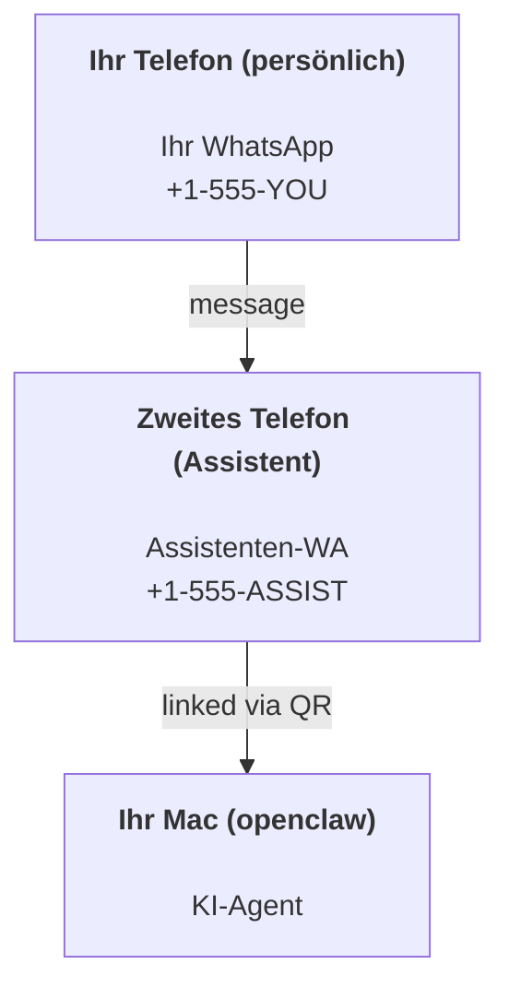

---
read_when:
    - Onboarding einer neuen Assistenteninstanz
    - Prüfen von Sicherheits- und Berechtigungsimplikationen
summary: End-to-End-Anleitung zum Ausführen von OpenClaw als persönlicher Assistent mit Sicherheitshinweisen
title: Einrichtung eines persönlichen Assistenten
x-i18n:
    generated_at: "2026-04-05T12:56:20Z"
    model: gpt-5.4
    provider: openai
    source_hash: 02f10a9f7ec08f71143cbae996d91cbdaa19897a40f725d8ef524def41cf2759
    source_path: start/openclaw.md
    workflow: 15
---

# Einen persönlichen Assistenten mit OpenClaw aufbauen

OpenClaw ist ein selbst gehostetes Gateway, das Discord, Google Chat, iMessage, Matrix, Microsoft Teams, Signal, Slack, Telegram, WhatsApp, Zalo und mehr mit KI-Agenten verbindet. Diese Anleitung behandelt das Setup für einen „persönlichen Assistenten“: eine dedizierte WhatsApp-Nummer, die sich wie Ihr ständig verfügbarer KI-Assistent verhält.

## ⚠️ Sicherheit zuerst

Sie bringen einen Agenten in die Lage:

- Befehle auf Ihrem Rechner auszuführen (abhängig von Ihrer Tool-Richtlinie)
- Dateien in Ihrem Workspace zu lesen/zu schreiben
- Nachrichten über WhatsApp/Telegram/Discord/Mattermost und andere gebündelte Kanäle wieder nach außen zu senden

Beginnen Sie konservativ:

- Setzen Sie immer `channels.whatsapp.allowFrom` (führen Sie es niemals offen für alle auf Ihrem persönlichen Mac aus).
- Verwenden Sie für den Assistenten eine dedizierte WhatsApp-Nummer.
- Heartbeats sind jetzt standardmäßig auf alle 30 Minuten gesetzt. Deaktivieren Sie sie, bis Sie dem Setup vertrauen, indem Sie `agents.defaults.heartbeat.every: "0m"` setzen.

## Voraussetzungen

- OpenClaw ist installiert und das Onboarding wurde durchgeführt — siehe [Erste Schritte](/de/start/getting-started), wenn Sie das noch nicht getan haben
- Eine zweite Telefonnummer (SIM/eSIM/Prepaid) für den Assistenten

## Das Zwei-Telefone-Setup (empfohlen)

Sie möchten Folgendes:



Wenn Sie Ihr persönliches WhatsApp mit OpenClaw verknüpfen, wird jede Nachricht an Sie zu „Agent-Eingabe“. Das ist selten das, was Sie möchten.

## 5-Minuten-Schnellstart

1. WhatsApp Web koppeln (zeigt QR-Code; mit dem Assistententelefon scannen):

```bash
openclaw channels login
```

2. Das Gateway starten (laufen lassen):

```bash
openclaw gateway --port 18789
```

3. Eine minimale Konfiguration in `~/.openclaw/openclaw.json` eintragen:

```json5
{
  gateway: { mode: "local" },
  channels: { whatsapp: { allowFrom: ["+15555550123"] } },
}
```

Senden Sie jetzt von Ihrem in der Allowlist stehenden Telefon eine Nachricht an die Assistentennummer.

Wenn das Onboarding abgeschlossen ist, öffnen wir automatisch das Dashboard und geben einen sauberen (nicht tokenisierten) Link aus. Wenn eine Authentifizierung angefordert wird, fügen Sie das konfigurierte Shared Secret in die Einstellungen der Control UI ein. Das Onboarding verwendet standardmäßig ein Token (`gateway.auth.token`), aber Passwort-Authentifizierung funktioniert ebenfalls, wenn Sie `gateway.auth.mode` auf `password` umgestellt haben. Später erneut öffnen: `openclaw dashboard`.

## Dem Agenten einen Workspace geben (AGENTS)

OpenClaw liest Betriebsanweisungen und „Memory“ aus seinem Workspace-Verzeichnis.

Standardmäßig verwendet OpenClaw `~/.openclaw/workspace` als Agent-Workspace und erstellt ihn (plus anfängliche Dateien `AGENTS.md`, `SOUL.md`, `TOOLS.md`, `IDENTITY.md`, `USER.md`, `HEARTBEAT.md`) automatisch bei der Einrichtung/beim ersten Agent-Lauf. `BOOTSTRAP.md` wird nur erstellt, wenn der Workspace ganz neu ist (es sollte nicht zurückkommen, nachdem Sie es gelöscht haben). `MEMORY.md` ist optional (wird nicht automatisch erstellt); wenn vorhanden, wird es für normale Sitzungen geladen. Subagent-Sitzungen injizieren nur `AGENTS.md` und `TOOLS.md`.

Tipp: Behandeln Sie diesen Ordner wie das „Memory“ von OpenClaw und machen Sie ihn zu einem Git-Repository (idealerweise privat), damit Ihre Dateien `AGENTS.md` + Memory gesichert sind. Wenn Git installiert ist, werden brandneue Workspaces automatisch initialisiert.

```bash
openclaw setup
```

Vollständiges Workspace-Layout + Backup-Anleitung: [Agent-Workspace](/de/concepts/agent-workspace)
Memory-Workflow: [Memory](/de/concepts/memory)

Optional: Wählen Sie mit `agents.defaults.workspace` einen anderen Workspace (unterstützt `~`).

```json5
{
  agent: {
    workspace: "~/.openclaw/workspace",
  },
}
```

Wenn Sie bereits eigene Workspace-Dateien aus einem Repository bereitstellen, können Sie die Erstellung von Bootstrap-Dateien vollständig deaktivieren:

```json5
{
  agent: {
    skipBootstrap: true,
  },
}
```

## Die Konfiguration, die daraus „einen Assistenten“ macht

OpenClaw verwendet standardmäßig ein gutes Assistenten-Setup, aber normalerweise sollten Sie Folgendes anpassen:

- Persona/Anweisungen in [`SOUL.md`](/de/concepts/soul)
- Thinking-Standards (falls gewünscht)
- Heartbeats (sobald Sie dem System vertrauen)

Beispiel:

```json5
{
  logging: { level: "info" },
  agent: {
    model: "anthropic/claude-opus-4-6",
    workspace: "~/.openclaw/workspace",
    thinkingDefault: "high",
    timeoutSeconds: 1800,
    // Mit 0 beginnen; später aktivieren.
    heartbeat: { every: "0m" },
  },
  channels: {
    whatsapp: {
      allowFrom: ["+15555550123"],
      groups: {
        "*": { requireMention: true },
      },
    },
  },
  routing: {
    groupChat: {
      mentionPatterns: ["@openclaw", "openclaw"],
    },
  },
  session: {
    scope: "per-sender",
    resetTriggers: ["/new", "/reset"],
    reset: {
      mode: "daily",
      atHour: 4,
      idleMinutes: 10080,
    },
  },
}
```

## Sitzungen und Memory

- Sitzungsdateien: `~/.openclaw/agents/<agentId>/sessions/{{SessionId}}.jsonl`
- Sitzungsmetadaten (Token-Nutzung, letzte Route usw.): `~/.openclaw/agents/<agentId>/sessions/sessions.json` (alt: `~/.openclaw/sessions/sessions.json`)
- `/new` oder `/reset` startet eine frische Sitzung für diesen Chat (konfigurierbar über `resetTriggers`). Wenn es allein gesendet wird, antwortet der Agent mit einem kurzen Hallo zur Bestätigung des Resets.
- `/compact [instructions]` kompaktiert den Sitzungskontext und meldet das verbleibende Kontextbudget.

## Heartbeats (proaktiver Modus)

Standardmäßig führt OpenClaw alle 30 Minuten einen Heartbeat mit folgendem Prompt aus:
`Read HEARTBEAT.md if it exists (workspace context). Follow it strictly. Do not infer or repeat old tasks from prior chats. If nothing needs attention, reply HEARTBEAT_OK.`
Setzen Sie `agents.defaults.heartbeat.every: "0m"`, um dies zu deaktivieren.

- Wenn `HEARTBEAT.md` existiert, aber faktisch leer ist (nur Leerzeilen und Markdown-Überschriften wie `# Heading`), überspringt OpenClaw den Heartbeat-Lauf, um API-Aufrufe zu sparen.
- Wenn die Datei fehlt, wird der Heartbeat trotzdem ausgeführt, und das Modell entscheidet, was zu tun ist.
- Wenn der Agent mit `HEARTBEAT_OK` antwortet (optional mit kurzem Padding; siehe `agents.defaults.heartbeat.ackMaxChars`), unterdrückt OpenClaw die ausgehende Zustellung für diesen Heartbeat.
- Standardmäßig ist die Heartbeat-Zustellung an DM-artige Ziele `user:<id>` erlaubt. Setzen Sie `agents.defaults.heartbeat.directPolicy: "block"`, um die Zustellung an direkte Ziele zu unterdrücken, während Heartbeat-Läufe aktiv bleiben.
- Heartbeats führen vollständige Agent-Turns aus — kürzere Intervalle verbrauchen mehr Tokens.

```json5
{
  agent: {
    heartbeat: { every: "30m" },
  },
}
```

## Medien rein und raus

Eingehende Anhänge (Bilder/Audio/Dokumente) können über Vorlagen an Ihren Befehl übergeben werden:

- `{{MediaPath}}` (lokaler temporärer Dateipfad)
- `{{MediaUrl}}` (Pseudo-URL)
- `{{Transcript}}` (wenn Audio-Transkription aktiviert ist)

Ausgehende Anhänge vom Agenten: Fügen Sie `MEDIA:<path-or-url>` in einer eigenen Zeile ein (ohne Leerzeichen). Beispiel:

```
Here’s the screenshot.
MEDIA:https://example.com/screenshot.png
```

OpenClaw extrahiert diese und sendet sie zusammen mit dem Text als Medien.

Das Verhalten lokaler Pfade folgt demselben Vertrauensmodell für Dateilesen wie der Agent:

- Wenn `tools.fs.workspaceOnly` auf `true` gesetzt ist, bleiben lokale ausgehende `MEDIA:`-Pfade auf das temporäre OpenClaw-Root, den Medien-Cache, Agent-Workspace-Pfade und von der Sandbox erzeugte Dateien beschränkt.
- Wenn `tools.fs.workspaceOnly` auf `false` gesetzt ist, kann ausgehendes `MEDIA:` hostlokale Dateien verwenden, die der Agent bereits lesen darf.
- Hostlokale Sendungen erlauben weiterhin nur Medien und sichere Dokumenttypen (Bilder, Audio, Video, PDF und Office-Dokumente). Klartext und geheimnisähnliche Dateien werden nicht als sendbare Medien behandelt.

Das bedeutet, dass erzeugte Bilder/Dateien außerhalb des Workspace jetzt gesendet werden können, wenn Ihre FS-Richtlinie diese Lesezugriffe bereits erlaubt, ohne beliebige Exfiltration von Host-Textanhängen erneut zu öffnen.

## Checkliste für den Betrieb

```bash
openclaw status          # lokaler Status (Anmeldedaten, Sitzungen, eingereihte Ereignisse)
openclaw status --all    # vollständige Diagnose (schreibgeschützt, zum Einfügen geeignet)
openclaw status --deep   # fragt das Gateway nach einem Live-Health-Check mit Kanal-Probes, wenn unterstützt
openclaw health --json   # Gateway-Health-Snapshot (WS; Standard kann einen neuen gecachten Snapshot zurückgeben)
```

Logs liegen unter `/tmp/openclaw/` (Standard: `openclaw-YYYY-MM-DD.log`).

## Nächste Schritte

- WebChat: [WebChat](/web/webchat)
- Gateway-Betrieb: [Gateway-Runbook](/de/gateway)
- Cron + Weckaufrufe: [Cron-Jobs](/de/automation/cron-jobs)
- macOS-Menüleisten-Begleiter: [OpenClaw macOS-App](/platforms/macos)
- iOS-Node-App: [iOS-App](/de/platforms/ios)
- Android-Node-App: [Android-App](/de/platforms/android)
- Windows-Status: [Windows (WSL2)](/platforms/windows)
- Linux-Status: [Linux-App](/de/platforms/linux)
- Sicherheit: [Sicherheit](/de/gateway/security)
