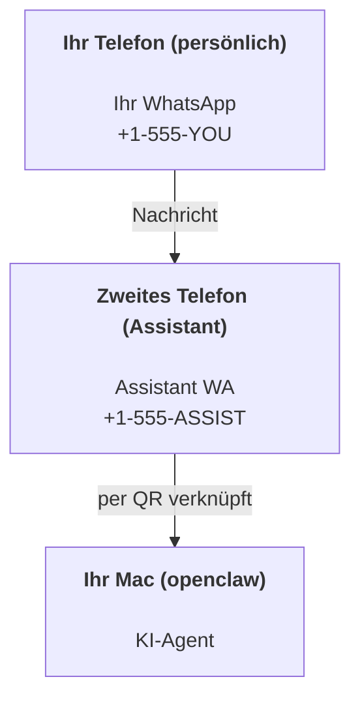

---
read_when:
    - Onboarding einer neuen Assistant-Instanz.
    - Sicherheits-/Berechtigungsimplikationen prüfen.
summary: End-to-End-Anleitung, um OpenClaw als persönlichen Assistant auszuführen, mit Sicherheitshinweisen
title: Einrichtung als persönlicher Assistant
x-i18n:
    generated_at: "2026-04-24T07:00:22Z"
    model: gpt-5.4
    provider: openai
    source_hash: 3048f2faae826fc33d962f1fac92da3c0ce464d2de803fee381c897eb6c76436
    source_path: start/openclaw.md
    workflow: 15
---

# Einen persönlichen Assistant mit OpenClaw erstellen

OpenClaw ist ein selbstgehostetes Gateway, das Discord, Google Chat, iMessage, Matrix, Microsoft Teams, Signal, Slack, Telegram, WhatsApp, Zalo und mehr mit KI-Agenten verbindet. Diese Anleitung behandelt das Setup „persönlicher Assistant“: eine dedizierte WhatsApp-Nummer, die sich wie Ihr immer aktiver KI-Assistent verhält.

## ⚠️ Sicherheit zuerst

Sie bringen einen Agenten in eine Position, in der er:

- Befehle auf Ihrem Rechner ausführen kann (abhängig von Ihrer Tool-Richtlinie)
- Dateien in Ihrem Workspace lesen/schreiben kann
- Nachrichten über WhatsApp/Telegram/Discord/Mattermost und andere gebündelte Kanäle zurücksenden kann

Starten Sie konservativ:

- Setzen Sie immer `channels.whatsapp.allowFrom` (führen Sie es niemals offen für die ganze Welt auf Ihrem persönlichen Mac aus).
- Verwenden Sie für den Assistant eine dedizierte WhatsApp-Nummer.
- Heartbeats sind jetzt standardmäßig alle 30 Minuten aktiv. Deaktivieren Sie sie, bis Sie dem Setup vertrauen, indem Sie `agents.defaults.heartbeat.every: "0m"` setzen.

## Voraussetzungen

- OpenClaw installiert und das Onboarding abgeschlossen — siehe [Erste Schritte](/de/start/getting-started), falls Sie das noch nicht getan haben
- Eine zweite Telefonnummer (SIM/eSIM/Prepaid) für den Assistant

## Das Zwei-Telefon-Setup (empfohlen)

Sie möchten Folgendes:



Wenn Sie Ihr persönliches WhatsApp mit OpenClaw verknüpfen, wird jede Nachricht an Sie zu „Agenteneingabe“. Das ist selten das, was Sie möchten.

## 5-Minuten-Schnellstart

1. WhatsApp Web koppeln (zeigt QR; mit dem Assistant-Telefon scannen):

```bash
openclaw channels login
```

2. Das Gateway starten (laufen lassen):

```bash
openclaw gateway --port 18789
```

3. Eine minimale Konfiguration in `~/.openclaw/openclaw.json` eintragen:

```json5
{
  gateway: { mode: "local" },
  channels: { whatsapp: { allowFrom: ["+15555550123"] } },
}
```

Senden Sie jetzt von Ihrem erlaubten Telefon aus eine Nachricht an die Assistant-Nummer.

Wenn das Onboarding abgeschlossen ist, öffnet OpenClaw automatisch das Dashboard und gibt einen sauberen (nicht tokenisierten) Link aus. Wenn das Dashboard nach Authentifizierung fragt, fügen Sie das konfigurierte Shared Secret in die Einstellungen der Control UI ein. Das Onboarding verwendet standardmäßig ein Token (`gateway.auth.token`), aber Passwortauthentifizierung funktioniert ebenfalls, wenn Sie `gateway.auth.mode` auf `password` umgestellt haben. Später erneut öffnen: `openclaw dashboard`.

## Dem Agenten einen Workspace geben (AGENTS)

OpenClaw liest Betriebsanweisungen und „Memory“ aus seinem Workspace-Verzeichnis.

Standardmäßig verwendet OpenClaw `~/.openclaw/workspace` als Agent-Workspace und erstellt ihn (plus Starter-Dateien `AGENTS.md`, `SOUL.md`, `TOOLS.md`, `IDENTITY.md`, `USER.md`, `HEARTBEAT.md`) automatisch beim Setup/beim ersten Agent-Lauf. `BOOTSTRAP.md` wird nur erstellt, wenn der Workspace brandneu ist (sie sollte nach dem Löschen nicht wieder auftauchen). `MEMORY.md` ist optional (wird nicht automatisch erstellt); wenn vorhanden, wird sie für normale Sitzungen geladen. Subagent-Sitzungen injizieren nur `AGENTS.md` und `TOOLS.md`.

Tipp: Behandeln Sie diesen Ordner wie das „Gedächtnis“ von OpenClaw und machen Sie ihn zu einem Git-Repo (idealerweise privat), damit Ihre `AGENTS.md`- und Memory-Dateien gesichert sind. Wenn Git installiert ist, werden brandneue Workspaces automatisch initialisiert.

```bash
openclaw setup
```

Vollständiges Workspace-Layout + Backup-Anleitung: [Agent workspace](/de/concepts/agent-workspace)
Memory-Workflow: [Memory](/de/concepts/memory)

Optional: Wählen Sie einen anderen Workspace mit `agents.defaults.workspace` (unterstützt `~`).

```json5
{
  agent: {
    workspace: "~/.openclaw/workspace",
  },
}
```

Wenn Sie bereits eigene Workspace-Dateien aus einem Repo bereitstellen, können Sie die Erstellung von Bootstrap-Dateien vollständig deaktivieren:

```json5
{
  agent: {
    skipBootstrap: true,
  },
}
```

## Die Konfiguration, die es zu „einem Assistant“ macht

OpenClaw verwendet standardmäßig ein gutes Assistant-Setup, aber normalerweise möchten Sie Folgendes anpassen:

- Persona/Anweisungen in [`SOUL.md`](/de/concepts/soul)
- Thinking-Standards (falls gewünscht)
- Heartbeats (sobald Sie dem Setup vertrauen)

Beispiel:

```json5
{
  logging: { level: "info" },
  agent: {
    model: "anthropic/claude-opus-4-6",
    workspace: "~/.openclaw/workspace",
    thinkingDefault: "high",
    timeoutSeconds: 1800,
    // Mit 0 starten; später aktivieren.
    heartbeat: { every: "0m" },
  },
  channels: {
    whatsapp: {
      allowFrom: ["+15555550123"],
      groups: {
        "*": { requireMention: true },
      },
    },
  },
  routing: {
    groupChat: {
      mentionPatterns: ["@openclaw", "openclaw"],
    },
  },
  session: {
    scope: "per-sender",
    resetTriggers: ["/new", "/reset"],
    reset: {
      mode: "daily",
      atHour: 4,
      idleMinutes: 10080,
    },
  },
}
```

## Sitzungen und Memory

- Sitzungsdateien: `~/.openclaw/agents/<agentId>/sessions/{{SessionId}}.jsonl`
- Sitzungsmetadaten (Token-Nutzung, letzte Route usw.): `~/.openclaw/agents/<agentId>/sessions/sessions.json` (Legacy: `~/.openclaw/sessions/sessions.json`)
- `/new` oder `/reset` startet eine frische Sitzung für diesen Chat (konfigurierbar über `resetTriggers`). Wenn der Befehl allein gesendet wird, antwortet der Agent mit einer kurzen Begrüßung, um das Zurücksetzen zu bestätigen.
- `/compact [instructions]` kompaktiert den Sitzungskontext und meldet das verbleibende Kontextbudget.

## Heartbeats (proaktiver Modus)

Standardmäßig führt OpenClaw alle 30 Minuten einen Heartbeat mit folgendem Prompt aus:
`Read HEARTBEAT.md if it exists (workspace context). Follow it strictly. Do not infer or repeat old tasks from prior chats. If nothing needs attention, reply HEARTBEAT_OK.`
Setzen Sie `agents.defaults.heartbeat.every: "0m"`, um dies zu deaktivieren.

- Wenn `HEARTBEAT.md` existiert, aber effektiv leer ist (nur leere Zeilen und Markdown-Überschriften wie `# Heading`), überspringt OpenClaw den Heartbeat-Lauf, um API-Aufrufe zu sparen.
- Wenn die Datei fehlt, läuft der Heartbeat trotzdem und das Modell entscheidet, was zu tun ist.
- Wenn der Agent mit `HEARTBEAT_OK` antwortet (optional mit kurzem Padding; siehe `agents.defaults.heartbeat.ackMaxChars`), unterdrückt OpenClaw die ausgehende Zustellung für diesen Heartbeat.
- Standardmäßig ist Heartbeat-Zustellung an Ziele im DM-Stil `user:<id>` erlaubt. Setzen Sie `agents.defaults.heartbeat.directPolicy: "block"`, um direkte Zielzustellung zu unterdrücken, während Heartbeat-Läufe aktiv bleiben.
- Heartbeats führen vollständige Agent-Turns aus — kürzere Intervalle verbrauchen mehr Tokens.

```json5
{
  agent: {
    heartbeat: { every: "30m" },
  },
}
```

## Medien ein- und ausgehend

Eingehende Anhänge (Bilder/Audio/Dokumente) können Ihrem Befehl über Templates bereitgestellt werden:

- `{{MediaPath}}` (lokaler temporärer Dateipfad)
- `{{MediaUrl}}` (Pseudo-URL)
- `{{Transcript}}` (wenn Audiotranskription aktiviert ist)

Ausgehende Anhänge vom Agenten: Fügen Sie `MEDIA:<path-or-url>` in einer eigenen Zeile ein (ohne Leerzeichen). Beispiel:

```
Here’s the screenshot.
MEDIA:https://example.com/screenshot.png
```

OpenClaw extrahiert dies und sendet es als Medium zusammen mit dem Text.

Das Verhalten bei lokalen Pfaden folgt demselben Vertrauensmodell beim Lesen von Dateien wie der Agent:

- Wenn `tools.fs.workspaceOnly` auf `true` gesetzt ist, bleiben lokale Pfade in ausgehendem `MEDIA:` auf die OpenClaw-Temp-Root, den Medien-Cache, Agent-Workspace-Pfade und in der Sandbox erzeugte Dateien beschränkt.
- Wenn `tools.fs.workspaceOnly` auf `false` gesetzt ist, kann ausgehendes `MEDIA:` hostlokale Dateien verwenden, die der Agent ohnehin lesen darf.
- Hostlokale Sendungen erlauben weiterhin nur Medien und sichere Dokumenttypen (Bilder, Audio, Video, PDF und Office-Dokumente). Reiner Text und geheimnisähnliche Dateien werden nicht als sendbare Medien behandelt.

Das bedeutet, dass generierte Bilder/Dateien außerhalb des Workspace jetzt gesendet werden können, wenn Ihre fs-Richtlinie diese Reads bereits erlaubt, ohne die Exfiltration beliebiger Host-Textanhänge erneut zu öffnen.

## Checkliste für den Betrieb

```bash
openclaw status          # lokaler Status (Zugangsdaten, Sitzungen, Ereignisse in der Warteschlange)
openclaw status --all    # vollständige Diagnose (schreibgeschützt, einfügbar)
openclaw status --deep   # fragt das Gateway nach einer Live-Health-Probe mit Kanal-Probes, wenn unterstützt
openclaw health --json   # Gateway-Health-Snapshot (WS; Standard kann einen frischen gecachten Snapshot zurückgeben)
```

Logs liegen unter `/tmp/openclaw/` (Standard: `openclaw-YYYY-MM-DD.log`).

## Nächste Schritte

- WebChat: [WebChat](/de/web/webchat)
- Gateway-Betrieb: [Gateway runbook](/de/gateway)
- Cron + Weckrufe: [Cron jobs](/de/automation/cron-jobs)
- macOS-Menüleisten-Begleiter: [OpenClaw macOS app](/de/platforms/macos)
- iOS-Node-App: [iOS app](/de/platforms/ios)
- Android-Node-App: [Android app](/de/platforms/android)
- Windows-Status: [Windows (WSL2)](/de/platforms/windows)
- Linux-Status: [Linux app](/de/platforms/linux)
- Sicherheit: [Security](/de/gateway/security)

## Verwandt

- [Getting started](/de/start/getting-started)
- [Setup](/de/start/setup)
- [Channels overview](/de/channels)
