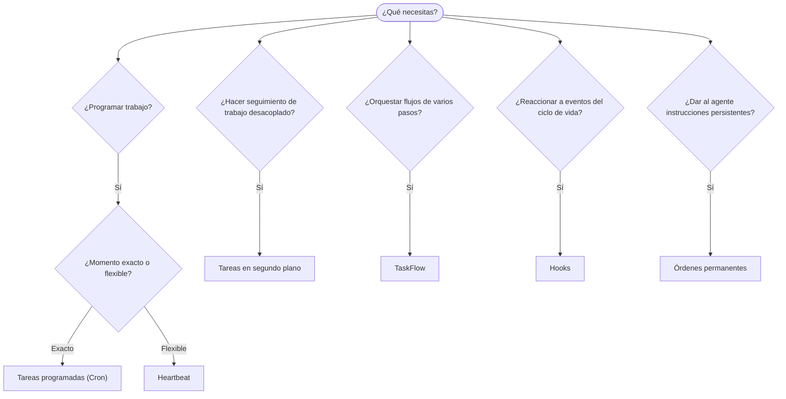

---
read_when:
    - Decidir cómo automatizar el trabajo con OpenClaw
    - Elegir entre Heartbeat, Cron, hooks y órdenes permanentes
    - Buscar el punto de entrada de automatización adecuado
summary: 'Resumen de los mecanismos de automatización: tareas, cron, hooks, órdenes permanentes y flujo de tareas'
title: Automatización y tareas
x-i18n:
    generated_at: "2026-04-25T13:41:01Z"
    model: gpt-5.4
    provider: openai
    source_hash: 54524eb5d1fcb2b2e3e51117339be1949d980afaef1f6ae71fcfd764049f3f47
    source_path: automation/index.md
    workflow: 15
---

OpenClaw ejecuta trabajo en segundo plano mediante tareas, trabajos programados, hooks de eventos e instrucciones permanentes. Esta página te ayuda a elegir el mecanismo adecuado y a entender cómo encajan entre sí.

## Guía rápida de decisión

| Caso de uso                             | Recomendado            | Por qué                                          |
| --------------------------------------- | ---------------------- | ------------------------------------------------ |
| Enviar informe diario a las 9:00 en punto | Tareas programadas (Cron) | Momento exacto, ejecución aislada                |
| Recuérdame en 20 minutos                | Tareas programadas (Cron) | Ejecución única con momento preciso (`--at`)     |
| Ejecutar un análisis profundo semanal   | Tareas programadas (Cron) | Tarea independiente, puede usar un modelo distinto |
| Revisar la bandeja de entrada cada 30 min | Heartbeat              | Agrupa con otras comprobaciones, consciente del contexto |
| Supervisar el calendario para próximos eventos | Heartbeat              | Encaja de forma natural con la supervisión periódica |
| Inspeccionar el estado de un subagente o una ejecución de ACP | Tareas en segundo plano | El registro de tareas rastrea todo el trabajo desacoplado |
| Auditar qué se ejecutó y cuándo         | Tareas en segundo plano | `openclaw tasks list` y `openclaw tasks audit`   |
| Investigación de varios pasos y luego resumir | TaskFlow              | Orquestación duradera con seguimiento de revisiones |
| Ejecutar un script al reiniciar la sesión | Hooks                  | Impulsado por eventos, se activa en eventos del ciclo de vida |
| Ejecutar código en cada llamada a herramientas | Hooks de Plugin      | Los hooks en proceso pueden interceptar llamadas a herramientas |
| Comprobar siempre el cumplimiento antes de responder | Órdenes permanentes | Se inyectan automáticamente en cada sesión       |

### Tareas programadas (Cron) vs Heartbeat

| Dimensión       | Tareas programadas (Cron)           | Heartbeat                            |
| --------------- | ----------------------------------- | ------------------------------------ |
| Momento         | Exacto (expresiones cron, ejecución única) | Aproximado (cada 30 min por defecto) |
| Contexto de sesión | Nuevo (aislado) o compartido     | Contexto completo de la sesión principal |
| Registros de tareas | Siempre se crean                | Nunca se crean                       |
| Entrega         | Canal, Webhook o silenciosa         | En línea en la sesión principal      |
| Ideal para      | Informes, recordatorios, trabajos en segundo plano | Revisiones de bandeja de entrada, calendario, notificaciones |

Usa Tareas programadas (Cron) cuando necesites un momento preciso o una ejecución aislada. Usa Heartbeat cuando el trabajo se beneficie del contexto completo de la sesión y el momento aproximado sea suficiente.

## Conceptos principales

### Tareas programadas (cron)

Cron es el programador integrado de Gateway para momentos precisos. Persiste los trabajos, activa al agente en el momento adecuado y puede entregar la salida a un canal de chat o a un endpoint de Webhook. Admite recordatorios de una sola ejecución, expresiones recurrentes y disparadores de Webhook entrantes.

Consulta [Tareas programadas](/es/automation/cron-jobs).

### Tareas

El registro de tareas en segundo plano rastrea todo el trabajo desacoplado: ejecuciones de ACP, inicios de subagentes, ejecuciones aisladas de cron y operaciones de CLI. Las tareas son registros, no programadores. Usa `openclaw tasks list` y `openclaw tasks audit` para inspeccionarlas.

Consulta [Tareas en segundo plano](/es/automation/tasks).

### TaskFlow

TaskFlow es el sustrato de orquestación de flujos por encima de las tareas en segundo plano. Gestiona flujos duraderos de varios pasos con modos de sincronización administrados y reflejados, seguimiento de revisiones y `openclaw tasks flow list|show|cancel` para inspección.

Consulta [TaskFlow](/es/automation/taskflow).

### Órdenes permanentes

Las órdenes permanentes otorgan al agente autoridad operativa permanente para programas definidos. Residen en archivos del espacio de trabajo (normalmente `AGENTS.md`) y se inyectan en cada sesión. Combínalas con cron para una aplicación basada en tiempo.

Consulta [Órdenes permanentes](/es/automation/standing-orders).

### Hooks

Los hooks internos son scripts impulsados por eventos que se activan mediante eventos del ciclo de vida del agente
(`/new`, `/reset`, `/stop`), Compaction de sesión, inicio de gateway y flujo
de mensajes. Se detectan automáticamente desde directorios y se pueden gestionar
con `openclaw hooks`. Para la interceptación en proceso de llamadas a herramientas, usa
[hooks de Plugin](/es/plugins/hooks).

Consulta [Hooks](/es/automation/hooks).

### Heartbeat

Heartbeat es un turno periódico de la sesión principal (cada 30 minutos por defecto). Agrupa varias comprobaciones (bandeja de entrada, calendario, notificaciones) en un turno del agente con contexto completo de la sesión. Los turnos de Heartbeat no crean registros de tareas. Usa `HEARTBEAT.md` para una pequeña lista de comprobación, o un bloque `tasks:` cuando quieras comprobaciones periódicas solo cuando correspondan dentro del propio heartbeat. Los archivos heartbeat vacíos se omiten como `empty-heartbeat-file`; el modo de tareas solo cuando correspondan se omite como `no-tasks-due`.

Consulta [Heartbeat](/es/gateway/heartbeat).

## Cómo funcionan juntos

- **Cron** gestiona horarios precisos (informes diarios, revisiones semanales) y recordatorios de una sola ejecución. Todas las ejecuciones de cron crean registros de tareas.
- **Heartbeat** gestiona la supervisión rutinaria (bandeja de entrada, calendario, notificaciones) en un turno agrupado cada 30 minutos.
- **Hooks** reaccionan a eventos específicos (reinicios de sesión, Compaction, flujo de mensajes) con scripts personalizados. Los hooks de Plugin cubren las llamadas a herramientas.
- **Órdenes permanentes** dan al agente contexto persistente y límites de autoridad.
- **TaskFlow** coordina flujos de varios pasos por encima de tareas individuales.
- **Tareas** rastrean automáticamente todo el trabajo desacoplado para que puedas inspeccionarlo y auditarlo.

## Relacionado

- [Tareas programadas](/es/automation/cron-jobs) — programación precisa y recordatorios de una sola ejecución
- [Tareas en segundo plano](/es/automation/tasks) — registro de tareas para todo el trabajo desacoplado
- [TaskFlow](/es/automation/taskflow) — orquestación duradera de flujos de varios pasos
- [Hooks](/es/automation/hooks) — scripts del ciclo de vida impulsados por eventos
- [hooks de Plugin](/es/plugins/hooks) — hooks en proceso de herramientas, prompts, mensajes y ciclo de vida
- [Órdenes permanentes](/es/automation/standing-orders) — instrucciones persistentes para el agente
- [Heartbeat](/es/gateway/heartbeat) — turnos periódicos de la sesión principal
- [Referencia de configuración](/es/gateway/configuration-reference) — todas las claves de configuración
