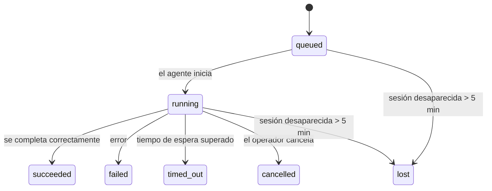

---
read_when:
    - Inspeccionar trabajo en segundo plano en curso o completado recientemente
    - Depurar fallas de entrega en ejecuciones desacopladas del agente
    - Comprender cómo se relacionan las ejecuciones en segundo plano con las sesiones, cron y heartbeat
summary: Seguimiento de tareas en segundo plano para ejecuciones de ACP, subagentes, trabajos cron aislados y operaciones de CLI
title: Tareas en segundo plano
x-i18n:
    generated_at: "2026-04-06T03:06:32Z"
    model: gpt-5.4
    provider: openai
    source_hash: 2f56c1ac23237907a090c69c920c09578a2f56f5d8bf750c7f2136c603c8a8ff
    source_path: automation/tasks.md
    workflow: 15
---

# Tareas en segundo plano

> **¿Buscas programación?** Consulta [Automatización y tareas](/es/automation) para elegir el mecanismo adecuado. Esta página cubre el **seguimiento** del trabajo en segundo plano, no su programación.

Las tareas en segundo plano registran trabajo que se ejecuta **fuera de tu sesión principal de conversación**:
ejecuciones de ACP, lanzamientos de subagentes, ejecuciones aisladas de trabajos cron y operaciones iniciadas desde la CLI.

Las tareas **no** reemplazan a las sesiones, los trabajos cron ni a heartbeat; son el **registro de actividad** que anota qué trabajo desacoplado ocurrió, cuándo ocurrió y si se completó correctamente.

<Note>
No todas las ejecuciones de agentes crean una tarea. Los turnos de heartbeat y el chat interactivo normal no lo hacen. Todas las ejecuciones cron, lanzamientos de ACP, lanzamientos de subagentes y comandos de agente de CLI sí lo hacen.
</Note>

## Resumen rápido

- Las tareas son **registros**, no programadores: cron y heartbeat deciden _cuándo_ se ejecuta el trabajo; las tareas registran _qué ocurrió_.
- ACP, los subagentes, todos los trabajos cron y las operaciones de CLI crean tareas. Los turnos de heartbeat no.
- Cada tarea pasa por `queued → running → terminal` (`succeeded`, `failed`, `timed_out`, `cancelled` o `lost`).
- Las tareas cron siguen activas mientras el entorno de ejecución cron siga siendo propietario del trabajo; las tareas de CLI respaldadas por chat siguen activas solo mientras su contexto de ejecución propietario siga activo.
- La finalización es impulsada por envíos: el trabajo desacoplado puede notificar directamente o despertar la sesión solicitante/heartbeat cuando termina, por lo que los bucles de sondeo de estado normalmente no son el enfoque adecuado.
- Las ejecuciones cron aisladas y las finalizaciones de subagentes limpian, en la medida de lo posible, las pestañas/procesos del navegador rastreados para su sesión hija antes de la contabilidad final de limpieza.
- La entrega de cron aislado suprime las respuestas provisionales obsoletas del padre mientras el trabajo de subagentes descendientes aún se está vaciando, y prefiere la salida final del descendiente cuando esta llega antes de la entrega.
- Las notificaciones de finalización se entregan directamente a un canal o se ponen en cola para el siguiente heartbeat.
- `openclaw tasks list` muestra todas las tareas; `openclaw tasks audit` muestra los problemas.
- Los registros terminales se conservan durante 7 días y luego se eliminan automáticamente.

## Inicio rápido

```bash
# Listar todas las tareas (las más nuevas primero)
openclaw tasks list

# Filtrar por entorno de ejecución o estado
openclaw tasks list --runtime acp
openclaw tasks list --status running

# Mostrar detalles de una tarea específica (por ID, ID de ejecución o clave de sesión)
openclaw tasks show <lookup>

# Cancelar una tarea en ejecución (mata la sesión hija)
openclaw tasks cancel <lookup>

# Cambiar la política de notificaciones de una tarea
openclaw tasks notify <lookup> state_changes

# Ejecutar una auditoría de estado
openclaw tasks audit

# Previsualizar o aplicar mantenimiento
openclaw tasks maintenance
openclaw tasks maintenance --apply

# Inspeccionar el estado de TaskFlow
openclaw tasks flow list
openclaw tasks flow show <lookup>
openclaw tasks flow cancel <lookup>
```

## Qué crea una tarea

| Origen                 | Tipo de entorno de ejecución | Cuándo se crea un registro de tarea                    | Política de notificación predeterminada |
| ---------------------- | ---------------------------- | ------------------------------------------------------ | --------------------------------------- |
| Ejecuciones en segundo plano de ACP | `acp`        | Al generar una sesión hija de ACP                      | `done_only`                             |
| Orquestación de subagentes | `subagent`   | Al generar un subagente mediante `sessions_spawn`      | `done_only`                             |
| Trabajos cron (todos los tipos) | `cron`       | En cada ejecución cron (sesión principal y aislada)    | `silent`                                |
| Operaciones de CLI     | `cli`        | Comandos `openclaw agent` que se ejecutan mediante el gateway | `silent`                         |
| Trabajos multimedia del agente | `cli`        | Ejecuciones de `video_generate` respaldadas por sesión | `silent`                                |

Las tareas cron de sesión principal usan la política de notificación `silent` de forma predeterminada: crean registros para seguimiento, pero no generan notificaciones. Las tareas cron aisladas también usan `silent` de forma predeterminada, pero son más visibles porque se ejecutan en su propia sesión.

Las ejecuciones de `video_generate` respaldadas por sesión también usan la política de notificación `silent`. Siguen creando registros de tareas, pero la finalización se devuelve a la sesión original del agente como una activación interna para que el agente pueda escribir el mensaje de seguimiento y adjuntar por sí mismo el video terminado. Si activas `tools.media.asyncCompletion.directSend`, las finalizaciones asíncronas de `music_generate` y `video_generate` intentan primero una entrega directa al canal antes de volver a la ruta de activación de la sesión solicitante.

Mientras una tarea de `video_generate` respaldada por sesión siga activa, la herramienta también actúa como una barrera de seguridad: las llamadas repetidas a `video_generate` en esa misma sesión devuelven el estado de la tarea activa en lugar de iniciar una segunda generación concurrente. Usa `action: "status"` cuando quieras una consulta explícita de progreso/estado desde el lado del agente.

**Qué no crea tareas:**

- Turnos de heartbeat: sesión principal; consulta [Heartbeat](/es/gateway/heartbeat)
- Turnos normales de chat interactivo
- Respuestas directas a `/command`

## Ciclo de vida de la tarea



| Estado      | Qué significa                                                             |
| ----------- | ------------------------------------------------------------------------- |
| `queued`    | Creada, esperando a que el agente inicie                                  |
| `running`   | El turno del agente se está ejecutando activamente                        |
| `succeeded` | Completada correctamente                                                   |
| `failed`    | Completada con un error                                                    |
| `timed_out` | Superó el tiempo de espera configurado                                     |
| `cancelled` | Detenida por el operador mediante `openclaw tasks cancel`                 |
| `lost`      | El entorno de ejecución perdió el estado de respaldo autoritativo después de un período de gracia de 5 minutos |

Las transiciones ocurren automáticamente: cuando termina la ejecución del agente asociada, el estado de la tarea se actualiza para coincidir.

`lost` depende del entorno de ejecución:

- Tareas de ACP: desaparecieron los metadatos de respaldo de la sesión hija de ACP.
- Tareas de subagentes: la sesión hija de respaldo desapareció del almacén del agente de destino.
- Tareas cron: el entorno de ejecución cron ya no rastrea el trabajo como activo.
- Tareas de CLI: las tareas aisladas de sesión hija usan la sesión hija; en su lugar, las tareas de CLI respaldadas por chat usan el contexto de ejecución en vivo, por lo que las filas persistentes de sesión de canal/grupo/directa no las mantienen activas.

## Entrega y notificaciones

Cuando una tarea alcanza un estado terminal, OpenClaw te notifica. Hay dos rutas de entrega:

**Entrega directa**: si la tarea tiene un destino de canal (el `requesterOrigin`), el mensaje de finalización va directamente a ese canal (Telegram, Discord, Slack, etc.). Para las finalizaciones de subagentes, OpenClaw también conserva el enrutamiento de hilo/tema asociado cuando está disponible y puede completar un `to` o una cuenta faltantes a partir de la ruta almacenada de la sesión solicitante (`lastChannel` / `lastTo` / `lastAccountId`) antes de abandonar la entrega directa.

**Entrega en cola de sesión**: si la entrega directa falla o no se ha configurado un origen, la actualización se pone en cola como un evento del sistema en la sesión del solicitante y aparece en el siguiente heartbeat.

<Tip>
La finalización de una tarea activa un despertar inmediato de heartbeat para que veas el resultado rápidamente; no tienes que esperar al siguiente tick programado de heartbeat.
</Tip>

Eso significa que el flujo de trabajo habitual se basa en envíos: inicia el trabajo desacoplado una vez y luego deja que el entorno de ejecución te despierte o te notifique cuando se complete. Sondea el estado de la tarea solo cuando necesites depuración, intervención o una auditoría explícita.

### Políticas de notificación

Controlan cuánto recibes de cada tarea:

| Política              | Qué se entrega                                                          |
| --------------------- | ----------------------------------------------------------------------- |
| `done_only` (predeterminada) | Solo el estado terminal (`succeeded`, `failed`, etc.); **esta es la opción predeterminada** |
| `state_changes`       | Cada transición de estado y actualización de progreso                   |
| `silent`              | Nada en absoluto                                                        |

Cambia la política mientras una tarea está en ejecución:

```bash
openclaw tasks notify <lookup> state_changes
```

## Referencia de CLI

### `tasks list`

```bash
openclaw tasks list [--runtime <acp|subagent|cron|cli>] [--status <status>] [--json]
```

Columnas de salida: ID de tarea, tipo, estado, entrega, ID de ejecución, sesión hija, resumen.

### `tasks show`

```bash
openclaw tasks show <lookup>
```

El token de búsqueda acepta un ID de tarea, ID de ejecución o clave de sesión. Muestra el registro completo, incluidos tiempos, estado de entrega, error y resumen terminal.

### `tasks cancel`

```bash
openclaw tasks cancel <lookup>
```

Para tareas de ACP y subagentes, esto mata la sesión hija. El estado pasa a `cancelled` y se envía una notificación de entrega.

### `tasks notify`

```bash
openclaw tasks notify <lookup> <done_only|state_changes|silent>
```

### `tasks audit`

```bash
openclaw tasks audit [--json]
```

Muestra problemas operativos. Los hallazgos también aparecen en `openclaw status` cuando se detectan problemas.

| Hallazgo                  | Severidad | Activador                                             |
| ------------------------- | --------- | ----------------------------------------------------- |
| `stale_queued`            | warn      | En cola durante más de 10 minutos                     |
| `stale_running`           | error     | En ejecución durante más de 30 minutos                |
| `lost`                    | error     | Desapareció la propiedad de la tarea respaldada por el entorno de ejecución |
| `delivery_failed`         | warn      | La entrega falló y la política de notificación no es `silent` |
| `missing_cleanup`         | warn      | Tarea terminal sin marca temporal de limpieza         |
| `inconsistent_timestamps` | warn      | Violación de la cronología (por ejemplo, terminó antes de empezar) |

### `tasks maintenance`

```bash
openclaw tasks maintenance [--json]
openclaw tasks maintenance --apply [--json]
```

Úsalo para previsualizar o aplicar reconciliación, marcado de limpieza y depuración para las tareas y el estado de Task Flow.

La reconciliación depende del entorno de ejecución:

- Las tareas de ACP/subagentes comprueban su sesión hija de respaldo.
- Las tareas cron comprueban si el entorno de ejecución cron sigue siendo propietario del trabajo.
- Las tareas de CLI respaldadas por chat comprueban el contexto de ejecución en vivo propietario, no solo la fila de sesión del chat.

La limpieza tras la finalización también depende del entorno de ejecución:

- La finalización de subagentes cierra, en la medida de lo posible, las pestañas/procesos de navegador rastreados para la sesión hija antes de que continúe la limpieza del anuncio.
- La finalización de cron aislado cierra, en la medida de lo posible, las pestañas/procesos de navegador rastreados para la sesión cron antes de que la ejecución termine por completo.
- La entrega de cron aislado espera el seguimiento de subagentes descendientes cuando es necesario y suprime el texto obsoleto de confirmación del padre en lugar de anunciarlo.
- La entrega de finalización de subagentes prefiere el texto visible más reciente del asistente; si está vacío, recurre al texto más reciente saneado de tool/toolResult, y las ejecuciones de llamadas de herramientas que solo agotan el tiempo pueden reducirse a un breve resumen de progreso parcial.
- Los fallos de limpieza no ocultan el resultado real de la tarea.

### `tasks flow list|show|cancel`

```bash
openclaw tasks flow list [--status <status>] [--json]
openclaw tasks flow show <lookup> [--json]
openclaw tasks flow cancel <lookup>
```

Usa estos comandos cuando lo que te importa es el Task Flow orquestador, en lugar de un registro individual de tarea en segundo plano.

## Tablero de tareas del chat (`/tasks`)

Usa `/tasks` en cualquier sesión de chat para ver las tareas en segundo plano vinculadas a esa sesión. El tablero muestra tareas activas y completadas recientemente con entorno de ejecución, estado, tiempos y detalles de progreso o error.

Cuando la sesión actual no tiene tareas vinculadas visibles, `/tasks` recurre a recuentos de tareas locales del agente para que sigas teniendo una vista general sin filtrar detalles de otras sesiones.

Para el registro completo del operador, usa la CLI: `openclaw tasks list`.

## Integración de estado (presión de tareas)

`openclaw status` incluye un resumen de tareas de vistazo rápido:

```
Tasks: 3 queued · 2 running · 1 issues
```

El resumen informa:

- **activas**: recuento de `queued` + `running`
- **fallidas**: recuento de `failed` + `timed_out` + `lost`
- **por entorno de ejecución**: desglose por `acp`, `subagent`, `cron`, `cli`

Tanto `/status` como la herramienta `session_status` usan una instantánea de tareas consciente de la limpieza: se priorizan las tareas activas, se ocultan las filas completadas obsoletas y los fallos recientes solo aparecen cuando no queda trabajo activo. Esto mantiene la tarjeta de estado centrada en lo que importa en este momento.

## Almacenamiento y mantenimiento

### Dónde se almacenan las tareas

Los registros de tareas se conservan en SQLite en:

```
$OPENCLAW_STATE_DIR/tasks/runs.sqlite
```

El registro se carga en memoria al iniciar el gateway y sincroniza las escrituras con SQLite para asegurar durabilidad entre reinicios.

### Mantenimiento automático

Un barrido se ejecuta cada **60 segundos** y maneja tres cosas:

1. **Reconciliación**: comprueba si las tareas activas todavía tienen un respaldo autoritativo del entorno de ejecución. Las tareas de ACP/subagentes usan el estado de la sesión hija, las tareas cron usan la propiedad del trabajo activo y las tareas de CLI respaldadas por chat usan el contexto de ejecución propietario. Si ese estado de respaldo desaparece durante más de 5 minutos, la tarea se marca como `lost`.
2. **Marcado de limpieza**: establece una marca temporal `cleanupAfter` en las tareas terminales (`endedAt + 7 days`).
3. **Depuración**: elimina los registros que hayan superado su fecha `cleanupAfter`.

**Retención**: los registros de tareas terminales se conservan durante **7 días** y luego se eliminan automáticamente. No se requiere configuración.

## Cómo se relacionan las tareas con otros sistemas

### Tareas y Task Flow

[Task Flow](/es/automation/taskflow) es la capa de orquestación de flujos por encima de las tareas en segundo plano. Un solo flujo puede coordinar varias tareas a lo largo de su vida útil utilizando modos de sincronización administrados o reflejados. Usa `openclaw tasks` para inspeccionar registros individuales de tareas y `openclaw tasks flow` para inspeccionar el flujo orquestador.

Consulta [Task Flow](/es/automation/taskflow) para obtener más detalles.

### Tareas y cron

Una **definición** de trabajo cron vive en `~/.openclaw/cron/jobs.json`. **Cada** ejecución cron crea un registro de tarea, tanto en sesión principal como aislada. Las tareas cron de sesión principal usan de forma predeterminada la política de notificación `silent`, por lo que hacen seguimiento sin generar notificaciones.

Consulta [Trabajos cron](/es/automation/cron-jobs).

### Tareas y heartbeat

Las ejecuciones de heartbeat son turnos de sesión principal: no crean registros de tareas. Cuando una tarea se completa, puede activar un despertar de heartbeat para que veas el resultado con rapidez.

Consulta [Heartbeat](/es/gateway/heartbeat).

### Tareas y sesiones

Una tarea puede hacer referencia a un `childSessionKey` (donde se ejecuta el trabajo) y a un `requesterSessionKey` (quién lo inició). Las sesiones son el contexto de la conversación; las tareas son el seguimiento de actividad por encima de ese contexto.

### Tareas y ejecuciones de agentes

El `runId` de una tarea enlaza con la ejecución del agente que realiza el trabajo. Los eventos del ciclo de vida del agente (inicio, fin, error) actualizan automáticamente el estado de la tarea; no necesitas gestionar el ciclo de vida manualmente.

## Relacionado

- [Automatización y tareas](/es/automation): todos los mecanismos de automatización de un vistazo
- [Task Flow](/es/automation/taskflow): orquestación de flujos por encima de las tareas
- [Tareas programadas](/es/automation/cron-jobs): programación de trabajo en segundo plano
- [Heartbeat](/es/gateway/heartbeat): turnos periódicos de sesión principal
- [CLI: Tareas](/cli/index#tasks): referencia de comandos de CLI
