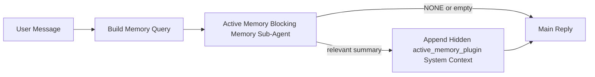

---
read_when:
    - Quieres entender para qué sirve la memoria activa
    - Quieres activar la memoria activa para un agente conversacional
    - Quieres ajustar el comportamiento de la memoria activa sin habilitarla en todas partes
summary: Un subagente de memoria de bloqueo propiedad del plugin que inyecta memoria relevante en las sesiones de chat interactivas
title: Memoria activa
x-i18n:
    generated_at: "2026-04-12T05:11:00Z"
    model: gpt-5.4
    provider: openai
    source_hash: 59456805c28daaab394ba2a7f87e1104a1334a5cf32dbb961d5d232d9c471d84
    source_path: concepts/active-memory.md
    workflow: 15
---

# Memoria activa

La memoria activa es un subagente opcional de memoria de bloqueo propiedad del plugin que se ejecuta
antes de la respuesta principal en las sesiones conversacionales aptas.

Existe porque la mayoría de los sistemas de memoria son capaces pero reactivos. Dependen de
que el agente principal decida cuándo buscar en la memoria, o de que el usuario diga cosas
como "recuerda esto" o "busca en la memoria". Para entonces, el momento en el que la memoria
habría hecho que la respuesta se sintiera natural ya pasó.

La memoria activa le da al sistema una oportunidad limitada para mostrar memoria relevante
antes de que se genere la respuesta principal.

## Pega esto en tu agente

Pega esto en tu agente si quieres que habilite la Memoria activa con una
configuración autocontenida y segura por defecto:

```json5
{
  plugins: {
    entries: {
      "active-memory": {
        enabled: true,
        config: {
          enabled: true,
          agents: ["main"],
          allowedChatTypes: ["direct"],
          modelFallback: "google/gemini-3-flash",
          queryMode: "recent",
          promptStyle: "balanced",
          timeoutMs: 15000,
          maxSummaryChars: 220,
          persistTranscripts: false,
          logging: true,
        },
      },
    },
  },
}
```

Esto activa el plugin para el agente `main`, lo mantiene limitado de forma predeterminada a sesiones
de estilo mensaje directo, le permite heredar primero el modelo de la sesión actual y
usa el modelo de respaldo configurado solo si no hay un modelo explícito o heredado
disponible.

Después de eso, reinicia el gateway:

```bash
openclaw gateway
```

Para inspeccionarlo en vivo en una conversación:

```text
/verbose on
```

## Activar la memoria activa

La configuración más segura es:

1. habilitar el plugin
2. apuntar a un agente conversacional
3. mantener el registro activado solo mientras ajustas el comportamiento

Empieza con esto en `openclaw.json`:

```json5
{
  plugins: {
    entries: {
      "active-memory": {
        enabled: true,
        config: {
          agents: ["main"],
          allowedChatTypes: ["direct"],
          modelFallback: "google/gemini-3-flash",
          queryMode: "recent",
          promptStyle: "balanced",
          timeoutMs: 15000,
          maxSummaryChars: 220,
          persistTranscripts: false,
          logging: true,
        },
      },
    },
  },
}
```

Luego reinicia el gateway:

```bash
openclaw gateway
```

Qué significa esto:

- `plugins.entries.active-memory.enabled: true` activa el plugin
- `config.agents: ["main"]` habilita la memoria activa solo para el agente `main`
- `config.allowedChatTypes: ["direct"]` mantiene la memoria activa habilitada de forma predeterminada solo para sesiones de estilo mensaje directo
- si `config.model` no está configurado, la memoria activa primero hereda el modelo de la sesión actual
- `config.modelFallback` opcionalmente proporciona tu propio proveedor/modelo de respaldo para la recuperación
- `config.promptStyle: "balanced"` usa el estilo de prompt predeterminado de propósito general para el modo `recent`
- la memoria activa sigue ejecutándose solo en sesiones de chat persistentes, interactivas y aptas

## Cómo verlo

La memoria activa inyecta contexto oculto del sistema para el modelo. No expone
etiquetas `<active_memory_plugin>...</active_memory_plugin>` sin procesar al cliente.

## Alternancia por sesión

Usa el comando del plugin cuando quieras pausar o reanudar la memoria activa para la
sesión de chat actual sin editar la configuración:

```text
/active-memory status
/active-memory off
/active-memory on
```

Esto tiene alcance de sesión. No cambia
`plugins.entries.active-memory.enabled`, la selección de agentes ni otra
configuración global.

Si quieres que el comando escriba la configuración y pause o reanude la memoria activa para
todas las sesiones, usa la forma global explícita:

```text
/active-memory status --global
/active-memory off --global
/active-memory on --global
```

La forma global escribe `plugins.entries.active-memory.config.enabled`. Deja
`plugins.entries.active-memory.enabled` activado para que el comando siga estando disponible y
puedas volver a activar la memoria activa más adelante.

Si quieres ver qué está haciendo la memoria activa en una sesión en vivo, activa el
modo detallado para esa sesión:

```text
/verbose on
```

Con el modo detallado habilitado, OpenClaw puede mostrar:

- una línea de estado de memoria activa como `Active Memory: ok 842ms recent 34 chars`
- un resumen de depuración legible como `Active Memory Debug: Lemon pepper wings with blue cheese.`

Esas líneas se derivan del mismo paso de memoria activa que alimenta el contexto oculto del
sistema, pero están formateadas para humanos en lugar de exponer el marcado del prompt sin procesar.

De forma predeterminada, la transcripción del subagente de memoria de bloqueo es temporal y se elimina
después de que la ejecución termina.

Flujo de ejemplo:

```text
/verbose on
what wings should i order?
```

Forma visible esperada de la respuesta:

```text
...normal assistant reply...

🧩 Active Memory: ok 842ms recent 34 chars
🔎 Active Memory Debug: Lemon pepper wings with blue cheese.
```

## Cuándo se ejecuta

La memoria activa usa dos compuertas:

1. **Inclusión mediante configuración**
   El plugin debe estar habilitado y el id del agente actual debe aparecer en
   `plugins.entries.active-memory.config.agents`.
2. **Elegibilidad estricta en tiempo de ejecución**
   Incluso cuando está habilitada y dirigida, la memoria activa solo se ejecuta en
   sesiones de chat persistentes, interactivas y aptas.

La regla real es:

```text
plugin enabled
+
agent id targeted
+
allowed chat type
+
eligible interactive persistent chat session
=
active memory runs
```

Si cualquiera de esas condiciones falla, la memoria activa no se ejecuta.

## Tipos de sesión

`config.allowedChatTypes` controla qué tipos de conversaciones pueden ejecutar la Memoria
activa.

El valor predeterminado es:

```json5
allowedChatTypes: ["direct"]
```

Eso significa que la Memoria activa se ejecuta de forma predeterminada en sesiones de estilo mensaje directo, pero
no en sesiones de grupo o canal a menos que las incluyas explícitamente.

Ejemplos:

```json5
allowedChatTypes: ["direct"]
```

```json5
allowedChatTypes: ["direct", "group"]
```

```json5
allowedChatTypes: ["direct", "group", "channel"]
```

## Dónde se ejecuta

La memoria activa es una función de enriquecimiento conversacional, no una función de
inferencia para toda la plataforma.

| Superficie                                                          | ¿Se ejecuta la memoria activa?                           |
| ------------------------------------------------------------------- | -------------------------------------------------------- |
| Sesiones persistentes de Control UI / chat web                      | Sí, si el plugin está habilitado y el agente está dirigido |
| Otras sesiones de canal interactivas en la misma ruta de chat persistente | Sí, si el plugin está habilitado y el agente está dirigido |
| Ejecuciones sin interfaz de una sola vez                            | No                                                       |
| Ejecuciones de latido/en segundo plano                              | No                                                       |
| Rutas internas genéricas de `agent-command`                         | No                                                       |
| Ejecución interna/de ayuda de subagentes                            | No                                                       |

## Por qué usarla

Usa la memoria activa cuando:

- la sesión es persistente y orientada al usuario
- el agente tiene memoria significativa de largo plazo para buscar
- la continuidad y la personalización importan más que el determinismo puro del prompt

Funciona especialmente bien para:

- preferencias estables
- hábitos recurrentes
- contexto de usuario de largo plazo que debería aparecer de forma natural

No es adecuada para:

- automatización
- workers internos
- tareas de API de una sola vez
- lugares donde una personalización oculta sería sorprendente

## Cómo funciona

La forma en tiempo de ejecución es:



El subagente de memoria de bloqueo solo puede usar:

- `memory_search`
- `memory_get`

Si la conexión es débil, debe devolver `NONE`.

## Modos de consulta

`config.queryMode` controla cuánta conversación ve el subagente de memoria de bloqueo.

## Estilos de prompt

`config.promptStyle` controla qué tan ansioso o estricto es el subagente de memoria de bloqueo
al decidir si debe devolver memoria.

Estilos disponibles:

- `balanced`: valor predeterminado de propósito general para el modo `recent`
- `strict`: el menos ansioso; es mejor cuando quieres muy poca contaminación del contexto cercano
- `contextual`: el más favorable a la continuidad; es mejor cuando el historial de conversación debe importar más
- `recall-heavy`: más dispuesto a mostrar memoria con coincidencias más suaves pero aún plausibles
- `precision-heavy`: prefiere agresivamente `NONE` a menos que la coincidencia sea obvia
- `preference-only`: optimizado para favoritos, hábitos, rutinas, gustos y hechos personales recurrentes

Asignación predeterminada cuando `config.promptStyle` no está configurado:

```text
message -> strict
recent -> balanced
full -> contextual
```

Si configuras `config.promptStyle` explícitamente, esa anulación prevalece.

Ejemplo:

```json5
promptStyle: "preference-only"
```

## Política de modelo de respaldo

Si `config.model` no está configurado, la Memoria activa intenta resolver un modelo en este orden:

```text
explicit plugin model
-> current session model
-> agent primary model
-> optional configured fallback model
```

`config.modelFallback` controla el paso del modelo de respaldo configurado.

Respaldo personalizado opcional:

```json5
modelFallback: "google/gemini-3-flash"
```

Si no se resuelve ningún modelo explícito, heredado o de respaldo configurado, la Memoria activa
omite la recuperación en ese turno.

`config.modelFallbackPolicy` se conserva solo como un campo de compatibilidad obsoleto
para configuraciones antiguas. Ya no cambia el comportamiento en tiempo de ejecución.

## Válvulas de escape avanzadas

Estas opciones intencionalmente no forman parte de la configuración recomendada.

`config.thinking` puede anular el nivel de razonamiento del subagente de memoria de bloqueo:

```json5
thinking: "medium"
```

Valor predeterminado:

```json5
thinking: "off"
```

No habilites esto de forma predeterminada. La Memoria activa se ejecuta en la ruta de respuesta, así que el
tiempo adicional de razonamiento aumenta directamente la latencia visible para el usuario.

`config.promptAppend` agrega instrucciones adicionales del operador después del prompt predeterminado de Memoria
activa y antes del contexto de la conversación:

```json5
promptAppend: "Prefer stable long-term preferences over one-off events."
```

`config.promptOverride` reemplaza el prompt predeterminado de Memoria activa. OpenClaw
sigue agregando después el contexto de la conversación:

```json5
promptOverride: "You are a memory search agent. Return NONE or one compact user fact."
```

No se recomienda personalizar el prompt a menos que estés probando deliberadamente un
contrato de recuperación diferente. El prompt predeterminado está ajustado para devolver `NONE`
o contexto compacto de hechos del usuario para el modelo principal.

### `message`

Solo se envía el mensaje más reciente del usuario.

```text
Latest user message only
```

Usa esto cuando:

- quieres el comportamiento más rápido
- quieres el sesgo más fuerte hacia la recuperación de preferencias estables
- los turnos de seguimiento no necesitan contexto conversacional

Tiempo de espera recomendado:

- empieza alrededor de `3000` a `5000` ms

### `recent`

Se envían el mensaje más reciente del usuario más una pequeña cola conversacional reciente.

```text
Recent conversation tail:
user: ...
assistant: ...
user: ...

Latest user message:
...
```

Usa esto cuando:

- quieres un mejor equilibrio entre velocidad y fundamento conversacional
- las preguntas de seguimiento a menudo dependen de los últimos turnos

Tiempo de espera recomendado:

- empieza alrededor de `15000` ms

### `full`

La conversación completa se envía al subagente de memoria de bloqueo.

```text
Full conversation context:
user: ...
assistant: ...
user: ...
...
```

Usa esto cuando:

- la mayor calidad de recuperación importa más que la latencia
- la conversación contiene preparación importante mucho más atrás en el hilo

Tiempo de espera recomendado:

- auméntalo considerablemente en comparación con `message` o `recent`
- empieza alrededor de `15000` ms o más según el tamaño del hilo

En general, el tiempo de espera debería aumentar con el tamaño del contexto:

```text
message < recent < full
```

## Persistencia de transcripciones

Las ejecuciones del subagente de memoria de bloqueo de la memoria activa crean una transcripción real `session.jsonl`
durante la llamada al subagente de memoria de bloqueo.

De forma predeterminada, esa transcripción es temporal:

- se escribe en un directorio temporal
- se usa solo para la ejecución del subagente de memoria de bloqueo
- se elimina inmediatamente después de que termina la ejecución

Si quieres conservar esas transcripciones del subagente de memoria de bloqueo en disco para depuración o
inspección, activa la persistencia explícitamente:

```json5
{
  plugins: {
    entries: {
      "active-memory": {
        enabled: true,
        config: {
          agents: ["main"],
          persistTranscripts: true,
          transcriptDir: "active-memory",
        },
      },
    },
  },
}
```

Cuando está habilitada, la memoria activa almacena las transcripciones en un directorio separado dentro de la
carpeta de sesiones del agente de destino, no en la ruta principal de la transcripción
de la conversación del usuario.

El diseño predeterminado es conceptualmente:

```text
agents/<agent>/sessions/active-memory/<blocking-memory-sub-agent-session-id>.jsonl
```

Puedes cambiar el subdirectorio relativo con `config.transcriptDir`.

Úsalo con cuidado:

- las transcripciones del subagente de memoria de bloqueo pueden acumularse rápidamente en sesiones con mucha actividad
- el modo de consulta `full` puede duplicar mucho contexto de conversación
- estas transcripciones contienen contexto oculto del prompt y memorias recuperadas

## Configuración

Toda la configuración de la memoria activa se encuentra en:

```text
plugins.entries.active-memory
```

Los campos más importantes son:

| Clave                       | Tipo                                                                                                 | Significado                                                                                             |
| --------------------------- | ---------------------------------------------------------------------------------------------------- | ------------------------------------------------------------------------------------------------------- |
| `enabled`                   | `boolean`                                                                                            | Habilita el propio plugin                                                                               |
| `config.agents`             | `string[]`                                                                                           | Ids de agentes que pueden usar memoria activa                                                           |
| `config.model`              | `string`                                                                                             | Referencia opcional de modelo del subagente de memoria de bloqueo; cuando no está configurado, la memoria activa usa el modelo de la sesión actual |
| `config.queryMode`          | `"message" \| "recent" \| "full"`                                                                    | Controla cuánta conversación ve el subagente de memoria de bloqueo                                      |
| `config.promptStyle`        | `"balanced" \| "strict" \| "contextual" \| "recall-heavy" \| "precision-heavy" \| "preference-only"` | Controla qué tan ansioso o estricto es el subagente de memoria de bloqueo al decidir si devolver memoria |
| `config.thinking`           | `"off" \| "minimal" \| "low" \| "medium" \| "high" \| "xhigh" \| "adaptive"`                         | Anulación avanzada del nivel de razonamiento para el subagente de memoria de bloqueo; valor predeterminado `off` para mayor velocidad |
| `config.promptOverride`     | `string`                                                                                             | Reemplazo avanzado completo del prompt; no recomendado para uso normal                                  |
| `config.promptAppend`       | `string`                                                                                             | Instrucciones adicionales avanzadas agregadas al prompt predeterminado o anulado                        |
| `config.timeoutMs`          | `number`                                                                                             | Tiempo de espera máximo estricto para el subagente de memoria de bloqueo                                |
| `config.maxSummaryChars`    | `number`                                                                                             | Máximo total de caracteres permitidos en el resumen de active-memory                                    |
| `config.logging`            | `boolean`                                                                                            | Emite registros de memoria activa mientras ajustas el comportamiento                                    |
| `config.persistTranscripts` | `boolean`                                                                                            | Conserva las transcripciones del subagente de memoria de bloqueo en disco en lugar de eliminar archivos temporales |
| `config.transcriptDir`      | `string`                                                                                             | Directorio relativo de transcripciones del subagente de memoria de bloqueo dentro de la carpeta de sesiones del agente |

Campos útiles para ajustar:

| Clave                         | Tipo     | Significado                                                  |
| ----------------------------- | -------- | ------------------------------------------------------------ |
| `config.maxSummaryChars`      | `number` | Máximo total de caracteres permitidos en el resumen de active-memory |
| `config.recentUserTurns`      | `number` | Turnos previos del usuario que se incluirán cuando `queryMode` sea `recent` |
| `config.recentAssistantTurns` | `number` | Turnos previos del asistente que se incluirán cuando `queryMode` sea `recent` |
| `config.recentUserChars`      | `number` | Máximo de caracteres por turno reciente del usuario          |
| `config.recentAssistantChars` | `number` | Máximo de caracteres por turno reciente del asistente        |
| `config.cacheTtlMs`           | `number` | Reutilización de caché para consultas idénticas repetidas    |

## Configuración recomendada

Empieza con `recent`.

```json5
{
  plugins: {
    entries: {
      "active-memory": {
        enabled: true,
        config: {
          agents: ["main"],
          queryMode: "recent",
          promptStyle: "balanced",
          timeoutMs: 15000,
          maxSummaryChars: 220,
          logging: true,
        },
      },
    },
  },
}
```

Si quieres inspeccionar el comportamiento en vivo mientras ajustas la configuración, usa `/verbose on` en la
sesión en lugar de buscar un comando de depuración de active-memory separado.

Luego cambia a:

- `message` si quieres menor latencia
- `full` si decides que el contexto adicional vale la pena pese a que el subagente de memoria de bloqueo sea más lento

## Depuración

Si la memoria activa no aparece donde esperas:

1. Confirma que el plugin está habilitado en `plugins.entries.active-memory.enabled`.
2. Confirma que el id del agente actual aparece en `config.agents`.
3. Confirma que estás probando mediante una sesión de chat persistente e interactiva.
4. Activa `config.logging: true` y observa los registros del gateway.
5. Verifica que la búsqueda en memoria funciona con `openclaw memory status --deep`.

Si los resultados de memoria son ruidosos, ajusta más estrictamente:

- `maxSummaryChars`

Si la memoria activa es demasiado lenta:

- reduce `queryMode`
- reduce `timeoutMs`
- reduce la cantidad de turnos recientes
- reduce los límites de caracteres por turno

## Páginas relacionadas

- [Búsqueda de memoria](/es/concepts/memory-search)
- [Referencia de configuración de memoria](/es/reference/memory-config)
- [Configuración del Plugin SDK](/es/plugins/sdk-setup)
