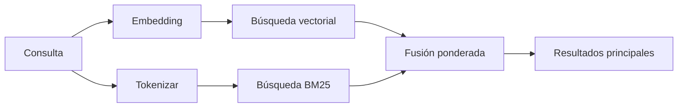

---
read_when:
    - Quieres entender cómo funciona `memory_search`
    - Quieres elegir un proveedor de embeddings
    - Quieres ajustar la calidad de la búsqueda
summary: Cómo la búsqueda de memoria encuentra notas relevantes usando embeddings y recuperación híbrida
title: Búsqueda de memoria
x-i18n:
    generated_at: "2026-04-15T14:40:21Z"
    model: gpt-5.4
    provider: openai
    source_hash: f5757aa8fe8f7fec30ef5c826f72230f591ce4cad591d81a091189d50d4262ed
    source_path: concepts/memory-search.md
    workflow: 15
---

# Búsqueda de memoria

`memory_search` encuentra notas relevantes en tus archivos de memoria, incluso cuando la
redacción difiere del texto original. Funciona indexando la memoria en pequeños
fragmentos y buscándolos mediante embeddings, palabras clave o ambos.

## Inicio rápido

Si tienes una suscripción a GitHub Copilot, o una clave de API de OpenAI, Gemini, Voyage o Mistral configurada, la búsqueda de memoria funciona automáticamente. Para establecer un proveedor
de forma explícita:

```json5
{
  agents: {
    defaults: {
      memorySearch: {
        provider: "openai", // o "gemini", "local", "ollama", etc.
      },
    },
  },
}
```

Para embeddings locales sin clave de API, usa `provider: "local"` (requiere
node-llama-cpp).

## Proveedores compatibles

| Proveedor       | ID               | Necesita clave de API | Notas                                                |
| --------------- | ---------------- | --------------------- | ---------------------------------------------------- |
| Bedrock         | `bedrock`        | No                    | Se detecta automáticamente cuando se resuelve la cadena de credenciales de AWS |
| Gemini          | `gemini`         | Sí                    | Compatible con indexación de imágenes/audio          |
| GitHub Copilot  | `github-copilot` | No                    | Se detecta automáticamente, usa la suscripción de Copilot |
| Local           | `local`          | No                    | Modelo GGUF, descarga de ~0.6 GB                     |
| Mistral         | `mistral`        | Sí                    | Se detecta automáticamente                           |
| Ollama          | `ollama`         | No                    | Local, debe establecerse explícitamente              |
| OpenAI          | `openai`         | Sí                    | Se detecta automáticamente, rápido                   |
| Voyage          | `voyage`         | Sí                    | Se detecta automáticamente                           |

## Cómo funciona la búsqueda

OpenClaw ejecuta dos rutas de recuperación en paralelo y fusiona los resultados:



- **La búsqueda vectorial** encuentra notas con significado similar ("gateway host" coincide
  con "la máquina que ejecuta OpenClaw").
- **La búsqueda por palabras clave BM25** encuentra coincidencias exactas (ID, cadenas de error, claves
  de configuración).

Si solo una ruta está disponible (sin embeddings o sin FTS), la otra se ejecuta por sí sola.

Cuando los embeddings no están disponibles, OpenClaw sigue usando clasificación léxica sobre los resultados de FTS en lugar de recurrir solo al orden bruto de coincidencias exactas. Ese modo degradado potencia los fragmentos con una cobertura más sólida de los términos de la consulta y rutas de archivo relevantes, lo que mantiene útil la recuperación incluso sin `sqlite-vec` o un proveedor de embeddings.

## Mejorar la calidad de la búsqueda

Dos funciones opcionales ayudan cuando tienes un historial grande de notas:

### Decaimiento temporal

Las notas antiguas pierden gradualmente peso en la clasificación para que la información reciente aparezca primero.
Con la vida media predeterminada de 30 días, una nota del mes pasado puntúa al 50% de
su peso original. Los archivos permanentes como `MEMORY.md` nunca se degradan.

<Tip>
Activa el decaimiento temporal si tu agente tiene meses de notas diarias y la
información obsoleta sigue apareciendo por encima del contexto reciente.
</Tip>

### MMR (diversidad)

Reduce los resultados redundantes. Si cinco notas mencionan la misma configuración del router, MMR
garantiza que los resultados principales cubran temas diferentes en lugar de repetirse.

<Tip>
Activa MMR si `memory_search` sigue devolviendo fragmentos casi duplicados de
distintas notas diarias.
</Tip>

### Activar ambos

```json5
{
  agents: {
    defaults: {
      memorySearch: {
        query: {
          hybrid: {
            mmr: { enabled: true },
            temporalDecay: { enabled: true },
          },
        },
      },
    },
  },
}
```

## Memoria multimodal

Con Gemini Embedding 2, puedes indexar imágenes y archivos de audio junto con
Markdown. Las consultas de búsqueda siguen siendo texto, pero coinciden con
contenido visual y de audio. Consulta la [referencia de configuración de Memory](/es/reference/memory-config) para
la configuración.

## Búsqueda de memoria de sesión

Opcionalmente puedes indexar transcripciones de sesiones para que `memory_search` pueda recordar
conversaciones anteriores. Esto es opcional mediante
`memorySearch.experimental.sessionMemory`. Consulta la
[referencia de configuración](/es/reference/memory-config) para más detalles.

## Solución de problemas

**¿No hay resultados?** Ejecuta `openclaw memory status` para comprobar el índice. Si está vacío, ejecuta
`openclaw memory index --force`.

**¿Solo hay coincidencias por palabras clave?** Puede que tu proveedor de embeddings no esté configurado. Comprueba
`openclaw memory status --deep`.

**¿No se encuentra texto CJK?** Reconstruye el índice FTS con
`openclaw memory index --force`.

## Más información

- [Active Memory](/es/concepts/active-memory) -- memoria de subagente para sesiones de chat interactivas
- [Memory](/es/concepts/memory) -- estructura de archivos, backends, herramientas
- [referencia de configuración de Memory](/es/reference/memory-config) -- todas las opciones de configuración
