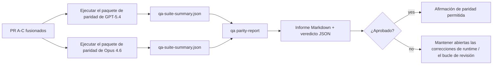

---
read_when:
    - Revisar la serie de PR de paridad GPT-5.4 / Codex
    - Mantener la arquitectura agéntica de seis contratos detrás del programa de paridad
summary: Cómo revisar el programa de paridad GPT-5.4 / Codex como cuatro unidades de fusión
title: Notas del mantenedor de paridad GPT-5.4 / Codex
x-i18n:
    generated_at: "2026-04-22T04:22:30Z"
    model: gpt-5.4
    provider: openai
    source_hash: b872d6a33b269c01b44537bfa8646329063298fdfcd3671a17d0eadbc9da5427
    source_path: help/gpt54-codex-agentic-parity-maintainers.md
    workflow: 15
---

# Notas del mantenedor de paridad GPT-5.4 / Codex

Esta nota explica cómo revisar el programa de paridad GPT-5.4 / Codex como cuatro unidades de fusión sin perder la arquitectura original de seis contratos.

## Unidades de fusión

### PR A: ejecución estrictamente agéntica

Se encarga de:

- `executionContract`
- seguimiento en el mismo turno con prioridad para GPT-5
- `update_plan` como seguimiento de progreso no terminal
- estados bloqueados explícitos en lugar de detenciones silenciosas solo con plan

No se encarga de:

- clasificación de fallos de autenticación/runtime
- veracidad de permisos
- rediseño de replay/continuación
- benchmarking de paridad

### PR B: veracidad del runtime

Se encarga de:

- corrección de alcance OAuth de Codex
- clasificación tipada de fallos de proveedor/runtime
- disponibilidad veraz de `/elevated full` y motivos de bloqueo

No se encarga de:

- normalización del esquema de herramientas
- estado de replay/vivacidad
- control por benchmark

### PR C: corrección de ejecución

Se encarga de:

- compatibilidad de herramientas OpenAI/Codex propiedad del proveedor
- manejo estricto de esquemas sin parámetros
- exposición de replay inválido
- visibilidad del estado de tareas largas pausadas, bloqueadas y abandonadas

No se encarga de:

- continuación autoelegida
- comportamiento genérico del dialecto Codex fuera de los hooks del proveedor
- control por benchmark

### PR D: arnés de paridad

Se encarga de:

- primer paquete de escenarios GPT-5.4 vs Opus 4.6
- documentación de paridad
- informe de paridad y mecánica de control de lanzamiento

No se encarga de:

- cambios de comportamiento de runtime fuera de QA-lab
- simulación de auth/proxy/DNS dentro del arnés

## Asignación a los seis contratos originales

| Contrato original                        | Unidad de fusión |
| ---------------------------------------- | ---------------- |
| Corrección de transporte/auth del proveedor | PR B          |
| Compatibilidad de contrato/esquema de herramientas | PR C   |
| Ejecución en el mismo turno              | PR A            |
| Veracidad de permisos                    | PR B            |
| Corrección de replay/continuación/vivacidad | PR C         |
| Benchmark/control de lanzamiento         | PR D            |

## Orden de revisión

1. PR A
2. PR B
3. PR C
4. PR D

PR D es la capa de prueba. No debe ser la razón por la que se retrasen los PR de corrección de runtime.

## Qué revisar

### PR A

- las ejecuciones de GPT-5 actúan o fallan de forma cerrada en lugar de detenerse en comentarios
- `update_plan` ya no parece progreso por sí solo
- el comportamiento sigue teniendo prioridad para GPT-5 y alcance limitado a Pi integrado

### PR B

- los fallos de auth/proxy/runtime dejan de colapsar en un manejo genérico de “model failed”
- `/elevated full` solo se describe como disponible cuando realmente lo está
- los motivos de bloqueo son visibles tanto para el modelo como para el runtime orientado al usuario

### PR C

- el registro estricto de herramientas OpenAI/Codex se comporta de forma predecible
- las herramientas sin parámetros no fallan las comprobaciones estrictas de esquema
- los resultados de replay y Compaction conservan un estado de vivacidad veraz

### PR D

- el paquete de escenarios es comprensible y reproducible
- el paquete incluye una vía de seguridad de replay mutante, no solo flujos de solo lectura
- los informes son legibles por humanos y automatización
- las afirmaciones de paridad están respaldadas por evidencia, no por anécdotas

Artefactos esperados de PR D:

- `qa-suite-report.md` / `qa-suite-summary.json` para cada ejecución de modelo
- `qa-agentic-parity-report.md` con comparación agregada y a nivel de escenario
- `qa-agentic-parity-summary.json` con un veredicto legible por máquina

## Control de lanzamiento

No afirmes paridad ni superioridad de GPT-5.4 sobre Opus 4.6 hasta que:

- PR A, PR B y PR C estén fusionados
- PR D ejecute limpiamente el primer paquete de paridad
- las suites de regresión de veracidad del runtime sigan en verde
- el informe de paridad no muestre casos de éxito falso ni regresión en el comportamiento de detención

El arnés de paridad no es la única fuente de evidencia. Mantén esta división explícita en la revisión:

- PR D se encarga de la comparación basada en escenarios entre GPT-5.4 y Opus 4.6
- las suites deterministas de PR B siguen encargándose de la evidencia de auth/proxy/DNS y veracidad de acceso total

## Mapa de objetivo a evidencia

| Elemento del control de finalización      | Responsable principal | Artefacto de revisión                                              |
| ----------------------------------------- | --------------------- | ------------------------------------------------------------------ |
| Sin bloqueos solo por plan                | PR A                  | pruebas de runtime estrictamente agéntico y `approval-turn-tool-followthrough` |
| Sin progreso falso ni finalización falsa de herramientas | PR A + PR D | recuento de éxitos falsos de paridad más detalles del informe a nivel de escenario |
| Sin orientación falsa de `/elevated full` | PR B                  | suites deterministas de veracidad del runtime                      |
| Los fallos de replay/vivacidad siguen siendo explícitos | PR C + PR D | suites de ciclo de vida/replay más `compaction-retry-mutating-tool` |
| GPT-5.4 iguala o supera a Opus 4.6        | PR D                  | `qa-agentic-parity-report.md` y `qa-agentic-parity-summary.json`   |

## Abreviatura para revisores: antes vs después

| Problema visible para el usuario antes                     | Señal de revisión después                                                               |
| ---------------------------------------------------------- | --------------------------------------------------------------------------------------- |
| GPT-5.4 se detenía después de planificar                   | PR A muestra comportamiento de actuar-o-bloquear en lugar de finalización solo con comentarios |
| El uso de herramientas parecía frágil con esquemas estrictos de OpenAI/Codex | PR C mantiene predecibles el registro de herramientas y la invocación sin parámetros |
| Las pistas de `/elevated full` a veces eran engañosas      | PR B vincula la orientación con la capacidad real del runtime y los motivos de bloqueo |
| Las tareas largas podían desaparecer en la ambigüedad de replay/Compaction | PR C emite estado explícito de pausado, bloqueado, abandonado y replay inválido |
| Las afirmaciones de paridad eran anecdóticas               | PR D produce un informe más un veredicto JSON con la misma cobertura de escenarios en ambos modelos |
