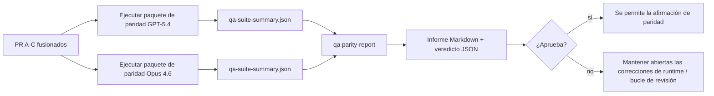

---
read_when:
    - Revisar la serie de PR de paridad de GPT-5.4 / Codex
    - Mantener la arquitectura agentic de seis contratos detrás del programa de paridad
summary: Cómo revisar el programa de paridad de GPT-5.4 / Codex como cuatro unidades de fusión
title: Notas de mantenimiento de paridad de GPT-5.4 / Codex
x-i18n:
    generated_at: "2026-04-25T13:48:35Z"
    model: gpt-5.4
    provider: openai
    source_hash: 162ea68476880d4dbf9b8c3b9397a51a2732c3eb10ac52e421a9c9d90e04eec2
    source_path: help/gpt54-codex-agentic-parity-maintainers.md
    workflow: 15
---

Esta nota explica cómo revisar el programa de paridad de GPT-5.4 / Codex como cuatro unidades de fusión sin perder la arquitectura agentic original de seis contratos.

## Unidades de fusión

### PR A: ejecución strict-agentic

Es responsable de:

- `executionContract`
- seguimiento en el mismo turno con prioridad GPT-5
- `update_plan` como seguimiento de progreso no terminal
- estados de bloqueo explícitos en lugar de detenciones silenciosas solo con plan

No es responsable de:

- clasificación de fallos de autenticación/runtime
- veracidad de permisos
- rediseño de replay/continuación
- benchmarking de paridad

### PR B: veracidad del runtime

Es responsable de:

- corrección del alcance OAuth de Codex
- clasificación tipada de fallos de proveedor/runtime
- disponibilidad veraz de `/elevated full` y motivos de bloqueo

No es responsable de:

- normalización del esquema de herramientas
- estado de replay/liveness
- compuerta de benchmarking

### PR C: corrección de ejecución

Es responsable de:

- compatibilidad de herramientas OpenAI/Codex propiedad del proveedor
- manejo estricto de esquemas sin parámetros
- exposición de replay-invalid
- visibilidad del estado de tareas largas pausadas, bloqueadas y abandonadas

No es responsable de:

- continuación autoelegida
- comportamiento genérico del dialecto Codex fuera de los hooks del proveedor
- compuerta de benchmarking

### PR D: harness de paridad

Es responsable de:

- primer paquete de escenarios de GPT-5.4 vs Opus 4.6
- documentación de paridad
- mecánica de informe de paridad y compuerta de lanzamiento

No es responsable de:

- cambios de comportamiento del runtime fuera de QA-lab
- simulación de auth/proxy/DNS dentro del harness

## Correspondencia con los seis contratos originales

| Contrato original                         | Unidad de fusión |
| ----------------------------------------- | ---------------- |
| Corrección de transporte/auth del proveedor | PR B             |
| Compatibilidad de contrato/esquema de herramientas | PR C      |
| Ejecución en el mismo turno               | PR A             |
| Veracidad de permisos                     | PR B             |
| Corrección de replay/continuación/liveness | PR C            |
| Benchmark/compuerta de lanzamiento        | PR D             |

## Orden de revisión

1. PR A
2. PR B
3. PR C
4. PR D

PR D es la capa de prueba. No debería ser el motivo por el que se retrasan los PR de corrección del runtime.

## Qué revisar

### PR A

- las ejecuciones de GPT-5 actúan o fallan de forma cerrada en lugar de detenerse en comentarios
- `update_plan` ya no parece progreso por sí solo
- el comportamiento sigue teniendo prioridad GPT-5 y alcance embedded-Pi

### PR B

- los fallos de auth/proxy/runtime dejan de colapsar en un manejo genérico de “model failed”
- `/elevated full` solo se describe como disponible cuando realmente lo está
- los motivos de bloqueo son visibles tanto para el modelo como para el runtime orientado al usuario

### PR C

- el registro estricto de herramientas OpenAI/Codex se comporta de forma predecible
- las herramientas sin parámetros no fallan las comprobaciones estrictas de esquema
- los resultados de replay y Compaction conservan un estado de liveness veraz

### PR D

- el paquete de escenarios es comprensible y reproducible
- el paquete incluye una lane mutante de seguridad de replay, no solo flujos de solo lectura
- los informes son legibles por humanos y automatización
- las afirmaciones de paridad están respaldadas por evidencia, no por anécdotas

Artefactos esperados de PR D:

- `qa-suite-report.md` / `qa-suite-summary.json` para cada ejecución de modelo
- `qa-agentic-parity-report.md` con comparación agregada y por escenario
- `qa-agentic-parity-summary.json` con un veredicto legible por máquina

## Compuerta de lanzamiento

No afirmes paridad o superioridad de GPT-5.4 sobre Opus 4.6 hasta que:

- PR A, PR B y PR C estén fusionados
- PR D ejecute limpiamente el primer paquete de paridad
- las suites de regresión de veracidad del runtime sigan en verde
- el informe de paridad no muestre casos de falso éxito ni regresión en el comportamiento de detención

El harness de paridad no es la única fuente de evidencia. Mantén esta división explícita en la revisión:

- PR D es responsable de la comparación basada en escenarios entre GPT-5.4 y Opus 4.6
- Las suites deterministas de PR B siguen siendo responsables de la evidencia de auth/proxy/DNS y veracidad de acceso completo

## Flujo rápido de fusión para mantenedores

Úsalo cuando estés listo para aterrizar un PR de paridad y quieras una secuencia repetible y de bajo riesgo.

1. Confirma que se cumple el nivel de evidencia antes de fusionar:
   - síntoma reproducible o prueba fallida
   - causa raíz verificada en el código tocado
   - corrección en la ruta implicada
   - prueba de regresión o nota explícita de verificación manual
2. Haz triaje/etiqueta antes de fusionar:
   - aplica cualquier etiqueta `r:*` de cierre automático cuando el PR no deba aterrizar
   - mantén a los candidatos de fusión libres de hilos bloqueadores sin resolver
3. Valida localmente la superficie tocada:
   - `pnpm check:changed`
   - `pnpm test:changed` cuando cambiaron pruebas o la confianza en la corrección del bug dependa de la cobertura de pruebas
4. Aterriza con el flujo estándar de mantenedor (proceso `/landpr`), luego verifica:
   - comportamiento de autocierre de issues enlazados
   - CI y estado posterior a la fusión en `main`
5. Después de aterrizar, ejecuta la búsqueda de duplicados para PR/issues abiertos relacionados y cierra solo con una referencia canónica.

Si falta cualquiera de los elementos del nivel de evidencia, solicita cambios en lugar de fusionar.

## Mapa de objetivo a evidencia

| Elemento de la compuerta de finalización | Responsable principal | Artefacto de revisión                                             |
| ---------------------------------------- | --------------------- | ----------------------------------------------------------------- |
| Sin bloqueos solo con plan               | PR A                  | pruebas de runtime strict-agentic y `approval-turn-tool-followthrough` |
| Sin progreso falso ni finalización falsa de herramientas | PR A + PR D | recuento de falsos éxitos de paridad más detalles del informe por escenario |
| Sin guía falsa de `/elevated full`       | PR B                  | suites deterministas de veracidad del runtime                     |
| Los fallos de replay/liveness siguen siendo explícitos | PR C + PR D | suites de lifecycle/replay más `compaction-retry-mutating-tool`   |
| GPT-5.4 iguala o supera a Opus 4.6       | PR D                  | `qa-agentic-parity-report.md` y `qa-agentic-parity-summary.json`  |

## Atajo para revisores: antes vs después

| Problema visible para el usuario antes                    | Señal de revisión después                                                              |
| --------------------------------------------------------- | -------------------------------------------------------------------------------------- |
| GPT-5.4 se detenía después de planificar                  | PR A muestra comportamiento de actuar o bloquear en lugar de finalización solo con comentarios |
| El uso de herramientas se sentía frágil con esquemas estrictos OpenAI/Codex | PR C mantiene predecible el registro de herramientas y la invocación sin parámetros |
| Las sugerencias de `/elevated full` a veces eran engañosas | PR B vincula la guía con la capacidad real del runtime y los motivos de bloqueo      |
| Las tareas largas podían perderse en la ambigüedad de replay/Compaction | PR C emite estado explícito de pausado, bloqueado, abandonado y replay-invalid |
| Las afirmaciones de paridad eran anecdóticas              | PR D produce un informe más un veredicto JSON con la misma cobertura de escenarios en ambos modelos |

## Relacionado

- [Paridad agentic de GPT-5.4 / Codex](/es/help/gpt54-codex-agentic-parity)
