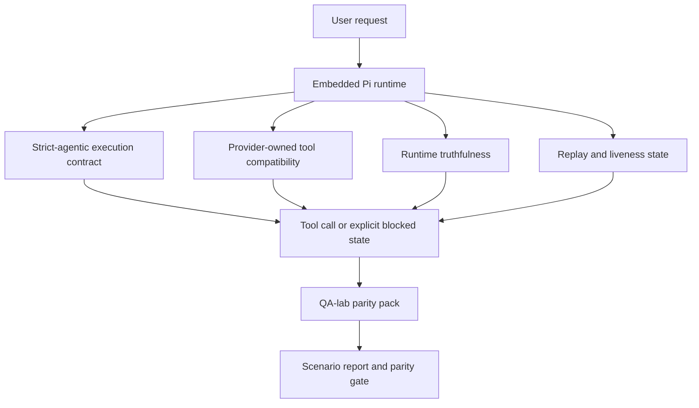
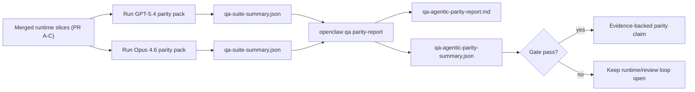

---
read_when:
    - Depuración del comportamiento agéntico de GPT-5.4 o Codex
    - Comparando el comportamiento agéntico de OpenClaw entre modelos frontier
    - Revisando las correcciones de strict-agentic, tool-schema, elevation y replay
summary: Cómo OpenClaw cierra las brechas de ejecución agéntica para GPT-5.4 y modelos de estilo Codex
title: Paridad agéntica de GPT-5.4 / Codex
x-i18n:
    generated_at: "2026-04-22T04:22:38Z"
    model: gpt-5.4
    provider: openai
    source_hash: 77bc9b8fab289bd35185fa246113503b3f5c94a22bd44739be07d39ae6779056
    source_path: help/gpt54-codex-agentic-parity.md
    workflow: 15
---

# Paridad agéntica de GPT-5.4 / Codex en OpenClaw

OpenClaw ya funcionaba bien con modelos frontier que usan herramientas, pero GPT-5.4 y los modelos de estilo Codex seguían teniendo un rendimiento inferior en algunos aspectos prácticos:

- podían detenerse después de planificar en lugar de hacer el trabajo
- podían usar incorrectamente los esquemas de herramientas estrictos de OpenAI/Codex
- podían pedir `/elevated full` incluso cuando el acceso completo era imposible
- podían perder el estado de tareas de larga duración durante replay o Compaction
- las afirmaciones de paridad frente a Claude Opus 4.6 se basaban en anécdotas en lugar de escenarios repetibles

Este programa de paridad corrige esas brechas en cuatro bloques revisables.

## Qué cambió

### PR A: ejecución strict-agentic

Este bloque añade un contrato de ejecución `strict-agentic` opcional para ejecuciones incrustadas de Pi GPT-5.

Cuando está habilitado, OpenClaw deja de aceptar turnos de solo planificación como una finalización “suficientemente buena”. Si el modelo solo dice lo que pretende hacer y no usa realmente herramientas ni progresa, OpenClaw vuelve a intentarlo con una indicación para actuar ahora y luego falla de forma cerrada con un estado bloqueado explícito en lugar de finalizar la tarea silenciosamente.

Esto mejora la experiencia con GPT-5.4 sobre todo en:

- seguimientos cortos de “ok hazlo”
- tareas de código en las que el primer paso es obvio
- flujos donde `update_plan` debería ser seguimiento del progreso en lugar de texto de relleno

### PR B: veracidad del tiempo de ejecución

Este bloque hace que OpenClaw diga la verdad sobre dos cosas:

- por qué falló la llamada del proveedor/tiempo de ejecución
- si `/elevated full` está realmente disponible

Eso significa que GPT-5.4 obtiene mejores señales del tiempo de ejecución sobre alcance faltante, fallos de actualización de autenticación, fallos de autenticación HTML 403, problemas de proxy, fallos de DNS o de tiempo de espera, y modos de acceso completo bloqueados. Es menos probable que el modelo alucine la remediación incorrecta o siga pidiendo un modo de permisos que el tiempo de ejecución no puede ofrecer.

### PR C: corrección de ejecución

Este bloque mejora dos tipos de corrección:

- compatibilidad de esquemas de herramientas OpenAI/Codex controlada por el proveedor
- visibilidad de replay y de la actividad de tareas largas

El trabajo de compatibilidad de herramientas reduce la fricción de esquemas para el registro estricto de herramientas OpenAI/Codex, especialmente en torno a herramientas sin parámetros y expectativas estrictas de raíz de objeto. El trabajo de replay/actividad hace que las tareas de larga duración sean más observables, de modo que los estados pausado, bloqueado y abandonado sean visibles en lugar de perderse dentro de texto de error genérico.

### PR D: arnés de paridad

Este bloque añade el primer paquete de paridad de qa-lab para que GPT-5.4 y Opus 4.6 puedan ejercitarse en los mismos escenarios y compararse usando evidencia compartida.

El paquete de paridad es la capa de prueba. No cambia por sí solo el comportamiento del tiempo de ejecución.

Después de tener dos artefactos `qa-suite-summary.json`, genera la comparación de la puerta de lanzamiento con:

```bash
pnpm openclaw qa parity-report \
  --repo-root . \
  --candidate-summary .artifacts/qa-e2e/gpt54/qa-suite-summary.json \
  --baseline-summary .artifacts/qa-e2e/opus46/qa-suite-summary.json \
  --output-dir .artifacts/qa-e2e/parity
```

Ese comando escribe:

- un informe Markdown legible para humanos
- un veredicto JSON legible por máquina
- un resultado explícito de puerta `pass` / `fail`

## Por qué esto mejora GPT-5.4 en la práctica

Antes de este trabajo, GPT-5.4 en OpenClaw podía sentirse menos agéntico que Opus en sesiones reales de programación porque el tiempo de ejecución toleraba comportamientos que son especialmente perjudiciales para modelos de estilo GPT-5:

- turnos de solo comentarios
- fricción de esquemas en torno a herramientas
- retroalimentación vaga sobre permisos
- roturas silenciosas de replay o Compaction

El objetivo no es hacer que GPT-5.4 imite a Opus. El objetivo es darle a GPT-5.4 un contrato de tiempo de ejecución que recompense el progreso real, proporcione semánticas más limpias para herramientas y permisos, y convierta los modos de fallo en estados explícitos legibles por máquinas y personas.

Eso cambia la experiencia de usuario de:

- “el modelo tenía un buen plan pero se detuvo”

a:

- “el modelo actuó, o OpenClaw mostró la razón exacta por la que no pudo hacerlo”

## Antes vs. después para usuarios de GPT-5.4

| Antes de este programa                                                                        | Después de PR A-D                                                                      |
| --------------------------------------------------------------------------------------------- | -------------------------------------------------------------------------------------- |
| GPT-5.4 podía detenerse después de un plan razonable sin dar el siguiente paso con herramientas | PR A convierte “solo plan” en “actuar ahora o mostrar un estado bloqueado”             |
| Los esquemas de herramientas estrictos podían rechazar herramientas sin parámetros o con forma OpenAI/Codex de maneras confusas | PR C hace que el registro y la invocación de herramientas controlados por el proveedor sean más predecibles |
| La orientación de `/elevated full` podía ser vaga o incorrecta en tiempos de ejecución bloqueados | PR B proporciona a GPT-5.4 y al usuario pistas veraces sobre tiempo de ejecución y permisos |
| Los fallos de replay o Compaction podían sentirse como si la tarea hubiera desaparecido silenciosamente | PR C muestra explícitamente resultados pausados, bloqueados, abandonados e inválidos por replay |
| “GPT-5.4 se siente peor que Opus” era sobre todo anecdótico                                  | PR D convierte eso en el mismo paquete de escenarios, las mismas métricas y una puerta estricta de pass/fail |

## Arquitectura



## Flujo de lanzamiento



## Paquete de escenarios

El primer paquete de paridad actualmente cubre cinco escenarios:

### `approval-turn-tool-followthrough`

Comprueba que el modelo no se detenga en “haré eso” después de una aprobación corta. Debe realizar la primera acción concreta en el mismo turno.

### `model-switch-tool-continuity`

Comprueba que el trabajo con uso de herramientas siga siendo coherente a través de límites de cambio de modelo/tiempo de ejecución en lugar de reiniciarse en comentarios o perder el contexto de ejecución.

### `source-docs-discovery-report`

Comprueba que el modelo pueda leer el código fuente y la documentación, sintetizar hallazgos y continuar la tarea de forma agéntica en lugar de producir un resumen superficial y detenerse pronto.

### `image-understanding-attachment`

Comprueba que las tareas de modo mixto que incluyen adjuntos sigan siendo accionables y no colapsen en una narración vaga.

### `compaction-retry-mutating-tool`

Comprueba que una tarea con una escritura mutante real mantenga explícita la inseguridad de replay en lugar de parecer silenciosamente segura para replay si la ejecución entra en Compaction, reintenta o pierde el estado de respuesta bajo presión.

## Matriz de escenarios

| Escenario                          | Qué prueba                             | Buen comportamiento de GPT-5.4                                                  | Señal de fallo                                                                  |
| ---------------------------------- | -------------------------------------- | -------------------------------------------------------------------------------- | -------------------------------------------------------------------------------- |
| `approval-turn-tool-followthrough` | Turnos de aprobación cortos tras un plan | Inicia inmediatamente la primera acción concreta con herramientas en lugar de reformular la intención | seguimiento de solo plan, sin actividad de herramientas o turno bloqueado sin un bloqueador real |
| `model-switch-tool-continuity`     | Cambio de tiempo de ejecución/modelo durante uso de herramientas | Conserva el contexto de la tarea y sigue actuando de forma coherente             | se reinicia en comentarios, pierde contexto de herramientas o se detiene tras el cambio |
| `source-docs-discovery-report`     | Lectura de código fuente + síntesis + acción | Encuentra fuentes, usa herramientas y produce un informe útil sin estancarse     | resumen superficial, trabajo con herramientas faltante o detención en turno incompleto |
| `image-understanding-attachment`   | Trabajo agéntico impulsado por adjuntos | Interpreta el adjunto, lo conecta con herramientas y continúa la tarea           | narración vaga, adjunto ignorado o ninguna acción siguiente concreta             |
| `compaction-retry-mutating-tool`   | Trabajo mutante bajo presión de Compaction | Realiza una escritura real y mantiene explícita la inseguridad de replay tras el efecto secundario | ocurre una escritura mutante pero la seguridad de replay se implica, falta o es contradictoria |

## Puerta de lanzamiento

GPT-5.4 solo puede considerarse en paridad o mejor cuando el tiempo de ejecución fusionado pasa el paquete de paridad y las regresiones de veracidad del tiempo de ejecución al mismo tiempo.

Resultados obligatorios:

- ninguna detención de solo plan cuando la siguiente acción con herramientas está clara
- ninguna finalización falsa sin ejecución real
- ninguna orientación incorrecta de `/elevated full`
- ningún abandono silencioso por replay o Compaction
- métricas del paquete de paridad al menos tan sólidas como la línea base acordada de Opus 4.6

Para el primer arnés, la puerta compara:

- tasa de finalización
- tasa de detención no intencionada
- tasa de llamadas de herramienta válidas
- recuento de éxitos falsos

La evidencia de paridad se divide intencionadamente en dos capas:

- PR D prueba el comportamiento de GPT-5.4 vs Opus 4.6 en los mismos escenarios con qa-lab
- los conjuntos deterministas de PR B prueban autenticación, proxy, DNS y la veracidad de `/elevated full` fuera del arnés

## Matriz de objetivo a evidencia

| Elemento de la puerta de finalización                  | PR responsable | Fuente de evidencia                                                 | Señal de aprobación                                                                    |
| ------------------------------------------------------ | -------------- | ------------------------------------------------------------------- | -------------------------------------------------------------------------------------- |
| GPT-5.4 ya no se atasca después de planificar          | PR A           | `approval-turn-tool-followthrough` más suites de tiempo de ejecución de PR A | los turnos de aprobación desencadenan trabajo real o un estado bloqueado explícito    |
| GPT-5.4 ya no finge progreso ni finalización falsa con herramientas | PR A + PR D    | resultados de escenarios del informe de paridad y recuento de éxitos falsos | ningún resultado sospechoso de aprobación y ninguna finalización de solo comentarios   |
| GPT-5.4 ya no da orientación falsa de `/elevated full` | PR B           | suites deterministas de veracidad                                   | las razones de bloqueo y las pistas de acceso completo se mantienen precisas respecto al tiempo de ejecución |
| Los fallos de replay/actividad siguen siendo explícitos | PR C + PR D    | suites de ciclo de vida/replay de PR C más `compaction-retry-mutating-tool` | el trabajo mutante mantiene explícita la inseguridad de replay en lugar de desaparecer silenciosamente |
| GPT-5.4 iguala o supera a Opus 4.6 en las métricas acordadas | PR D           | `qa-agentic-parity-report.md` y `qa-agentic-parity-summary.json`    | misma cobertura de escenarios y ninguna regresión en finalización, comportamiento de detención o uso válido de herramientas |

## Cómo leer el veredicto de paridad

Usa el veredicto de `qa-agentic-parity-summary.json` como la decisión final legible por máquina para el primer paquete de paridad.

- `pass` significa que GPT-5.4 cubrió los mismos escenarios que Opus 4.6 y no tuvo regresiones en las métricas agregadas acordadas.
- `fail` significa que se activó al menos una puerta estricta: finalización más débil, peores detenciones no intencionadas, uso válido de herramientas más débil, cualquier caso de éxito falso o cobertura de escenarios no coincidente.
- “shared/base CI issue” no es por sí mismo un resultado de paridad. Si el ruido de CI fuera de PR D bloquea una ejecución, el veredicto debe esperar a una ejecución limpia del tiempo de ejecución fusionado en lugar de inferirse a partir de registros de ramas anteriores.
- La veracidad de autenticación, proxy, DNS y `/elevated full` sigue viniendo de las suites deterministas de PR B, así que la afirmación final de lanzamiento necesita ambas cosas: un veredicto de paridad aprobado de PR D y una cobertura de veracidad en verde de PR B.

## Quién debería habilitar `strict-agentic`

Usa `strict-agentic` cuando:

- se espera que el agente actúe de inmediato cuando el siguiente paso sea obvio
- GPT-5.4 o los modelos de la familia Codex sean el tiempo de ejecución principal
- prefieras estados bloqueados explícitos en lugar de respuestas de solo recapitulación “útiles”

Mantén el contrato predeterminado cuando:

- quieras el comportamiento actual más flexible
- no estés usando modelos de la familia GPT-5
- estés probando prompts en lugar de la aplicación de reglas en tiempo de ejecución
