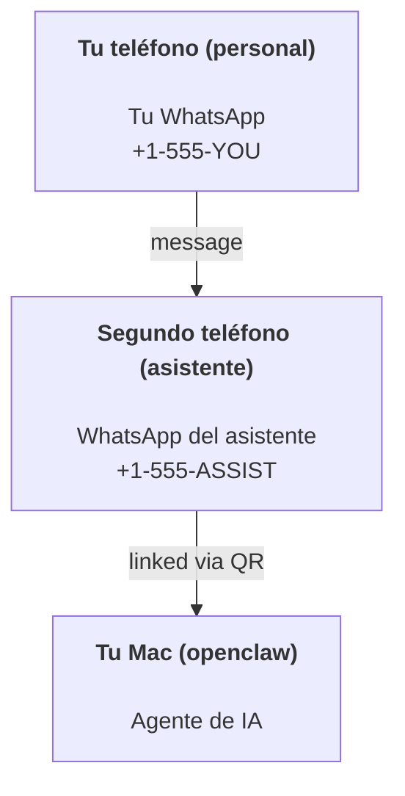

---
read_when:
    - Incorporación de una nueva instancia de asistente
    - Revisión de las implicaciones de seguridad/permisos
summary: Guía integral para ejecutar OpenClaw como asistente personal con advertencias de seguridad
title: Configuración del asistente personal
x-i18n:
    generated_at: "2026-04-25T13:57:11Z"
    model: gpt-5.4
    provider: openai
    source_hash: 1647b78e8cf23a3a025969c52fbd8a73aed78df27698abf36bbf62045dc30e3b
    source_path: start/openclaw.md
    workflow: 15
---

# Crear un asistente personal con OpenClaw

OpenClaw es un Gateway autoalojado que conecta Discord, Google Chat, iMessage, Matrix, Microsoft Teams, Signal, Slack, Telegram, WhatsApp, Zalo y más con agentes de IA. Esta guía cubre la configuración de "asistente personal": un número de WhatsApp dedicado que funciona como tu asistente de IA siempre activo.

## ⚠️ La seguridad primero

Estás colocando a un agente en una posición para:

- ejecutar comandos en tu máquina (según tu política de herramientas)
- leer/escribir archivos en tu espacio de trabajo
- enviar mensajes de vuelta a través de WhatsApp/Telegram/Discord/Mattermost y otros canales incluidos

Empieza de forma conservadora:

- Configura siempre `channels.whatsapp.allowFrom` (nunca ejecutes algo abierto al mundo en tu Mac personal).
- Usa un número de WhatsApp dedicado para el asistente.
- Heartbeat ahora usa por defecto una frecuencia de cada 30 minutos. Desactívalo hasta que confíes en la configuración estableciendo `agents.defaults.heartbeat.every: "0m"`.

## Requisitos previos

- OpenClaw instalado y configurado — consulta [Getting Started](/es/start/getting-started) si todavía no lo has hecho
- Un segundo número de teléfono (SIM/eSIM/prepago) para el asistente

## La configuración de dos teléfonos (recomendada)

Esto es lo que quieres:



Si vinculas tu WhatsApp personal a OpenClaw, cada mensaje que recibas se convierte en “entrada del agente”. Rara vez eso es lo que quieres.

## Inicio rápido de 5 minutos

1. Empareja WhatsApp Web (muestra un QR; escanéalo con el teléfono del asistente):

```bash
openclaw channels login
```

2. Inicia el Gateway (déjalo en ejecución):

```bash
openclaw gateway --port 18789
```

3. Coloca una configuración mínima en `~/.openclaw/openclaw.json`:

```json5
{
  gateway: { mode: "local" },
  channels: { whatsapp: { allowFrom: ["+15555550123"] } },
}
```

Ahora envía un mensaje al número del asistente desde tu teléfono incluido en la lista permitida.

Cuando termina la incorporación, OpenClaw abre automáticamente el panel e imprime un enlace limpio (sin tokenizar). Si el panel solicita autenticación, pega el secreto compartido configurado en la configuración de Control UI. La incorporación usa un token por defecto (`gateway.auth.token`), pero la autenticación por contraseña también funciona si cambiaste `gateway.auth.mode` a `password`. Para volver a abrirlo más tarde: `openclaw dashboard`.

## Dale al agente un espacio de trabajo (AGENTS)

OpenClaw lee instrucciones operativas y “memoria” desde su directorio de espacio de trabajo.

Por defecto, OpenClaw usa `~/.openclaw/workspace` como espacio de trabajo del agente, y lo creará automáticamente (junto con los archivos iniciales `AGENTS.md`, `SOUL.md`, `TOOLS.md`, `IDENTITY.md`, `USER.md`, `HEARTBEAT.md`) durante la configuración o en la primera ejecución del agente. `BOOTSTRAP.md` solo se crea cuando el espacio de trabajo es completamente nuevo (no debería volver a aparecer después de eliminarlo). `MEMORY.md` es opcional (no se crea automáticamente); cuando está presente, se carga en las sesiones normales. Las sesiones de subagentes solo inyectan `AGENTS.md` y `TOOLS.md`.

Consejo: trata esta carpeta como la “memoria” de OpenClaw y conviértela en un repositorio git (idealmente privado) para que tu `AGENTS.md` y tus archivos de memoria tengan copia de seguridad. Si git está instalado, los espacios de trabajo completamente nuevos se inicializan automáticamente.

```bash
openclaw setup
```

Diseño completo del espacio de trabajo + guía de copia de seguridad: [Agent workspace](/es/concepts/agent-workspace)
Flujo de trabajo de memoria: [Memory](/es/concepts/memory)

Opcional: elige un espacio de trabajo diferente con `agents.defaults.workspace` (admite `~`).

```json5
{
  agents: {
    defaults: {
      workspace: "~/.openclaw/workspace",
    },
  },
}
```

Si ya distribuyes tus propios archivos de espacio de trabajo desde un repositorio, puedes desactivar completamente la creación de archivos de arranque:

```json5
{
  agents: {
    defaults: {
      skipBootstrap: true,
    },
  },
}
```

## La configuración que lo convierte en "un asistente"

OpenClaw usa por defecto una buena configuración de asistente, pero normalmente querrás ajustar:

- la persona/instrucciones en [`SOUL.md`](/es/concepts/soul)
- los valores predeterminados de razonamiento (si lo deseas)
- los Heartbeat (una vez que confíes en él)

Ejemplo:

```json5
{
  logging: { level: "info" },
  agent: {
    model: "anthropic/claude-opus-4-6",
    workspace: "~/.openclaw/workspace",
    thinkingDefault: "high",
    timeoutSeconds: 1800,
    // Empieza con 0; actívalo más tarde.
    heartbeat: { every: "0m" },
  },
  channels: {
    whatsapp: {
      allowFrom: ["+15555550123"],
      groups: {
        "*": { requireMention: true },
      },
    },
  },
  routing: {
    groupChat: {
      mentionPatterns: ["@openclaw", "openclaw"],
    },
  },
  session: {
    scope: "per-sender",
    resetTriggers: ["/new", "/reset"],
    reset: {
      mode: "daily",
      atHour: 4,
      idleMinutes: 10080,
    },
  },
}
```

## Sesiones y memoria

- Archivos de sesión: `~/.openclaw/agents/<agentId>/sessions/{{SessionId}}.jsonl`
- Metadatos de sesión (uso de tokens, última ruta, etc.): `~/.openclaw/agents/<agentId>/sessions/sessions.json` (heredado: `~/.openclaw/sessions/sessions.json`)
- `/new` o `/reset` inicia una sesión nueva para ese chat (configurable mediante `resetTriggers`). Si se envía solo, el agente responde con un breve saludo para confirmar el reinicio.
- `/compact [instructions]` aplica Compaction al contexto de la sesión e informa el presupuesto de contexto restante.

## Heartbeat (modo proactivo)

Por defecto, OpenClaw ejecuta un Heartbeat cada 30 minutos con el prompt:
`Read HEARTBEAT.md if it exists (workspace context). Follow it strictly. Do not infer or repeat old tasks from prior chats. If nothing needs attention, reply HEARTBEAT_OK.`
Establece `agents.defaults.heartbeat.every: "0m"` para desactivarlo.

- Si `HEARTBEAT.md` existe pero está efectivamente vacío (solo líneas en blanco y encabezados markdown como `# Heading`), OpenClaw omite la ejecución del Heartbeat para ahorrar llamadas a la API.
- Si falta el archivo, el Heartbeat igualmente se ejecuta y el modelo decide qué hacer.
- Si el agente responde con `HEARTBEAT_OK` (opcionalmente con un pequeño relleno; consulta `agents.defaults.heartbeat.ackMaxChars`), OpenClaw suprime la entrega saliente de ese Heartbeat.
- Por defecto, se permite la entrega de Heartbeat a destinos tipo MD `user:<id>`. Establece `agents.defaults.heartbeat.directPolicy: "block"` para suprimir la entrega a destinos directos mientras mantienes activas las ejecuciones de Heartbeat.
- Los Heartbeat ejecutan turnos completos del agente — intervalos más cortos consumen más tokens.

```json5
{
  agent: {
    heartbeat: { every: "30m" },
  },
}
```

## Entrada y salida de medios

Los adjuntos entrantes (imágenes/audio/documentos) pueden exponerse a tu comando mediante plantillas:

- `{{MediaPath}}` (ruta local del archivo temporal)
- `{{MediaUrl}}` (pseudo-URL)
- `{{Transcript}}` (si la transcripción de audio está habilitada)

Adjuntos salientes desde el agente: incluye `MEDIA:<path-or-url>` en su propia línea (sin espacios). Ejemplo:

```
Aquí está la captura de pantalla.
MEDIA:https://example.com/screenshot.png
```

OpenClaw los extrae y los envía como medios junto con el texto.

El comportamiento de las rutas locales sigue el mismo modelo de confianza de lectura de archivos que el agente:

- Si `tools.fs.workspaceOnly` es `true`, las rutas locales salientes `MEDIA:` siguen restringidas a la raíz temporal de OpenClaw, la caché de medios, las rutas del espacio de trabajo del agente y los archivos generados en el sandbox.
- Si `tools.fs.workspaceOnly` es `false`, `MEDIA:` saliente puede usar archivos locales del host que el agente ya tiene permiso para leer.
- Los envíos locales del host siguen permitiendo solo tipos de medios y documentos seguros (imágenes, audio, video, PDF y documentos de Office). Los archivos de texto sin formato y los archivos con apariencia de secreto no se consideran medios enviables.

Eso significa que las imágenes/archivos generados fuera del espacio de trabajo ahora pueden enviarse cuando tu política de fs ya permite esas lecturas, sin volver a abrir la exfiltración arbitraria de adjuntos de texto del host.

## Lista de verificación de operaciones

```bash
openclaw status          # estado local (credenciales, sesiones, eventos en cola)
openclaw status --all    # diagnóstico completo (solo lectura, apto para pegar)
openclaw status --deep   # solicita al gateway una sonda de estado en vivo con sondas de canal cuando se admiten
openclaw health --json   # instantánea de estado del gateway (WS; el valor predeterminado puede devolver una instantánea nueva en caché)
```

Los registros se almacenan en `/tmp/openclaw/` (por defecto: `openclaw-YYYY-MM-DD.log`).

## Siguientes pasos

- WebChat: [WebChat](/es/web/webchat)
- Operaciones del Gateway: [Gateway runbook](/es/gateway)
- Cron + activaciones: [Cron jobs](/es/automation/cron-jobs)
- Complemento de barra de menús para macOS: [OpenClaw macOS app](/es/platforms/macos)
- Aplicación de Node para iOS: [iOS app](/es/platforms/ios)
- Aplicación de Node para Android: [Android app](/es/platforms/android)
- Estado en Windows: [Windows (WSL2)](/es/platforms/windows)
- Estado en Linux: [Linux app](/es/platforms/linux)
- Seguridad: [Security](/es/gateway/security)

## Relacionado

- [Getting started](/es/start/getting-started)
- [Setup](/es/start/setup)
- [Channels overview](/es/channels)
