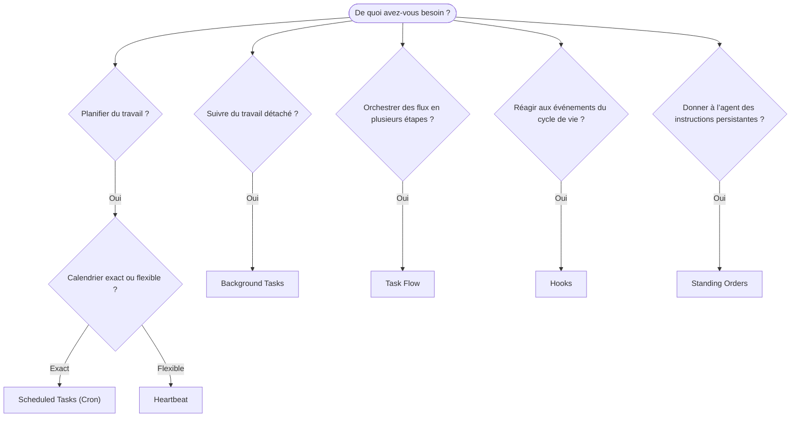

---
read_when:
    - Décider comment automatiser le travail avec OpenClaw
    - Choisir entre heartbeat, cron, hooks et standing orders
    - Rechercher le bon point d’entrée pour l’automatisation
summary: 'Vue d’ensemble des mécanismes d’automatisation : tâches, cron, hooks, standing orders et Task Flow'
title: Automation & Tasks
x-i18n:
    generated_at: "2026-04-05T12:34:20Z"
    model: gpt-5.4
    provider: openai
    source_hash: 13cd05dcd2f38737f7bb19243ad1136978bfd727006fd65226daa3590f823afe
    source_path: automation/index.md
    workflow: 15
---

# Automation & Tasks

OpenClaw exécute le travail en arrière-plan au moyen de tâches, de jobs planifiés, de hooks d’événement et d’instructions permanentes. Cette page vous aide à choisir le bon mécanisme et à comprendre comment ils s’articulent.

## Guide de décision rapide

| Cas d’usage                              | Recommandation        | Pourquoi                                         |
| ---------------------------------------- | --------------------- | ------------------------------------------------ |
| Envoyer un rapport quotidien à 9 h pile  | Scheduled Tasks (Cron) | Calendrier exact, exécution isolée               |
| Me rappeler quelque chose dans 20 minutes | Scheduled Tasks (Cron) | Exécution unique avec un horaire précis (`--at`) |
| Exécuter une analyse approfondie hebdomadaire | Scheduled Tasks (Cron) | Tâche autonome, peut utiliser un modèle différent |
| Vérifier la boîte de réception toutes les 30 min | Heartbeat             | Regroupe avec d’autres vérifications, tient compte du contexte |
| Surveiller le calendrier pour les événements à venir | Heartbeat             | Convient naturellement à une surveillance périodique |
| Inspecter l’état d’un subagent ou d’une exécution ACP | Background Tasks      | Le registre des tâches suit tout le travail détaché |
| Auditer ce qui a été exécuté et quand    | Background Tasks      | `openclaw tasks list` et `openclaw tasks audit` |
| Effectuer une recherche en plusieurs étapes puis résumer | Task Flow             | Orchestration durable avec suivi des révisions   |
| Exécuter un script lors de la réinitialisation de session | Hooks                 | Piloté par les événements, se déclenche sur les événements du cycle de vie |
| Exécuter du code à chaque appel d’outil  | Hooks                 | Les hooks peuvent filtrer par type d’événement   |
| Toujours vérifier la conformité avant de répondre | Standing Orders       | Injecté automatiquement dans chaque session      |

### Scheduled Tasks (Cron) vs Heartbeat

| Dimension       | Scheduled Tasks (Cron)              | Heartbeat                             |
| --------------- | ----------------------------------- | ------------------------------------- |
| Calendrier      | Exact (expressions cron, exécution unique) | Approximatif (par défaut toutes les 30 min) |
| Contexte de session | Nouveau (isolé) ou partagé      | Contexte complet de la session principale |
| Enregistrements de tâche | Toujours créés             | Jamais créés                          |
| Livraison       | Canal, webhook ou silencieuse       | En ligne dans la session principale   |
| Idéal pour      | Rapports, rappels, jobs en arrière-plan | Vérifications de boîte de réception, calendrier, notifications |

Utilisez Scheduled Tasks (Cron) lorsque vous avez besoin d’un calendrier précis ou d’une exécution isolée. Utilisez Heartbeat lorsque le travail bénéficie du contexte complet de la session et qu’un calendrier approximatif suffit.

## Concepts de base

### Scheduled tasks (cron)

Cron est le planificateur intégré de la Gateway pour un calendrier précis. Il conserve les jobs, réveille l’agent au bon moment et peut transmettre la sortie à un canal de discussion ou à un endpoint webhook. Il prend en charge les rappels ponctuels, les expressions récurrentes et les déclencheurs webhook entrants.

Consultez [Scheduled Tasks](/automation/cron-jobs).

### Tasks

Le registre des tâches en arrière-plan suit tout le travail détaché : exécutions ACP, lancements de subagent, exécutions cron isolées et opérations CLI. Les tâches sont des enregistrements, pas des planificateurs. Utilisez `openclaw tasks list` et `openclaw tasks audit` pour les inspecter.

Consultez [Background Tasks](/automation/tasks).

### Task Flow

Task Flow est la couche d’orchestration de flux au-dessus des tâches en arrière-plan. Il gère des flux durables en plusieurs étapes avec des modes de synchronisation managed et mirrored, le suivi des révisions, ainsi que `openclaw tasks flow list|show|cancel` pour l’inspection.

Consultez [Task Flow](/automation/taskflow).

### Standing orders

Les standing orders accordent à l’agent une autorité opérationnelle permanente pour des programmes définis. Elles se trouvent dans des fichiers d’espace de travail (généralement `AGENTS.md`) et sont injectées dans chaque session. Combinez-les avec cron pour une application basée sur le temps.

Consultez [Standing Orders](/automation/standing-orders).

### Hooks

Les hooks sont des scripts pilotés par les événements, déclenchés par les événements du cycle de vie de l’agent (`/new`, `/reset`, `/stop`), la compaction de session, le démarrage de la gateway, le flux de messages et les appels d’outils. Les hooks sont découverts automatiquement à partir de répertoires et peuvent être gérés avec `openclaw hooks`.

Consultez [Hooks](/automation/hooks).

### Heartbeat

Heartbeat est un tour périodique de la session principale (toutes les 30 minutes par défaut). Il regroupe plusieurs vérifications (boîte de réception, calendrier, notifications) en un seul tour de l’agent avec le contexte complet de la session. Les tours Heartbeat ne créent pas d’enregistrements de tâche. Utilisez `HEARTBEAT.md` pour une petite checklist, ou un bloc `tasks:` si vous voulez des vérifications périodiques uniquement à échéance dans heartbeat lui-même. Les fichiers heartbeat vides sont ignorés avec `empty-heartbeat-file` ; le mode tâche uniquement à échéance est ignoré avec `no-tasks-due`.

Consultez [Heartbeat](/gateway/heartbeat).

## Comment ils fonctionnent ensemble

- **Cron** gère les calendriers précis (rapports quotidiens, revues hebdomadaires) et les rappels ponctuels. Toutes les exécutions cron créent des enregistrements de tâche.
- **Heartbeat** gère la surveillance de routine (boîte de réception, calendrier, notifications) dans un seul tour regroupé toutes les 30 minutes.
- **Hooks** réagissent à des événements spécifiques (appels d’outils, réinitialisations de session, compaction) avec des scripts personnalisés.
- **Standing orders** donnent à l’agent un contexte persistant et des limites d’autorité.
- **Task Flow** coordonne des flux en plusieurs étapes au-dessus des tâches individuelles.
- **Tasks** suivent automatiquement tout le travail détaché afin que vous puissiez l’inspecter et l’auditer.

## Related

- [Scheduled Tasks](/automation/cron-jobs) — planification précise et rappels ponctuels
- [Background Tasks](/automation/tasks) — registre des tâches pour tout le travail détaché
- [Task Flow](/automation/taskflow) — orchestration durable de flux en plusieurs étapes
- [Hooks](/automation/hooks) — scripts de cycle de vie pilotés par les événements
- [Standing Orders](/automation/standing-orders) — instructions persistantes de l’agent
- [Heartbeat](/gateway/heartbeat) — tours périodiques de la session principale
- [Configuration Reference](/gateway/configuration-reference) — toutes les clés de configuration
