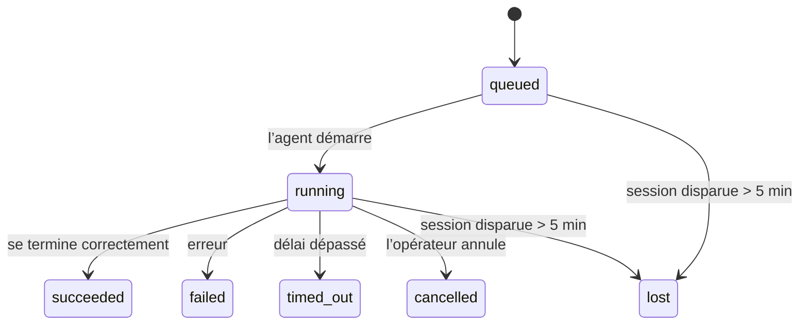

---
read_when:
    - Inspection du travail en arrière-plan en cours ou récemment terminé
    - Débogage des échecs de livraison pour les exécutions d’agent détachées
    - Comprendre comment les exécutions en arrière-plan sont liées aux sessions, aux tâches cron et au signal de pulsation
summary: Suivi des tâches en arrière-plan pour les exécutions ACP, les sous-agents, les tâches cron isolées et les opérations CLI
title: Tâches en arrière-plan
x-i18n:
    generated_at: "2026-04-10T06:56:13Z"
    model: gpt-5.4
    provider: openai
    source_hash: d7b5ba41f1025e0089986342ce85698bc62f676439c3ccf03f3ed146beb1b1ac
    source_path: automation/tasks.md
    workflow: 15
---

# Tâches en arrière-plan

> **Vous cherchez la planification ?** Consultez [Automatisation et tâches](/fr/automation) pour choisir le bon mécanisme. Cette page couvre le **suivi** du travail en arrière-plan, pas sa planification.

Les tâches en arrière-plan suivent le travail qui s’exécute **en dehors de votre session de conversation principale** :
les exécutions ACP, les lancements de sous-agents, les exécutions de tâches cron isolées et les opérations initiées par la CLI.

Les tâches ne **remplacent pas** les sessions, les tâches cron ou les signaux de pulsation — elles constituent le **journal d’activité** qui enregistre quel travail détaché a eu lieu, quand, et s’il a réussi.

<Note>
Toutes les exécutions d’agent ne créent pas une tâche. Les tours de signal de pulsation et le chat interactif normal n’en créent pas. Toutes les exécutions cron, tous les lancements ACP, tous les lancements de sous-agents et toutes les commandes d’agent via la CLI en créent.
</Note>

## TL;DR

- Les tâches sont des **enregistrements**, pas des planificateurs — cron et le signal de pulsation décident _quand_ le travail s’exécute, les tâches suivent _ce qui s’est passé_.
- ACP, les sous-agents, toutes les tâches cron et les opérations CLI créent des tâches. Les tours de signal de pulsation n’en créent pas.
- Chaque tâche passe par `queued → running → terminal` (`succeeded`, `failed`, `timed_out`, `cancelled` ou `lost`).
- Les tâches cron restent actives tant que l’environnement d’exécution cron possède encore la tâche ; les tâches CLI adossées au chat restent actives uniquement tant que leur contexte d’exécution propriétaire est encore actif.
- La fin d’exécution est pilotée par envoi : le travail détaché peut notifier directement ou réveiller la session/le signal de pulsation du demandeur lorsqu’il se termine, donc les boucles d’interrogation d’état sont généralement une mauvaise approche.
- Les exécutions cron isolées et les fins d’exécution de sous-agents nettoient au mieux les onglets/processus de navigateur suivis pour leur session enfant avant le nettoyage final.
- La livraison des exécutions cron isolées supprime les réponses intermédiaires parent obsolètes pendant que le travail des sous-agents descendants est encore en cours de vidage, et elle privilégie la sortie finale descendante lorsqu’elle arrive avant la livraison.
- Les notifications de fin d’exécution sont livrées directement à un canal ou mises en file d’attente pour le prochain signal de pulsation.
- `openclaw tasks list` affiche toutes les tâches ; `openclaw tasks audit` fait remonter les problèmes.
- Les enregistrements terminaux sont conservés pendant 7 jours, puis automatiquement supprimés.

## Démarrage rapide

```bash
# Lister toutes les tâches (de la plus récente à la plus ancienne)
openclaw tasks list

# Filtrer par environnement d’exécution ou statut
openclaw tasks list --runtime acp
openclaw tasks list --status running

# Afficher les détails d’une tâche spécifique (par ID, ID d’exécution ou clé de session)
openclaw tasks show <lookup>

# Annuler une tâche en cours d’exécution (tue la session enfant)
openclaw tasks cancel <lookup>

# Modifier la politique de notification d’une tâche
openclaw tasks notify <lookup> state_changes

# Exécuter un audit de santé
openclaw tasks audit

# Prévisualiser ou appliquer la maintenance
openclaw tasks maintenance
openclaw tasks maintenance --apply

# Inspecter l’état de TaskFlow
openclaw tasks flow list
openclaw tasks flow show <lookup>
openclaw tasks flow cancel <lookup>
```

## Ce qui crée une tâche

| Source                 | Type d’environnement d’exécution | Moment où un enregistrement de tâche est créé          | Politique de notification par défaut |
| ---------------------- | -------------------------------- | ------------------------------------------------------ | ------------------------------------ |
| Exécutions ACP en arrière-plan | `acp`                    | Lancement d’une session ACP enfant                     | `done_only`                          |
| Orchestration de sous-agents | `subagent`              | Lancement d’un sous-agent via `sessions_spawn`         | `done_only`                          |
| Tâches cron (tous types) | `cron`                        | Chaque exécution cron (session principale et isolée)   | `silent`                             |
| Opérations CLI         | `cli`                            | Commandes `openclaw agent` exécutées via la passerelle | `silent`                             |
| Tâches média d’agent   | `cli`                            | Exécutions `video_generate` adossées à une session     | `silent`                             |

Les tâches cron de session principale utilisent par défaut la politique de notification `silent` — elles créent des enregistrements pour le suivi mais ne génèrent pas de notifications. Les tâches cron isolées utilisent aussi `silent` par défaut, mais sont plus visibles parce qu’elles s’exécutent dans leur propre session.

Les exécutions `video_generate` adossées à une session utilisent également la politique de notification `silent`. Elles créent tout de même des enregistrements de tâche, mais la fin d’exécution est renvoyée à la session d’agent d’origine sous forme de réveil interne afin que l’agent puisse lui-même écrire le message de suivi et joindre la vidéo terminée. Si vous activez `tools.media.asyncCompletion.directSend`, les fins d’exécution asynchrones de `music_generate` et `video_generate` tentent d’abord une livraison directe au canal avant de revenir au chemin de réveil de la session demandeuse.

Tant qu’une tâche `video_generate` adossée à une session est encore active, l’outil sert aussi de garde-fou : des appels `video_generate` répétés dans cette même session renvoient le statut de la tâche active au lieu de démarrer une deuxième génération concurrente. Utilisez `action: "status"` si vous voulez une consultation explicite de progression/statut côté agent.

**Ce qui ne crée pas de tâches :**

- Les tours de signal de pulsation — session principale ; voir [Signal de pulsation](/fr/gateway/heartbeat)
- Les tours de chat interactif normaux
- Les réponses directes `/command`

## Cycle de vie d’une tâche



| Statut      | Ce que cela signifie                                                     |
| ----------- | ------------------------------------------------------------------------ |
| `queued`    | Créée, en attente du démarrage de l’agent                                |
| `running`   | Le tour de l’agent est en cours d’exécution                              |
| `succeeded` | Terminée avec succès                                                     |
| `failed`    | Terminée avec une erreur                                                 |
| `timed_out` | A dépassé le délai configuré                                             |
| `cancelled` | Arrêtée par l’opérateur via `openclaw tasks cancel`                      |
| `lost`      | L’environnement d’exécution a perdu l’état de support faisant autorité après une période de grâce de 5 minutes |

Les transitions se produisent automatiquement — lorsque l’exécution d’agent associée se termine, le statut de la tâche est mis à jour pour correspondre.

`lost` dépend de l’environnement d’exécution :

- Tâches ACP : les métadonnées de la session ACP enfant de support ont disparu.
- Tâches de sous-agents : la session enfant de support a disparu du stockage de l’agent cible.
- Tâches cron : l’environnement d’exécution cron ne suit plus la tâche comme active.
- Tâches CLI : les tâches de session enfant isolée utilisent la session enfant ; les tâches CLI adossées au chat utilisent à la place le contexte d’exécution actif, donc des lignes persistantes de session canal/groupe/direct ne les maintiennent pas actives.

## Livraison et notifications

Lorsqu’une tâche atteint un état terminal, OpenClaw vous en informe. Il existe deux chemins de livraison :

**Livraison directe** — si la tâche a une cible de canal (le `requesterOrigin`), le message de fin d’exécution est envoyé directement à ce canal (Telegram, Discord, Slack, etc.). Pour les fins d’exécution de sous-agents, OpenClaw préserve également le routage de fil/topic lié lorsqu’il est disponible et peut compléter un `to` / compte manquant à partir de la route stockée de la session demandeuse (`lastChannel` / `lastTo` / `lastAccountId`) avant d’abandonner la livraison directe.

**Livraison mise en file dans la session** — si la livraison directe échoue ou si aucune origine n’est définie, la mise à jour est mise en file d’attente comme événement système dans la session du demandeur et apparaît au prochain signal de pulsation.

<Tip>
La fin d’exécution d’une tâche déclenche un réveil immédiat du signal de pulsation afin que vous voyiez le résultat rapidement — vous n’avez pas à attendre le prochain tick planifié du signal de pulsation.
</Tip>

Cela signifie que le flux habituel repose sur l’envoi : démarrez le travail détaché une seule fois, puis laissez l’environnement d’exécution vous réveiller ou vous notifier à la fin. Interrogez l’état des tâches seulement si vous avez besoin de débogage, d’intervention ou d’un audit explicite.

### Politiques de notification

Contrôlez la quantité d’informations que vous recevez pour chaque tâche :

| Politique              | Ce qui est livré                                                        |
| ---------------------- | ----------------------------------------------------------------------- |
| `done_only` (par défaut) | Seulement l’état terminal (`succeeded`, `failed`, etc.) — **c’est la valeur par défaut** |
| `state_changes`       | Chaque transition d’état et chaque mise à jour de progression           |
| `silent`              | Rien du tout                                                            |

Modifiez la politique pendant qu’une tâche est en cours d’exécution :

```bash
openclaw tasks notify <lookup> state_changes
```

## Référence CLI

### `tasks list`

```bash
openclaw tasks list [--runtime <acp|subagent|cron|cli>] [--status <status>] [--json]
```

Colonnes de sortie : ID de tâche, type, statut, livraison, ID d’exécution, session enfant, résumé.

### `tasks show`

```bash
openclaw tasks show <lookup>
```

Le jeton de recherche accepte un ID de tâche, un ID d’exécution ou une clé de session. Affiche l’enregistrement complet, y compris le minutage, l’état de livraison, l’erreur et le résumé terminal.

### `tasks cancel`

```bash
openclaw tasks cancel <lookup>
```

Pour les tâches ACP et de sous-agents, cela tue la session enfant. Pour les tâches suivies par la CLI, l’annulation est enregistrée dans le registre des tâches (il n’existe pas de handle d’environnement d’exécution enfant distinct). Le statut passe à `cancelled` et une notification de livraison est envoyée le cas échéant.

### `tasks notify`

```bash
openclaw tasks notify <lookup> <done_only|state_changes|silent>
```

### `tasks audit`

```bash
openclaw tasks audit [--json]
```

Fait remonter les problèmes opérationnels. Les constatations apparaissent également dans `openclaw status` lorsque des problèmes sont détectés.

| Constatation              | Gravité | Déclencheur                                          |
| ------------------------- | ------- | ---------------------------------------------------- |
| `stale_queued`            | warn    | En file d’attente depuis plus de 10 minutes          |
| `stale_running`           | error   | En cours d’exécution depuis plus de 30 minutes       |
| `lost`                    | error   | La propriété de tâche adossée à l’environnement d’exécution a disparu |
| `delivery_failed`         | warn    | La livraison a échoué et la politique de notification n’est pas `silent` |
| `missing_cleanup`         | warn    | Tâche terminale sans horodatage de nettoyage         |
| `inconsistent_timestamps` | warn    | Violation de chronologie (par exemple, fin avant démarrage) |

### `tasks maintenance`

```bash
openclaw tasks maintenance [--json]
openclaw tasks maintenance --apply [--json]
```

Utilisez cette commande pour prévisualiser ou appliquer la réconciliation, l’horodatage du nettoyage et l’élagage des tâches ainsi que de l’état de Task Flow.

La réconciliation dépend de l’environnement d’exécution :

- Les tâches ACP/sous-agents vérifient leur session enfant de support.
- Les tâches cron vérifient si l’environnement d’exécution cron possède encore la tâche.
- Les tâches CLI adossées au chat vérifient le contexte d’exécution actif propriétaire, et pas seulement la ligne de session de chat.

Le nettoyage de fin d’exécution dépend aussi de l’environnement d’exécution :

- La fin d’exécution d’un sous-agent ferme au mieux les onglets/processus de navigateur suivis pour la session enfant avant que le nettoyage de l’annonce se poursuive.
- La fin d’exécution d’une tâche cron isolée ferme au mieux les onglets/processus de navigateur suivis pour la session cron avant que l’exécution ne soit complètement démontée.
- La livraison d’une tâche cron isolée attend au besoin la fin du suivi des sous-agents descendants et supprime le texte d’accusé de réception parent obsolète au lieu de l’annoncer.
- La livraison de fin d’exécution d’un sous-agent privilégie le dernier texte visible de l’assistant ; s’il est vide, elle se rabat sur le dernier texte `tool`/`toolResult` assaini, et les exécutions limitées à des appels d’outil ayant expiré peuvent être réduites à un court résumé de progression partielle.
- Les échecs de nettoyage ne masquent pas le véritable résultat de la tâche.

### `tasks flow list|show|cancel`

```bash
openclaw tasks flow list [--status <status>] [--json]
openclaw tasks flow show <lookup> [--json]
openclaw tasks flow cancel <lookup>
```

Utilisez ces commandes lorsque c’est le Task Flow orchestrateur qui vous intéresse plutôt qu’un enregistrement individuel de tâche en arrière-plan.

## Tableau des tâches de chat (`/tasks`)

Utilisez `/tasks` dans n’importe quelle session de chat pour voir les tâches en arrière-plan liées à cette session. Le tableau affiche
les tâches actives et récemment terminées avec l’environnement d’exécution, le statut, le minutage, ainsi que les détails de progression ou d’erreur.

Lorsque la session actuelle n’a aucune tâche liée visible, `/tasks` se rabat sur les comptes de tâches locaux à l’agent
afin que vous conserviez une vue d’ensemble sans divulguer les détails d’autres sessions.

Pour le journal opérateur complet, utilisez la CLI : `openclaw tasks list`.

## Intégration au statut (pression des tâches)

`openclaw status` inclut un résumé des tâches visible en un coup d’œil :

```
Tasks: 3 queued · 2 running · 1 issues
```

Le résumé indique :

- **active** — nombre de `queued` + `running`
- **failures** — nombre de `failed` + `timed_out` + `lost`
- **byRuntime** — répartition par `acp`, `subagent`, `cron`, `cli`

`/status` et l’outil `session_status` utilisent tous deux un instantané des tâches tenant compte du nettoyage : les tâches actives sont
privilégiées, les lignes terminées obsolètes sont masquées, et les échecs récents ne remontent que lorsqu’il ne reste plus aucun travail actif.
Cela permet à la carte de statut de rester centrée sur ce qui compte maintenant.

## Stockage et maintenance

### Où vivent les tâches

Les enregistrements de tâches persistent dans SQLite à l’emplacement suivant :

```
$OPENCLAW_STATE_DIR/tasks/runs.sqlite
```

Le registre est chargé en mémoire au démarrage de la passerelle et synchronise les écritures vers SQLite pour garantir la durabilité entre les redémarrages.

### Maintenance automatique

Un balayage s’exécute toutes les **60 secondes** et gère trois éléments :

1. **Réconciliation** — vérifie si les tâches actives ont encore un support d’exécution faisant autorité. Les tâches ACP/sous-agents utilisent l’état de la session enfant, les tâches cron utilisent la possession de tâche active, et les tâches CLI adossées au chat utilisent le contexte d’exécution propriétaire. Si cet état de support a disparu pendant plus de 5 minutes, la tâche est marquée `lost`.
2. **Horodatage du nettoyage** — définit un horodatage `cleanupAfter` sur les tâches terminales (`endedAt + 7 days`).
3. **Élagage** — supprime les enregistrements ayant dépassé leur date `cleanupAfter`.

**Rétention** : les enregistrements de tâches terminales sont conservés pendant **7 jours**, puis automatiquement supprimés. Aucune configuration nécessaire.

## Comment les tâches sont liées aux autres systèmes

### Tâches et Task Flow

[Task Flow](/fr/automation/taskflow) est la couche d’orchestration de flux au-dessus des tâches en arrière-plan. Un même flux peut coordonner plusieurs tâches au cours de son cycle de vie à l’aide de modes de synchronisation gérés ou miroir. Utilisez `openclaw tasks` pour inspecter les enregistrements individuels de tâches et `openclaw tasks flow` pour inspecter le flux orchestrateur.

Voir [Task Flow](/fr/automation/taskflow) pour plus de détails.

### Tâches et cron

Une **définition** de tâche cron vit dans `~/.openclaw/cron/jobs.json`. **Chaque** exécution cron crée un enregistrement de tâche — à la fois pour la session principale et pour les exécutions isolées. Les tâches cron de session principale utilisent par défaut la politique de notification `silent`, de sorte qu’elles sont suivies sans générer de notifications.

Voir [Tâches cron](/fr/automation/cron-jobs).

### Tâches et signal de pulsation

Les exécutions du signal de pulsation sont des tours de session principale — elles ne créent pas d’enregistrements de tâche. Lorsqu’une tâche se termine, elle peut déclencher un réveil du signal de pulsation afin que vous voyiez rapidement le résultat.

Voir [Signal de pulsation](/fr/gateway/heartbeat).

### Tâches et sessions

Une tâche peut référencer une `childSessionKey` (où le travail s’exécute) et une `requesterSessionKey` (qui l’a démarré). Les sessions correspondent au contexte de conversation ; les tâches correspondent au suivi d’activité au-dessus de ce contexte.

### Tâches et exécutions d’agent

Le `runId` d’une tâche renvoie à l’exécution d’agent qui effectue le travail. Les événements du cycle de vie de l’agent (démarrage, fin, erreur) mettent automatiquement à jour le statut de la tâche — vous n’avez pas besoin de gérer manuellement le cycle de vie.

## Liens associés

- [Automatisation et tâches](/fr/automation) — aperçu de tous les mécanismes d’automatisation
- [Task Flow](/fr/automation/taskflow) — orchestration de flux au-dessus des tâches
- [Tâches planifiées](/fr/automation/cron-jobs) — planification du travail en arrière-plan
- [Signal de pulsation](/fr/gateway/heartbeat) — tours périodiques de session principale
- [CLI : tâches](/cli/index#tasks) — référence des commandes CLI
