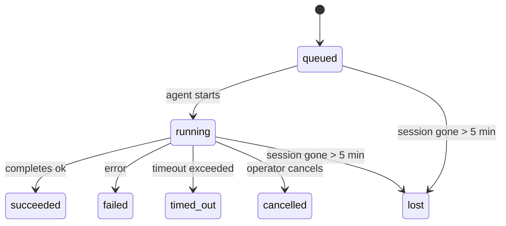

---
read_when:
    - Inspection d’un travail en arrière-plan en cours ou récemment terminé
    - Débogage des échecs de livraison pour les exécutions d’agents détachées
    - Compréhension de la relation entre les exécutions en arrière-plan, les sessions, cron et heartbeat
summary: Suivi des tâches en arrière-plan pour les exécutions ACP, les sous-agents, les tâches cron isolées et les opérations CLI
title: Tâches en arrière-plan
x-i18n:
    generated_at: "2026-04-05T12:34:46Z"
    model: gpt-5.4
    provider: openai
    source_hash: 6c95ccf4388d07e60a7bb68746b161793f4bb5ff2ba3d5ce9e51f2225dab2c4d
    source_path: automation/tasks.md
    workflow: 15
---

# Tâches en arrière-plan

> **Vous cherchez la planification ?** Consultez [Automation & Tasks](/automation) pour choisir le bon mécanisme. Cette page couvre le **suivi** du travail en arrière-plan, pas sa planification.

Les tâches en arrière-plan suivent le travail qui s’exécute **en dehors de votre session de conversation principale** :
exécutions ACP, lancements de sous-agents, exécutions de tâches cron isolées et opérations lancées via la CLI.

Les tâches ne **remplacent pas** les sessions, les tâches cron ou heartbeat — elles constituent le **journal d’activité** qui enregistre quel travail détaché a eu lieu, quand, et s’il a réussi.

<Note>
Toutes les exécutions d’agent ne créent pas une tâche. Les tours heartbeat et le chat interactif normal n’en créent pas. En revanche, toutes les exécutions cron, les lancements ACP, les lancements de sous-agents et les commandes d’agent CLI en créent.
</Note>

## TL;DR

- Les tâches sont des **enregistrements**, pas des planificateurs — cron et heartbeat décident _quand_ le travail s’exécute, les tâches suivent _ce qui s’est passé_.
- ACP, les sous-agents, toutes les tâches cron et les opérations CLI créent des tâches. Les tours heartbeat n’en créent pas.
- Chaque tâche passe par `queued → running → terminal` (succeeded, failed, timed_out, cancelled ou lost).
- Les tâches cron restent actives tant que le runtime cron possède encore la tâche ; les tâches CLI adossées au chat restent actives uniquement tant que leur contexte d’exécution propriétaire est encore actif.
- L’achèvement repose sur un mécanisme poussé : le travail détaché peut notifier directement ou réveiller la session/heartbeat du demandeur lorsqu’il se termine, donc les boucles de sondage d’état sont généralement inadaptées.
- Les exécutions cron isolées et les achèvements de sous-agents nettoient au mieux les onglets/processus navigateur suivis pour leur session enfant avant la comptabilisation finale du nettoyage.
- La livraison des exécutions cron isolées supprime les réponses intermédiaires parent obsolètes pendant que le travail des sous-agents descendants continue de se vider, et privilégie la sortie finale descendante lorsqu’elle arrive avant la livraison.
- Les notifications d’achèvement sont envoyées directement à un canal ou mises en file pour le prochain heartbeat.
- `openclaw tasks list` affiche toutes les tâches ; `openclaw tasks audit` fait remonter les problèmes.
- Les enregistrements terminaux sont conservés pendant 7 jours, puis automatiquement élagués.

## Démarrage rapide

```bash
# List all tasks (newest first)
openclaw tasks list

# Filter by runtime or status
openclaw tasks list --runtime acp
openclaw tasks list --status running

# Show details for a specific task (by ID, run ID, or session key)
openclaw tasks show <lookup>

# Cancel a running task (kills the child session)
openclaw tasks cancel <lookup>

# Change notification policy for a task
openclaw tasks notify <lookup> state_changes

# Run a health audit
openclaw tasks audit

# Preview or apply maintenance
openclaw tasks maintenance
openclaw tasks maintenance --apply

# Inspect TaskFlow state
openclaw tasks flow list
openclaw tasks flow show <lookup>
openclaw tasks flow cancel <lookup>
```

## Ce qui crée une tâche

| Source                 | Type de runtime | Moment où un enregistrement de tâche est créé          | Politique de notification par défaut |
| ---------------------- | --------------- | ------------------------------------------------------ | ------------------------------------ |
| Exécutions ACP en arrière-plan | `acp`        | Lancement d’une session ACP enfant                     | `done_only`                          |
| Orchestration de sous-agents | `subagent`   | Lancement d’un sous-agent via `sessions_spawn`         | `done_only`                          |
| Tâches cron (tous types) | `cron`       | Chaque exécution cron (session principale et isolée)   | `silent`                             |
| Opérations CLI         | `cli`           | Commandes `openclaw agent` exécutées via la passerelle | `silent`                             |

Les tâches cron de session principale utilisent par défaut la politique de notification `silent` — elles créent des enregistrements pour le suivi mais ne génèrent pas de notifications. Les tâches cron isolées utilisent également `silent` par défaut, mais elles sont plus visibles parce qu’elles s’exécutent dans leur propre session.

**Ce qui ne crée pas de tâches :**

- Les tours heartbeat — session principale ; voir [Heartbeat](/gateway/heartbeat)
- Les tours de chat interactif normaux
- Les réponses directes `/command`

## Cycle de vie d’une tâche



| Statut      | Signification                                                               |
| ----------- | ---------------------------------------------------------------------------- |
| `queued`    | Créée, en attente du démarrage de l’agent                                    |
| `running`   | Le tour de l’agent est en cours d’exécution                                  |
| `succeeded` | Terminée avec succès                                                         |
| `failed`    | Terminée avec une erreur                                                     |
| `timed_out` | A dépassé le délai d’expiration configuré                                    |
| `cancelled` | Arrêtée par l’opérateur via `openclaw tasks cancel`                          |
| `lost`      | Le runtime a perdu l’état de support faisant autorité après un délai de grâce de 5 minutes |

Les transitions se produisent automatiquement — lorsque l’exécution de l’agent associée se termine, le statut de la tâche est mis à jour en conséquence.

`lost` est sensible au runtime :

- Tâches ACP : les métadonnées de la session enfant ACP de support ont disparu.
- Tâches de sous-agent : la session enfant de support a disparu du magasin de l’agent cible.
- Tâches cron : le runtime cron ne suit plus la tâche comme active.
- Tâches CLI : les tâches de session enfant isolée utilisent la session enfant ; les tâches CLI adossées au chat utilisent à la place le contexte d’exécution actif, donc les lignes persistantes de session canal/groupe/direct ne les maintiennent pas actives.

## Livraison et notifications

Lorsqu’une tâche atteint un état terminal, OpenClaw vous notifie. Il existe deux chemins de livraison :

**Livraison directe** — si la tâche a une cible de canal (le `requesterOrigin`), le message d’achèvement est envoyé directement à ce canal (Telegram, Discord, Slack, etc.). Pour les achèvements de sous-agents, OpenClaw préserve également le routage lié thread/sujet lorsqu’il est disponible et peut renseigner un `to` / compte manquant à partir de la route stockée de la session demandeuse (`lastChannel` / `lastTo` / `lastAccountId`) avant d’abandonner la livraison directe.

**Livraison mise en file pour la session** — si la livraison directe échoue ou si aucune origine n’est définie, la mise à jour est mise en file comme événement système dans la session du demandeur et apparaît au prochain heartbeat.

<Tip>
L’achèvement d’une tâche déclenche un réveil heartbeat immédiat afin que vous voyiez rapidement le résultat — vous n’avez pas à attendre la prochaine impulsion heartbeat planifiée.
</Tip>

Cela signifie que le flux de travail habituel est basé sur l’envoi : lancez le travail détaché une seule fois, puis laissez le runtime vous réveiller ou vous notifier lors de l’achèvement. Ne sondez l’état des tâches que lorsque vous avez besoin de débogage, d’intervention ou d’un audit explicite.

### Politiques de notification

Contrôlez la quantité d’informations reçues pour chaque tâche :

| Politique             | Ce qui est livré                                                           |
| --------------------- | -------------------------------------------------------------------------- |
| `done_only` (par défaut) | Seulement l’état terminal (succeeded, failed, etc.) — **c’est le comportement par défaut** |
| `state_changes`       | Chaque transition d’état et mise à jour de progression                     |
| `silent`              | Rien du tout                                                               |

Modifiez la politique pendant qu’une tâche s’exécute :

```bash
openclaw tasks notify <lookup> state_changes
```

## Référence CLI

### `tasks list`

```bash
openclaw tasks list [--runtime <acp|subagent|cron|cli>] [--status <status>] [--json]
```

Colonnes de sortie : ID de tâche, Type, Statut, Livraison, ID d’exécution, Session enfant, Résumé.

### `tasks show`

```bash
openclaw tasks show <lookup>
```

Le jeton de recherche accepte un ID de tâche, un ID d’exécution ou une clé de session. Affiche l’enregistrement complet, y compris la chronologie, l’état de livraison, l’erreur et le résumé terminal.

### `tasks cancel`

```bash
openclaw tasks cancel <lookup>
```

Pour les tâches ACP et de sous-agent, cela tue la session enfant. Le statut passe à `cancelled` et une notification de livraison est envoyée.

### `tasks notify`

```bash
openclaw tasks notify <lookup> <done_only|state_changes|silent>
```

### `tasks audit`

```bash
openclaw tasks audit [--json]
```

Fait remonter les problèmes opérationnels. Les constats apparaissent également dans `openclaw status` lorsque des problèmes sont détectés.

| Constat                   | Gravité | Déclencheur                                          |
| ------------------------- | ------- | ---------------------------------------------------- |
| `stale_queued`            | warn    | En file depuis plus de 10 minutes                    |
| `stale_running`           | error   | En cours depuis plus de 30 minutes                   |
| `lost`                    | error   | La propriété de la tâche adossée au runtime a disparu |
| `delivery_failed`         | warn    | La livraison a échoué et la politique de notification n’est pas `silent` |
| `missing_cleanup`         | warn    | Tâche terminale sans horodatage de nettoyage         |
| `inconsistent_timestamps` | warn    | Violation de chronologie (par exemple terminé avant d’avoir commencé) |

### `tasks maintenance`

```bash
openclaw tasks maintenance [--json]
openclaw tasks maintenance --apply [--json]
```

Utilisez cette commande pour prévisualiser ou appliquer la réconciliation, le marquage de nettoyage et l’élagage des tâches et de l’état de Task Flow.

La réconciliation est sensible au runtime :

- Les tâches ACP/sous-agent vérifient leur session enfant de support.
- Les tâches cron vérifient si le runtime cron possède encore la tâche.
- Les tâches CLI adossées au chat vérifient le contexte d’exécution actif propriétaire, pas seulement la ligne de session de chat.

Le nettoyage après achèvement est également sensible au runtime :

- L’achèvement d’un sous-agent ferme au mieux les onglets/processus navigateur suivis pour la session enfant avant que le nettoyage de l’annonce se poursuive.
- L’achèvement d’une exécution cron isolée ferme au mieux les onglets/processus navigateur suivis pour la session cron avant que l’exécution ne soit complètement démontée.
- La livraison d’une exécution cron isolée attend au besoin le suivi des sous-agents descendants et supprime le texte d’accusé de réception parent obsolète au lieu de l’annoncer.
- La livraison d’un achèvement de sous-agent privilégie le dernier texte visible de l’assistant ; s’il est vide, elle se rabat sur le dernier texte `tool`/`toolResult` nettoyé, et les exécutions d’appel d’outil limitées à un délai d’expiration peuvent se réduire à un court résumé de progression partielle.
- Les échecs de nettoyage ne masquent pas le résultat réel de la tâche.

### `tasks flow list|show|cancel`

```bash
openclaw tasks flow list [--status <status>] [--json]
openclaw tasks flow show <lookup> [--json]
openclaw tasks flow cancel <lookup>
```

Utilisez ces commandes lorsque c’est le Task Flow orchestrateur qui vous intéresse plutôt qu’un enregistrement individuel de tâche en arrière-plan.

## Tableau des tâches du chat (`/tasks`)

Utilisez `/tasks` dans n’importe quelle session de chat pour voir les tâches en arrière-plan liées à cette session. Le tableau affiche les tâches actives et récemment terminées avec le runtime, le statut, la chronologie, ainsi que les détails de progression ou d’erreur.

Lorsque la session actuelle n’a aucune tâche liée visible, `/tasks` se rabat sur les décomptes de tâches locales à l’agent afin que vous obteniez tout de même une vue d’ensemble sans divulguer les détails d’autres sessions.

Pour le journal opérateur complet, utilisez la CLI : `openclaw tasks list`.

## Intégration au statut (pression des tâches)

`openclaw status` inclut un résumé des tâches en un coup d’œil :

```
Tasks: 3 queued · 2 running · 1 issues
```

Le résumé signale :

- **active** — nombre de `queued` + `running`
- **failures** — nombre de `failed` + `timed_out` + `lost`
- **byRuntime** — ventilation par `acp`, `subagent`, `cron`, `cli`

`/status` et l’outil `session_status` utilisent tous deux un instantané des tâches tenant compte du nettoyage : les tâches actives sont privilégiées, les lignes terminées obsolètes sont masquées, et les échecs récents n’apparaissent que lorsqu’il ne reste plus de travail actif. Cela permet à la carte de statut de rester concentrée sur ce qui compte maintenant.

## Stockage et maintenance

### Emplacement des tâches

Les enregistrements de tâches sont conservés dans SQLite à l’emplacement suivant :

```
$OPENCLAW_STATE_DIR/tasks/runs.sqlite
```

Le registre est chargé en mémoire au démarrage de la passerelle et synchronise les écritures vers SQLite pour assurer la durabilité entre les redémarrages.

### Maintenance automatique

Un balayage s’exécute toutes les **60 secondes** et gère trois éléments :

1. **Réconciliation** — vérifie si les tâches actives ont toujours un support de runtime faisant autorité. Les tâches ACP/sous-agent utilisent l’état de la session enfant, les tâches cron utilisent la propriété de tâche active, et les tâches CLI adossées au chat utilisent le contexte d’exécution propriétaire. Si cet état de support a disparu pendant plus de 5 minutes, la tâche est marquée `lost`.
2. **Marquage de nettoyage** — définit un horodatage `cleanupAfter` sur les tâches terminales (`endedAt + 7 days`).
3. **Élagage** — supprime les enregistrements ayant dépassé leur date `cleanupAfter`.

**Rétention** : les enregistrements de tâches terminales sont conservés pendant **7 jours**, puis automatiquement élagués. Aucune configuration nécessaire.

## Comment les tâches se rapportent aux autres systèmes

### Tâches et Task Flow

[Task Flow](/automation/taskflow) est la couche d’orchestration de flux au-dessus des tâches en arrière-plan. Un seul flux peut coordonner plusieurs tâches au cours de sa durée de vie en utilisant des modes de synchronisation gérés ou miroir. Utilisez `openclaw tasks` pour inspecter les enregistrements individuels de tâches et `openclaw tasks flow` pour inspecter le flux orchestrateur.

Consultez [Task Flow](/automation/taskflow) pour plus de détails.

### Tâches et cron

Une **définition** de tâche cron se trouve dans `~/.openclaw/cron/jobs.json`. **Chaque** exécution cron crée un enregistrement de tâche — à la fois en session principale et en mode isolé. Les tâches cron de session principale utilisent par défaut la politique de notification `silent` afin d’assurer le suivi sans générer de notifications.

Consultez [Cron Jobs](/automation/cron-jobs).

### Tâches et heartbeat

Les exécutions heartbeat sont des tours de session principale — elles ne créent pas d’enregistrements de tâche. Lorsqu’une tâche se termine, elle peut déclencher un réveil heartbeat afin que vous voyiez rapidement le résultat.

Consultez [Heartbeat](/gateway/heartbeat).

### Tâches et sessions

Une tâche peut référencer une `childSessionKey` (où le travail s’exécute) et une `requesterSessionKey` (qui l’a démarrée). Les sessions sont le contexte conversationnel ; les tâches constituent le suivi d’activité par-dessus celui-ci.

### Tâches et exécutions d’agent

Le `runId` d’une tâche renvoie à l’exécution d’agent qui effectue le travail. Les événements du cycle de vie de l’agent (démarrage, fin, erreur) mettent automatiquement à jour le statut de la tâche — vous n’avez pas besoin de gérer manuellement le cycle de vie.

## Lié

- [Automation & Tasks](/automation) — tous les mécanismes d’automatisation en un coup d’œil
- [Task Flow](/automation/taskflow) — orchestration de flux au-dessus des tâches
- [Scheduled Tasks](/automation/cron-jobs) — planification du travail en arrière-plan
- [Heartbeat](/gateway/heartbeat) — tours périodiques de session principale
- [CLI: Tasks](/cli/index#tasks) — référence des commandes CLI
