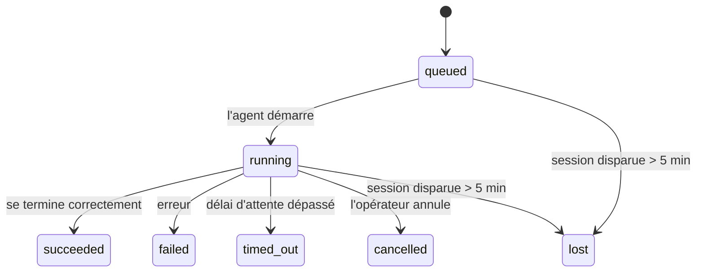

---
read_when:
    - Inspection du travail en arrière-plan en cours ou récemment terminé
    - Débogage des échecs de livraison pour les exécutions d'agent détachées
    - Compréhension de la relation entre les exécutions en arrière-plan, les sessions, cron et heartbeat
summary: Suivi des tâches en arrière-plan pour les exécutions ACP, les sous-agents, les tâches cron isolées et les opérations CLI
title: Tâches en arrière-plan
x-i18n:
    generated_at: "2026-04-06T03:06:38Z"
    model: gpt-5.4
    provider: openai
    source_hash: 2f56c1ac23237907a090c69c920c09578a2f56f5d8bf750c7f2136c603c8a8ff
    source_path: automation/tasks.md
    workflow: 15
---

# Tâches en arrière-plan

> **Vous cherchez la planification ?** Consultez [Automatisation et tâches](/fr/automation) pour choisir le bon mécanisme. Cette page couvre le **suivi** du travail en arrière-plan, pas sa planification.

Les tâches en arrière-plan suivent le travail qui s'exécute **en dehors de votre session de conversation principale** :
les exécutions ACP, les lancements de sous-agents, les exécutions de tâches cron isolées et les opérations initiées par la CLI.

Les tâches ne remplacent **pas** les sessions, les tâches cron ou les heartbeat — elles constituent le **journal d'activité** qui enregistre quel travail détaché a eu lieu, quand, et s'il a réussi.

<Note>
Toutes les exécutions d'agent ne créent pas une tâche. Les tours de heartbeat et le chat interactif normal n'en créent pas. Toutes les exécutions cron, tous les lancements ACP, tous les lancements de sous-agents et toutes les commandes d'agent CLI en créent.
</Note>

## En bref

- Les tâches sont des **enregistrements**, pas des planificateurs — cron et heartbeat décident _quand_ le travail s'exécute, les tâches suivent _ce qui s'est passé_.
- ACP, les sous-agents, toutes les tâches cron et les opérations CLI créent des tâches. Les tours de heartbeat n'en créent pas.
- Chaque tâche passe par `queued → running → terminal` (`succeeded`, `failed`, `timed_out`, `cancelled` ou `lost`).
- Les tâches cron restent actives tant que l'environnement d'exécution cron possède encore la tâche ; les tâches CLI adossées au chat restent actives uniquement tant que leur contexte d'exécution propriétaire est encore actif.
- L'achèvement est piloté par poussée : le travail détaché peut notifier directement ou réveiller
  la session demandeuse/le heartbeat lorsqu'il se termine, donc les boucles de
  sondage de statut ont généralement une mauvaise forme.
- Les exécutions cron isolées et les achèvements de sous-agents nettoient au mieux les onglets/processus de navigateur suivis pour leur session enfant avant le nettoyage final de comptabilisation.
- La livraison des exécutions cron isolées supprime les réponses intermédiaires parentes obsolètes pendant que le
  travail de sous-agents descendants continue de s'écouler, et elle préfère la sortie finale descendante
  lorsqu'elle arrive avant la livraison.
- Les notifications d'achèvement sont envoyées directement à un canal ou mises en file d'attente pour le prochain heartbeat.
- `openclaw tasks list` affiche toutes les tâches ; `openclaw tasks audit` fait remonter les problèmes.
- Les enregistrements terminaux sont conservés pendant 7 jours, puis automatiquement supprimés.

## Démarrage rapide

```bash
# Lister toutes les tâches (de la plus récente à la plus ancienne)
openclaw tasks list

# Filtrer par environnement d'exécution ou statut
openclaw tasks list --runtime acp
openclaw tasks list --status running

# Afficher les détails d'une tâche spécifique (par ID, ID d'exécution ou clé de session)
openclaw tasks show <lookup>

# Annuler une tâche en cours (tue la session enfant)
openclaw tasks cancel <lookup>

# Modifier la politique de notification pour une tâche
openclaw tasks notify <lookup> state_changes

# Exécuter un audit de santé
openclaw tasks audit

# Prévisualiser ou appliquer la maintenance
openclaw tasks maintenance
openclaw tasks maintenance --apply

# Inspecter l'état de TaskFlow
openclaw tasks flow list
openclaw tasks flow show <lookup>
openclaw tasks flow cancel <lookup>
```

## Ce qui crée une tâche

| Source                   | Type d'exécution | Moment de création d'un enregistrement de tâche        | Politique de notification par défaut |
| ------------------------ | ---------------- | ------------------------------------------------------ | ------------------------------------ |
| Exécutions ACP en arrière-plan | `acp`        | Lancement d'une session enfant ACP                     | `done_only`                          |
| Orchestration de sous-agents | `subagent`   | Lancement d'un sous-agent via `sessions_spawn`         | `done_only`                          |
| Tâches cron (tous types) | `cron`           | Chaque exécution cron (session principale et isolée)   | `silent`                             |
| Opérations CLI           | `cli`            | Commandes `openclaw agent` qui passent par la gateway  | `silent`                             |
| Tâches média de l'agent  | `cli`            | Exécutions `video_generate` adossées à une session     | `silent`                             |

Les tâches cron de session principale utilisent `silent` comme politique de notification par défaut — elles créent des enregistrements pour le suivi mais ne génèrent pas de notifications. Les tâches cron isolées utilisent aussi `silent` par défaut, mais elles sont plus visibles car elles s'exécutent dans leur propre session.

Les exécutions `video_generate` adossées à une session utilisent également `silent` comme politique de notification. Elles créent tout de même des enregistrements de tâche, mais l'achèvement est renvoyé à la session d'agent d'origine sous forme de réveil interne afin que l'agent puisse écrire le message de suivi et joindre lui-même la vidéo terminée. Si vous activez `tools.media.asyncCompletion.directSend`, les achèvements asynchrones de `music_generate` et `video_generate` essaient d'abord la livraison directe au canal avant de revenir au chemin de réveil de la session demandeuse.

Tant qu'une tâche `video_generate` adossée à une session est encore active, l'outil agit aussi comme garde-fou : les appels répétés à `video_generate` dans cette même session renvoient le statut de la tâche active au lieu de démarrer une deuxième génération concurrente. Utilisez `action: "status"` lorsque vous voulez une consultation explicite de progression/statut côté agent.

**Ce qui ne crée pas de tâches :**

- Les tours de heartbeat — session principale ; voir [Heartbeat](/fr/gateway/heartbeat)
- Les tours de chat interactif normaux
- Les réponses directes à `/command`

## Cycle de vie d'une tâche



| Statut      | Ce qu'il signifie                                                          |
| ----------- | -------------------------------------------------------------------------- |
| `queued`    | Créée, en attente du démarrage de l'agent                                  |
| `running`   | Le tour de l'agent est en cours d'exécution                                |
| `succeeded` | Terminée avec succès                                                       |
| `failed`    | Terminée avec une erreur                                                   |
| `timed_out` | A dépassé le délai d'attente configuré                                     |
| `cancelled` | Arrêtée par l'opérateur via `openclaw tasks cancel`                        |
| `lost`      | L'environnement d'exécution a perdu l'état d'autorité de référence après un délai de grâce de 5 minutes |

Les transitions se produisent automatiquement — lorsque l'exécution d'agent associée se termine, le statut de la tâche est mis à jour pour correspondre.

`lost` dépend de l'environnement d'exécution :

- Tâches ACP : les métadonnées de la session enfant ACP de référence ont disparu.
- Tâches de sous-agent : la session enfant de référence a disparu du magasin de l'agent cible.
- Tâches cron : l'environnement d'exécution cron ne suit plus la tâche comme active.
- Tâches CLI : les tâches de session enfant isolée utilisent la session enfant ; les tâches CLI adossées au chat utilisent à la place le contexte d'exécution actif, donc des lignes persistantes de session canal/groupe/direct ne les maintiennent pas actives.

## Livraison et notifications

Lorsqu'une tâche atteint un état terminal, OpenClaw vous notifie. Il existe deux chemins de livraison :

**Livraison directe** — si la tâche a une cible de canal (le `requesterOrigin`), le message d'achèvement est envoyé directement à ce canal (Telegram, Discord, Slack, etc.). Pour les achèvements de sous-agents, OpenClaw préserve aussi le routage lié de fil/sujet quand il est disponible et peut renseigner un `to` / compte manquant à partir de la route stockée de la session demandeuse (`lastChannel` / `lastTo` / `lastAccountId`) avant d'abandonner la livraison directe.

**Livraison mise en file d'attente dans la session** — si la livraison directe échoue ou si aucune origine n'est définie, la mise à jour est mise en file d'attente comme événement système dans la session du demandeur et apparaît au prochain heartbeat.

<Tip>
L'achèvement d'une tâche déclenche un réveil immédiat du heartbeat afin que vous voyiez rapidement le résultat — vous n'avez pas besoin d'attendre le prochain tick planifié du heartbeat.
</Tip>

Cela signifie que le flux de travail habituel est piloté par poussée : lancez le travail détaché une seule fois, puis laissez
l'environnement d'exécution vous réveiller ou vous notifier à l'achèvement. Ne sondez l'état d'une tâche que lorsque vous
avez besoin de débogage, d'intervention ou d'un audit explicite.

### Politiques de notification

Contrôlez la quantité d'informations que vous recevez pour chaque tâche :

| Politique             | Ce qui est livré                                                          |
| --------------------- | ------------------------------------------------------------------------- |
| `done_only` (par défaut) | Uniquement l'état terminal (`succeeded`, `failed`, etc.) — **c'est la valeur par défaut** |
| `state_changes`       | Chaque transition d'état et chaque mise à jour de progression             |
| `silent`              | Rien du tout                                                              |

Modifiez la politique pendant l'exécution d'une tâche :

```bash
openclaw tasks notify <lookup> state_changes
```

## Référence CLI

### `tasks list`

```bash
openclaw tasks list [--runtime <acp|subagent|cron|cli>] [--status <status>] [--json]
```

Colonnes de sortie : ID de tâche, Type, Statut, Livraison, ID d'exécution, Session enfant, Résumé.

### `tasks show`

```bash
openclaw tasks show <lookup>
```

Le jeton de recherche accepte un ID de tâche, un ID d'exécution ou une clé de session. Affiche l'enregistrement complet, y compris le minutage, l'état de livraison, l'erreur et le résumé terminal.

### `tasks cancel`

```bash
openclaw tasks cancel <lookup>
```

Pour les tâches ACP et de sous-agent, cela tue la session enfant. Le statut passe à `cancelled` et une notification de livraison est envoyée.

### `tasks notify`

```bash
openclaw tasks notify <lookup> <done_only|state_changes|silent>
```

### `tasks audit`

```bash
openclaw tasks audit [--json]
```

Fait remonter les problèmes opérationnels. Les résultats apparaissent aussi dans `openclaw status` lorsque des problèmes sont détectés.

| Résultat                  | Gravité | Déclencheur                                          |
| ------------------------- | ------- | ---------------------------------------------------- |
| `stale_queued`            | warn    | En file d'attente depuis plus de 10 minutes          |
| `stale_running`           | error   | En cours depuis plus de 30 minutes                   |
| `lost`                    | error   | La propriété de tâche adossée à l'environnement d'exécution a disparu |
| `delivery_failed`         | warn    | La livraison a échoué et la politique de notification n'est pas `silent` |
| `missing_cleanup`         | warn    | Tâche terminale sans horodatage de nettoyage         |
| `inconsistent_timestamps` | warn    | Violation de la chronologie (par exemple terminée avant d'avoir commencé) |

### `tasks maintenance`

```bash
openclaw tasks maintenance [--json]
openclaw tasks maintenance --apply [--json]
```

Utilisez cette commande pour prévisualiser ou appliquer la réconciliation, l'horodatage de nettoyage et la suppression
pour les tâches et l'état de Task Flow.

La réconciliation dépend de l'environnement d'exécution :

- Les tâches ACP/sous-agent vérifient leur session enfant de référence.
- Les tâches cron vérifient si l'environnement d'exécution cron possède encore la tâche.
- Les tâches CLI adossées au chat vérifient le contexte d'exécution actif propriétaire, pas seulement la ligne de session de chat.

Le nettoyage à l'achèvement dépend aussi de l'environnement d'exécution :

- L'achèvement d'un sous-agent ferme au mieux les onglets/processus de navigateur suivis pour la session enfant avant que le nettoyage d'annonce ne continue.
- L'achèvement d'une exécution cron isolée ferme au mieux les onglets/processus de navigateur suivis pour la session cron avant que l'exécution ne soit complètement démontée.
- La livraison des exécutions cron isolées attend, si nécessaire, le suivi descendant des sous-agents et
  supprime le texte d'accusé de réception parent obsolète au lieu de l'annoncer.
- La livraison de l'achèvement d'un sous-agent privilégie le dernier texte visible de l'assistant ; s'il est vide, elle revient à un texte assaini de dernier `tool`/`toolResult`, et les exécutions composées uniquement d'appels d'outil avec expiration de délai peuvent être réduites à un court résumé de progression partielle.
- Les échecs de nettoyage ne masquent pas le véritable résultat de la tâche.

### `tasks flow list|show|cancel`

```bash
openclaw tasks flow list [--status <status>] [--json]
openclaw tasks flow show <lookup> [--json]
openclaw tasks flow cancel <lookup>
```

Utilisez ces commandes lorsque l'élément qui vous intéresse est le Task Flow orchestrateur
plutôt qu'un enregistrement individuel de tâche en arrière-plan.

## Tableau des tâches de chat (`/tasks`)

Utilisez `/tasks` dans n'importe quelle session de chat pour voir les tâches en arrière-plan liées à cette session. Le tableau affiche
les tâches actives et récemment terminées avec l'environnement d'exécution, le statut, le minutage et les détails de progression ou d'erreur.

Lorsque la session actuelle n'a aucune tâche liée visible, `/tasks` revient aux comptages de tâches locales à l'agent
afin que vous obteniez tout de même une vue d'ensemble sans divulguer les détails des autres sessions.

Pour le journal opérateur complet, utilisez la CLI : `openclaw tasks list`.

## Intégration au statut (pression des tâches)

`openclaw status` inclut un résumé des tâches visible en un coup d'œil :

```
Tasks: 3 queued · 2 running · 1 issues
```

Le résumé signale :

- **active** — nombre de `queued` + `running`
- **failures** — nombre de `failed` + `timed_out` + `lost`
- **byRuntime** — répartition par `acp`, `subagent`, `cron`, `cli`

`/status` comme l'outil `session_status` utilisent un instantané des tâches sensible au nettoyage :
les tâches actives sont privilégiées, les lignes terminées obsolètes sont masquées, et les échecs récents n'apparaissent que lorsqu'aucun travail actif
ne reste. Cela permet à la carte de statut de rester centrée sur ce qui compte maintenant.

## Stockage et maintenance

### Emplacement des tâches

Les enregistrements de tâche persistent dans SQLite à l'emplacement suivant :

```
$OPENCLAW_STATE_DIR/tasks/runs.sqlite
```

Le registre est chargé en mémoire au démarrage de la gateway et synchronise les écritures vers SQLite pour garantir la durabilité entre les redémarrages.

### Maintenance automatique

Un nettoyeur s'exécute toutes les **60 secondes** et gère trois choses :

1. **Réconciliation** — vérifie si les tâches actives ont toujours un état de référence faisant autorité dans l'environnement d'exécution. Les tâches ACP/sous-agent utilisent l'état de la session enfant, les tâches cron utilisent la propriété de tâche active, et les tâches CLI adossées au chat utilisent le contexte d'exécution propriétaire. Si cet état de référence a disparu depuis plus de 5 minutes, la tâche est marquée `lost`.
2. **Horodatage de nettoyage** — définit un horodatage `cleanupAfter` sur les tâches terminales (`endedAt` + 7 jours).
3. **Suppression** — supprime les enregistrements au-delà de leur date `cleanupAfter`.

**Rétention** : les enregistrements de tâche terminaux sont conservés pendant **7 jours**, puis automatiquement supprimés. Aucune configuration nécessaire.

## Comment les tâches se rapportent aux autres systèmes

### Tâches et Task Flow

[Task Flow](/fr/automation/taskflow) est la couche d'orchestration de flux au-dessus des tâches en arrière-plan. Un seul flux peut coordonner plusieurs tâches au cours de sa durée de vie en utilisant des modes de synchronisation gérés ou miroir. Utilisez `openclaw tasks` pour inspecter les enregistrements individuels de tâche et `openclaw tasks flow` pour inspecter le flux orchestrateur.

Consultez [Task Flow](/fr/automation/taskflow) pour plus de détails.

### Tâches et cron

Une **définition** de tâche cron se trouve dans `~/.openclaw/cron/jobs.json`. **Chaque** exécution cron crée un enregistrement de tâche — à la fois en session principale et en mode isolé. Les tâches cron de session principale utilisent par défaut la politique de notification `silent`, afin d'assurer le suivi sans générer de notifications.

Consultez [Tâches cron](/fr/automation/cron-jobs).

### Tâches et heartbeat

Les exécutions heartbeat sont des tours de session principale — elles ne créent pas d'enregistrements de tâche. Lorsqu'une tâche se termine, elle peut déclencher un réveil du heartbeat afin que vous voyiez rapidement le résultat.

Consultez [Heartbeat](/fr/gateway/heartbeat).

### Tâches et sessions

Une tâche peut référencer une `childSessionKey` (où le travail s'exécute) et une `requesterSessionKey` (qui l'a démarrée). Les sessions sont le contexte de conversation ; les tâches sont une couche de suivi d'activité au-dessus.

### Tâches et exécutions d'agent

Le `runId` d'une tâche la relie à l'exécution d'agent qui effectue le travail. Les événements de cycle de vie de l'agent (démarrage, fin, erreur) mettent automatiquement à jour le statut de la tâche — vous n'avez pas besoin de gérer manuellement le cycle de vie.

## Liens associés

- [Automatisation et tâches](/fr/automation) — tous les mécanismes d'automatisation en un coup d'œil
- [Task Flow](/fr/automation/taskflow) — orchestration de flux au-dessus des tâches
- [Tâches planifiées](/fr/automation/cron-jobs) — planification du travail en arrière-plan
- [Heartbeat](/fr/gateway/heartbeat) — tours périodiques de la session principale
- [CLI : tâches](/cli/index#tasks) — référence des commandes CLI
