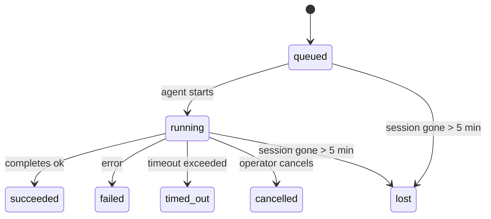

---
read_when:
    - Inspection du travail en arrière-plan en cours ou récemment terminé
    - Débogage des échecs de livraison pour les exécutions d’agent détachées
    - Comprendre comment les exécutions en arrière-plan se rapportent aux sessions, à Cron et à Heartbeat
summary: Suivi des tâches en arrière-plan pour les exécutions ACP, les sous-agents, les tâches Cron isolées et les opérations CLI
title: Tâches en arrière-plan
x-i18n:
    generated_at: "2026-04-21T06:57:45Z"
    model: gpt-5.4
    provider: openai
    source_hash: ba5511b1c421bdf505fc7d34f09e453ac44e85213fcb0f082078fa957aa91fe7
    source_path: automation/tasks.md
    workflow: 15
---

# Tâches en arrière-plan

> **Vous cherchez la planification ?** Consultez [Automation & Tasks](/fr/automation) pour choisir le bon mécanisme. Cette page couvre le **suivi** du travail en arrière-plan, pas sa planification.

Les tâches en arrière-plan suivent le travail qui s’exécute **en dehors de votre session de conversation principale** :
exécutions ACP, lancements de sous-agents, exécutions isolées de tâches Cron et opérations initiées par la CLI.

Les tâches ne remplacent **pas** les sessions, les tâches Cron ni les heartbeats — elles constituent le **journal d’activité** qui enregistre quel travail détaché a eu lieu, quand il a eu lieu et s’il a réussi.

<Note>
Chaque exécution d’agent ne crée pas forcément une tâche. Les tours Heartbeat et le chat interactif normal n’en créent pas. En revanche, toutes les exécutions Cron, tous les lancements ACP, tous les lancements de sous-agents et toutes les commandes d’agent CLI en créent.
</Note>

## TL;DR

- Les tâches sont des **enregistrements**, pas des planificateurs — Cron et Heartbeat décident _quand_ le travail s’exécute, les tâches suivent _ce qui s’est passé_.
- ACP, les sous-agents, toutes les tâches Cron et les opérations CLI créent des tâches. Les tours Heartbeat n’en créent pas.
- Chaque tâche passe par `queued → running → terminal` (succeeded, failed, timed_out, cancelled ou lost).
- Les tâches Cron restent actives tant que l’environnement d’exécution Cron possède encore la tâche ; les tâches CLI adossées au chat restent actives uniquement tant que leur contexte d’exécution propriétaire est encore actif.
- La finalisation est pilotée par push : le travail détaché peut notifier directement ou réveiller la session/Heartbeat demandeur lorsqu’il se termine ; les boucles d’interrogation d’état sont donc généralement une mauvaise approche.
- Les exécutions Cron isolées et les finalisations de sous-agents nettoient au mieux les onglets/processus de navigateur suivis pour leur session enfant avant le nettoyage final.
- La livraison des exécutions Cron isolées supprime les réponses intermédiaires parent obsolètes pendant que le travail des sous-agents descendants est encore en cours de vidage, et privilégie la sortie finale descendante lorsqu’elle arrive avant la livraison.
- Les notifications de fin sont envoyées directement à un canal ou mises en file pour le prochain Heartbeat.
- `openclaw tasks list` affiche toutes les tâches ; `openclaw tasks audit` fait remonter les problèmes.
- Les enregistrements terminaux sont conservés pendant 7 jours, puis automatiquement supprimés.

## Démarrage rapide

```bash
# Lister toutes les tâches (des plus récentes aux plus anciennes)
openclaw tasks list

# Filtrer par environnement d’exécution ou par statut
openclaw tasks list --runtime acp
openclaw tasks list --status running

# Afficher les détails d’une tâche spécifique (par ID, ID d’exécution ou clé de session)
openclaw tasks show <lookup>

# Annuler une tâche en cours d’exécution (tue la session enfant)
openclaw tasks cancel <lookup>

# Modifier la politique de notification d’une tâche
openclaw tasks notify <lookup> state_changes

# Exécuter un audit d’intégrité
openclaw tasks audit

# Prévisualiser ou appliquer la maintenance
openclaw tasks maintenance
openclaw tasks maintenance --apply

# Inspecter l’état de TaskFlow
openclaw tasks flow list
openclaw tasks flow show <lookup>
openclaw tasks flow cancel <lookup>
```

## Ce qui crée une tâche

| Source                 | Type d’environnement d’exécution | Quand un enregistrement de tâche est créé             | Politique de notification par défaut |
| ---------------------- | -------------------------------- | ----------------------------------------------------- | ------------------------------------ |
| Exécutions en arrière-plan ACP | `acp`                    | Lors du lancement d’une session enfant ACP            | `done_only`                          |
| Orchestration de sous-agents | `subagent`               | Lors du lancement d’un sous-agent via `sessions_spawn` | `done_only`                         |
| Tâches Cron (tous types) | `cron`                        | À chaque exécution Cron (session principale et isolée) | `silent`                            |
| Opérations CLI         | `cli`                            | Commandes `openclaw agent` exécutées via la Gateway   | `silent`                             |
| Tâches média d’agent   | `cli`                            | Exécutions `video_generate` adossées à une session    | `silent`                             |

Les tâches Cron de session principale utilisent par défaut la politique de notification `silent` — elles créent des enregistrements pour le suivi, mais ne génèrent pas de notifications. Les tâches Cron isolées utilisent aussi `silent` par défaut, mais sont plus visibles parce qu’elles s’exécutent dans leur propre session.

Les exécutions `video_generate` adossées à une session utilisent également la politique de notification `silent`. Elles créent quand même des enregistrements de tâche, mais la finalisation est renvoyée à la session d’agent d’origine sous forme de réveil interne, afin que l’agent puisse lui-même écrire le message de suivi et joindre la vidéo terminée. Si vous activez `tools.media.asyncCompletion.directSend`, les finalisations asynchrones de `music_generate` et `video_generate` essaient d’abord une livraison directe au canal avant de revenir au chemin de réveil de la session demandeuse.

Tant qu’une tâche `video_generate` adossée à une session est encore active, l’outil agit aussi comme garde-fou : les appels répétés à `video_generate` dans cette même session renvoient le statut de la tâche active au lieu de démarrer une seconde génération concurrente. Utilisez `action: "status"` lorsque vous voulez une recherche explicite de progression/statut du côté de l’agent.

**Ce qui ne crée pas de tâches :**

- Les tours Heartbeat — session principale ; voir [Heartbeat](/fr/gateway/heartbeat)
- Les tours de chat interactif normaux
- Les réponses directes à `/command`

## Cycle de vie d’une tâche



| Statut      | Ce que cela signifie                                                     |
| ----------- | ------------------------------------------------------------------------ |
| `queued`    | Créée, en attente du démarrage de l’agent                                |
| `running`   | Le tour d’agent est en cours d’exécution                                 |
| `succeeded` | Terminée avec succès                                                     |
| `failed`    | Terminée avec une erreur                                                 |
| `timed_out` | A dépassé le délai configuré                                             |
| `cancelled` | Arrêtée par l’opérateur via `openclaw tasks cancel`                      |
| `lost`      | L’environnement d’exécution a perdu l’état de référence après un délai de grâce de 5 minutes |

Les transitions se produisent automatiquement — quand l’exécution d’agent associée se termine, le statut de la tâche se met à jour en conséquence.

`lost` dépend de l’environnement d’exécution :

- Tâches ACP : les métadonnées de la session enfant ACP ont disparu.
- Tâches de sous-agent : la session enfant de support a disparu du magasin d’agents cible.
- Tâches Cron : l’environnement d’exécution Cron ne suit plus la tâche comme active.
- Tâches CLI : les tâches de session enfant isolée utilisent la session enfant ; les tâches CLI adossées au chat utilisent plutôt le contexte d’exécution actif, de sorte que des lignes de session canal/groupe/direct persistantes ne les maintiennent pas actives.

## Livraison et notifications

Lorsqu’une tâche atteint un état terminal, OpenClaw vous notifie. Il existe deux chemins de livraison :

**Livraison directe** — si la tâche a une cible de canal (le `requesterOrigin`), le message de fin est envoyé directement à ce canal (Telegram, Discord, Slack, etc.). Pour les finalisations de sous-agents, OpenClaw préserve aussi l’acheminement lié au fil/sujet lorsque c’est possible et peut compléter un `to` / compte manquant à partir de la route stockée de la session demandeuse (`lastChannel` / `lastTo` / `lastAccountId`) avant d’abandonner la livraison directe.

**Livraison mise en file dans la session** — si la livraison directe échoue ou si aucune origine n’est définie, la mise à jour est mise en file comme événement système dans la session du demandeur et apparaît au prochain heartbeat.

<Tip>
La finalisation d’une tâche déclenche un réveil Heartbeat immédiat afin que vous voyiez rapidement le résultat — vous n’avez pas à attendre le prochain tick Heartbeat planifié.
</Tip>

Cela signifie que le flux de travail habituel est fondé sur le push : lancez une fois le travail détaché, puis laissez l’environnement d’exécution vous réveiller ou vous notifier à la fin. N’interrogez l’état d’une tâche que lorsque vous avez besoin de débogage, d’intervention ou d’un audit explicite.

### Politiques de notification

Contrôlez le niveau d’information reçu pour chaque tâche :

| Politique             | Ce qui est livré                                                          |
| --------------------- | ------------------------------------------------------------------------- |
| `done_only` (par défaut) | Uniquement l’état terminal (succeeded, failed, etc.) — **c’est le comportement par défaut** |
| `state_changes`       | Chaque transition d’état et mise à jour de progression                    |
| `silent`              | Rien du tout                                                              |

Modifiez la politique pendant l’exécution d’une tâche :

```bash
openclaw tasks notify <lookup> state_changes
```

## Référence CLI

### `tasks list`

```bash
openclaw tasks list [--runtime <acp|subagent|cron|cli>] [--status <status>] [--json]
```

Colonnes de sortie : ID de tâche, Type, Statut, Livraison, ID d’exécution, Session enfant, Résumé.

### `tasks show`

```bash
openclaw tasks show <lookup>
```

Le jeton de recherche accepte un ID de tâche, un ID d’exécution ou une clé de session. Affiche l’enregistrement complet, y compris la chronologie, l’état de livraison, l’erreur et le résumé terminal.

### `tasks cancel`

```bash
openclaw tasks cancel <lookup>
```

Pour les tâches ACP et de sous-agent, cela tue la session enfant. Pour les tâches suivies par la CLI, l’annulation est enregistrée dans le registre des tâches (il n’existe pas de handle d’environnement enfant distinct). Le statut passe à `cancelled` et une notification de livraison est envoyée le cas échéant.

### `tasks notify`

```bash
openclaw tasks notify <lookup> <done_only|state_changes|silent>
```

### `tasks audit`

```bash
openclaw tasks audit [--json]
```

Fait remonter les problèmes opérationnels. Les constats apparaissent aussi dans `openclaw status` lorsque des problèmes sont détectés.

| Constat                   | Gravité | Déclencheur                                           |
| ------------------------- | ------- | ----------------------------------------------------- |
| `stale_queued`            | warn    | En file d’attente depuis plus de 10 minutes           |
| `stale_running`           | error   | En cours d’exécution depuis plus de 30 minutes        |
| `lost`                    | error   | La possession de la tâche adossée à l’environnement d’exécution a disparu |
| `delivery_failed`         | warn    | La livraison a échoué et la politique de notification n’est pas `silent` |
| `missing_cleanup`         | warn    | Tâche terminale sans horodatage de nettoyage          |
| `inconsistent_timestamps` | warn    | Violation de chronologie (par exemple terminée avant d’avoir commencé) |

### `tasks maintenance`

```bash
openclaw tasks maintenance [--json]
openclaw tasks maintenance --apply [--json]
```

Utilisez ceci pour prévisualiser ou appliquer la réconciliation, l’horodatage de nettoyage et l’élagage des tâches et de l’état de Task Flow.

La réconciliation dépend de l’environnement d’exécution :

- Les tâches ACP/sous-agent vérifient leur session enfant de support.
- Les tâches Cron vérifient si l’environnement d’exécution Cron possède toujours la tâche.
- Les tâches CLI adossées au chat vérifient le contexte d’exécution actif propriétaire, pas seulement la ligne de session du chat.

Le nettoyage de finalisation dépend aussi de l’environnement d’exécution :

- La finalisation des sous-agents ferme au mieux les onglets/processus de navigateur suivis pour la session enfant avant que le nettoyage de l’annonce se poursuive.
- La finalisation des exécutions Cron isolées ferme au mieux les onglets/processus de navigateur suivis pour la session Cron avant que l’exécution ne soit totalement démontée.
- La livraison des exécutions Cron isolées attend si nécessaire la suite du travail des sous-agents descendants et supprime le texte d’accusé de réception parent obsolète au lieu de l’annoncer.
- La livraison de finalisation des sous-agents privilégie le dernier texte visible de l’assistant ; si celui-ci est vide, elle revient au dernier texte `tool`/`toolResult` nettoyé, et les exécutions limitées à un appel d’outil avec timeout peuvent se réduire à un court résumé de progression partielle.
- Les échecs de nettoyage ne masquent pas le résultat réel de la tâche.

### `tasks flow list|show|cancel`

```bash
openclaw tasks flow list [--status <status>] [--json]
openclaw tasks flow show <lookup> [--json]
openclaw tasks flow cancel <lookup>
```

Utilisez ces commandes lorsque c’est le TaskFlow orchestrateur qui vous intéresse plutôt qu’un enregistrement individuel de tâche en arrière-plan.

## Tableau des tâches du chat (`/tasks`)

Utilisez `/tasks` dans n’importe quelle session de chat pour voir les tâches en arrière-plan liées à cette session. Le tableau affiche les tâches actives et récemment terminées avec l’environnement d’exécution, le statut, la chronologie et les détails de progression ou d’erreur.

Lorsque la session actuelle n’a aucune tâche liée visible, `/tasks` revient à des comptes de tâches locaux à l’agent afin que vous conserviez une vue d’ensemble sans divulguer les détails d’autres sessions.

Pour le journal opérateur complet, utilisez la CLI : `openclaw tasks list`.

## Intégration du statut (pression des tâches)

`openclaw status` inclut un résumé des tâches visible en un coup d’œil :

```
Tasks: 3 queued · 2 running · 1 issues
```

Le résumé indique :

- **active** — nombre de `queued` + `running`
- **failures** — nombre de `failed` + `timed_out` + `lost`
- **byRuntime** — répartition par `acp`, `subagent`, `cron`, `cli`

`/status` comme l’outil `session_status` utilisent tous deux un instantané des tâches tenant compte du nettoyage : les tâches actives sont privilégiées, les lignes terminées obsolètes sont masquées, et les échecs récents n’apparaissent que lorsqu’il ne reste plus de travail actif.

Cela permet à la carte de statut de rester centrée sur ce qui compte maintenant.

## Stockage et maintenance

### Où vivent les tâches

Les enregistrements de tâche persistent dans SQLite à l’emplacement suivant :

```
$OPENCLAW_STATE_DIR/tasks/runs.sqlite
```

Le registre est chargé en mémoire au démarrage de la Gateway et synchronise les écritures vers SQLite afin d’assurer la durabilité entre les redémarrages.

### Maintenance automatique

Un processus de balayage s’exécute toutes les **60 secondes** et gère trois éléments :

1. **Réconciliation** — vérifie si les tâches actives ont toujours un support d’exécution faisant autorité. Les tâches ACP/sous-agent utilisent l’état de la session enfant, les tâches Cron utilisent la possession active de la tâche, et les tâches CLI adossées au chat utilisent le contexte d’exécution propriétaire. Si cet état de support a disparu depuis plus de 5 minutes, la tâche est marquée `lost`.
2. **Horodatage du nettoyage** — définit un horodatage `cleanupAfter` sur les tâches terminales (`endedAt + 7 days`).
3. **Élagage** — supprime les enregistrements ayant dépassé leur date `cleanupAfter`.

**Rétention** : les enregistrements de tâche terminaux sont conservés pendant **7 jours**, puis automatiquement supprimés. Aucune configuration nécessaire.

## Comment les tâches se rapportent aux autres systèmes

### Tâches et Task Flow

[Task Flow](/fr/automation/taskflow) est la couche d’orchestration des flux au-dessus des tâches en arrière-plan. Un même flux peut coordonner plusieurs tâches au cours de sa durée de vie en utilisant des modes de synchronisation gérés ou mis en miroir. Utilisez `openclaw tasks` pour inspecter les enregistrements de tâche individuels et `openclaw tasks flow` pour inspecter le flux orchestrateur.

Voir [Task Flow](/fr/automation/taskflow) pour plus de détails.

### Tâches et cron

Une **définition** de tâche Cron se trouve dans `~/.openclaw/cron/jobs.json` ; l’état d’exécution se trouve à côté dans `~/.openclaw/cron/jobs-state.json`. **Chaque** exécution Cron crée un enregistrement de tâche — session principale comme session isolée. Les tâches Cron de session principale utilisent par défaut la politique de notification `silent`, ce qui permet leur suivi sans générer de notifications.

Voir [Cron Jobs](/fr/automation/cron-jobs).

### Tâches et heartbeat

Les exécutions Heartbeat sont des tours de session principale — elles ne créent pas d’enregistrements de tâche. Lorsqu’une tâche se termine, elle peut déclencher un réveil Heartbeat afin que vous voyiez rapidement le résultat.

Voir [Heartbeat](/fr/gateway/heartbeat).

### Tâches et sessions

Une tâche peut référencer un `childSessionKey` (où le travail s’exécute) et un `requesterSessionKey` (qui l’a lancée). Les sessions correspondent au contexte de conversation ; les tâches ajoutent par-dessus un suivi de l’activité.

### Tâches et exécutions d’agent

Le `runId` d’une tâche renvoie à l’exécution d’agent qui effectue le travail. Les événements du cycle de vie de l’agent (démarrage, fin, erreur) mettent automatiquement à jour le statut de la tâche — vous n’avez pas besoin de gérer le cycle de vie manuellement.

## Liens connexes

- [Automation & Tasks](/fr/automation) — tous les mécanismes d’automatisation en un coup d’œil
- [Task Flow](/fr/automation/taskflow) — orchestration des flux au-dessus des tâches
- [Scheduled Tasks](/fr/automation/cron-jobs) — planification du travail en arrière-plan
- [Heartbeat](/fr/gateway/heartbeat) — tours périodiques de session principale
- [CLI: Tasks](/cli/index#tasks) — référence des commandes CLI
