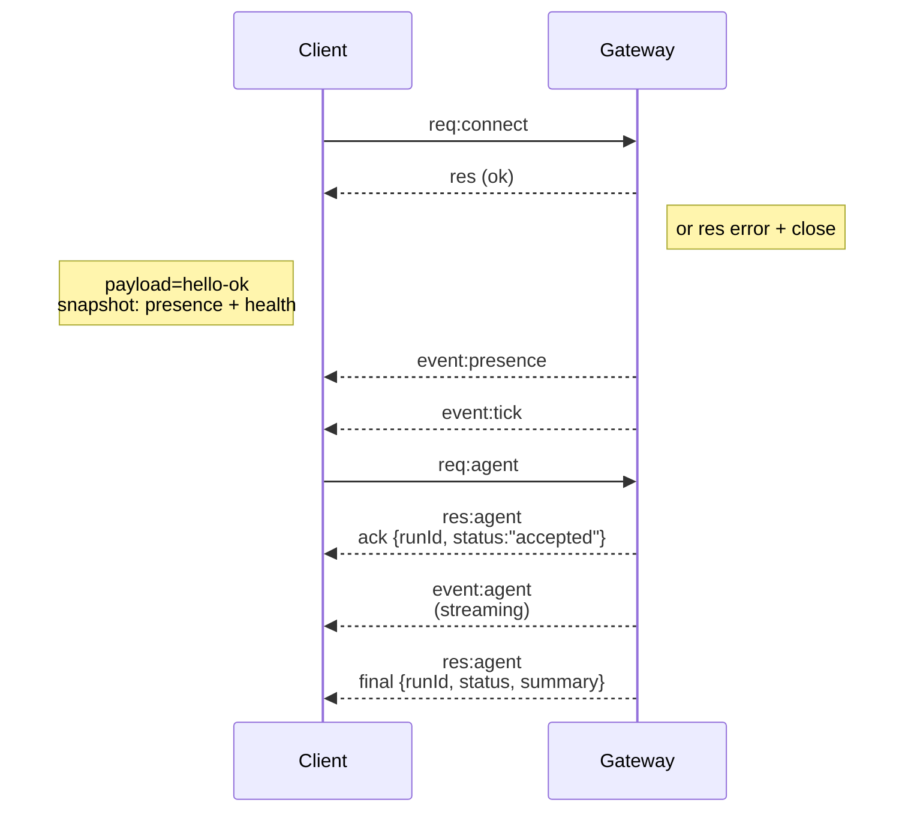

---
read_when:
    - Travail sur le protocole de passerelle, les clients ou les transports
summary: Architecture de la passerelle WebSocket, composants et flux clients
title: Architecture de la passerelle
x-i18n:
    generated_at: "2026-04-05T12:39:32Z"
    model: gpt-5.4
    provider: openai
    source_hash: 2b12a2a29e94334c6d10787ac85c34b5b046f9a14f3dd53be453368ca4a7547d
    source_path: concepts/architecture.md
    workflow: 15
---

# Architecture de la passerelle

## Vue d’ensemble

- Une seule **passerelle** de longue durée possède toutes les surfaces de messagerie (WhatsApp via
  Baileys, Telegram via grammY, Slack, Discord, Signal, iMessage, WebChat).
- Les clients du plan de contrôle (application macOS, CLI, interface web, automatisations) se connectent à la
  passerelle via **WebSocket** sur l’hôte de liaison configuré (par défaut
  `127.0.0.1:18789`).
- Les **nœuds** (macOS/iOS/Android/headless) se connectent également via **WebSocket**, mais
  déclarent `role: node` avec des capacités/commandes explicites.
- Une passerelle par hôte ; c’est le seul endroit qui ouvre une session WhatsApp.
- Le **canvas host** est servi par le serveur HTTP de la passerelle sous :
  - `/__openclaw__/canvas/` (HTML/CSS/JS modifiables par l’agent)
  - `/__openclaw__/a2ui/` (hôte A2UI)
    Il utilise le même port que la passerelle (par défaut `18789`).

## Composants et flux

### Passerelle (daemon)

- Maintient les connexions aux fournisseurs.
- Expose une API WS typée (requêtes, réponses, événements poussés par le serveur).
- Valide les trames entrantes par rapport au schéma JSON.
- Émet des événements tels que `agent`, `chat`, `presence`, `health`, `heartbeat`, `cron`.

### Clients (application mac / CLI / administration web)

- Une connexion WS par client.
- Envoient des requêtes (`health`, `status`, `send`, `agent`, `system-presence`).
- S’abonnent aux événements (`tick`, `agent`, `presence`, `shutdown`).

### Nœuds (macOS / iOS / Android / headless)

- Se connectent au **même serveur WS** avec `role: node`.
- Fournissent une identité d’appareil dans `connect` ; le pairage est **basé sur l’appareil** (rôle `node`) et
  l’approbation est stockée dans le magasin de pairage des appareils.
- Exposent des commandes comme `canvas.*`, `camera.*`, `screen.record`, `location.get`.

Détails du protocole :

- [Protocole de passerelle](/gateway/protocol)

### WebChat

- Interface statique qui utilise l’API WS de la passerelle pour l’historique du chat et les envois.
- Dans les configurations distantes, se connecte via le même tunnel SSH/Tailscale que les autres
  clients.

## Cycle de vie de la connexion (client unique)



## Protocole filaire (résumé)

- Transport : WebSocket, trames texte avec charge utile JSON.
- La première trame **doit** être `connect`.
- Après la poignée de main :
  - Requêtes : `{type:"req", id, method, params}` → `{type:"res", id, ok, payload|error}`
  - Événements : `{type:"event", event, payload, seq?, stateVersion?}`
- `hello-ok.features.methods` / `events` sont des métadonnées de découverte, pas un
  dump généré de toutes les routes d’assistance appelables.
- L’authentification par secret partagé utilise `connect.params.auth.token` ou
  `connect.params.auth.password`, selon le mode d’authentification de passerelle configuré.
- Les modes portant une identité tels que Tailscale Serve
  (`gateway.auth.allowTailscale: true`) ou les liaisons non loopback
  `gateway.auth.mode: "trusted-proxy"` satisfont l’authentification à partir des en-têtes de requête
  au lieu de `connect.params.auth.*`.
- Le mode d’entrée privée `gateway.auth.mode: "none"` désactive entièrement l’authentification par secret partagé ;
  gardez ce mode désactivé sur une entrée publique ou non fiable.
- Des clés d’idempotence sont requises pour les méthodes avec effets de bord (`send`, `agent`) afin
  de permettre des tentatives sûres ; le serveur conserve un cache de déduplication de courte durée.
- Les nœuds doivent inclure `role: "node"` plus les capacités/commandes/autorisations dans `connect`.

## Pairage + confiance locale

- Tous les clients WS (opérateurs + nœuds) incluent une **identité d’appareil** dans `connect`.
- Les nouveaux identifiants d’appareil nécessitent une approbation de pairage ; la passerelle émet un **jeton d’appareil**
  pour les connexions suivantes.
- Les connexions directes locales loopback peuvent être approuvées automatiquement afin de garder l’expérience sur le même hôte
  fluide.
- OpenClaw dispose également d’un chemin étroit d’auto-connexion backend/conteneur local pour
  des flux d’assistance de secret partagé de confiance.
- Les connexions Tailnet et LAN, y compris les liaisons tailnet sur le même hôte, nécessitent toujours
  une approbation explicite de pairage.
- Toutes les connexions doivent signer le nonce `connect.challenge`.
- La charge utile de signature `v3` lie aussi `platform` + `deviceFamily` ; la passerelle
  épingle les métadonnées appairées lors de la reconnexion et exige un pairage de réparation en cas
  de changement de métadonnées.
- Les connexions **non locales** nécessitent toujours une approbation explicite.
- L’authentification de passerelle (`gateway.auth.*`) s’applique toujours à **toutes** les connexions, locales ou
  distantes.

Détails : [Protocole de passerelle](/gateway/protocol), [Pairing](/channels/pairing),
[Security](/gateway/security).

## Typage du protocole et génération de code

- Les schémas TypeBox définissent le protocole.
- Le schéma JSON est généré à partir de ces schémas.
- Les modèles Swift sont générés à partir du schéma JSON.

## Accès distant

- Préféré : Tailscale ou VPN.
- Alternative : tunnel SSH

  ```bash
  ssh -N -L 18789:127.0.0.1:18789 user@host
  ```

- La même poignée de main + le même jeton d’authentification s’appliquent sur le tunnel.
- TLS + épinglage facultatif peuvent être activés pour WS dans les configurations distantes.

## Instantané opérationnel

- Démarrage : `openclaw gateway` (premier plan, journaux vers stdout).
- État : `health` via WS (également inclus dans `hello-ok`).
- Supervision : launchd/systemd pour le redémarrage automatique.

## Invariants

- Exactement une passerelle contrôle une seule session Baileys par hôte.
- La poignée de main est obligatoire ; toute première trame non JSON ou non `connect` entraîne une fermeture forcée.
- Les événements ne sont pas rejoués ; les clients doivent actualiser en cas de trous.

## Lié

- [Agent Loop](/concepts/agent-loop) — cycle détaillé d’exécution de l’agent
- [Gateway Protocol](/gateway/protocol) — contrat du protocole WebSocket
- [Queue](/concepts/queue) — file de commandes et concurrence
- [Security](/gateway/security) — modèle de confiance et durcissement
