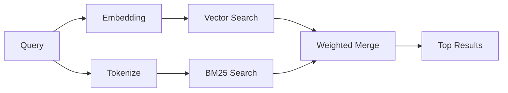

---
read_when:
    - Vous souhaitez comprendre comment `memory_search` fonctionne
    - Vous souhaitez choisir un fournisseur d’embeddings
    - Vous souhaitez ajuster la qualité de recherche
summary: Comment la recherche en mémoire trouve des notes pertinentes à l’aide d’embeddings et de récupération hybride
title: Recherche en mémoire
x-i18n:
    generated_at: "2026-04-24T07:07:05Z"
    model: gpt-5.4
    provider: openai
    source_hash: 04db62e519a691316ce40825c082918094bcaa9c36042cc8101c6504453d238e
    source_path: concepts/memory-search.md
    workflow: 15
---

`memory_search` trouve des notes pertinentes dans vos fichiers de mémoire, même lorsque
la formulation diffère du texte d’origine. Il fonctionne en indexant la mémoire en petits
fragments et en les recherchant à l’aide d’embeddings, de mots-clés ou des deux.

## Démarrage rapide

Si vous avez un abonnement GitHub Copilot, ou une clé API OpenAI, Gemini, Voyage ou Mistral configurée, la recherche en mémoire fonctionne automatiquement. Pour définir explicitement un fournisseur :

```json5
{
  agents: {
    defaults: {
      memorySearch: {
        provider: "openai", // or "gemini", "local", "ollama", etc.
      },
    },
  },
}
```

Pour des embeddings locaux sans clé API, utilisez `provider: "local"` (nécessite
`node-llama-cpp`).

## Fournisseurs pris en charge

| Fournisseur     | ID               | Clé API nécessaire | Remarques                                             |
| --------------- | ---------------- | ------------------ | ----------------------------------------------------- |
| Bedrock         | `bedrock`        | Non                | Détection automatique lorsque la chaîne d’identifiants AWS est résolue |
| Gemini          | `gemini`         | Oui                | Prend en charge l’indexation image/audio              |
| GitHub Copilot  | `github-copilot` | Non                | Détection automatique, utilise l’abonnement Copilot   |
| Local           | `local`          | Non                | Modèle GGUF, téléchargement d’environ 0,6 GB          |
| Mistral         | `mistral`        | Oui                | Détection automatique                                 |
| Ollama          | `ollama`         | Non                | Local, doit être défini explicitement                 |
| OpenAI          | `openai`         | Oui                | Détection automatique, rapide                         |
| Voyage          | `voyage`         | Oui                | Détection automatique                                 |

## Fonctionnement de la recherche

OpenClaw exécute deux chemins de récupération en parallèle et fusionne les résultats :



- **La recherche vectorielle** trouve des notes au sens similaire (« gateway host » correspond à
  « the machine running OpenClaw »).
- **La recherche de mots-clés BM25** trouve les correspondances exactes (ID, chaînes d’erreur, clés de configuration).

Si un seul chemin est disponible (pas d’embeddings ou pas de FTS), l’autre s’exécute seul.

Lorsque les embeddings ne sont pas disponibles, OpenClaw utilise tout de même un classement lexical sur les résultats FTS au lieu de revenir uniquement à un tri brut par correspondance exacte. Ce mode dégradé favorise les fragments avec une meilleure couverture des termes de la requête et des chemins de fichier pertinents, ce qui maintient un rappel utile même sans `sqlite-vec` ni fournisseur d’embeddings.

## Améliorer la qualité de recherche

Deux fonctionnalités facultatives aident lorsque vous avez un long historique de notes :

### Décroissance temporelle

Les anciennes notes perdent progressivement du poids dans le classement afin que les informations récentes remontent en premier.
Avec la demi-vie par défaut de 30 jours, une note du mois dernier obtient 50 % de
son poids d’origine. Les fichiers persistants comme `MEMORY.md` ne subissent jamais de décroissance.

<Tip>
Activez la décroissance temporelle si votre agent possède plusieurs mois de notes quotidiennes et que des informations obsolètes dépassent régulièrement le contexte récent.
</Tip>

### MMR (diversité)

Réduit les résultats redondants. Si cinq notes mentionnent toutes la même configuration de routeur, MMR
garantit que les premiers résultats couvrent différents sujets au lieu de se répéter.

<Tip>
Activez MMR si `memory_search` continue de renvoyer des extraits presque dupliqués provenant de
différentes notes quotidiennes.
</Tip>

### Activer les deux

```json5
{
  agents: {
    defaults: {
      memorySearch: {
        query: {
          hybrid: {
            mmr: { enabled: true },
            temporalDecay: { enabled: true },
          },
        },
      },
    },
  },
}
```

## Mémoire multimodale

Avec Gemini Embedding 2, vous pouvez indexer des images et des fichiers audio en plus du
Markdown. Les requêtes de recherche restent textuelles, mais elles correspondent au contenu visuel et audio. Consultez la [référence de configuration de la mémoire](/fr/reference/memory-config) pour la
configuration.

## Recherche dans la mémoire de session

Vous pouvez éventuellement indexer les transcriptions de session afin que `memory_search` puisse rappeler
des conversations antérieures. Cela s’active explicitement via
`memorySearch.experimental.sessionMemory`. Consultez la
[référence de configuration](/fr/reference/memory-config) pour plus de détails.

## Dépannage

**Aucun résultat ?** Exécutez `openclaw memory status` pour vérifier l’index. S’il est vide, exécutez
`openclaw memory index --force`.

**Seulement des correspondances par mots-clés ?** Votre fournisseur d’embeddings n’est peut-être pas configuré. Vérifiez
`openclaw memory status --deep`.

**Texte CJK introuvable ?** Reconstruisez l’index FTS avec
`openclaw memory index --force`.

## Pour aller plus loin

- [Active Memory](/fr/concepts/active-memory) -- mémoire des sous-agents pour les sessions de chat interactives
- [Mémoire](/fr/concepts/memory) -- disposition des fichiers, backends, outils
- [Référence de configuration de la mémoire](/fr/reference/memory-config) -- tous les paramètres de configuration

## Voir aussi

- [Vue d’ensemble de la mémoire](/fr/concepts/memory)
- [Active Memory](/fr/concepts/active-memory)
- [Moteur de mémoire intégré](/fr/concepts/memory-builtin)
