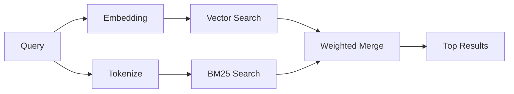

---
read_when:
    - Vous voulez comprendre comment `memory_search` fonctionne
    - Vous voulez choisir un fournisseur d’embeddings
    - Vous voulez ajuster la qualité de recherche
summary: Comment la recherche mémoire trouve des notes pertinentes à l’aide d’embeddings et d’une récupération hybride
title: Recherche mémoire
x-i18n:
    generated_at: "2026-04-05T12:40:01Z"
    model: gpt-5.4
    provider: openai
    source_hash: 87b1cb3469c7805f95bca5e77a02919d1e06d626ad3633bbc5465f6ab9db12a2
    source_path: concepts/memory-search.md
    workflow: 15
---

# Recherche mémoire

`memory_search` trouve des notes pertinentes dans vos fichiers mémoire, même lorsque
la formulation diffère du texte d’origine. Il fonctionne en indexant la mémoire en petits
segments et en les recherchant à l’aide d’embeddings, de mots-clés ou des deux.

## Démarrage rapide

Si vous avez une clé API OpenAI, Gemini, Voyage ou Mistral configurée, la recherche mémoire
fonctionne automatiquement. Pour définir explicitement un fournisseur :

```json5
{
  agents: {
    defaults: {
      memorySearch: {
        provider: "openai", // ou "gemini", "local", "ollama", etc.
      },
    },
  },
}
```

Pour des embeddings locaux sans clé API, utilisez `provider: "local"` (nécessite
node-llama-cpp).

## Fournisseurs pris en charge

| Fournisseur | ID        | Nécessite une clé API | Remarques                      |
| ----------- | --------- | --------------------- | ------------------------------ |
| OpenAI      | `openai`  | Oui                   | Détection automatique, rapide  |
| Gemini      | `gemini`  | Oui                   | Prend en charge l’indexation d’images/audio |
| Voyage      | `voyage`  | Oui                   | Détection automatique          |
| Mistral     | `mistral` | Oui                   | Détection automatique          |
| Ollama      | `ollama`  | Non                   | Local, doit être défini explicitement |
| Local       | `local`   | Non                   | Modèle GGUF, téléchargement d’environ 0,6 Go |

## Fonctionnement de la recherche

OpenClaw exécute deux chemins de récupération en parallèle et fusionne les résultats :



- **La recherche vectorielle** trouve des notes au sens similaire (« gateway host » correspond à
  « the machine running OpenClaw »).
- **La recherche de mots-clés BM25** trouve des correspondances exactes (ID, chaînes d’erreur, clés de configuration).

Si un seul chemin est disponible (pas d’embeddings ou pas de FTS), l’autre fonctionne seul.

## Améliorer la qualité de recherche

Deux fonctionnalités facultatives aident lorsque vous avez un long historique de notes :

### Décroissance temporelle

Les anciennes notes perdent progressivement du poids dans le classement afin que les informations récentes remontent en premier.
Avec la demi-vie par défaut de 30 jours, une note du mois dernier obtient 50 % de
son poids d’origine. Les fichiers pérennes comme `MEMORY.md` ne sont jamais soumis à cette décroissance.

<Tip>
Activez la décroissance temporelle si votre agent a des mois de notes quotidiennes et que des
informations obsolètes dépassent constamment le contexte récent.
</Tip>

### MMR (diversité)

Réduit les résultats redondants. Si cinq notes mentionnent toutes la même configuration de routeur, le MMR
garantit que les meilleurs résultats couvrent différents sujets au lieu de se répéter.

<Tip>
Activez le MMR si `memory_search` continue de renvoyer des extraits quasi dupliqués provenant
de différentes notes quotidiennes.
</Tip>

### Activer les deux

```json5
{
  agents: {
    defaults: {
      memorySearch: {
        query: {
          hybrid: {
            mmr: { enabled: true },
            temporalDecay: { enabled: true },
          },
        },
      },
    },
  },
}
```

## Mémoire multimodale

Avec Gemini Embedding 2, vous pouvez indexer des images et des fichiers audio en plus du
Markdown. Les requêtes de recherche restent textuelles, mais elles correspondent aussi au contenu visuel et audio.
Consultez la [référence de configuration mémoire](/reference/memory-config) pour la
configuration.

## Recherche mémoire de session

Vous pouvez éventuellement indexer les transcriptions de session afin que `memory_search` puisse rappeler
des conversations antérieures. Cela s’active explicitement via
`memorySearch.experimental.sessionMemory`. Consultez la
[référence de configuration](/reference/memory-config) pour plus de détails.

## Dépannage

**Aucun résultat ?** Exécutez `openclaw memory status` pour vérifier l’index. S’il est vide, exécutez
`openclaw memory index --force`.

**Seulement des correspondances par mot-clé ?** Il se peut que votre fournisseur d’embeddings ne soit pas configuré. Vérifiez
`openclaw memory status --deep`.

**Texte CJK introuvable ?** Reconstruisez l’index FTS avec
`openclaw memory index --force`.

## Pour aller plus loin

- [Mémoire](/concepts/memory) -- disposition des fichiers, backends, outils
- [Référence de configuration mémoire](/reference/memory-config) -- tous les paramètres de configuration
