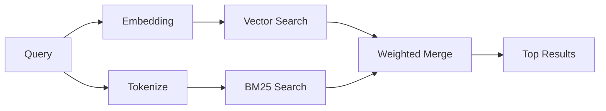

---
read_when:
    - Vous voulez comprendre comment `memory_search` fonctionne
    - Vous voulez choisir un fournisseur d'embeddings
    - Vous voulez ajuster la qualité de la recherche
summary: Comment memory search trouve des notes pertinentes à l'aide des embeddings et de la récupération hybride
title: Memory Search
x-i18n:
    generated_at: "2026-04-06T03:06:26Z"
    model: gpt-5.4
    provider: openai
    source_hash: b6541cd702bff41f9a468dad75ea438b70c44db7c65a4b793cbacaf9e583c7e9
    source_path: concepts/memory-search.md
    workflow: 15
---

# Memory Search

`memory_search` trouve des notes pertinentes dans vos fichiers de mémoire, même lorsque
la formulation diffère du texte d'origine. Il fonctionne en indexant la mémoire en petits
fragments et en les recherchant à l'aide d'embeddings, de mots-clés, ou des deux.

## Démarrage rapide

Si vous avez une clé API OpenAI, Gemini, Voyage ou Mistral configurée, memory
search fonctionne automatiquement. Pour définir explicitement un fournisseur :

```json5
{
  agents: {
    defaults: {
      memorySearch: {
        provider: "openai", // or "gemini", "local", "ollama", etc.
      },
    },
  },
}
```

Pour des embeddings locaux sans clé API, utilisez `provider: "local"` (nécessite
node-llama-cpp).

## Fournisseurs pris en charge

| Fournisseur | ID        | Nécessite une clé API | Notes                                                |
| ----------- | --------- | --------------------- | ---------------------------------------------------- |
| OpenAI      | `openai`  | Oui                   | Détection automatique, rapide                        |
| Gemini      | `gemini`  | Oui                   | Prend en charge l'indexation d'images et d'audio     |
| Voyage      | `voyage`  | Oui                   | Détection automatique                                |
| Mistral     | `mistral` | Oui                   | Détection automatique                                |
| Bedrock     | `bedrock` | Non                   | Détection automatique lorsque la chaîne d'identifiants AWS est résolue |
| Ollama      | `ollama`  | Non                   | Local, doit être défini explicitement                |
| Local       | `local`   | Non                   | Modèle GGUF, téléchargement d'environ 0,6 Go         |

## Fonctionnement de la recherche

OpenClaw exécute deux parcours de récupération en parallèle et fusionne les résultats :



- **La recherche vectorielle** trouve des notes au sens similaire ("gateway host" correspond à
  "the machine running OpenClaw").
- **La recherche par mots-clés BM25** trouve des correspondances exactes (ID, chaînes d'erreur, clés
  de configuration).

Si un seul parcours est disponible (pas d'embeddings ou pas de FTS), l'autre s'exécute seul.

## Améliorer la qualité de la recherche

Deux fonctionnalités facultatives aident lorsque vous avez un long historique de notes :

### Décroissance temporelle

Les anciennes notes perdent progressivement du poids dans le classement afin que les informations récentes remontent en premier.
Avec la demi-vie par défaut de 30 jours, une note du mois dernier obtient un score égal à 50 % de
son poids d'origine. Les fichiers permanents comme `MEMORY.md` ne subissent jamais de décroissance.

<Tip>
Activez la décroissance temporelle si votre agent a des mois de notes quotidiennes et que des informations obsolètes
continuent de dépasser le contexte récent dans le classement.
</Tip>

### MMR (diversité)

Réduit les résultats redondants. Si cinq notes mentionnent toutes la même configuration de routeur, MMR
garantit que les meilleurs résultats couvrent différents sujets au lieu de se répéter.

<Tip>
Activez MMR si `memory_search` continue de renvoyer des extraits quasi dupliqués provenant
de différentes notes quotidiennes.
</Tip>

### Activer les deux

```json5
{
  agents: {
    defaults: {
      memorySearch: {
        query: {
          hybrid: {
            mmr: { enabled: true },
            temporalDecay: { enabled: true },
          },
        },
      },
    },
  },
}
```

## Mémoire multimodale

Avec Gemini Embedding 2, vous pouvez indexer des images et des fichiers audio aux côtés du
Markdown. Les requêtes de recherche restent du texte, mais elles correspondent au contenu visuel et audio.
Consultez la [référence de configuration de la mémoire](/fr/reference/memory-config) pour la
configuration.

## Recherche dans la mémoire de session

Vous pouvez éventuellement indexer les transcriptions de session afin que `memory_search` puisse rappeler
des conversations antérieures. Cette fonctionnalité est optionnelle via
`memorySearch.experimental.sessionMemory`. Consultez la
[référence de configuration](/fr/reference/memory-config) pour plus de détails.

## Dépannage

**Aucun résultat ?** Exécutez `openclaw memory status` pour vérifier l'index. S'il est vide, exécutez
`openclaw memory index --force`.

**Seulement des correspondances par mots-clés ?** Il se peut que votre fournisseur d'embeddings ne soit pas configuré. Vérifiez
`openclaw memory status --deep`.

**Texte CJK introuvable ?** Reconstruisez l'index FTS avec
`openclaw memory index --force`.

## Pour aller plus loin

- [Memory](/fr/concepts/memory) -- disposition des fichiers, backends, outils
- [Référence de configuration de la mémoire](/fr/reference/memory-config) -- tous les paramètres de configuration
