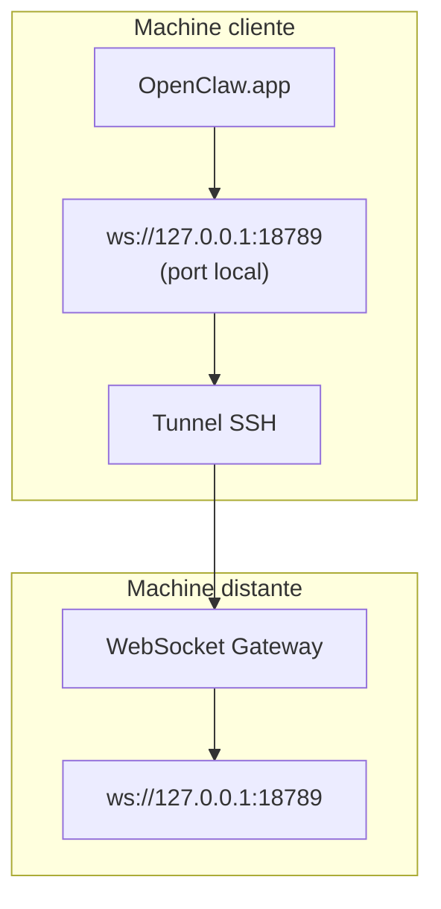

> Ce contenu a été fusionné dans [Accès distant](/fr/gateway/remote#macos-persistent-ssh-tunnel-via-launchagent). Consultez cette page pour le guide à jour.

# Exécuter OpenClaw.app avec un Gateway distant

OpenClaw.app utilise un tunnel SSH pour se connecter à un gateway distant. Ce guide montre comment le configurer.

## Vue d’ensemble



## Configuration rapide

### Étape 1 : Ajouter la configuration SSH

Modifiez `~/.ssh/config` et ajoutez :

```ssh
Host remote-gateway
    HostName <REMOTE_IP>          # e.g., 172.27.187.184
    User <REMOTE_USER>            # e.g., jefferson
    LocalForward 18789 127.0.0.1:18789
    IdentityFile ~/.ssh/id_rsa
```

Remplacez `<REMOTE_IP>` et `<REMOTE_USER>` par vos valeurs.

### Étape 2 : Copier la clé SSH

Copiez votre clé publique sur la machine distante (saisissez le mot de passe une fois) :

```bash
ssh-copy-id -i ~/.ssh/id_rsa <REMOTE_USER>@<REMOTE_IP>
```

### Étape 3 : Configurer l’authentification du Gateway distant

```bash
openclaw config set gateway.remote.token "<your-token>"
```

Utilisez `gateway.remote.password` à la place si votre gateway distant utilise une authentification par mot de passe.
`OPENCLAW_GATEWAY_TOKEN` reste valable comme surcharge au niveau du shell, mais la configuration client distant durable est `gateway.remote.token` / `gateway.remote.password`.

### Étape 4 : Démarrer le tunnel SSH

```bash
ssh -N remote-gateway &
```

### Étape 5 : Redémarrer OpenClaw.app

```bash
# Quit OpenClaw.app (⌘Q), then reopen:
open /path/to/OpenClaw.app
```

L’application se connectera maintenant au gateway distant via le tunnel SSH.

---

## Démarrer automatiquement le tunnel à la connexion

Pour que le tunnel SSH démarre automatiquement lorsque vous ouvrez une session, créez un Launch Agent.

### Créer le fichier PLIST

Enregistrez ceci sous `~/Library/LaunchAgents/ai.openclaw.ssh-tunnel.plist` :

```xml
<?xml version="1.0" encoding="UTF-8"?>
<!DOCTYPE plist PUBLIC "-//Apple//DTD PLIST 1.0//EN" "http://www.apple.com/DTDs/PropertyList-1.0.dtd">
<plist version="1.0">
<dict>
    <key>Label</key>
    <string>ai.openclaw.ssh-tunnel</string>
    <key>ProgramArguments</key>
    <array>
        <string>/usr/bin/ssh</string>
        <string>-N</string>
        <string>remote-gateway</string>
    </array>
    <key>KeepAlive</key>
    <true/>
    <key>RunAtLoad</key>
    <true/>
</dict>
</plist>
```

### Charger le Launch Agent

```bash
launchctl bootstrap gui/$UID ~/Library/LaunchAgents/ai.openclaw.ssh-tunnel.plist
```

Le tunnel va maintenant :

- démarrer automatiquement lorsque vous ouvrez une session
- redémarrer s’il plante
- continuer à s’exécuter en arrière-plan

Remarque héritée : supprimez tout LaunchAgent `com.openclaw.ssh-tunnel` restant s’il existe.

---

## Dépannage

**Vérifier si le tunnel est en cours d’exécution :**

```bash
ps aux | grep "ssh -N remote-gateway" | grep -v grep
lsof -i :18789
```

**Redémarrer le tunnel :**

```bash
launchctl kickstart -k gui/$UID/ai.openclaw.ssh-tunnel
```

**Arrêter le tunnel :**

```bash
launchctl bootout gui/$UID/ai.openclaw.ssh-tunnel
```

---

## Fonctionnement

| Composant                            | Rôle                                                         |
| ------------------------------------ | ------------------------------------------------------------ |
| `LocalForward 18789 127.0.0.1:18789` | Redirige le port local 18789 vers le port distant 18789      |
| `ssh -N`                             | SSH sans exécuter de commandes distantes (redirection de port uniquement) |
| `KeepAlive`                          | Redémarre automatiquement le tunnel s’il plante              |
| `RunAtLoad`                          | Démarre le tunnel lorsque l’agent est chargé                 |

OpenClaw.app se connecte à `ws://127.0.0.1:18789` sur votre machine cliente. Le tunnel SSH transfère cette connexion vers le port 18789 de la machine distante où le Gateway s’exécute.

## Lié

- [Accès distant](/fr/gateway/remote)
- [Tailscale](/fr/gateway/tailscale)
