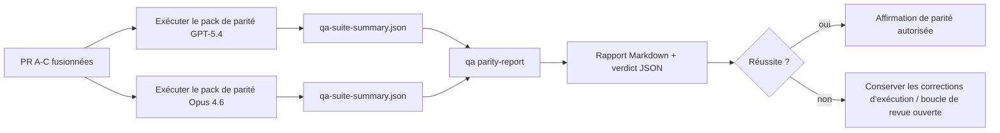

---
read_when:
    - Examen de la série de PR de parité GPT-5.4 / Codex
    - Maintenance de l’architecture agentique à six contrats derrière le programme de parité
summary: Comment examiner le programme de parité GPT-5.4 / Codex en quatre unités de fusion
title: Notes de maintenance sur la parité GPT-5.4 / Codex
x-i18n:
    generated_at: "2026-04-24T07:14:25Z"
    model: gpt-5.4
    provider: openai
    source_hash: 803b62bf5bb6b00125f424fa733e743ecdec7f8410dec0782096f9d1ddbed6c0
    source_path: help/gpt54-codex-agentic-parity-maintainers.md
    workflow: 15
---

Cette note explique comment examiner le programme de parité GPT-5.4 / Codex en quatre unités de fusion sans perdre l’architecture originale à six contrats.

## Unités de fusion

### PR A : exécution strictement agentique

Possède :

- `executionContract`
- suivi dans le même tour avec GPT-5 en priorité
- `update_plan` comme suivi de progression non terminal
- états bloqués explicites au lieu d’arrêts silencieux limités au plan

Ne possède pas :

- classification des échecs d’authentification/d’exécution
- véracité des permissions
- refonte de la relecture/continuation
- benchmarking de parité

### PR B : véracité de l’exécution

Possède :

- correction des scopes Codex OAuth
- classification typée des échecs provider/runtime
- disponibilité véridique de `/elevated full` et raisons de blocage

Ne possède pas :

- normalisation du schéma des outils
- état de relecture/vivacité
- barrières de benchmark

### PR C : correction de l’exécution

Possède :

- compatibilité des outils OpenAI/Codex détenue par le provider
- gestion stricte des schémas sans paramètres
- remontée de replay-invalid
- visibilité des états de tâches longues paused, blocked et abandoned

Ne possède pas :

- continuation auto-élue
- comportement générique du dialecte Codex en dehors des hooks provider
- barrières de benchmark

### PR D : harnais de parité

Possède :

- premier pack de scénarios GPT-5.4 vs Opus 4.6
- documentation de parité
- rapport de parité et mécanismes de barrière de publication

Ne possède pas :

- changements de comportement à l’exécution hors QA-lab
- simulation auth/proxy/DNS à l’intérieur du harnais

## Correspondance avec les six contrats originaux

| Contrat original                         | Unité de fusion |
| ---------------------------------------- | --------------- |
| Correction transport/authentification provider | PR B       |
| Compatibilité contrat/schéma des outils  | PR C            |
| Exécution dans le même tour              | PR A            |
| Véracité des permissions                 | PR B            |
| Correction relecture/continuation/vivacité | PR C          |
| Barrière benchmark/publication           | PR D            |

## Ordre de revue

1. PR A
2. PR B
3. PR C
4. PR D

PR D est la couche de preuve. Il ne doit pas être la raison pour laquelle les PR de correction d’exécution sont retardées.

## Points à examiner

### PR A

- les exécutions GPT-5 agissent ou échouent en fermeture stricte au lieu de s’arrêter à un commentaire
- `update_plan` ne ressemble plus à une progression à lui seul
- le comportement reste centré sur GPT-5 et limité à Pi intégré

### PR B

- les échecs auth/proxy/runtime cessent de se fondre dans un traitement générique « le modèle a échoué »
- `/elevated full` n’est décrit comme disponible que lorsqu’il l’est réellement
- les raisons de blocage sont visibles à la fois pour le modèle et pour le runtime orienté utilisateur

### PR C

- l’enregistrement strict des outils OpenAI/Codex se comporte de façon prévisible
- les outils sans paramètres n’échouent pas aux vérifications strictes de schéma
- les résultats de relecture et de Compaction préservent un état de vivacité véridique

### PR D

- le pack de scénarios est compréhensible et reproductible
- le pack inclut une voie mutante de sécurité de relecture, et pas seulement des flux en lecture seule
- les rapports sont lisibles par des humains et par l’automatisation
- les affirmations de parité sont étayées par des preuves, et non anecdotiques

Artefacts attendus de PR D :

- `qa-suite-report.md` / `qa-suite-summary.json` pour chaque exécution de modèle
- `qa-agentic-parity-report.md` avec comparaison agrégée et au niveau des scénarios
- `qa-agentic-parity-summary.json` avec un verdict lisible par machine

## Barrière de publication

Ne revendiquez pas la parité GPT-5.4 ni sa supériorité sur Opus 4.6 tant que :

- PR A, PR B et PR C ne sont pas fusionnées
- PR D n’exécute pas proprement le premier pack de parité
- les suites de régression de véracité à l’exécution restent vertes
- le rapport de parité ne montre aucun cas de faux succès ni aucune régression du comportement d’arrêt

Le harnais de parité n’est pas la seule source de preuve. Gardez cette séparation explicite lors de la revue :

- PR D possède la comparaison basée sur les scénarios GPT-5.4 vs Opus 4.6
- Les suites déterministes de PR B possèdent toujours les preuves auth/proxy/DNS et de véracité d’accès complet

## Carte objectif → preuve

| Élément de barrière de complétion        | Propriétaire principal | Artefact de revue                                                   |
| ---------------------------------------- | ---------------------- | ------------------------------------------------------------------- |
| Pas de blocage limité au plan            | PR A                   | tests d’exécution strictement agentique et `approval-turn-tool-followthrough` |
| Pas de fausse progression ni de fausse complétion d’outil | PR A + PR D   | nombre de faux succès de parité plus détails du rapport au niveau des scénarios |
| Pas de faux conseils `/elevated full`    | PR B                   | suites déterministes de véracité à l’exécution                      |
| Les échecs de relecture/vivacité restent explicites | PR C + PR D   | suites lifecycle/replay plus `compaction-retry-mutating-tool`       |
| GPT-5.4 égale ou dépasse Opus 4.6        | PR D                   | `qa-agentic-parity-report.md` et `qa-agentic-parity-summary.json`   |

## Raccourci pour reviewer : avant vs après

| Problème visible par l’utilisateur avant | Signal de revue après                                                                  |
| ---------------------------------------- | -------------------------------------------------------------------------------------- |
| GPT-5.4 s’arrêtait après la planification | PR A montre un comportement agir-ou-bloquer au lieu d’une complétion limitée au commentaire |
| L’usage des outils semblait fragile avec les schémas stricts OpenAI/Codex | PR C maintient prévisible l’enregistrement des outils et l’invocation sans paramètres |
| Les indices `/elevated full` étaient parfois trompeurs | PR B lie les conseils à la capacité réelle d’exécution et aux raisons de blocage     |
| Les tâches longues pouvaient disparaître dans l’ambiguïté relecture/Compaction | PR C émet un état explicite paused, blocked, abandoned et replay-invalid |
| Les affirmations de parité étaient anecdotiques | PR D produit un rapport plus un verdict JSON avec la même couverture de scénarios sur les deux modèles |

## Lié

- [Parité agentique GPT-5.4 / Codex](/fr/help/gpt54-codex-agentic-parity)
