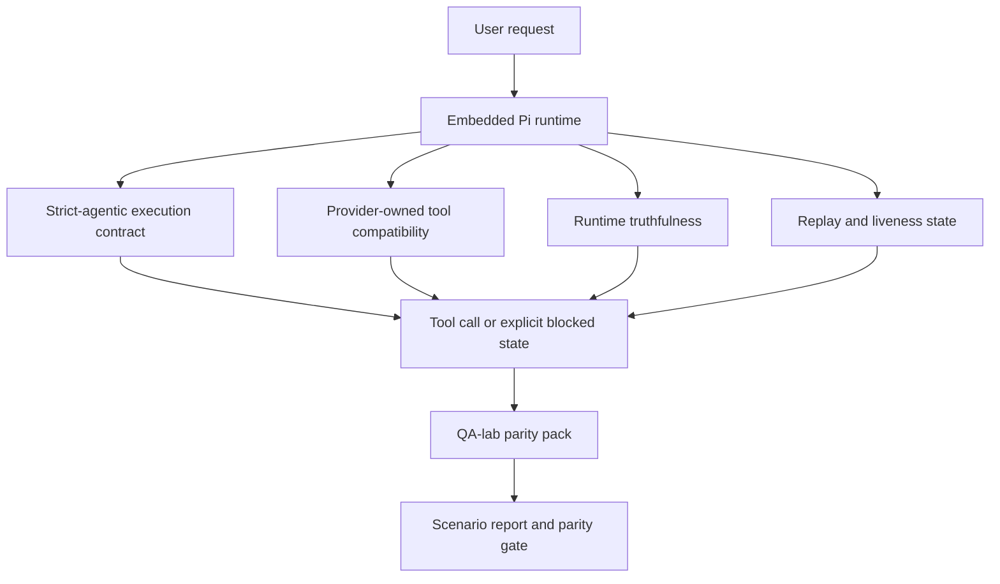
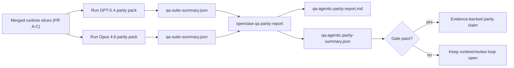

---
read_when:
    - Débogage du comportement agentique de GPT-5.4 ou Codex
    - Comparaison du comportement agentique d’OpenClaw entre différents modèles de pointe
    - Examen des correctifs strict-agentic, schéma d’outil, élévation et relecture
summary: comment OpenClaw comble les lacunes d’exécution agentique pour GPT-5.4 et les modèles de type Codex
title: parité agentique GPT-5.4 / Codex
x-i18n:
    generated_at: "2026-04-24T07:14:32Z"
    model: gpt-5.4
    provider: openai
    source_hash: 9f8c7dcf21583e6dbac80da9ddd75f2dc9af9b80801072ade8fa14b04258d4dc
    source_path: help/gpt54-codex-agentic-parity.md
    workflow: 15
---

# Parité agentique GPT-5.4 / Codex dans OpenClaw

OpenClaw fonctionnait déjà bien avec les modèles de pointe utilisant des outils, mais GPT-5.4 et les modèles de type Codex restaient encore en dessous des attentes sur quelques points pratiques :

- ils pouvaient s’arrêter après la planification au lieu d’effectuer le travail
- ils pouvaient utiliser incorrectement les schémas d’outils stricts OpenAI/Codex
- ils pouvaient demander `/elevated full` même lorsqu’un accès complet était impossible
- ils pouvaient perdre l’état des tâches longues pendant la relecture ou la Compaction
- les affirmations de parité face à Claude Opus 4.6 reposaient sur des anecdotes au lieu de scénarios reproductibles

Ce programme de parité corrige ces lacunes en quatre tranches examinables.

## Ce qui a changé

### PR A : exécution strict-agentic

Cette tranche ajoute un contrat d’exécution `strict-agentic` à activation explicite pour les exécutions Pi GPT-5 intégrées.

Lorsqu’il est activé, OpenClaw cesse d’accepter les tours de simple planification comme un achèvement « suffisant ». Si le modèle dit seulement ce qu’il a l’intention de faire sans réellement utiliser d’outils ni progresser, OpenClaw réessaie avec une incitation à agir immédiatement, puis échoue de manière stricte avec un état bloqué explicite au lieu de terminer silencieusement la tâche.

Cela améliore surtout l’expérience GPT-5.4 sur :

- les suivis courts du type « ok fais-le »
- les tâches de code où la première étape est évidente
- les flux où `update_plan` devrait servir au suivi de progression plutôt qu’au remplissage textuel

### PR B : véracité du runtime

Cette tranche fait en sorte qu’OpenClaw dise la vérité sur deux points :

- pourquoi l’appel fournisseur/runtime a échoué
- si `/elevated full` est réellement disponible

Cela signifie que GPT-5.4 reçoit de meilleurs signaux runtime pour les portées manquantes, les échecs d’actualisation d’authentification, les échecs d’authentification HTML 403, les problèmes de proxy, les échecs DNS ou de délai d’expiration, ainsi que les modes d’accès complet bloqués. Le modèle est moins susceptible d’halluciner une mauvaise remédiation ou de continuer à demander un mode d’autorisation que le runtime ne peut pas fournir.

### PR C : exactitude de l’exécution

Cette tranche améliore deux formes d’exactitude :

- la compatibilité des schémas d’outils OpenAI/Codex possédée par le fournisseur
- l’exposition de la liveness en relecture et des tâches longues

Le travail de compatibilité des outils réduit les frictions de schéma pour l’enregistrement strict des outils OpenAI/Codex, en particulier autour des outils sans paramètres et des attentes strictes sur la racine objet. Le travail sur la relecture/liveness rend les tâches longues plus observables, de sorte que les états en pause, bloqués et abandonnés deviennent visibles au lieu de disparaître dans un texte d’échec générique.

### PR D : harnais de parité

Cette tranche ajoute le premier pack de parité QA-lab afin que GPT-5.4 et Opus 4.6 puissent être exercés via les mêmes scénarios et comparés à l’aide de preuves partagées.

Le pack de parité est la couche de preuve. Il ne modifie pas à lui seul le comportement du runtime.

Une fois que vous avez deux artefacts `qa-suite-summary.json`, générez la comparaison de barrière de version avec :

```bash
pnpm openclaw qa parity-report \
  --repo-root . \
  --candidate-summary .artifacts/qa-e2e/gpt54/qa-suite-summary.json \
  --baseline-summary .artifacts/qa-e2e/opus46/qa-suite-summary.json \
  --output-dir .artifacts/qa-e2e/parity
```

Cette commande écrit :

- un rapport Markdown lisible par des humains
- un verdict JSON lisible par une machine
- un résultat de barrière explicite `pass` / `fail`

## Pourquoi cela améliore GPT-5.4 en pratique

Avant ce travail, GPT-5.4 dans OpenClaw pouvait sembler moins agentique qu’Opus dans de vraies sessions de codage parce que le runtime tolérait des comportements particulièrement nuisibles aux modèles de type GPT-5 :

- tours composés uniquement de commentaires
- friction de schéma autour des outils
- retours d’autorisation vagues
- cassures silencieuses de relecture ou de Compaction

Le but n’est pas de faire imiter Opus à GPT-5.4. Le but est de donner à GPT-5.4 un contrat de runtime qui récompense les vrais progrès, fournit une sémantique plus propre pour les outils et les autorisations, et transforme les modes d’échec en états explicites lisibles par les machines et les humains.

Cela transforme l’expérience utilisateur de :

- « le modèle avait un bon plan mais s’est arrêté »

en :

- « le modèle a soit agi, soit OpenClaw a exposé la raison exacte pour laquelle il ne pouvait pas le faire »

## Avant vs après pour les utilisateurs de GPT-5.4

| Avant ce programme                                                                       | Après PR A-D                                                                              |
| ----------------------------------------------------------------------------------------- | ----------------------------------------------------------------------------------------- |
| GPT-5.4 pouvait s’arrêter après un plan raisonnable sans passer à l’étape outil suivante | PR A transforme « plan seulement » en « agir maintenant ou exposer un état bloqué »      |
| Les schémas d’outils stricts pouvaient rejeter de manière confuse des outils sans paramètres ou de forme OpenAI/Codex | PR C rend l’enregistrement et l’invocation d’outils possédés par le fournisseur plus prévisibles |
| Les indications `/elevated full` pouvaient être vagues ou fausses dans les runtimes bloqués | PR B donne à GPT-5.4 et à l’utilisateur des indications véridiques sur le runtime et les autorisations |
| Les échecs de relecture ou de Compaction pouvaient donner l’impression que la tâche avait simplement disparu | PR C expose explicitement les résultats en pause, bloqués, abandonnés et invalides en relecture |
| « GPT-5.4 semble pire qu’Opus » était surtout anecdotique                                | PR D transforme cela en même pack de scénarios, mêmes métriques et barrière stricte pass/fail |

## Architecture



## Flux de version



## Pack de scénarios

Le pack de parité de première vague couvre actuellement cinq scénarios :

### `approval-turn-tool-followthrough`

Vérifie que le modèle ne s’arrête pas à « je vais faire ça » après une approbation courte. Il doit entreprendre la première action concrète dans le même tour.

### `model-switch-tool-continuity`

Vérifie que le travail utilisant des outils reste cohérent à travers les changements de modèle/runtime au lieu de se réinitialiser en commentaire ou de perdre le contexte d’exécution.

### `source-docs-discovery-report`

Vérifie que le modèle peut lire le code source et la documentation, synthétiser les résultats et poursuivre la tâche de façon agentique au lieu de produire un résumé mince puis de s’arrêter trop tôt.

### `image-understanding-attachment`

Vérifie que les tâches mixtes impliquant des pièces jointes restent exploitables et ne s’effondrent pas en narration vague.

### `compaction-retry-mutating-tool`

Vérifie qu’une tâche avec une vraie écriture mutante garde le caractère non sûr en relecture explicitement visible au lieu d’avoir l’air silencieusement sûre en relecture si l’exécution compacte, réessaie ou perd l’état de réponse sous pression.

## Matrice des scénarios

| Scénario                           | Ce qu’il teste                           | Bon comportement GPT-5.4                                                        | Signal d’échec                                                                   |
| ---------------------------------- | ---------------------------------------- | -------------------------------------------------------------------------------- | --------------------------------------------------------------------------------- |
| `approval-turn-tool-followthrough` | Tours d’approbation courts après un plan | Lance immédiatement la première action d’outil concrète au lieu de reformuler l’intention | suivi plan-seulement, aucune activité d’outil, ou tour bloqué sans vrai bloqueur |
| `model-switch-tool-continuity`     | Changement de runtime/modèle sous usage d’outils | Préserve le contexte de la tâche et continue à agir de manière cohérente     | se réinitialise en commentaire, perd le contexte outil ou s’arrête après le changement |
| `source-docs-discovery-report`     | Lecture du code source + synthèse + action | Trouve les sources, utilise les outils et produit un rapport utile sans blocage | résumé mince, travail outil manquant ou arrêt sur tour incomplet                 |
| `image-understanding-attachment`   | Travail agentique piloté par pièce jointe | Interprète la pièce jointe, la relie aux outils et poursuit la tâche          | narration vague, pièce jointe ignorée ou absence d’action concrète suivante      |
| `compaction-retry-mutating-tool`   | Travail mutant sous pression de Compaction | Effectue une vraie écriture et garde le caractère non sûr en relecture explicite après l’effet de bord | l’écriture mutante a lieu mais la sûreté en relecture est implicite, absente ou contradictoire |

## Barrière de version

GPT-5.4 ne peut être considéré à parité ou meilleur que lorsque le runtime fusionné réussit le pack de parité et les régressions de véracité du runtime en même temps.

Résultats requis :

- aucun blocage de type plan-seulement lorsque l’action outil suivante est claire
- aucune fausse réussite sans exécution réelle
- aucune indication incorrecte `/elevated full`
- aucun abandon silencieux dû à la relecture ou à la Compaction
- des métriques du pack de parité au moins aussi fortes que la ligne de base Opus 4.6 convenue

Pour le harnais de première vague, la barrière compare :

- taux d’achèvement
- taux d’arrêt non intentionnel
- taux d’appel d’outil valide
- nombre de faux succès

Les preuves de parité sont volontairement réparties sur deux couches :

- PR D prouve le comportement GPT-5.4 vs Opus 4.6 sur les mêmes scénarios avec QA-lab
- les suites déterministes PR B prouvent la véracité de l’authentification, du proxy, du DNS et de `/elevated full` en dehors du harnais

## Matrice objectif → preuve

| Élément de la barrière d’achèvement                       | PR responsable | Source de preuve                                                   | Signal de réussite                                                                    |
| -------------------------------------------------------- | -------------- | ------------------------------------------------------------------ | ------------------------------------------------------------------------------------- |
| GPT-5.4 ne bloque plus après la planification            | PR A           | `approval-turn-tool-followthrough` plus suites runtime PR A        | les tours d’approbation déclenchent un vrai travail ou un état bloqué explicite      |
| GPT-5.4 ne simule plus de progression ni de faux achèvement d’outil | PR A + PR D | résultats de scénarios du rapport de parité et nombre de faux succès | aucun résultat suspect et aucun achèvement composé uniquement de commentaires         |
| GPT-5.4 ne donne plus de faux conseils `/elevated full`  | PR B           | suites déterministes de véracité                                   | les raisons de blocage et indices d’accès complet restent exacts par rapport au runtime |
| Les échecs de relecture/liveness restent explicites      | PR C + PR D    | suites de cycle de vie/relecture PR C plus `compaction-retry-mutating-tool` | le travail mutant garde explicitement le caractère non sûr en relecture au lieu de disparaître silencieusement |
| GPT-5.4 égale ou dépasse Opus 4.6 sur les métriques convenues | PR D        | `qa-agentic-parity-report.md` et `qa-agentic-parity-summary.json` | même couverture de scénarios et aucune régression sur l’achèvement, le comportement d’arrêt ou l’usage valide des outils |

## Comment lire le verdict de parité

Utilisez le verdict dans `qa-agentic-parity-summary.json` comme décision finale lisible par machine pour le pack de parité de première vague.

- `pass` signifie que GPT-5.4 a couvert les mêmes scénarios qu’Opus 4.6 et n’a pas régressé sur les métriques agrégées convenues.
- `fail` signifie qu’au moins une barrière stricte a été déclenchée : achèvement plus faible, pires arrêts non intentionnels, usage valide des outils plus faible, présence d’un faux succès, ou couverture de scénarios non correspondante.
- « shared/base CI issue » n’est pas en soi un résultat de parité. Si du bruit CI hors PR D bloque une exécution, le verdict doit attendre une exécution propre du runtime fusionné au lieu d’être déduit de journaux anciens de branche.
- L’authentification, le proxy, le DNS et la véracité de `/elevated full` proviennent toujours des suites déterministes de PR B ; ainsi, l’affirmation finale de version exige les deux : un verdict de parité PR D réussi et une couverture de véracité PR B au vert.

## Qui doit activer `strict-agentic`

Utilisez `strict-agentic` lorsque :

- on attend de l’agent qu’il agisse immédiatement quand l’étape suivante est évidente
- GPT-5.4 ou les modèles de la famille Codex sont le runtime principal
- vous préférez des états bloqués explicites à des réponses « utiles » limitées à une reformulation

Gardez le contrat par défaut lorsque :

- vous voulez conserver le comportement existant plus souple
- vous n’utilisez pas de modèles de la famille GPT-5
- vous testez des prompts plutôt que l’application du runtime

## Liens associés

- [Notes de maintenance sur la parité GPT-5.4 / Codex](/fr/help/gpt54-codex-agentic-parity-maintainers)
