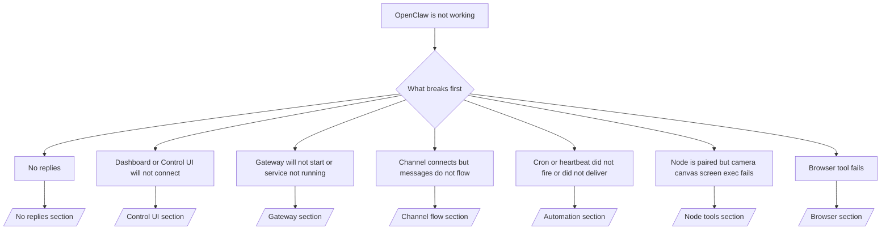

---
read_when:
    - OpenClaw ne fonctionne pas et vous avez besoin du chemin le plus rapide vers une correction
    - Vous souhaitez un flux de triage avant de plonger dans des procédures détaillées
summary: Centre de dépannage symptomatique pour OpenClaw
title: Dépannage général
x-i18n:
    generated_at: "2026-04-05T12:44:56Z"
    model: gpt-5.4
    provider: openai
    source_hash: 23ae9638af5edf5a5e0584ccb15ba404223ac3b16c2d62eb93b2c9dac171c252
    source_path: help/troubleshooting.md
    workflow: 15
---

# Dépannage

Si vous n’avez que 2 minutes, utilisez cette page comme point d’entrée de triage.

## Les 60 premières secondes

Exécutez exactement cette séquence dans l’ordre :

```bash
openclaw status
openclaw status --all
openclaw gateway probe
openclaw gateway status
openclaw doctor
openclaw channels status --probe
openclaw logs --follow
```

Bonne sortie en une ligne :

- `openclaw status` → affiche les canaux configurés et aucune erreur d’authentification évidente.
- `openclaw status --all` → le rapport complet est présent et peut être partagé.
- `openclaw gateway probe` → la cible de passerelle attendue est joignable (`Reachable: yes`). `RPC: limited - missing scope: operator.read` correspond à des diagnostics dégradés, pas à un échec de connexion.
- `openclaw gateway status` → `Runtime: running` et `RPC probe: ok`.
- `openclaw doctor` → aucune erreur bloquante de configuration/service.
- `openclaw channels status --probe` → une passerelle joignable renvoie l’état de transport en direct par compte ainsi que des résultats de sonde/audit tels que `works` ou `audit ok` ; si la passerelle est inaccessible, la commande revient à des résumés basés uniquement sur la configuration.
- `openclaw logs --follow` → activité régulière, pas d’erreurs fatales répétées.

## Anthropic long context 429

Si vous voyez :
`HTTP 429: rate_limit_error: Extra usage is required for long context requests`,
consultez [/gateway/troubleshooting#anthropic-429-extra-usage-required-for-long-context](/gateway/troubleshooting#anthropic-429-extra-usage-required-for-long-context).

## L’installation d’un plugin échoue avec openclaw extensions manquant

Si l’installation échoue avec `package.json missing openclaw.extensions`, le package du plugin
utilise une ancienne forme qu’OpenClaw n’accepte plus.

Correction dans le package du plugin :

1. Ajoutez `openclaw.extensions` à `package.json`.
2. Faites pointer les entrées vers les fichiers runtime compilés (généralement `./dist/index.js`).
3. Republiez le plugin et exécutez à nouveau `openclaw plugins install <package>`.

Exemple :

```json
{
  "name": "@openclaw/my-plugin",
  "version": "1.2.3",
  "openclaw": {
    "extensions": ["./dist/index.js"]
  }
}
```

Référence : [Architecture des plugins](/plugins/architecture)

## Arbre de décision



<AccordionGroup>
  <Accordion title="Aucune réponse">
    ```bash
    openclaw status
    openclaw gateway status
    openclaw channels status --probe
    openclaw pairing list --channel <channel> [--account <id>]
    openclaw logs --follow
    ```

    Une bonne sortie ressemble à ceci :

    - `Runtime: running`
    - `RPC probe: ok`
    - Votre canal affiche un transport connecté et, là où c’est pris en charge, `works` ou `audit ok` dans `channels status --probe`
    - L’expéditeur apparaît comme approuvé (ou la politique DM est open/allowlist)

    Signatures de journal courantes :

    - `drop guild message (mention required` → le contrôle par mention a bloqué le message dans Discord.
    - `pairing request` → l’expéditeur n’est pas approuvé et attend l’approbation de pairage DM.
    - `blocked` / `allowlist` dans les journaux de canal → l’expéditeur, le salon ou le groupe est filtré.

    Pages détaillées :

    - [/gateway/troubleshooting#no-replies](/gateway/troubleshooting#no-replies)
    - [/channels/troubleshooting](/channels/troubleshooting)
    - [/channels/pairing](/channels/pairing)

  </Accordion>

  <Accordion title="Le tableau de bord ou l’interface de contrôle ne se connecte pas">
    ```bash
    openclaw status
    openclaw gateway status
    openclaw logs --follow
    openclaw doctor
    openclaw channels status --probe
    ```

    Une bonne sortie ressemble à ceci :

    - `Dashboard: http://...` est affiché dans `openclaw gateway status`
    - `RPC probe: ok`
    - Aucune boucle d’authentification dans les journaux

    Signatures de journal courantes :

    - `device identity required` → le contexte HTTP/non sécurisé ne peut pas terminer l’authentification de l’appareil.
    - `origin not allowed` → l’`Origin` du navigateur n’est pas autorisé pour la cible de passerelle de l’interface de contrôle.
    - `AUTH_TOKEN_MISMATCH` avec des indices de nouvelle tentative (`canRetryWithDeviceToken=true`) → une nouvelle tentative automatique avec jeton d’appareil de confiance peut se produire.
    - Cette nouvelle tentative avec jeton mis en cache réutilise l’ensemble de portées mis en cache stocké avec le jeton d’appareil appairé. Les appelants explicites `deviceToken` / `scopes` explicites conservent leur ensemble de portées demandé.
    - Sur le chemin asynchrone Tailscale Serve de l’interface de contrôle, les tentatives échouées pour le même `{scope, ip}` sont sérialisées avant que le limiteur n’enregistre l’échec, si bien qu’une seconde mauvaise tentative concurrente peut déjà afficher `retry later`.
    - `too many failed authentication attempts (retry later)` depuis une origine de navigateur localhost → des échecs répétés depuis cette même `Origin` sont temporairement bloqués ; une autre origine localhost utilise un compartiment distinct.
    - `unauthorized` répété après cette nouvelle tentative → mauvais jeton/mot de passe, incompatibilité de mode d’authentification ou jeton d’appareil appairé obsolète.
    - `gateway connect failed:` → l’interface cible la mauvaise URL/port ou une passerelle inaccessible.

    Pages détaillées :

    - [/gateway/troubleshooting#dashboard-control-ui-connectivity](/gateway/troubleshooting#dashboard-control-ui-connectivity)
    - [/web/control-ui](/web/control-ui)
    - [/gateway/authentication](/gateway/authentication)

  </Accordion>

  <Accordion title="La passerelle ne démarre pas ou le service est installé mais non lancé">
    ```bash
    openclaw status
    openclaw gateway status
    openclaw logs --follow
    openclaw doctor
    openclaw channels status --probe
    ```

    Une bonne sortie ressemble à ceci :

    - `Service: ... (loaded)`
    - `Runtime: running`
    - `RPC probe: ok`

    Signatures de journal courantes :

    - `Gateway start blocked: set gateway.mode=local` ou `existing config is missing gateway.mode` → le mode de passerelle est remote, ou le fichier de configuration n’a pas l’indicateur de mode local et doit être réparé.
    - `refusing to bind gateway ... without auth` → liaison non loopback sans chemin valide d’authentification de passerelle (jeton/mot de passe, ou trusted-proxy lorsque configuré).
    - `another gateway instance is already listening` ou `EADDRINUSE` → port déjà occupé.

    Pages détaillées :

    - [/gateway/troubleshooting#gateway-service-not-running](/gateway/troubleshooting#gateway-service-not-running)
    - [/gateway/background-process](/gateway/background-process)
    - [/gateway/configuration](/gateway/configuration)

  </Accordion>

  <Accordion title="Le canal se connecte mais les messages ne circulent pas">
    ```bash
    openclaw status
    openclaw gateway status
    openclaw logs --follow
    openclaw doctor
    openclaw channels status --probe
    ```

    Une bonne sortie ressemble à ceci :

    - Le transport du canal est connecté.
    - Les vérifications de pairage/liste d’autorisation réussissent.
    - Les mentions sont détectées lorsqu’elles sont requises.

    Signatures de journal courantes :

    - `mention required` → le contrôle par mention a bloqué le traitement dans le groupe.
    - `pairing` / `pending` → l’expéditeur DM n’est pas encore approuvé.
    - `not_in_channel`, `missing_scope`, `Forbidden`, `401/403` → problème de permission ou de jeton du canal.

    Pages détaillées :

    - [/gateway/troubleshooting#channel-connected-messages-not-flowing](/gateway/troubleshooting#channel-connected-messages-not-flowing)
    - [/channels/troubleshooting](/channels/troubleshooting)

  </Accordion>

  <Accordion title="Cron ou heartbeat ne s’est pas déclenché ou n’a pas livré">
    ```bash
    openclaw status
    openclaw gateway status
    openclaw cron status
    openclaw cron list
    openclaw cron runs --id <jobId> --limit 20
    openclaw logs --follow
    ```

    Une bonne sortie ressemble à ceci :

    - `cron.status` indique activé avec un prochain réveil.
    - `cron runs` affiche des entrées récentes `ok`.
    - Heartbeat est activé et n’est pas hors des heures actives.

    Signatures de journal courantes :

- `cron: scheduler disabled; jobs will not run automatically` → cron est désactivé.
- `heartbeat skipped` avec `reason=quiet-hours` → en dehors des heures actives configurées.
- `heartbeat skipped` avec `reason=empty-heartbeat-file` → `HEARTBEAT.md` existe mais contient uniquement une structure vide/ou des en-têtes.
- `heartbeat skipped` avec `reason=no-tasks-due` → le mode tâche de `HEARTBEAT.md` est actif mais aucun intervalle de tâche n’est encore arrivé à échéance.
- `heartbeat skipped` avec `reason=alerts-disabled` → toute la visibilité heartbeat est désactivée (`showOk`, `showAlerts` et `useIndicator` sont tous désactivés).
- `requests-in-flight` → voie principale occupée ; le réveil heartbeat a été différé. - `unknown accountId` → le compte cible de livraison heartbeat n’existe pas.

      Pages détaillées :

      - [/gateway/troubleshooting#cron-and-heartbeat-delivery](/gateway/troubleshooting#cron-and-heartbeat-delivery)
      - [/automation/cron-jobs#troubleshooting](/automation/cron-jobs#troubleshooting)
      - [/gateway/heartbeat](/gateway/heartbeat)

    </Accordion>

    <Accordion title="Le nœud est appairé mais l’outil échoue pour caméra canvas écran exec">
      ```bash
      openclaw status
      openclaw gateway status
      openclaw nodes status
      openclaw nodes describe --node <idOrNameOrIp>
      openclaw logs --follow
      ```

      Une bonne sortie ressemble à ceci :

      - Le nœud est listé comme connecté et appairé pour le rôle `node`.
      - La capacité existe pour la commande que vous invoquez.
      - L’état des autorisations est accordé pour l’outil.

      Signatures de journal courantes :

      - `NODE_BACKGROUND_UNAVAILABLE` → amenez l’application de nœud au premier plan.
      - `*_PERMISSION_REQUIRED` → une autorisation OS a été refusée/manquante.
      - `SYSTEM_RUN_DENIED: approval required` → l’approbation exec est en attente.
      - `SYSTEM_RUN_DENIED: allowlist miss` → la commande ne figure pas dans la liste d’autorisation exec.

      Pages détaillées :

      - [/gateway/troubleshooting#node-paired-tool-fails](/gateway/troubleshooting#node-paired-tool-fails)
      - [/nodes/troubleshooting](/nodes/troubleshooting)
      - [/tools/exec-approvals](/tools/exec-approvals)

    </Accordion>

    <Accordion title="Exec demande soudainement une approbation">
      ```bash
      openclaw config get tools.exec.host
      openclaw config get tools.exec.security
      openclaw config get tools.exec.ask
      openclaw gateway restart
      ```

      Ce qui a changé :

      - Si `tools.exec.host` n’est pas défini, la valeur par défaut est `auto`.
      - `host=auto` se résout en `sandbox` lorsqu’un runtime sandbox est actif, sinon en `gateway`.
      - `host=auto` ne fait que router ; le comportement sans invite « YOLO » provient de `security=full` plus `ask=off` sur gateway/node.
      - Sur `gateway` et `node`, une valeur non définie de `tools.exec.security` vaut par défaut `full`.
      - Une valeur non définie de `tools.exec.ask` vaut par défaut `off`.
      - Résultat : si vous voyez des approbations, une politique locale à l’hôte ou à la session a resserré exec par rapport aux valeurs par défaut actuelles.

      Restaurer le comportement actuel sans approbation par défaut :

      ```bash
      openclaw config set tools.exec.host gateway
      openclaw config set tools.exec.security full
      openclaw config set tools.exec.ask off
      openclaw gateway restart
      ```

      Alternatives plus sûres :

      - Définissez uniquement `tools.exec.host=gateway` si vous voulez juste un routage hôte stable.
      - Utilisez `security=allowlist` avec `ask=on-miss` si vous voulez exec sur l’hôte tout en gardant une revue en cas d’absence dans la liste d’autorisation.
      - Activez le mode sandbox si vous souhaitez que `host=auto` se résolve à nouveau en `sandbox`.

      Signatures de journal courantes :

      - `Approval required.` → la commande attend `/approve ...`.
      - `SYSTEM_RUN_DENIED: approval required` → l’approbation exec sur hôte de nœud est en attente.
      - `exec host=sandbox requires a sandbox runtime for this session` → sélection implicite/explicite de sandbox alors que le mode sandbox est désactivé.

      Pages détaillées :

      - [/tools/exec](/tools/exec)
      - [/tools/exec-approvals](/tools/exec-approvals)
      - [/gateway/security#runtime-expectation-drift](/gateway/security#runtime-expectation-drift)

    </Accordion>

    <Accordion title="L’outil navigateur échoue">
      ```bash
      openclaw status
      openclaw gateway status
      openclaw browser status
      openclaw logs --follow
      openclaw doctor
      ```

      Une bonne sortie ressemble à ceci :

      - L’état du navigateur affiche `running: true` et un navigateur/profil choisi.
      - `openclaw` démarre, ou `user` peut voir les onglets Chrome locaux.

      Signatures de journal courantes :

      - `unknown command "browser"` ou `unknown command 'browser'` → `plugins.allow` est défini et n’inclut pas `browser`.
      - `Failed to start Chrome CDP on port` → le lancement du navigateur local a échoué.
      - `browser.executablePath not found` → le chemin binaire configuré est incorrect.
      - `browser.cdpUrl must be http(s) or ws(s)` → l’URL CDP configurée utilise un schéma non pris en charge.
      - `browser.cdpUrl has invalid port` → l’URL CDP configurée a un port invalide ou hors plage.
      - `No Chrome tabs found for profile="user"` → le profil d’attache Chrome MCP n’a aucun onglet Chrome local ouvert.
      - `Remote CDP for profile "<name>" is not reachable` → le point de terminaison CDP distant configuré n’est pas joignable depuis cet hôte.
      - `Browser attachOnly is enabled ... not reachable` ou `Browser attachOnly is enabled and CDP websocket ... is not reachable` → le profil attach-only n’a pas de cible CDP active.
      - remplacements obsolètes viewport / dark-mode / locale / offline sur des profils attach-only ou CDP distant → exécutez `openclaw browser stop --browser-profile <name>` pour fermer la session de contrôle active et libérer l’état d’émulation sans redémarrer la passerelle.

      Pages détaillées :

      - [/gateway/troubleshooting#browser-tool-fails](/gateway/troubleshooting#browser-tool-fails)
      - [/tools/browser#missing-browser-command-or-tool](/tools/browser#missing-browser-command-or-tool)
      - [/tools/browser-linux-troubleshooting](/tools/browser-linux-troubleshooting)
      - [/tools/browser-wsl2-windows-remote-cdp-troubleshooting](/tools/browser-wsl2-windows-remote-cdp-troubleshooting)

    </Accordion>
  </AccordionGroup>

## Lié

- [FAQ](/help/faq) — questions fréquemment posées
- [Gateway Troubleshooting](/gateway/troubleshooting) — problèmes spécifiques à la passerelle
- [Doctor](/gateway/doctor) — contrôles d’état automatisés et réparations
- [Channel Troubleshooting](/channels/troubleshooting) — problèmes de connectivité des canaux
- [Automation Troubleshooting](/automation/cron-jobs#troubleshooting) — problèmes cron et heartbeat
