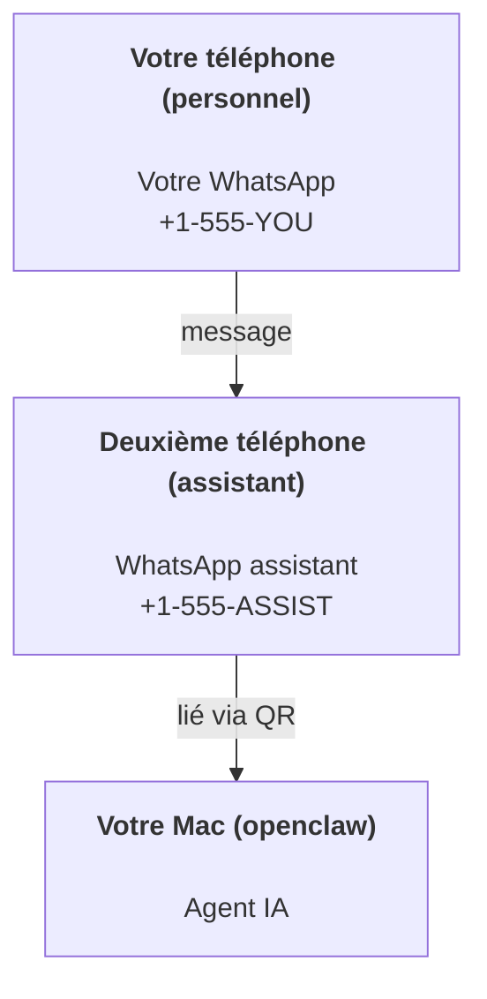

---
read_when:
    - Configuration initiale d’une nouvelle instance d’assistant
    - Examen des implications de sécurité et de permissions
summary: Guide de bout en bout pour exécuter OpenClaw comme assistant personnel avec des mises en garde de sécurité
title: Configuration d’assistant personnel
x-i18n:
    generated_at: "2026-04-24T07:33:39Z"
    model: gpt-5.4
    provider: openai
    source_hash: 3048f2faae826fc33d962f1fac92da3c0ce464d2de803fee381c897eb6c76436
    source_path: start/openclaw.md
    workflow: 15
---

# Créer un assistant personnel avec OpenClaw

OpenClaw est une passerelle auto-hébergée qui connecte Discord, Google Chat, iMessage, Matrix, Microsoft Teams, Signal, Slack, Telegram, WhatsApp, Zalo, et plus encore à des agents IA. Ce guide couvre la configuration « assistant personnel » : un numéro WhatsApp dédié qui se comporte comme votre assistant IA toujours actif.

## ⚠️ Sécurité avant tout

Vous placez un agent en position de :

- exécuter des commandes sur votre machine (selon votre politique d’outils)
- lire/écrire des fichiers dans votre espace de travail
- renvoyer des messages via WhatsApp/Telegram/Discord/Mattermost et d’autres canaux inclus

Commencez de manière prudente :

- Définissez toujours `channels.whatsapp.allowFrom` (n’exécutez jamais une configuration ouverte à tout le monde sur votre Mac personnel).
- Utilisez un numéro WhatsApp dédié pour l’assistant.
- Les Heartbeats sont désormais configurés par défaut toutes les 30 minutes. Désactivez-les tant que vous n’avez pas confiance dans la configuration en définissant `agents.defaults.heartbeat.every: "0m"`.

## Prérequis

- OpenClaw installé et onboarding effectué — voir [Getting Started](/fr/start/getting-started) si ce n’est pas encore fait
- Un deuxième numéro de téléphone (SIM/eSIM/prépayé) pour l’assistant

## La configuration à deux téléphones (recommandée)

Vous voulez ceci :



Si vous liez votre WhatsApp personnel à OpenClaw, chaque message qui vous est adressé devient une « entrée agent ». C’est rarement ce que vous voulez.

## Démarrage rapide en 5 minutes

1. Associez WhatsApp Web (affiche un QR ; scannez-le avec le téléphone assistant) :

```bash
openclaw channels login
```

2. Démarrez le Gateway (laissez-le tourner) :

```bash
openclaw gateway --port 18789
```

3. Mettez une configuration minimale dans `~/.openclaw/openclaw.json` :

```json5
{
  gateway: { mode: "local" },
  channels: { whatsapp: { allowFrom: ["+15555550123"] } },
}
```

Envoyez maintenant un message au numéro de l’assistant depuis votre téléphone figurant dans la liste d’autorisation.

Lorsque l’onboarding se termine, OpenClaw ouvre automatiquement le tableau de bord et affiche un lien propre (sans jeton). Si le tableau de bord demande une authentification, collez le secret partagé configuré dans les réglages de l’interface de contrôle. L’onboarding utilise un jeton par défaut (`gateway.auth.token`), mais l’authentification par mot de passe fonctionne aussi si vous avez remplacé `gateway.auth.mode` par `password`. Pour le rouvrir plus tard : `openclaw dashboard`.

## Donner un espace de travail à l’agent (AGENTS)

OpenClaw lit les instructions d’exploitation et la « mémoire » depuis son répertoire d’espace de travail.

Par défaut, OpenClaw utilise `~/.openclaw/workspace` comme espace de travail de l’agent, et le crée automatiquement (avec les fichiers de départ `AGENTS.md`, `SOUL.md`, `TOOLS.md`, `IDENTITY.md`, `USER.md`, `HEARTBEAT.md`) lors de la configuration ou de la première exécution d’agent. `BOOTSTRAP.md` n’est créé que lorsque l’espace de travail est entièrement neuf (il ne doit pas réapparaître après suppression). `MEMORY.md` est facultatif (pas créé automatiquement) ; lorsqu’il est présent, il est chargé pour les sessions normales. Les sessions de sous-agent n’injectent que `AGENTS.md` et `TOOLS.md`.

Astuce : considérez ce dossier comme la « mémoire » d’OpenClaw et faites-en un dépôt git (idéalement privé) pour sauvegarder `AGENTS.md` et vos fichiers mémoire. Si git est installé, les espaces de travail tout neufs sont initialisés automatiquement.

```bash
openclaw setup
```

Disposition complète de l’espace de travail + guide de sauvegarde : [Espace de travail de l’agent](/fr/concepts/agent-workspace)
Flux Memory : [Memory](/fr/concepts/memory)

Facultatif : choisissez un autre espace de travail avec `agents.defaults.workspace` (prend en charge `~`).

```json5
{
  agent: {
    workspace: "~/.openclaw/workspace",
  },
}
```

Si vous fournissez déjà vos propres fichiers d’espace de travail depuis un dépôt, vous pouvez désactiver complètement la création des fichiers bootstrap :

```json5
{
  agent: {
    skipBootstrap: true,
  },
}
```

## La configuration qui en fait « un assistant »

OpenClaw a de bonnes valeurs par défaut pour un assistant, mais vous voudrez généralement ajuster :

- la persona/les instructions dans [`SOUL.md`](/fr/concepts/soul)
- les valeurs par défaut de réflexion (si souhaité)
- les Heartbeats (une fois que vous avez confiance)

Exemple :

```json5
{
  logging: { level: "info" },
  agent: {
    model: "anthropic/claude-opus-4-6",
    workspace: "~/.openclaw/workspace",
    thinkingDefault: "high",
    timeoutSeconds: 1800,
    // Commencez avec 0 ; activez plus tard.
    heartbeat: { every: "0m" },
  },
  channels: {
    whatsapp: {
      allowFrom: ["+15555550123"],
      groups: {
        "*": { requireMention: true },
      },
    },
  },
  routing: {
    groupChat: {
      mentionPatterns: ["@openclaw", "openclaw"],
    },
  },
  session: {
    scope: "per-sender",
    resetTriggers: ["/new", "/reset"],
    reset: {
      mode: "daily",
      atHour: 4,
      idleMinutes: 10080,
    },
  },
}
```

## Sessions et mémoire

- Fichiers de session : `~/.openclaw/agents/<agentId>/sessions/{{SessionId}}.jsonl`
- Métadonnées de session (utilisation de jetons, dernière route, etc.) : `~/.openclaw/agents/<agentId>/sessions/sessions.json` (hérité : `~/.openclaw/sessions/sessions.json`)
- `/new` ou `/reset` démarre une nouvelle session pour cette discussion (configurable via `resetTriggers`). S’il est envoyé seul, l’agent répond avec un court message de salutation pour confirmer la réinitialisation.
- `/compact [instructions]` compacte le contexte de la session et indique le budget de contexte restant.

## Heartbeats (mode proactif)

Par défaut, OpenClaw exécute un Heartbeat toutes les 30 minutes avec le prompt :
`Read HEARTBEAT.md if it exists (workspace context). Follow it strictly. Do not infer or repeat old tasks from prior chats. If nothing needs attention, reply HEARTBEAT_OK.`
Définissez `agents.defaults.heartbeat.every: "0m"` pour le désactiver.

- Si `HEARTBEAT.md` existe mais est effectivement vide (seulement des lignes vides et des en-têtes markdown comme `# Heading`), OpenClaw ignore l’exécution Heartbeat pour économiser des appels API.
- Si le fichier est absent, le Heartbeat s’exécute quand même et le modèle décide quoi faire.
- Si l’agent répond avec `HEARTBEAT_OK` (éventuellement avec un court remplissage ; voir `agents.defaults.heartbeat.ackMaxChars`), OpenClaw supprime la livraison sortante pour ce Heartbeat.
- Par défaut, la livraison Heartbeat vers des cibles de type message privé `user:<id>` est autorisée. Définissez `agents.defaults.heartbeat.directPolicy: "block"` pour supprimer la livraison vers des cibles directes tout en gardant les exécutions Heartbeat actives.
- Les Heartbeats exécutent des tours d’agent complets — des intervalles plus courts consomment plus de jetons.

```json5
{
  agent: {
    heartbeat: { every: "30m" },
  },
}
```

## Médias entrants et sortants

Les pièces jointes entrantes (images/audio/documents) peuvent être exposées à votre commande via des modèles :

- `{{MediaPath}}` (chemin local vers un fichier temporaire)
- `{{MediaUrl}}` (pseudo-URL)
- `{{Transcript}}` (si la transcription audio est activée)

Pièces jointes sortantes de l’agent : incluez `MEDIA:<path-or-url>` sur sa propre ligne (sans espaces). Exemple :

```text
Here’s the screenshot.
MEDIA:https://example.com/screenshot.png
```

OpenClaw les extrait et les envoie comme média avec le texte.

Le comportement des chemins locaux suit le même modèle de confiance de lecture de fichiers que l’agent :

- Si `tools.fs.workspaceOnly` vaut `true`, les chemins locaux sortants `MEDIA:` restent limités à la racine temporaire OpenClaw, au cache média, aux chemins d’espace de travail de l’agent et aux fichiers générés dans le sandbox.
- Si `tools.fs.workspaceOnly` vaut `false`, `MEDIA:` sortant peut utiliser des fichiers locaux hôte que l’agent est déjà autorisé à lire.
- Les envois locaux hôte n’autorisent toujours que les médias et types de documents sûrs (images, audio, vidéo, PDF, et documents Office). Le texte brut et les fichiers ressemblant à des secrets ne sont pas traités comme des médias envoyables.

Cela signifie que les images/fichiers générés en dehors de l’espace de travail peuvent désormais être envoyés lorsque votre politique fs autorise déjà ces lectures, sans rouvrir l’exfiltration arbitraire de pièces jointes texte de l’hôte.

## Liste de contrôle d’exploitation

```bash
openclaw status          # état local (identifiants, sessions, événements en file)
openclaw status --all    # diagnostic complet (lecture seule, collable)
openclaw status --deep   # demande au gateway une sonde de santé en direct avec des sondes de canaux lorsque prises en charge
openclaw health --json   # instantané de santé du gateway (WS ; la valeur par défaut peut renvoyer un instantané récent en cache)
```

Les journaux se trouvent sous `/tmp/openclaw/` (par défaut : `openclaw-YYYY-MM-DD.log`).

## Étapes suivantes

- WebChat : [WebChat](/fr/web/webchat)
- Exploitation Gateway : [Runbook Gateway](/fr/gateway)
- Cron + réveils : [Tâches Cron](/fr/automation/cron-jobs)
- Compagnon de barre de menu macOS : [App OpenClaw macOS](/fr/platforms/macos)
- App Node iOS : [App iOS](/fr/platforms/ios)
- App Node Android : [App Android](/fr/platforms/android)
- État Windows : [Windows (WSL2)](/fr/platforms/windows)
- État Linux : [App Linux](/fr/platforms/linux)
- Sécurité : [Sécurité](/fr/gateway/security)

## Lié

- [Getting started](/fr/start/getting-started)
- [Setup](/fr/start/setup)
- [Aperçu des canaux](/fr/channels)
