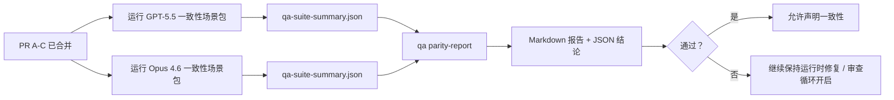

---
read_when:
    - 审查 GPT-5.5 / Codex 一致性 PR 系列
    - 维护支撑一致性计划的六契约智能体架构
summary: 如何将 GPT-5.5 / Codex 一致性计划按四个合并单元进行审查
title: GPT-5.5 / Codex 一致性维护者说明
x-i18n:
    generated_at: "2026-04-25T17:09:40Z"
    model: gpt-5.4
    provider: openai
    source_hash: 8de69081f5985954b88583880c36388dc47116c3351c15d135b8ab3a660058e3
    source_path: help/gpt55-codex-agentic-parity-maintainers.md
    workflow: 15
---

这份说明解释了如何将 GPT-5.5 / Codex 一致性计划按四个合并单元进行审查，同时不丢失原有的六契约架构。

## 合并单元

### PR A：严格智能体式执行

负责：

- `executionContract`
- GPT-5 优先的同轮后续执行
- 将 `update_plan` 作为非终结性的进度跟踪
- 使用明确的阻塞状态，而不是仅有计划的静默停止

不负责：

- 凭证 / 运行时失败分类
- 权限真实性
- 重放 / 续接重设计
- 一致性基准测试

### PR B：运行时真实性

负责：

- Codex OAuth scope 正确性
- 类型化的提供商 / 运行时失败分类
- 真实的 `/elevated full` 可用性与阻塞原因

不负责：

- 工具 schema 归一化
- 重放 / 存活性状态
- 基准测试门禁

### PR C：执行正确性

负责：

- 由提供商负责的 OpenAI / Codex 工具兼容性
- 无参数严格 schema 处理
- replay-invalid 暴露
- paused、blocked 和 abandoned 长任务状态可见性

不负责：

- 自行选择的续接
- 提供商钩子之外的通用 Codex 方言行为
- 基准测试门禁

### PR D：一致性 harness

负责：

- 第一波 GPT-5.5 对比 Opus 4.6 的场景包
- 一致性文档
- 一致性报告与发布门禁机制

不负责：

- QA-lab 之外的运行时行为变更
- harness 内的凭证 / 代理 / DNS 模拟

## 映射回原始六项契约

| 原始契约 | 合并单元 |
| ---------------------------------------- | ---------- |
| 提供商传输 / 凭证正确性 | PR B       |
| 工具契约 / schema 兼容性 | PR C       |
| 同轮执行 | PR A       |
| 权限真实性 | PR B       |
| 重放 / 续接 / 存活性正确性 | PR C       |
| 基准测试 / 发布门禁 | PR D       |

## 审查顺序

1. PR A
2. PR B
3. PR C
4. PR D

PR D 是证据层。它不应成为运行时正确性 PR 被延迟的理由。

## 审查要点

### PR A

- GPT-5 运行会执行或以封闭失败方式结束，而不是停在说明性内容
- `update_plan` 本身不再看起来像进展
- 行为仍保持 GPT-5 优先，并限定在嵌入式 Pi 范围内

### PR B

- 凭证 / 代理 / 运行时失败不再被折叠成通用的“模型失败”处理
- 只有在实际可用时，才将 `/elevated full` 描述为可用
- 模型和面向用户的运行时都能看到阻塞原因

### PR C

- 严格的 OpenAI / Codex 工具注册行为可预测
- 无参数工具不会因严格 schema 检查而失败
- 重放和压缩结果会保留真实的存活性状态

### PR D

- 场景包易于理解且可复现
- 场景包包含会变更状态的重放安全通道，而不只是只读流程
- 报告对人工和自动化都可读
- 一致性声明有证据支撑，而不是轶事式结论

PR D 的预期产物：

- 每次模型运行的 `qa-suite-report.md` / `qa-suite-summary.json`
- 包含聚合与场景级比较的 `qa-agentic-parity-report.md`
- 带有机器可读结论的 `qa-agentic-parity-summary.json`

## 发布门禁

在以下条件满足之前，不要声称 GPT-5.5 与 Opus 4.6 一致，或优于 Opus 4.6：

- PR A、PR B 和 PR C 已合并
- PR D 干净地跑通第一波一致性场景包
- 运行时真实性回归测试套件保持绿色
- 一致性报告显示没有虚假成功案例，也没有停止行为回归

一致性 harness 不是唯一的证据来源。审查时要明确保持这种拆分：

- PR D 负责基于场景的 GPT-5.5 与 Opus 4.6 对比
- PR B 的确定性测试套件仍然负责凭证 / 代理 / DNS 和完全访问真实性证据

## 快速维护者合并工作流

当你准备落地一个一致性 PR，并希望采用可重复、低风险的顺序时，请使用这个流程。

1. 在合并前确认达到证据门槛：
   - 可复现的症状或失败测试
   - 在被修改代码中验证过的根因
   - 位于相关路径中的修复
   - 回归测试或明确的手动验证说明
2. 合并前进行分流 / 打标签：
   - 当 PR 不应落地时，应用任何 `r:*` 自动关闭标签
   - 保持候选合并 PR 没有未解决的阻塞讨论线程
3. 在本地验证被修改的范围：
   - `pnpm check:changed`
   - 如果测试有改动，或缺陷修复的信心依赖测试覆盖，则运行 `pnpm test:changed`
4. 使用标准维护者流程落地（`/landpr` 流程），然后验证：
   - 已关联 issue 的自动关闭行为
   - `main` 上的 CI 和合并后状态
5. 落地后，对相关未关闭 PR / issue 进行重复搜索，只在提供规范引用时关闭。

如果证据门槛中的任意一项缺失，请请求修改，而不是合并。

## 目标到证据映射

| 完成门禁项 | 主要负责人 | 审查产物 |
| ---------------------------------------- | ------------- | ------------------------------------------------------------------- |
| 没有仅计划式停滞 | PR A          | 严格智能体式运行时测试和 `approval-turn-tool-followthrough` |
| 没有虚假进展或虚假工具完成 | PR A + PR D   | 一致性虚假成功计数，加上场景级报告细节 |
| 没有错误的 `/elevated full` 指引 | PR B          | 确定性的运行时真实性测试套件 |
| 重放 / 存活性失败仍然保持显式 | PR C + PR D   | 生命周期 / 重放测试套件，加上 `compaction-retry-mutating-tool` |
| GPT-5.5 达到或超过 Opus 4.6 | PR D          | `qa-agentic-parity-report.md` 和 `qa-agentic-parity-summary.json` |

## 审查者速记：前后对比

| 之前用户可见的问题 | 之后的审查信号 |
| ----------------------------------------------------------- | --------------------------------------------------------------------------------------- |
| GPT-5.5 在规划后停止 | PR A 展示的是执行或阻塞行为，而不是只完成说明性内容 |
| 在严格 OpenAI / Codex schema 下，工具使用感觉脆弱 | PR C 让工具注册和无参数调用保持可预测 |
| `/elevated full` 提示有时会产生误导 | PR B 将提示与实际运行时能力和阻塞原因绑定 |
| 长任务可能消失在重放 / 压缩歧义中 | PR C 发出明确的 paused、blocked、abandoned 和 replay-invalid 状态 |
| 一致性声明只是轶事式结论 | PR D 生成报告以及 JSON 结论，并在两个模型上使用相同的场景覆盖 |

## 相关内容

- [GPT-5.5 / Codex 智能体一致性](/zh-CN/help/gpt55-codex-agentic-parity)
